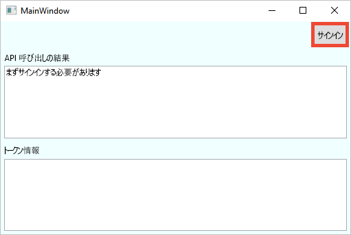

# <a name="quickstart-set-up-sign-in-for-a-desktop-app-using-azure-active-directory-b2c"></a>クイック スタート: Azure Active Directory B2C を使用したデスクトップ アプリのサインインの設定 

Azure Active Directory (Azure AD) B2C は、アプリケーション、ビジネス、顧客を保護するためのクラウド ID 管理を提供します。 Azure AD B2C に対応したアプリは、オープンな標準プロトコルを使用し、ソーシャル アカウントやエンタープライズ アカウントで認証を行うことができます。

このクイックスタートでは、Azure AD B2C 対応のサンプル WPF (Windows Presentation Foundation) デスクトップ アプリにソーシャル ID プロバイダーを使ってサインインし、Azure AD B2C で保護された Web API を呼び出します。

[!INCLUDE [quickstarts-free-trial-note](../../includes/quickstarts-free-trial-note.md)]

## <a name="prerequisites"></a>前提条件

* [Visual Studio 2017](https://www.visualstudio.com/downloads/) と **ASP.NET および開発**ワークロード。 
* Facebook、Google、Microsoft、または Twitter のソーシャル アカウント。

## <a name="download-the-sample"></a>サンプルのダウンロード

[ZIP ファイルをダウンロード](https://github.com/Azure-Samples/active-directory-b2c-dotnet-desktop/archive/master.zip)するか、GitHub からサンプル Web アプリを複製します。

```
git clone https://github.com/Azure-Samples/active-directory-b2c-dotnet-desktop.git
```

## <a name="run-the-app-in-visual-studio"></a>Visual Studio でのアプリの実行

サンプル アプリケーションのプロジェクト フォルダーにある `active-directory-b2c-wpf.sln` ソリューションを Visual Studio で開きます。

**F5** キーを押してアプリケーションをデバッグします。

## <a name="create-an-account"></a>アカウントの作成

**[Sign in]\(サインイン\)** をクリックすると、Azure AD B2C のポリシーに基づく**サインアップまたはサインイン** ワークフローが開始されます。



このサンプルは、ソーシャル ID プロバイダーを使用する方法や、メール アドレスを使用してローカル アカウントを作成する方法など、複数のサインアップ方法に対応しています。 このクイック スタートでは、Facebook、Google、Microsoft、または Twitter のいずれかのソーシャル ID プロバイダー アカウントを使用します。 

### <a name="sign-up-using-a-social-identity-provider"></a>ソーシャル ID プロバイダーを使用してサインアップする

このサンプル Web アプリでは、Wingtip Toys という架空のブランドのカスタム ログイン ページが Azure AD B2C により表示されます。 

1. ソーシャル ID プロバイダーを使用してサインアップするには、使用する ID プロバイダーのボタンをクリックします。 

    

    ユーザーは、ソーシャル アカウントの資格情報を使用して認証 (サインイン) を行うと共に、ソーシャル アカウントから情報を読み取ることについての承認をアプリケーションに与えることになります。 アクセスを許可することにより、アプリケーションはソーシャル アカウントからプロファイル情報 (名前やお住まいの都市など) を取得できるようになります。 

2. ID プロバイダーのサインイン プロセスを完了します。 たとえば、Twitter を選択した場合、Twitter の資格情報を入力し、**[サインイン]** をクリックします。

    

    新しいアカウントのプロファイルの詳細には、ソーシャル アカウントからの情報があらかじめ設定されています。 

3. 必要に応じて詳細を変更し、**[Continue]\(続行\)** をクリックします。 入力した値は、Azure AD B2C ユーザー アカウントのプロファイルに使用されます。

    

    ID プロバイダーを使用する新しい Azure AD B2C ユーザー アカウントが正常に作成されました。 サインイン後に、アクセス トークンが *[Token info]\(トークン情報\)* テキスト ボックスに表示されます。 アクセス トークンは、API リソースにアクセスするときに使用されます。

## <a name="edit-your-profile"></a>プロファイルの編集

Azure Active Directory B2C には、ユーザーが自分のプロファイルを更新することができる機能があります。  このサンプル Web アプリのワークフローには、Azure AD B2C の編集プロファイル ポリシーが使用されます。 

1. 作成したプロファイルを編集するには、**[Edit profile]\(プロファイルの編集\)** をクリックします。

    

2. 作成したアカウントに関連付けられている ID プロバイダーを選択します。 たとえば、アカウントの作成時に ID プロバイダーとして Twitter を使用した場合は、関連付けられているプロファイルの詳細を変更するために Twitter を選択します。

3. **表示名**や**都市**を変更し、**[Continue]\(続行\)** をクリックします。

    新しいアクセス トークンが *[Token info]\(トークン情報\)* テキスト ボックスに表示されます。 プロファイルに対する変更を確認する場合は、アクセス トークンをコピーしてトークン デコーダー https://jwt.ms に貼り付けます。

## <a name="access-a-protected-web-api-resource"></a>保護された Web API リソースにアクセスする

**[Call API]\(API の呼び出し\)** をクリックして、Azure AD B2C で保護されたリソース https://fabrikamb2chello.azurewebsites.net/hello に対して要求を送信します。 


このアプリケーションは、保護された Web API リソースへの要求に Azure AD アクセス トークンを追加します。 Web API からは、アクセス トークンに含まれている表示名が返されます。

Azure AD B2C ユーザー アカウントを使用して、Azure AD B2C で保護された Web API の承認済みの呼び出しを正しく行いました。

## <a name="clean-up-resources"></a>リソースのクリーンアップ

他の Azure AD B2C クイックスタートやチュートリアルを試す場合は、Azure AD B2C テナントを使用できます。 不要になったら、[Azure AD B2C テナントを削除する](active-directory-b2c-faqs.md#how-do-i-delete-my-azure-ad-b2c-tenant)ことができます。

## <a name="next-steps"></a>次の手順

次のステップでは、独自の Azure AD B2C テナントを作成し、そのテナントを使用して実行するようにサンプルを構成します。 

> [!div class="nextstepaction"]
> [Azure Portal で Azure Active Directory B2C テナントを作成する](active-directory-b2c-get-started.md)
