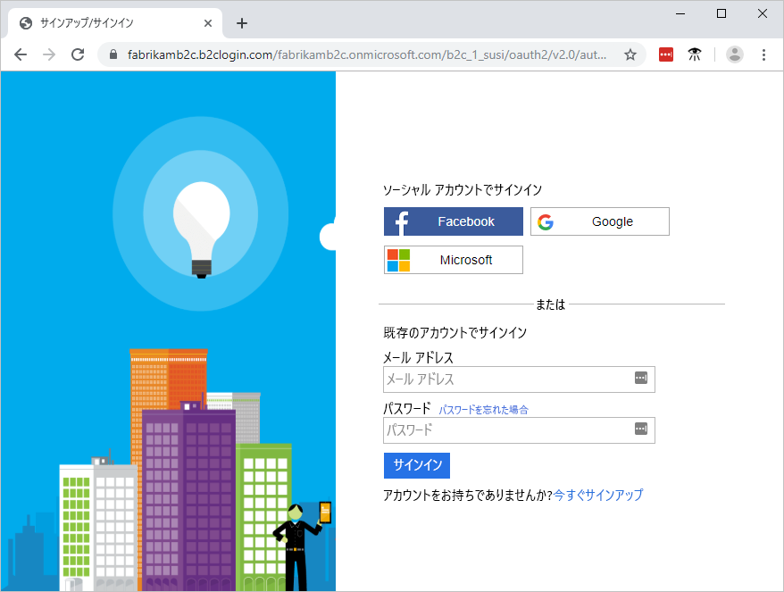

# Azure AD B2C で構成されている Web アプリケーションの試用

Azure Active Directory B2C は、アプリケーション、ビジネス、顧客を保護するためのクラウド ID 管理を提供します。  このクイック スタートでは、サンプルの To-Do リスト アプリを使用して、以下のデモンストレーションを行います。

* **サインアップまたはサインイン** ポリシーを使用した、ソーシャル ID プロバイダー アカウントまたはメール アドレスを使用したローカル アカウントの作成またはサインイン。 
* Azure AD B2C によってセキュリティを保護された API の呼び出しによる To-Do 項目の作成と編集。

## 前提条件

* 次のワークロードを使って、[Visual Studio 2017](https://www.visualstudio.com/downloads/) をインストールします。
    - **ASP.NET と Web 開発**

* Facebook、Google、Microsoft、または Twitter のソーシャル アカウント。 ソーシャル アカウントを持っていない場合は、有効なメール アドレスが必要です。

[!INCLUDE [quickstarts-free-trial-note](../../includes/quickstarts-free-trial-note.md)]

## サンプルのダウンロード

GitHub から[サンプル アプリケーションをダウンロードまたは複製](https://github.com/Azure-Samples/active-directory-b2c-dotnet-webapp-and-webapi)します。

## Visual Studio でのアプリの実行

サンプル アプリケーションのプロジェクト フォルダーにある `B2C-WebAPI-DotNet.sln` ソリューションを Visual Studio で開きます。 

このソリューションは、次の 2 つのプロジェクトで構成されています。

* **TaskWebApp** - ユーザーが To-Do リスト項目を管理できる ASP.NET MVC Web アプリケーション。  
* **TaskService** - ユーザーの To-Do リスト項目に対して実行されるすべての CRUD 操作を管理する ASP.NET Web API バックエンド。 Web アプリはこの API を呼び出し、結果を表示します。

このクイック スタートでは、`TaskWebApp` プロジェクトと `TaskService` プロジェクトの両方を同時に実行する必要があります。 

1. ソリューション エクスプローラーでソリューションを右クリックし、**[スタートアップ プロジェクトの設定]** を選択します。 
2. **[マルチ スタートアップ プロジェクト]** を選択します。
3. 両方のプロジェクトの **[アクション]** を **[開始]** に変更します。 **[OK]**をクリックします。

**[デバッグ]、[デバッグの開始]** の順に選択し、両方のアプリケーションをビルドして実行します。 各アプリケーションは、それぞれ別のブラウザー タブで開かれます。

* `https://localhost:44316/` - このページは、ASP.NET Web アプリケーションです。 このクイック スタートでは、このアプリケーションを直接操作します。
* `https://localhost:44332/` - このページは、ASP.NET Web アプリケーションによって呼び出される Web API です。

## アカウントの作成

ASP.NET Web アプリケーションの **[Sign up / Sign in]\(サインアップ/サインイン\)** リンクをクリックして、**サインアップまたはサインイン** ワークフローを開始します。 アカウントの作成時に、既存のソーシャル ID プロバイダー アカウントまたは電子メール アカウントを使用することができます。

### ソーシャル ID プロバイダーを使用してサインアップする

ソーシャル ID プロバイダーを使用してサインアップするには、使用する ID プロバイダーのボタンをクリックします。 メール アドレスを使用する場合は、「[メール アドレスを使用してサインアップする](#sign-up-using-an-email-address)」セクションに進んでください。

ソーシャル アカウントの資格情報を使用して認証 (サインイン) し、アプリケーションがソーシャル アカウントから情報を読み取ることを承認する必要があります。 アクセスを許可することにより、アプリケーションはソーシャル アカウントからプロファイル情報 (名前やお住まいの都市など) を取得できるようになります。 

ID プロバイダーのサインイン プロセスを完了します。 たとえば、Twitter の **[Sign in]\(サインイン\)** ボタンをクリックします。

新しいアカウントのプロファイルの詳細には、ソーシャル アカウントからの情報があらかじめ設定されています。

[Display Name]\(表示名\)、[Job Title]\(役職\)、[City]\(都市) フィールドを更新し、**[Continue]\(続行\)** をクリックします。  入力した値は、Azure AD B2C ユーザー アカウントのプロファイルに使用されます。

ID プロバイダーを使用する新しい Azure AD B2C ユーザー アカウントが正常に作成されました。 

次の手順: 「[要求の表示](#view-your-claims)」セクションに進みます。

### メール アドレスを使用してサインアップする

認証の提供にソーシャル アカウントを使用しない場合は、有効なメール アドレスを使用して Azure AD B2C ユーザー アカウントを作成できます。 Azure AD B2C ローカル ユーザー アカウントは、ID プロバイダーとして Azure Active Directory を使用します。 メール アドレスを使用するには、**[Don't have an account? Sign up now]\(アカウントをお持ちでない場合は今すぐサインアップ\)** リンクをクリックします。

有効なメール アドレスを入力し、**[Send verification code]\(確認コードの送信\)** をクリックします。 Azure AD B2C から確認コードを受信するには、有効なメール アドレスが必要です。 

電子メールで受け取った確認コードを入力し、**[Verify code]\(コードの確認\)** をクリックします。

プロファイル情報を追加し、**[Create]\(作成\)** をクリックします。

新しい Azure AD B2C ローカル ユーザー アカウントが正常に作成されました。

## パスワードをリセットする

メール アドレスを使用してアカウントを作成した場合、Azure AD B2C では、パスワードのリセットをユーザーに許可できるようになります。 作成したプロファイルを編集するには、メニュー バーのプロファイル名をクリックし、**[Reset Password]\(パスワードのリセット\)** を選択します。

メール アドレスを入力して **[Send verification code]\(確認コードの送信\)** をクリックすることで、メール アドレスを確認します。 確認コードは、メール アドレスに送信されます。

電子メールで受け取った確認コードを入力し、**[Verify code]\(コードの確認\)** をクリックします。

メール アドレスが確認されたら、**[Continue]\(続行\)** をクリックします。

新しいパスワードを入力し、**[Continue]\(続行\)** をクリックします。

## 要求の表示

Web アプリケーションのメニュー バーで **[Claims]\(要求\)** をクリックして、最後のアクションに関連付けられている要求を表示します。 

この例では、最後のアクションは "*サインインまたはサインアップ*" 操作に対するものでした。 **要求の種類** `http://schemas.microsoft.com/claims/authnclassreference` が、最後のアクションがサインアップまたはサインインだったことを示す `b2c_1_susi` になっていることに注意してください。 最後のアクションがパスワードのリセットだった場合、この**要求の種類**は `b2c_1_reset` になります。

## プロファイルの編集

Azure Active Directory B2C には、ユーザーが自分のプロファイルを更新することができる機能があります。 Web アプリケーションのメニュー バーでプロファイル名をクリックし、**[Edit Profile]\(プロファイルの編集\)** を選択して、作成したプロファイルを編集します。

**[Display name]\(表示名\)** と **[City]\(都市\)** を変更します。  **[Continue]\(続行\)** をクリックして、プロファイルを更新します。

名前を変更した後、ページの右上部分で表示名が更新されることに注意してください。 

**[Claims]\(要求\)** をクリックします。 **[Display name]\(表示名\)** と **[City]\(都市\)** に対して行った変更が要求に反映されています。

 **要求の種類** `http://schemas.microsoft.com/claims/authnclassreference` が、最後に実行されたアクションがプロファイルの編集だったことを示す `b2c_1_edit_profile` に更新されていることに注意してください。 また、名前と都市が新しい値 *Sara S.* と *Seattle* になっていることにも注意してください。

## リソースへのアクセス

To-Do リスト項目を入力および変更するには、**[To-Do List]\(To-Do リスト\)** をクリックします。 ASP.NET Web アプリケーションは、ユーザーの To-Do リスト項目に対する操作を実行するためのアクセス許可を求めるアクセス トークンを Web API リソースへの要求に含めます。 

**[New Item]\(新しい項目\)** テキスト ボックスにテキストを入力します。 **[Add]\(追加\)** をクリックして、To-do リスト項目を追加する、Azure AD B2C のセキュリティで保護された Web API を呼び出します。

## その他のシナリオ

その他に試用するシナリオは、次のとおりです。

* アプリケーションからサインアウトし、**[To-do list]\(To-Do リスト\)** をクリックします。 サインインを求めるメッセージが表示されるしくみとリスト項目が保持されるしくみに注目してください。 
* 別の種類のアカウントを使用して新しいアカウントを作成します。 たとえば、以前にメール アドレスを使用してアカウントを作成した場合は、ソーシャル ID プロバイダーを使用します。

## 次のステップ

次のステップでは、独自の Azure AD B2C テナントを作成し、そのテナントを使用して実行するようにサンプルを構成します。 

> [!div class="nextstepaction"]
> [Azure Portal で Azure Active Directory B2C テナントを作成する](active-directory-b2c-get-started.md)