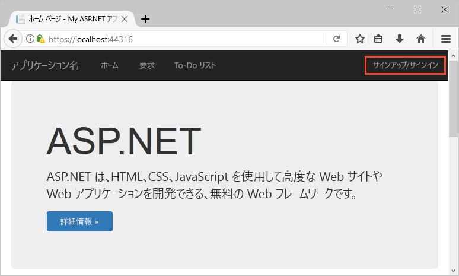

# <a name="quickstart-set-up-sign-in-for-an-aspnet-application-using-azure-active-directory-b2c"></a>クイック スタート: Azure Active Directory B2C を使用した ASP.NET アプリケーションのサインインの設定

Azure Active Directory (Azure AD) B2C は、アプリケーション、ビジネス、顧客を保護するためのクラウド ID 管理を提供します。 Azure AD B2C に対応したアプリは、オープンな標準プロトコルを使用し、ソーシャル アカウントやエンタープライズ アカウントで認証を行うことができます。

このクイックスタートでは、Azure AD B2C 対応のサンプル ASP.NET アプリにソーシャル ID プロバイダーを使ってサインインし、Azure AD B2C で保護された Web API を呼び出します。

[!INCLUDE [quickstarts-free-trial-note](../../includes/quickstarts-free-trial-note.md)]

## <a name="prerequisites"></a>前提条件

* [Visual Studio 2017](https://www.visualstudio.com/downloads/) と **ASP.NET および開発**ワークロード。 
* Facebook、Google、Microsoft、または Twitter のソーシャル アカウント。

## <a name="download-the-sample"></a>サンプルのダウンロード

[ZIP ファイルをダウンロード](https://github.com/Azure-Samples/active-directory-b2c-dotnet-webapp-and-webapi/archive/master.zip)するか、GitHub からサンプル Web アプリを複製します。

```
git clone https://github.com/Azure-Samples/active-directory-b2c-dotnet-webapp-and-webapi.git
```

## <a name="run-the-app-in-visual-studio"></a>Visual Studio でのアプリの実行

サンプル アプリケーションのプロジェクト フォルダーにある `B2C-WebAPI-DotNet.sln` ソリューションを Visual Studio で開きます。

サンプル ソリューションには 2 つのプロジェクトがあります。

**Web アプリのサンプル アプリ (TaskWebApp):** タスク リストを作成および編集するための Web アプリ。 この Web アプリでは、**サインアップまたはサインイン** ポリシーを使用して、ユーザーをサインアップまたはサインインします。

**Web API のサンプル アプリ (TaskService):** タスク リストの作成、読み取り、更新、削除機能をサポートする Web API。 この Web API は Azure AD B2C によって保護されており、Web アプリによって呼び出されます。

このクイック スタートでは、`TaskWebApp` プロジェクトと `TaskService` プロジェクトの両方を同時に実行します。 

1. ソリューション エクスプローラーで `B2C-WebAPI-DotNet` ソリューションを選択します。
2. Visual Studio のメニューで、**[プロジェクト]、[スタートアップ プロジェクトの設定]** の順に選択します。 
3. **[マルチ スタートアップ プロジェクト]** を選択します。
4. 両方のプロジェクトの **[アクション]** を **[開始]** に変更します。 Click **OK**.

**F5** キーを押して両方のアプリケーションをデバッグします。 各アプリケーションは、それぞれ別のブラウザー タブで開かれます。

`https://localhost:44316/` - このページは、ASP.NET Web アプリケーションです。 このクイック スタートでは、このアプリケーションを直接操作します。
`https://localhost:44332/` - このページは、ASP.NET Web アプリケーションによって呼び出される Web API です。

## <a name="create-an-account"></a>アカウントの作成

ASP.NET Web アプリケーションの **[Sign up / Sign in]\(サインアップ/サインイン\)** リンクをクリックして、Azure AD B2C のポリシーに基づく**サインアップまたはサインイン** ワークフローを開始します。



このサンプルは、ソーシャル ID プロバイダーを使用する方法や、メール アドレスを使用してローカル アカウントを作成する方法など、複数のサインアップ方法に対応しています。 このクイック スタートでは、Facebook、Google、Microsoft、または Twitter のいずれかのソーシャル ID プロバイダー アカウントを使用します。 

### <a name="sign-up-using-a-social-identity-provider"></a>ソーシャル ID プロバイダーを使用してサインアップする

このサンプル Web アプリでは、Wingtip Toys という架空のブランドのカスタム ログイン ページが Azure AD B2C により表示されます。 

1. ソーシャル ID プロバイダーを使用してサインアップするには、使用する ID プロバイダーのボタンをクリックします。

    

    ユーザーは、ソーシャル アカウントの資格情報を使用して認証 (サインイン) を行うと共に、ソーシャル アカウントから情報を読み取ることについての承認をアプリケーションに与えることになります。 アクセスを許可することにより、アプリケーションはソーシャル アカウントからプロファイル情報 (名前やお住まいの都市など) を取得できるようになります。 

2. ID プロバイダーのサインイン プロセスを完了します。 たとえば、Twitter を選択した場合、Twitter の資格情報を入力し、**[サインイン]** をクリックします。

    

    新しい Azure AD B2C アカウントのプロファイルの詳細には、ソーシャル アカウントからの情報があらかじめ設定されています。

3. [Display Name]\(表示名\)、[Job Title]\(役職\)、[City]\(都市) フィールドを更新し、**[Continue]\(続行\)** をクリックします。  入力した値は、Azure AD B2C ユーザー アカウントのプロファイルに使用されます。

    

    Azure AD B2C のポリシーに基づき ID プロバイダーを使って認証を行ったり、Azure AD B2C ユーザー アカウントを作成したりするサンプル Web アプリを無事に使用することができました。 

## <a name="edit-your-profile"></a>プロファイルの編集

Azure Active Directory B2C には、ユーザーが自分のプロファイルを更新することができる機能があります。 このサンプル Web アプリのワークフローには、Azure AD B2C の編集プロファイル ポリシーが使用されます。 

1. Web アプリケーションのメニュー バーでプロファイル名をクリックし、**[Edit Profile]\(プロファイルの編集\)** を選択して、作成したプロファイルを編集します。

    

2. **[Display name]\(表示名\)** と **[City]\(都市\)** を変更します。  
3. **[Continue]\(続行\)** をクリックして、プロファイルを更新します。 新しい表示名が、Web アプリのホーム ページの右上の領域に表示されます。

## <a name="access-a-protected-web-api-resource"></a>保護された Web API リソースにアクセスする

1. To-Do リスト項目を入力および変更するには、**[To-Do List]\(To-Do リスト\)** をクリックします。 

2. **[New Item]\(新しい項目\)** テキスト ボックスにテキストを入力します。 **[Add]\(追加\)** をクリックして、To-do リスト項目を追加する、Azure AD B2C で保護された Web API を呼び出します。

    

    ASP.NET Web アプリケーションは、保護された Web API リソースへの要求に、ユーザーの To Do リスト項目に対する操作を実行するための Azure AD アクセス トークンを追加します。

Azure AD B2C ユーザー アカウントを使用して、Azure AD B2C で保護された Web API の承認済みの呼び出しを正しく行いました。

## <a name="clean-up-resources"></a>リソースのクリーンアップ

他の Azure AD B2C クイックスタートやチュートリアルを試す場合は、Azure AD B2C テナントを使用できます。 不要になったら、[Azure AD B2C テナントを削除する](active-directory-b2c-faqs.md#how-do-i-delete-my-azure-ad-b2c-tenant)ことができます。

## <a name="next-steps"></a>次の手順

このクイックスタートでは、Azure AD B2C 対応のサンプル ASP.NET アプリを使用して、カスタム ログイン ページでのサインインとソーシャル ID プロバイダーでのサインイン、Azure AD B2C アカウントの作成を行った後、Azure AD B2C で保護された Web API を呼び出しました。 

引き続き、独自の Azure AD B2C テナントを使用するための構成をサンプル ASP.NET に対して行う方法のチュートリアルをご覧ください。

> [!div class="nextstepaction"]
> [Azure Portal で Azure Active Directory B2C テナントを作成する](tutorial-create-tenant.md)