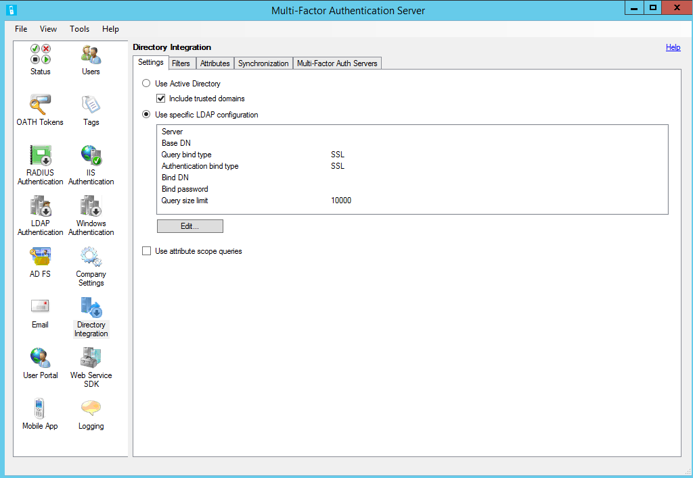

# AD FS 2.0 と連携するように Azure Multi-Factor Authentication Server を構成する

この記事は、現在 Azure Active Directory を使用しており、オンプレミスやクラウドに置かれたリソースをセキュリティで保護したいと考えている組織を対象としたものです。 Azure Multi-Factor Authentication Server を使用し、AD FS との連携を構成すれば、価値の大きなエンド ポイントに対して 2 段階認証をトリガーできるため、リソースを保護することができます。

このドキュメントでは、Azure Multi-Factor Authentication Server と AD FS 2.0 の使用について説明します。 AD FS について詳しくは、「[Azure Multi-Factor Authentication Server と Windows Server 2012 R2 の AD FS を使用したクラウドとオンプレミスのリソースのセキュリティ保護](howto-mfaserver-adfs-2012.md)」をご覧ください。

## プロキシを使って AD FS 2.0 を保護する
プロキシで AD FS 2.0 を保護するには、AD FS プロキシ サーバーに Azure Multi-Factor Authentication Server をインストールします。

### IIS 認証を構成する
1. Azure Multi-Factor Authentication Server 内で、左側のメニューの **[IIS 認証]** アイコンをクリックします。
2. **[フォームベース]** タブをクリックします。
3. **[追加]** をクリックします。

   

4. ユーザー名、パスワード、およびドメインの変数を自動的に検出するには、[フォームベースの Web サイトの自動構成] ダイアログ ボックス内でログイン URL (例: https://sso.contoso.com/adfs/ls)) を入力し、**[OK]** をクリックします。
5. すべてのユーザーがサーバーにインポート済みであるかインポート予定であり、2 段階認証の対象となる場合は、**[Require Azure Multi-Factor Authentication user match (Azure Multi-Factor Authentication のユーザー照合が必要)]** ボックスをオンにします。 多数のユーザーがまだサーバーにインポートされていない、または 2 段階認証から除外される場合、ボックスはオフのままにします。
6. ページ変数を自動で検出できなかった場合には、[フォームベースの Web サイトの自動構成] ダイアログ ボックスの **[手動で指定...]** ボタンをクリックします。
7. [フォームベースの Web サイトの追加] ダイアログ ボックスで、AD FS ログイン ページの URL (例: https://sso.contoso.com/adfs/ls)) を [送信 URL] フィールドに入力し、アプリケーション名 (省略可能) を入力します。 アプリケーション名は Azure Multi-Factor Authentication レポートに表示され、SMS またはモバイル アプリの認証メッセージにも表示される場合があります。
8. [要求の形式] を **[POST または GET]** に設定します。
9. ユーザー名変数 (ctl00 $contentplaceholder1 $usernametextbox) とパスワード変数 (ctl00 $contentplaceholder1 $passwordtextbox) を入力します。 フォーム ベースのログイン ページにドメイン テキスト ボックスが表示される場合、[ドメイン変数] も入力します。 ログイン ページ内の入力ボックスの名前を検索するには、Web ブラウザーでログイン ページに移動し、ページを右クリックし、**[ソースの表示]** を選択します。
10. すべてのユーザーがサーバーにインポート済みであるかインポート予定であり、2 段階認証の対象となる場合は、**[Require Azure Multi-Factor Authentication user match (Azure Multi-Factor Authentication のユーザー照合が必要)]** ボックスをオンにします。 多数のユーザーがまだサーバーにインポートされていない、または 2 段階認証から除外される場合、ボックスはオフのままにします。
    

11. **[詳細設定...]** をクリックして、 詳細設定を確認します。 構成できる設定は次のとおりです。

    - カスタム拒否ページ ファイルの選択
    - Cookie を使用した Web サイトへの成功した認証のキャッシュ
    - プライマリ資格情報の認証方法の選択

12. AD FS プロキシ サーバーはドメインに参加しない可能性があるため、ユーザー インポートや事前認証のためのドメイン コントローラーへの接続に LDAP を使用できます。 [フォームベースの Web サイトの詳細設定] ダイアログ ボックスで、**[プライマリ認証]** タブをクリックし、事前認証の種類に **[LDAP バインド]** を選択します。
13. 完了したら、**[OK]** をクリックして、[フォームベースの Web サイトの追加] ダイアログ ボックスに戻ります。
14. **[OK]** をクリックしてダイアログ ボックスを閉じます。
15. URL とページの変数が検出または入力されたら、フォームベースのパネルにその Web サイトのデータが表示されます。
16. **[ネイティブ モジュール]** タブをクリックし、サーバー、AD FS プロキシが実行されている Web サイト (例: "既定の Web サイト")、または AD FS プロキシ アプリケーション (例: "adfs" の下の "ls") を選び、必要なレベルで IIS プラグインを有効にします。
17. 画面上部にある **[IIS 認証を有効にする]** ボックスをクリックします。

IIS 認証が有効になりました。

### ディレクトリ統合の構成
IIS 認証は有効になったものの、LDAP を経由して Active Directory (AD) に事前認証を実行するには、ドメイン コントローラーへの LDAP 接続を構成する必要があります。

1. **[ディレクトリ統合]** アイコンをクリックします。
2. [設定] タブで、**[特定の LDAP 構成を使用する]** ラジオ ボタンを選択します。

   

3. **[編集]** をクリックします。
4. [LDAP 構成の編集] ダイアログ ボックスで、AD ドメイン コントローラーへの接続に必要な情報をフィールドに入力します。 各フィールドの説明は、Azure Multi-Factor Authentication Server のヘルプ ファイルに含まれています。
5. **[テスト]** ボタンをクリックして、LDAP 接続をテストします。

   

6. LDAP 接続テストが成功した場合は、**[OK]** をクリックします。

### 会社の設定の構成
1. 次に、**[会社の設定]** アイコンをクリックし、**[ユーザー名の解決]** タブを選択します。
2. **[LDAP 一意識別子の属性をユーザー名の照合に使用する]** ラジオ ボタンを選択します。
3. ユーザーがユーザー名を "domain\username" の形式で入力した場合、サーバーは、LDAP クエリの作成時にユーザー名からドメイン部分を除去する必要があります。 これはレジストリの設定から行えます。
4. レジストリ エディタを開き、64 ビット サーバーの HKEY_LOCAL_MACHINE/SOFTWARE/Wow6432Node/Positive Networks/PhoneFactor に移動します。 32 ビット サーバーの場合、パスから “Wow6432Node” を取ってください。 "UsernameCxz_stripPrefixDomain" という名前の DWORD レジストリ キーを作成し、値を 1 に設定します。 Azure Multi-Factor Authentication は、AD FS プロキシをセキュリティ保護するようになりました。

ユーザーが Active Directory からサーバーにインポートされたことを確認します。 内部 IP アドレスをホワイトリストに登録し、それらの場所から Web サイトにサインインする際に 2 段階認証を不要にするには、以下の「[信頼できる IP](#trusted-ips)」のセクションを参照してください。

## プロキシを持たない AD FS 2.0 Direct
AD FS プロキシを使用しない場合でも、AD FS をセキュリティで保護できます。 そのためには、以下の手順に従って AD FS サーバーに Azure Multi-Factor Authentication Server をインストールし、サーバーを構成します。

1. Azure Multi-factor Authentication Server 内で、左側のメニューの **[IIS 認証]** アイコンをクリックします。
2. **[HTTP]** タブをクリックします。
3. **[追加]** をクリックします。
4. [ベース URL の追加] ダイアログ ボックスで、HTTP 認証が実行される AD FS Web サイトの URL (例: https://sso.domain.com/adfs/ls/auth/integrated)) を [ベース URL] フィールドに入力します。 入力が終わったら、アプリケーション名を入力します (省略可能)。 アプリケーション名は Azure Multi-Factor Authentication レポートに表示され、SMS またはモバイル アプリの認証メッセージにも表示される場合があります。
5. 必要な場合、アイドル状態のタイムアウトと最大セッション時間を調整します。
6. すべてのユーザーがサーバーにインポート済みであるかインポート予定であり、2 段階認証の対象となる場合は、**[Require Azure Multi-Factor Authentication user match (Azure Multi-Factor Authentication のユーザー照合が必要)]** ボックスをオンにします。 多数のユーザーがまだサーバーにインポートされていない、または 2 段階認証から除外される場合、ボックスはオフのままにします。
7. 必要な場合は、[クッキーのキャッシュ] ボックスをオンにします。

   

8. Click **OK**.
9. **[ネイティブ モジュール]** タブをクリックし、サーバー、Web サイト (例: [既定の Web サイト])、または AD FS アプリケーション (例: [adfs] の下の [ls]) を選び、必要なレベルで IIS プラグインを有効にします。
10. 画面上部にある **[IIS 認証を有効にする]** ボックスをクリックします。

Azure Multi-Factor Authentication は、AD FS をセキュリティ保護するようになりました。

ユーザーが Active Directory からサーバーにインポートされたことを確認します。 内部 IP アドレスをホワイトリストに登録し、それらの場所から Web サイトにサインインする際に 2 段階認証を不要にするには、以下の「信頼できる IP」のセクションを参照してください。

## 信頼できる IP
信頼できる IP は、特定の IP アドレスまたはサブネットから発生する Web サイト要求に関して、ユーザーが Azure Multi-Factor Authentication をバイパスできるようにします。 たとえば、オフィスからサインインした場合には 2 段階認証からユーザーを除外したいとします。 そのためには、社内のサブネットを信頼できる IP エントリとして指定します。

### 信頼される IP を構成するには
1. [IIS 認証] セクションで、**[信頼できる IP]** タブをクリックします。
2. **[追加]** ボタンを選択します。
3. [Add Trusted IPs (信頼できる IP の追加)] ダイアログ ボックスが表示されたら、**[単一 IP を追加する]**、**[IP 範囲を指定して追加する]**、または **[サブネット]** ラジオ ボタンのいずれかを選択します。
4. ホワイト リストに登録する IP アドレス、IP アドレスの範囲、またはサブネットを入力します。 サブネットを入力する場合は、適切なネットマスクを選択し、**[OK]** ボタンをクリックします。 信頼される IP が追加されました。

