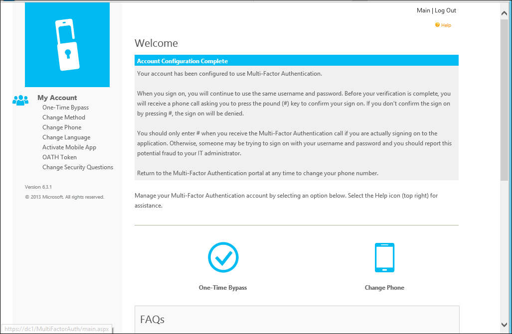
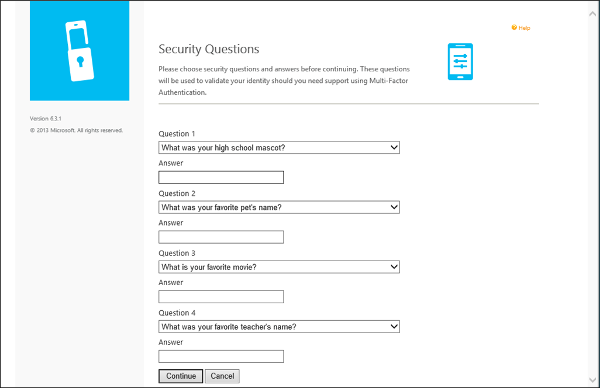

# Azure Multi-Factor Authentication Server のユーザー ポータル

ユーザー ポータルは、ユーザーが Azure Multi-Factor Authentication (MFA) に登録を行い、アカウントを保守するための IIS Web サイトです。 ユーザーは次のサインイン時に、電話番号の変更、PIN の変更、または 2 段階認証をバイパスを行うことができます。

ユーザーは、通常のユーザー名とパスワードを使用してユーザー ポータルにサインインし、2 段階認証呼び出しを完了するか、セキュリティに関する質問に回答して認証を完了します。 ユーザー登録が許可されている場合、ユーザー ポータルに最初にサインインする際にユーザーは電話番号と PIN を構成します。

ユーザー ポータルの管理者をセットアップして、新しいユーザーを追加するアクセス許可と既存のユーザーを更新するアクセス許可を付与することができます。

ユーザー ポータルは、ご利用の環境に応じて、Azure Multi-Factor Authentication Server と同じサーバーにデプロイするか、またはインターネットに接続された別のサーバーにデプロイしてもかまいません。

> [!NOTE]
> ユーザー ポータルは Multi-Factor Authentication Server でのみ使用できます。 Multi-Factor Authentication をクラウドで使用する場合、[2 段階認証のためのアカウント設定](end-user/current/multi-factor-authentication-end-user-first-time.md)に関するページか「[2 段階認証設定の管理](end-user/current/multi-factor-authentication-end-user-manage-settings.md)」をユーザーに参照してもらってください。

## Web サービス SDK のインストール

どちらのシナリオにおいても、Azure Multi-Factor Authentication (MFA) Server に Azure Multi-Factor Authentication Web サービス SDK がまだインストールされて**いない**場合は、以下の手順を実行してください。

1. Multi-Factor Authentication Server コンソールを開きます。
2. **[Web Service SDK]** に移動し、**[Web サービス SDK のインストール]** を選択します。
3. インストールは既定の設定で行ってください (何らかの理由で変更しなければならない場合を除く)。
4. IIS 内のサイトに SSL 証明書をバインドします。

IIS サーバーに SSL 証明書を構成する方法についてご不明な点があれば、[IIS における SSL のセットアップ方法](https://docs.microsoft.com/iis/manage/configuring-security/how-to-set-up-ssl-on-iis)に関する記事を参照してください。

Web サービス SDK は、SSL 証明書で保護されている必要があります。 このために自己署名証明書を使用できます。 SSL 接続を開始するときにその証明書が信頼されるように、ユーザー ポータル Web サーバー上のローカル コンピューター アカウントの "信頼されたルート証明機関" ストアに証明書をインポートします。

## Azure Multi-Factor Authentication Server と同じサーバーにユーザー ポータルをデプロイする

Azure Multi-Factor Authentication Server と**同じサーバー**にユーザー ポータルをインストールするには、前提条件となる次のものが必要です。

* ASP.NET と IIS 6 メタベース互換性を含む IIS (IIS 7 以降の場合)
* コンピューターとドメイン (該当する場合) に対する管理者権限が付与されたアカウント。 このアカウントには Active Directory セキュリティ グループを作成するためのアクセス許可が必要です。
* ユーザー ポータルを SSL 証明書でセキュリティ保護します。
* Azure Multi-Factor Authentication Web サービス SDK を SSL 証明書でセキュリティ保護します。

ユーザー ポータルをデプロイするには、次の手順を実行します。

1. Azure Multi-Factor Authentication Server コンソールを開いて、左側のメニューの **[ユーザー ポータル]** アイコンをクリックし、**[ユーザー ポータルのインストール]** をクリックします。
2. インストールは既定の設定で行ってください (何らかの理由で変更しなければならない場合を除く)。
3. IIS 内のサイトに SSL 証明書をバインドします。

   > [!NOTE]
   > 通常この SSL 証明書は、公的に署名された SSL 証明書です。

4. 任意のコンピューターで Web ブラウザーを開き、ユーザー ポータルがインストールされた URL に移動します (https://mfa.contoso.com/MultiFactorAuth) など)。 証明書の警告およびエラーが表示されないことを確認してください。

IIS サーバーに SSL 証明書を構成する方法についてご不明な点があれば、[IIS における SSL のセットアップ方法](https://docs.microsoft.com/iis/manage/configuring-security/how-to-set-up-ssl-on-iis)に関する記事を参照してください。

## ユーザー ポータルを別のサーバーにデプロイする

Azure Multi-Factor Authentication Server が実行されているサーバーがインターネットに接続していない場合、ユーザー ポータルは**インターネットに接続している別のサーバー**にインストールする必要があります。

認証方法の 1 つとして Microsoft Authenticator アプリが組織で使用されていて、ユーザー ポータルを独自のサーバーにデプロイしたい場合、次の要件を満たす必要があります。

* v6.0 以上の Azure Multi-Factor Authentication Server を使用します。
* Microsoft インターネット インフォメーション サービス (IIS) 6.x 以上を実行している、インターネットに接続された Web サーバーにユーザー ポータルをインストールします。
* IIS 6.x を使用している場合は、ASP.NET v2.0.50727 がインストールおよび登録され、**[許可]** に設定されていることを確認します。
* IIS 7.x 以上を使用している場合は、IIS 基本認証、ASP.NET、IIS 6 メタベース互換が必要となります。
* ユーザー ポータルを SSL 証明書でセキュリティ保護します。
* Azure Multi-Factor Authentication Web サービス SDK を SSL 証明書でセキュリティ保護します。
* ユーザー ポータルが SSL 経由で Azure Multi-Factor Authentication Web サービス SDK に接続できるようにします。
* "PhoneFactor Admins" セキュリティ グループのサービス アカウントの資格情報を使用して、Azure Multi-Factor Authentication Web サービス SDK でユーザー ポータルを認証できるようにします。 このサービス アカウントとグループは、Azure Multi-Factor Authentication Server がドメインに参加しているサーバーで実行されている場合は、Active Directory に存在している必要があります。 このサービス アカウントとグループは、Azure Multi-Factor Authentication Server がドメインに参加していない場合、Azure Multi-Factor Authentication Server のローカルに存在します。

Azure Multi-Factor Authentication Server 以外のサーバーにユーザー ポータルをインストールするには、次の手順が必要です。

1. **MFA Server** 上のインストール パス (例: C:\Program Files\Multi-Factor Authentication Server) を参照して **MultiFactorAuthenticationUserPortalSetup64** ファイルをコピーし、そのインストール先となる、インターネットに接続されたサーバーからアクセスできる場所に貼り付けます。
2. **インターネットに接続している Web サーバーで**、MultiFactorAuthenticationUserPortalSetup64 インストール ファイルを管理者として実行し、必要な場合はサイトを変更し、仮想ディレクトリを適宜短い名前に変更します。
3. IIS 内のサイトに SSL 証明書をバインドします。

   > [!NOTE]
   > 通常この SSL 証明書は、公的に署名された SSL 証明書です。

4. **C:\inetpub\wwwroot\MultiFactorAuth** を参照します。
5. メモ帳で Web.Config ファイルを編集します。

    * **"USE_WEB_SERVICE_SDK"** というキーを探して **value="false"** を **value="true"** に変更します。
    * **"WEB_SERVICE_SDK_AUTHENTICATION_USERNAME"** というキーを探して **value=""** を **value="DOMAIN\User"** に変更します。DOMAIN\User には、"PhoneFactor Admins" グループに属しているサービス アカウントを指定してください。
    * **"WEB_SERVICE_SDK_AUTHENTICATION_PASSWORD"** というキーを探して **value=""** を **value="Password"** に変更します。Password には、前の行で入力したサービス アカウントのパスワードを指定してください。
    * **https://www.contoso.com/MultiFactorAuthWebServiceSdk/PfWsSdk.asmx** という値を探して、このプレースホルダー URL を手順 2. でインストールした Web サービス SDK の URL に変更します。
    * Web.Config ファイルを保存してメモ帳を閉じます。

6. 任意のコンピューターで Web ブラウザーを開き、ユーザー ポータルがインストールされた URL に移動します (https://mfa.contoso.com/MultiFactorAuth) など)。 証明書の警告およびエラーが表示されないことを確認してください。

IIS サーバーに SSL 証明書を構成する方法についてご不明な点があれば、[IIS における SSL のセットアップ方法](https://docs.microsoft.com/iis/manage/configuring-security/how-to-set-up-ssl-on-iis)に関する記事を参照してください。

## Azure Multi-Factor Authentication Server のユーザー ポータル設定を構成する

ユーザー ポータルがインストールされたため、Azure Multi-Factor Authentication Server を構成してポータルと連携させる必要があります。

1. Azure Multi-Factor Authentication Server コンソールで、**[ユーザー ポータル]** アイコンをクリックします。 [設定] タブで、**[ユーザー ポータル URL]** ボックスにユーザー ポータルの URL を入力します。 電子メール機能が有効な場合、この URL は、ユーザーが Azure Multi-Factor Authentication Server にインポートされるときに送信される電子メールに含まれます。
2. ユーザー ポータルで使用する設定を選択します。 たとえば、認証方法の選択をユーザーに許可する場合は、ユーザーが選択できる方法と共に、**[ユーザーに認証方法の選択を許可する]** をオンにします。
3. 管理者となるユーザーを **[管理者]** タブで定義します。追加/編集ボックスのドロップダウンとチェック ボックスを使用して管理アクセス許可を細かく設定できます。

オプションの構成:
- **[セキュリティの質問]** - 対象の環境に関して承認されたセキュリティの質問とその質問を表示する際の言語を定義します。
- **[渡されたセッション]** - MFA を使用して、ユーザー ポータルとフォームベースの Web サイトの統合を構成します。
- **[信頼できる IP]** - 信頼できる IP リスト (または範囲) から認証を行った場合に、ユーザーは MFA をスキップすることができます。

Azure Multi-Factor Authentication Server にはユーザー ポータル用のさまざまなオプションがあります。 次の表に、これらのオプションとそれぞれの使用目的を示します。

| ユーザー ポータル設定 | 説明 |
|:--- |:--- |
| ユーザー ポータル URL | ポータルがホストされる場所の URL を入力します。 |
| プライマリ認証 | ポータルにサインインするときに使用する認証の種類を指定します。 Windows 認証、Radius 認証または LDAP 認証のいずれかです。 |
| ユーザーにログインを許可する | ユーザー ポータルのサインイン ページにユーザー名とパスワードを入力できるようにします。 このオプションが選択されていない場合、ボックスは淡色表示されます。 |
| ユーザー登録を許可する | 電話番号などの追加情報の入力を求める設定画面に移動して、Multi-Factor Authentication に登録できるようにします。 予備の電話番号には、補助的な電話番号を指定できます。 サード パーティの OATH トークンには、サード パーティの OATH トークンを指定できます。 |
| ワンタイム バイパスの開始をユーザーに許可する | ユーザーがワンタイム バイパスを開始できるようにします。 このオプションを有効にした場合は、ユーザーの次回のサインインで有効になります。 プロンプトのバイパス秒を指定するボックスが表示され、ユーザーは既定値である 300 秒を変更できます。 変更しなかった場合、ワンタイム バイパスは 300 秒間のみ有効です。 |
| ユーザーに認証方法の選択を許可する | ユーザーが主要な連絡方法を指定できるようにします。 電話、テキスト メッセージ、モバイル アプリ、または OATH トークンを指定できます。 |
| ユーザーに言語の選択を許可する | 電話、テキスト メッセージ、モバイル アプリ、または OATH トークンに使用される言語をユーザーが変更できるようにします。 |
| ユーザーにモバイル アプリのアクティブ化を許可する | サーバーで使用されるモバイル アプリのアクティブ化プロセスを完了するためのアクティブ化コードをユーザーが生成できるようにします。  アプリをアクティブ化できるデバイスの数 (1 ～ 10) を設定することもできます。 |
| 代替認証にセキュリティの質問を使用する | 2 段階認証が失敗した場合に、セキュリティの質問を使用できます。 正解する必要があるセキュリティの質問の数を指定できます。 |
| ユーザーにサード パーティ製の OATH トークンの関連付けを許可する | ユーザーがサード パーティの OATH トークンを指定できるようにします。 |
| 代替認証に OATH トークンを使用する | 2 段階認証が失敗した場合に、OATH トークンを使用できるようにします。 セッションのタイムアウトを分単位で指定することもできます。 |
| ログの有効化 | ユーザー ポータルでログを有効にします。 ログ ファイルは C:\Program Files\Multi-Factor Authentication Server\Logs に配置されます。 |

これらの設定をポータルのユーザーが確認できるのは、それらが有効になった後、ユーザー ポータルにサインインした後になります。

### セルフサービスのユーザー登録

ユーザーにサインインと登録を許可するには、[設定] タブで **[ユーザーにログインを許可する]** オプションと **[ユーザー登録を許可する]** オプションを選択する必要があります。選択した設定は、ユーザーのサインイン エクスペリエンスに影響することに注意してください。

たとえば、ユーザーが初めてユーザー ポータルにサインインすると、Azure Multi-Factor Authentication のユーザー設定ページが表示されます。 Azure Multi-Factor Authentication の構成方法によっては、ユーザーは自分の認証方法を選択できる場合があります。

ユーザーが認証方法として音声通話を選択した場合、またはそのように事前に構成されている場合は、ページに代表電話番号と内線番号 (該当する場合) を入力します。 予備の電話番号を入力できる場合もあります。

ユーザーの認証時に PIN を使用する必要がある場合は、PIN を作成するように求められます。 電話番号と PIN (該当する場合) を入力した後、**[今すぐ電話で認証]** ボタンをクリックします。 Azure Multi-Factor Authentication が、ユーザーの代表電話番号に対して電話による認証を実行します。 ユーザーは、自己登録プロセスの次の手順に進むには、電話に応答し、PINを入力する (該当する場合) 必要があります。

ユーザーが認証方法としてテキスト メッセージを選択した場合、またはそのように事前に構成されている場合は、ページに携帯電話の番号を入力します。 ユーザーの認証時に PIN を使用する必要がある場合は、PIN の入力も求められます。  電話番号と PIN (該当する場合) を入力した後、**[今すぐテキスト メッセージで認証]** ボタンをクリックします。 Azure Multi-Factor Authentication が、ユーザーの携帯電話に対して SMS 認証を実行します。 ユーザーはワンタイム パスコード (OTP) を含むテキスト メッセージを受信し、その OTP と PIN (該当する場合) を使用してそのメッセージに返信します。

ユーザーが認証方法としてモバイル アプリを選択した場合、ユーザーのデバイスに Microsoft Authenticator アプリをインストールしてアクティブ化コードを生成するよう求めるメッセージがページに表示されます。 アプリをインストールしたら、[アクティブ化コードの生成] ボタンをクリックします。

> [!NOTE]
> Microsoft Authenticator アプリを使用するには、ユーザーのデバイスのプッシュ通知を有効にする必要があります。

アクティブ化コード、URL、およびバーコード画像がページに表示されます。 ユーザーの認証時に PIN を使用する必要がある場合は、PIN の入力も求められます。 Microsoft Authenticator アプリにアクティブ化コードと URL を入力するか、バーコード スキャナーを使用してバーコード画像をスキャンした後、[アクティブにする] ボタンをクリックします。

アクティブ化が完了したら、**[今すぐ認証]** ボタンをクリックします。 Azure Multi-Factor Authentication がユーザーのモバイル アプリに対して認証を実行します。 ユーザーは、自己登録プロセスの次の手順に進むには、モバイル アプリに PINを入力し (該当する場合)、[認証] ボタンを押す必要があります。

管理者がセキュリティの質問と回答を収集するように Azure Multi-Factor Authentication Server を構成している場合は [セキュリティの質問] ページが表示されます。 ユーザーは、4 つのセキュリティの質問を選択し、選択した質問への回答を入力する必要があります。

これで、ユーザーの自己登録が完了し、ユーザーはユーザー ポータルにサインインします。 管理者によって変更が許可されている場合、ユーザーは、今後いつでもユーザー ポータルに戻って、電話番号、PIN、認証方法、セキュリティの質問を変更できます。

## 次の手順

- [Azure Multi-Factor Authentication Server モバイル アプリ Web サービスのデプロイ](howto-mfaserver-deploy-mobileapp.md)。