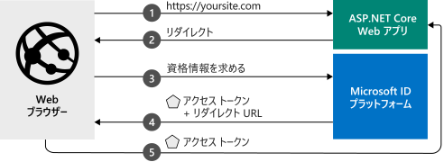

# <a name="quickstart-add-sign-in-with-microsoft-to-an-aspnet-core-web-app"></a>クイック スタート: ASP.NET Core Web アプリに Microsoft サインインを追加する

[!INCLUDE [active-directory-develop-applies-v2](../../../includes/active-directory-develop-applies-v2.md)]

このクイック スタートでは、ASP.NET Core Web アプリで、(hotmail.com、outlook.com などの) 個人アカウント、また職場や学校のアカウントを任意の Azure Active Directory (Azure AD) インスタンスからサインインさせる方法を学びます。



> [!div renderon="docs"]
> ## <a name="register-and-download-your-quickstart-app"></a>クイック スタート アプリを登録してダウンロードする
> クイック スタート アプリケーションを開始する方法としては、次の 2 つの選択肢があります。
> * [簡易] [選択肢 1: アプリを登録して自動構成を行った後、コード サンプルをダウンロードする](#option-1-register-and-auto-configure-your-app-and-then-download-your-code-sample)
> * [手動] [選択肢 2: アプリケーションを登録し、コード サンプルを手動で構成する](#option-2-register-and-manually-configure-your-application-and-code-sample)
>
> ### <a name="option-1-register-and-auto-configure-your-app-and-then-download-your-code-sample"></a>選択肢 1: アプリを登録して自動構成を行った後、コード サンプルをダウンロードする
>
> 1. [Azure portal の [アプリの登録]](https://aka.ms/aspnetcore2-1-aad-quickstart-v2) に移動します。
> 1. アプリケーションの名前を入力し、 **[登録]** を選択します。
> 1. 画面の指示に従ってダウンロードし、1 回クリックするだけで、新しいアプリケーションが自動的に構成されます。
>
> ### <a name="option-2-register-and-manually-configure-your-application-and-code-sample"></a>選択肢 2: アプリケーションを登録し、アプリケーションとコード サンプルを手動で構成する
>
> #### <a name="step-1-register-your-application"></a>手順 1: アプリケーションの登録
> アプリケーションを登録し、その登録情報をソリューションに手動で追加するには、次の手順を実行します。
>
> 1. 職場または学校アカウントか、個人の Microsoft アカウントを使用して、[Azure portal](https://portal.azure.com) にサインインします。
> 1. ご利用のアカウントで複数のテナントにアクセスできる場合は、右上隅でアカウントを選択し、ポータルのセッションを目的の Azure AD テナントに設定します。
> 1. 開発者用の Microsoft ID プラットフォームの [[アプリの登録]](https://go.microsoft.com/fwlink/?linkid=2083908) ページに移動します。
> 1. **[新規登録]** を選択します。
> 1. **[アプリケーションの登録]** ページが表示されたら、以下のアプリケーションの登録情報を入力します。
>    - **[名前]** セクションに、アプリのユーザーに表示されるわかりやすいアプリケーション名を入力します (例: `AspNetCore-Quickstart`)。
>    - **[リダイレクト URI]** で `https://localhost:44321/` を追加し、 **[登録]** を選択します。
> 1. **[認証]** メニューを選択し、次の情報を追加します。
>    - **[リダイレクト URI]** で `https://localhost:44321/signin-oidc` を追加し、 **[保存]** を選択します。
>    - **[詳細設定]** セクションの **[ログアウト URL]** を「`https://localhost:44321/signout-oidc`」に設定します。
>    - **[暗黙的な許可]** の **[ID トークン]** チェック ボックスをオンにします。
>    - **[保存]** を選択します。

> [!div class="sxs-lookup" renderon="portal"]
> #### <a name="step-1-configure-your-application-in-the-azure-portal"></a>手順 1: Azure portal でのアプリケーションの構成
> このクイック スタートのコード サンプルを正常に動作させるためには、応答 URL として `https://localhost:44321/` および `https://localhost:44321/signin-oidc` を追加し、ログアウト URL として `https://localhost:44321/signout-oidc` を追加したうえで、承認エンドポイントによって発行される要求 ID トークンを追加する必要があります。
> > [!div renderon="portal" id="makechanges" class="nextstepaction"]
> > [この変更を行う]()
>
> > [!div id="appconfigured" class="alert alert-info"]
> >  アプリケーションはこれらの属性で構成されています。

#### <a name="step-2-download-your-aspnet-core-project"></a>手順 2: ASP.NET Core プロジェクトのダウンロード

- [Visual Studio 2019 ソリューションのダウンロード](https://github.com/Azure-Samples/active-directory-aspnetcore-webapp-openidconnect-v2/archive/aspnetcore2-2.zip)

#### <a name="step-3-configure-your-visual-studio-project"></a>手順 3:Visual Studio プロジェクトの構成

1. ルート フォルダー内のローカル フォルダー (例: **C:\Azure-Samples**) に ZIP ファイルを展開します。
1. Visual Studio 2019 を使用する場合は、Visual Studio でソリューションを開きます (任意)。
1. **appsettings.json** ファイルを編集します。 `ClientId` を探し、`ClientId` の値を、登録済みのアプリケーションの**アプリケーション (クライアント) ID** 値で更新します。 

    ```json
    "ClientId": "Enter_the_Application_Id_here"
    "TenantId": "Enter_the_Tenant_Info_Here"
    ```

> [!div class="sxs-lookup" renderon="portal"]
> > [!NOTE]
> > このクイックスタートでは、Enter_the_Supported_Account_Info_Here をサポートしています。

> [!div renderon="docs"]
> 各値の説明:
> - `Enter_the_Application_Id_here` -Azure portal に登録されているアプリケーションの "**アプリケーション (クライアント) ID**"。 "**アプリケーション (クライアント) ID**" は、アプリの **[概要]** ページで確認できます。
> - `Enter_the_Tenant_Info_Here` - 次のいずれかのオプション。
>   - アプリケーションで**この組織のディレクトリ内のアカウントのみ**をサポートする場合は、この値を**テナント ID** または**テナント名**に置き換えます (たとえば、contoso.microsoft.com)
>   - アプリケーションで **[任意の組織のディレクトリ内のアカウント]** がサポートされる場合は、この値を `organizations` に置き換えます。
>   - アプリケーションで **[すべての Microsoft アカウント ユーザー]** がサポートされる場合は、この値を `common` に置き換えます。
>
> > [!TIP]
> > **[アプリケーション (クライアント) ID]** 、 **[ディレクトリ (テナント) ID]** 、 **[サポートされているアカウントの種類]** の値を見つけるには、Azure portal でアプリの **[概要]** ページに移動します。

## <a name="more-information"></a>詳細情報

このセクションでは、ユーザーをサインインさせるために必要なコードの概要を示します。 この概要、コードの機能や主な引数について理解するために、また、既存の ASP.NET Core アプリケーションにサインインを追加する場合にも役立ちます。

### <a name="startup-class"></a>スタートアップ クラス

*Microsoft.AspNetCore.Authentication* ミドルウェアは、ホスト プロセスの初期化時に実行されるスタートアップ クラスを使用します。

```csharp
public void ConfigureServices(IServiceCollection services)
{
  services.Configure<CookiePolicyOptions>(options =>
  {
    // This lambda determines whether user consent for non-essential cookies is needed for a given request.
    options.CheckConsentNeeded = context => true;
    options.MinimumSameSitePolicy = SameSiteMode.None;
  });

  services.AddAuthentication(AzureADDefaults.AuthenticationScheme)
          .AddAzureAD(options => Configuration.Bind("AzureAd", options));

  services.Configure<OpenIdConnectOptions>(AzureADDefaults.OpenIdScheme, options =>
  {
    options.Authority = options.Authority + "/v2.0/";         // Microsoft identity platform

    options.TokenValidationParameters.ValidateIssuer = false; // accept several tenants (here simplified)
  });

  services.AddMvc(options =>
  {
     var policy = new AuthorizationPolicyBuilder()
                     .RequireAuthenticatedUser()
                     .Build();
     options.Filters.Add(new AuthorizeFilter(policy));
  })
  .SetCompatibilityVersion(CompatibilityVersion.Version_2_1);
}
```

`AddAuthentication` メソッドは、ブラウザーのシナリオで使用される Cookie ベースの認証を追加するようにサービスを構成し、OpenID Connect へのチャレンジも設定します。 

`.AddAzureAd` を含む行によって、Microsoft ID プラットフォーム認証がアプリケーションに追加されます。 次に、Microsoft ID プラットフォーム エンドポイントを使用してサインインするように構成されます。

> |Where  |  |
> |---------|---------|
> | ClientId  | Azure portal に登録されているアプリケーションのアプリケーション (クライアント) ID。 |
> | Authority | ユーザーが認証するための STS エンドポイント。 パブリック クラウドでは、通常は <https://login.microsoftonline.com/{tenant}/v2.0>。{tenant} はテナントの名前、テナント ID、または共通エンドポイントへの参照を表す *common* (マルチテナント アプリケーションで使用) です |
> | TokenValidationParameters | トークン検証のためのパラメーター リスト。 ここでは、`ValidateIssuer` は `false` に設定され、任意の個人、あるいは職場または学校のアカウント タイプからのサインインを受け付け可能であることを示しています。 |


> [!NOTE]
> `ValidateIssuer = false` の設定は、このクイックスタートを単純にするためのものです。 実際のアプリケーションでは、発行者を検証する必要があります。
> その方法については、サンプルを参照してください。

### <a name="protect-a-controller-or-a-controllers-method"></a>コントローラーまたはコントローラーのメソッドを保護する

`[Authorize]` 属性を使用して、コントローラーまたはコントローラーのメソッドを保護できます。 この属性は、認証済みのユーザーのみを許可することによって、コントローラーまたはメソッドへのアクセスを制限します。つまり、ユーザーが認証されていない場合は、コントローラーにアクセスするための認証チャレンジを開始できます。

[!INCLUDE [Help and support](../../../includes/active-directory-develop-help-support-include.md)]

## <a name="next-steps"></a>次の手順

詳細情報 (新しい ASP.NET Core Web アプリケーションに認証を追加する方法、Microsoft Graph や他の Microsoft API を呼び出す方法、独自の API を呼び出す方法、認証の追加方法、国内クラウドでのユーザーのサインイン方法、またはソーシャル ID によるサインイン方法に関する手順など) については、ASP.NET Core チュートリアルの GitHub リポジトリを参照してください。

> [!div class="nextstepaction"]
> [ASP.NET Core Web アプリのチュートリアル](https://github.com/Azure-Samples/active-directory-aspnetcore-webapp-openidconnect-v2/)

Microsoft ID プラットフォームの改善にご協力ください。 簡単な 2 つの質問からなるアンケートに記入し、ご意見をお聞かせください。

> [!div class="nextstepaction"]
> [Microsoft ID プラットフォームのアンケート](https://forms.office.com/Pages/ResponsePage.aspx?id=v4j5cvGGr0GRqy180BHbRyKrNDMV_xBIiPGgSvnbQZdUQjFIUUFGUE1SMEVFTkdaVU5YT0EyOEtJVi4u)