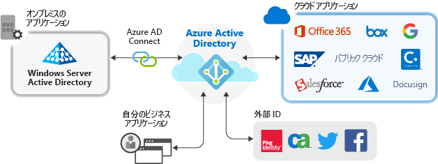

# Azure Active Directory によるアプリケーションの管理

Azure Active Directory (Azure AD) では、クラウドとオンプレミス アプリケーションに安全かつシームレスなアクセスを提供します。 ユーザーは、一度のサインインで、Microsoft が提供する Office 365 およびその他の業務アプリケーション、サービスとしてのソフトウェア (SaaS) アプリケーション、オンプレミス アプリケーション、および基幹業務 (LOB) アプリにアクセスできます。 ユーザー プロビジョニングを自動化することで、管理コストを削減します。 多要素認証と条件付きアクセス ポリシーを使用して、安全なアプリケーション アクセスを提供します。

## クラウド ソリューションを使用してアプリケーションを管理する理由

組織には通常、ユーザーが業務を遂行するために使用している何百ものアプリケーションがあります。 ユーザーは、多数のデバイスおよび場所から、これらのアプリケーションにアクセスします。 毎日、新しいアプリケーションが追加、開発され、また、廃止されます。 非常に多くのアプリケーションとアクセス ポイントがあるため、クラウドベース ソリューションを使用してすべてのアプリケーションへのユーザー アクセスを管理することが、これまでよりも重要になります。

## 条件付きアクセス ポリシーによるリスクの管理
条件付きアクセス ポリシーと Azure AD シングル サインオン (SSO) を組みわせることで、アプリケーションにアクセスするための高度なセキュリティが提供されます。 セキュリティ機能には、クラウド規模の ID 保護、リスクベースのアクセス制御、ネイティブな多要素認証、および条件付きアクセス ポリシーが含まれます。 これらの機能では、さらに高度なセキュリティを必要とするアプリケーションまたはグループに基づいて、より詳細にポリシーを制御できます。

## シングル サインオンによる生産性の向上
複数のアプリケーションおよび Office 365 でシングル サインオン (SSO) を有効にすると、サインイン プロンプトを減らすかなくすことで、既存のユーザーにより優れたサインイン エクスペリエンスを提供できます。 ユーザーの環境がより総合的になったことを実感できると共に、複数のプロンプトを伴わず、また複数のパスワードを管理する必要もないため、注意を削がれる機会が少なくなります。 業務グループでは、セルフ サービスかつ動的なメンバーシップを利用して、アクセスを管理して承認できます。 その業務での適任者がアプリケーションへのアクセスを管理できるので、ID システムのセキュリティが向上します。

SSO によって、セキュリティが改善されます。 *シングル サインオン*を利用しない場合、管理者は個々のアプリケーションごとに、ユーザー アカウントを作成および更新する必要があります。これには、時間がかかります。 また、ユーザーは、複数の資格情報を追跡してアプリケーションにアクセスする必要があります。 その結果、ユーザーは自分のパスワードをメモしたり、他のパスワード管理のソリューションを使用したりすることになり、データ セキュリティ リスクが生じる傾向があります。 

## ガバナンスとコンプライアンスへの対応
Azure AD では、セキュリティ情報とイベント管理 (SIEM) ツールを活用したレポート経由で、アプリケーション サインインを監視できます。 ポータルから、または API から、レポートにアクセスできます。 お使いのアプリケーションに誰がアクセスできるかをプログラムから監視して、アクセス レビュー経由で非アクティブなユーザーへのアクセスを削除します。

## コストを管理する
Azure AD に移行することで、コストを節約し、オンプレミス インフラストラクチャの管理における負担を除去できます。 また、Azure AD はアプリケーションにセルフ サービス アクセスを提供し、管理者とユーザーの両者が時間を節約できます。 シングル サインオンにより、アプリケーション固有のパスワードはなくなります。 この 1 回限りのサインオンにより、アプリケーションのパスワード リセットと、パスワードの取得時の生産性低下に関連するコストを削減できます。

