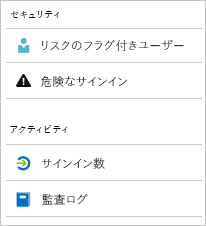

# Azure Active Directory レポートの概要

Azure Active Directory (Azure AD) レポートを使用すると、ご利用の環境におけるアクティビティを包括的に把握することができます。 レポートから得たデータによって次のことが可能となります。

- 管理下にあるユーザーがアプリとサービスをどのように利用しているかを明らかにする。
- 自分が管理している環境の正常性に影響する潜在的リスクを検出する。
- ユーザーの作業を妨げている問題をトラブルシューティングする。  

このレポート機能のアーキテクチャは、大きく次の 2 つの要素から成ります。

- [セキュリティ レポート](#security-reports)
- [アクティビティ レポート](#activity-reports)

## セキュリティ レポート

セキュリティ レポートは、組織の ID 保護に役立てることができます。 セキュリティ レポートには次の 2 種類があります。

- **リスクのフラグ付きユーザー** - [リスクのフラグ付きユーザー セキュリティ レポート](concept-user-at-risk.md)では、セキュリティが侵害されている可能性のあるユーザー アカウントの概要を把握することができます。

- **危険なサインイン** - [危険なサインイン セキュリティ レポート](concept-risky-sign-ins.md)は、ユーザー アカウントの正当な所有者ではない人によって行われた可能性があるサインイン試行の指標です。 

### セキュリティ レポートにアクセスするために必要な Azure AD ライセンス  

"リスクのフラグ付きユーザー" レポートと "危険なサインイン" レポートは、Azure AD の全エディションで利用できます。 ただしエディションによってレポートの粒度が異なります。 

- リスクのフラグ付きユーザーと危険なサインインは、**Azure Active Directory の Free エディションと Basic エディション**で一覧表示できます。 

- **Azure Active Directory Premium 1** エディションではこのモデルが拡張され、各レポートについて検出された、基になるリスク イベントの一部を調べることができます。 

- **Azure Active Directory Premium 2** エディションでは、基になるリスク イベントについて最も詳しい情報が得られます。また、構成されているリスク レベルに対して自動的に対応するセキュリティ ポリシーを構成することができます。

## アクティビティ レポート

アクティビティ レポートを使用すると、組織内のユーザーの行動が把握しやすくなります。 Azure AD には、次の 2 種類のアクティビティ レポートがあります。

- **監査ログ** - テナント内で実行されたすべてのタスクの履歴は、[監査ログ アクティビティ レポート](concept-audit-logs.md)で把握できます。

- **サインイン** -  監査ログ レポートによって報告されたタスクをだれが実行したかは、[サインイン アクティビティ レポート](concept-sign-ins.md)で明らかにすることができます。

### 監査ログ レポート 

[監査ログ レポート](concept-audit-logs.md)から得られるシステム アクティビティの記録は、コンプライアンスに利用することができます。 このデータを使用して、次のような一般的なシナリオに対処することができます。

- テナント内のだれかが管理者グループにアクセスした。 だれがアクセス権を与えたのか。 

- 最近自分が配布準備をしたアプリの状況を知るために、特定のアプリにサインインしている一連のユーザーを把握したい。

- テナント内でパスワード リセットが何回実行されたかを知りたい。

#### 監査ログ レポートにアクセスするために必要な Azure AD ライセンス  

監査ログ レポートは、自分がライセンスを所有している機能に関して利用できます。 特定の機能のライセンスがある場合、その機能の監査ログ情報にもアクセスすることができます。 詳細については、[Azure Active Directory の機能と働き](https://www.microsoft.com/cloud-platform/azure-active-directory-features)に関するページを参照してください。   

### サインイン レポート

[サインイン レポート](concept-sign-ins.md)によって、次のような疑問に対する答えを見つけることができます。

- ユーザーのサインインにどのようなパターンがあるか。
- 1 週間で何人のユーザーがユーザー サインインを行ったか。
- これらのサインインはどのような状態か。

#### サインイン アクティビティ レポートにアクセスするために必要な Azure AD ライセンス  

サインイン アクティビティ レポートにアクセスするためには、ご利用のテナントに Azure AD Premium ライセンスが関連付けられている必要があります。

## プログラムによるアクセス

Azure AD では、レポート データにユーザー インターフェイスからだけでなく、一連の REST ベースの API を通じて[プログラムからアクセス](concept-reporting-api.md)することもできます。 これらの API は、さまざまなプログラミング言語とツールから呼び出すことができます。 

## 次の手順

- [リスクの高いサインイン レポート](concept-risky-sign-ins.md)
- [監査ログ レポート](concept-audit-logs.md)
- [サインイン ログ レポート](concept-sign-ins.md)