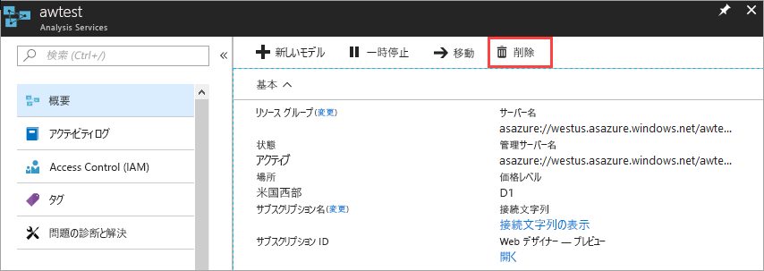

# Azure Portal で Analysis Services サーバーを作成する
この記事では、Azure サブスクリプションで Analysis Services サーバー リソースを作成する手順について説明します。

開始する前に、次のことが必要です。 

* **Azure サブスクリプション**: [Azure 無料試用版](https://azure.microsoft.com/offers/ms-azr-0044p/)でアカウントを作成します。
* **Azure Active Directory**: サブスクリプションは、Azure Active Directory テナントに関連付けられている必要があります。 また、その Azure Active Directory でアカウントを使用して Azure にサインインしている必要があります。 詳細については、「[認証とユーザーのアクセス許可](analysis-services-manage-users.md)」を参照してください。

## Azure Portal にログインする 

[Azure ポータル](https://portal.azure.com)

## サーバーの作成

1. **[リソースの作成]** > **[データ + 分析]** > **[Analysis Services]** の順にクリックします。

    

2. **[Analysis Services]** で、必要なフィールドを入力して **[作成]** をクリックします。
   
    
   
   * **[サーバー名]**: サーバーの参照に使われる一意の名前を入力します。
   * **[サブスクリプション]**: このサーバーを関連付けるサブスクリプションを選びます。
   * **[リソース グループ]**: 新しいリソース グループを作成するか、既存のリソース グループを選択します。 リソース グループは、Azure リソースのコレクション管理をサポートするように設計されています。 詳しくは、「[Azure リソース マネージャーの概要](../azure-resource-manager/resource-group-overview.md)」をご覧ください。
   * **[場所]**: この Azure データセンターの場所でサーバーをホストします。 最大のユーザー ベースに最も近い場所を選びます。
   * **[価格レベル]**: 価格レベルを選びます。 サンプル モデルのデータベースをテストしてインストールする場合、無料の **D1** 層を選択します。 詳しくは、「[Azure Analysis Services の価格](https://azure.microsoft.com/pricing/details/analysis-services/)」をご覧ください。 
    * **管理者**: 既定では、これはログインで使用するアカウントです。 Azure Active Directory から別のアカウントを選択できます。
    * **Backup Storage setting (バックアップ ストレージの設定)**: 省略可能です。 [ストレージ アカウント](../storage/common/storage-introduction.md)が既に存在する場合、モデル データベースのバックアップの既定値として指定することができます。 後で[バックアップと復元](analysis-services-backup.md)の設定を指定することもできます。
    * **ストレージ キーの有効期限**: 省略可能です。 ストレージ キーの有効期限を指定します。
3. **Create** をクリックしてください。

作成にかかる時間は通常 1 分未満です。 **[Add to Portal]** (ポータルに追加) を選んだ場合は、ポータルに移動して新しいサーバーを確認します。 または、**[すべてのサービス]** > **[Analysis Services]** に移動して、サーバーの準備ができていることを確認します。

## リソースのクリーンアップ
不要になったら、サーバーを削除します。 サーバーの **[概要]** で、**[削除]** をクリックします。 

 

## 次の手順

[サンプル データ モデルを](analysis-services-create-sample-model.md)サーバーに追加します。  
データ モデルをオンプレミスのデータ ソースに接続する場合は、[オンプレミス データ ゲートウェイをインストールします](analysis-services-gateway-install.md)。  
Visual Studio から[表形式モデル プロジェクトを配置](analysis-services-deploy.md)します。   

