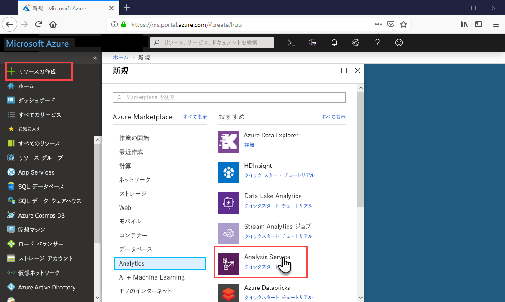

# クイック スタート: サーバーの作成 - ポータル

このクイック スタートでは、ポータルを使って、Azure サブスクリプションに Analysis Services サーバー リソースを作成する方法について説明します。

## 前提条件 

* **Azure サブスクリプション**: [Azure 無料試用版](https://azure.microsoft.com/offers/ms-azr-0044p/)にアクセスしてアカウントを作成します。
* **Azure Active Directory**: お使いのサブスクリプションは、Azure Active Directory テナントに関連付けられている必要があります。 また、その Azure Active Directory でアカウントを使用して Azure にサインインしている必要があります。 詳細については、「[認証とユーザーのアクセス許可](analysis-services-manage-users.md)」を参照してください。

## Azure Portal にサインインします 

[ポータルにサインイン](https://portal.azure.com)します。

## サーバーの作成

1. **[+ リソースの作成]** > **[分析]** > **[Analysis Services]** の順にクリックします。

    

2. **[Analysis Services]** で、必要なフィールドを入力して **[作成]** をクリックします。
   
   * **サーバー名**: サーバーの参照に使われる一意の名前を入力します。
   * **サブスクリプション**:このサーバーを関連付けるサブスクリプションを選びます。
   * **リソース グループ**: 新しいリソース グループを作成するか、既存のリソース グループを選択します。 リソース グループは、Azure リソースのコレクション管理をサポートするように設計されています。 詳しくは、「[Azure リソース マネージャーの概要](../azure-resource-manager/resource-group-overview.md)」をご覧ください。
   * **場所**: この Azure データセンターの場所でサーバーをホストします。 最大のユーザー ベースに最も近い場所を選びます。
   * **価格レベル**: 価格レベルを選択します。 サンプル モデルのデータベースをテストしてインストールする場合、無料の **D1** レベルを選択します。 詳しくは、「[Azure Analysis Services の価格](https://azure.microsoft.com/pricing/details/analysis-services/)」をご覧ください。 
   * **管理者**: 既定では、これはログインで使用するアカウントです。 Azure Active Directory から別のアカウントを選択できます。
   * **バックアップ ストレージの設定**: 省略可能。 [ストレージ アカウント](../storage/common/storage-introduction.md)が既に存在する場合、モデル データベースのバックアップの既定値として指定することができます。 後で[バックアップと復元](analysis-services-backup.md)の設定を指定することもできます。
   * **ストレージ キーの有効期限**: 省略可能。 ストレージ キーの有効期限を指定します。

通常、サーバーの作成にかかる時間は 1 分以下です。 **[Add to Portal]** (ポータルに追加) を選んだ場合は、ポータルに移動して新しいサーバーを確認します。 または、**[すべてのサービス]** > **[Analysis Services]** に移動して、サーバーの準備ができていることを確認します。 サーバーは、互換性レベル 1200 以降の表形式モデルをサポートします。 モデルの互換性レベルは、SSDT または SSMS で指定されます。

## リソースのクリーンアップ

不要になったら、サーバーを削除します。 サーバーの **[概要]** で、**[削除]** をクリックします。 

 

## 次の手順
このクイック スタートでは、Azure サブスクリプションにサーバーを作成する方法について学習しました。 サーバーを作成したら、(必要に応じて) サーバー ファイアウォールを構成することによってサーバーをセキュリティで保護できます。 また、ポータルからサーバーにデータ モデルの基本的なサンプルを追加することもできます。 サンプル モデルがあると、モデル データベース ロールの構成とクライアント接続のテストについて理解するのに役立ちます。 詳しくは、サンプル モデルの追加のチュートリアルに進んでください。

> [!div class="nextstepaction"]
> [クイック スタート: サーバーのファイアウォールの構成 - ポータル](analysis-services-qs-firewall.md)   
> [!div class="nextstepaction"]
> [チュートリアル: サーバーにサンプル モデルを追加する](analysis-services-create-sample-model.md)
