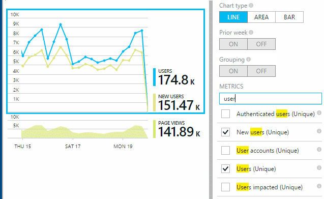
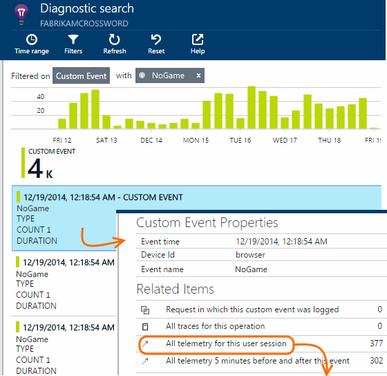
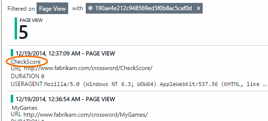

<properties 
	pageTitle="Application Insights による利用状況分析" 
	description="Application Insights による利用状況分析の概要" 
	services="application-insights" 
    documentationCenter=""
	authors="alancameronwills" 
	manager="kamrani"/>

<tags 
	ms.service="application-insights" 
	ms.workload="tbd" 
	ms.tgt_pltfrm="ibiza" 
	ms.devlang="na" 
	ms.topic="article" 
	ms.date="05/03/2015" 
	ms.author="awills"/>
 
# Application Insights による利用状況分析

ユーザーによるアプリケーションの使用状況を把握することで、ユーザーにとって最も重要なシナリオに重点を置いて開発作業を行うことができ、実現するのが簡単またはより困難であるとユーザーが捉えている目標を理解することができます。

Application Insights を使用すると、アプリケーションの利用状況を明確に把握できるため、ユーザー エクスペリエンスの向上やビジネス目標の達成に役立ちます。

## すぐに利用できる分析
 
[Application Insights][start] をプロジェクトに追加するだけで、特別な作業なしでユーザーの数やその他のデータを表示するグラフを利用できるようになります。

![Azure で、\[参照\]、\[Application Insights\]、目的のプロジェクトの順に選択し、下へスクロールします](./media/app-insights-overview-usage/01-overview.png)
 
グラフ上の空白部分にマウス ポインターを移動すると、特定のポイントにおける数が表示されます。それ以外の場合、特定の期間にわたって集計された値 \(平均、合計、期間における一意のユーザーの数など\) が表示されます。

Web アプリケーションでは、ユーザーは Cookie を使用してカウントされます。複数のブラウザーを使用しているユーザー、Cookie を消去しているユーザー、またはプライバシー機能を使用しているユーザーは、複数回カウントされます。

Web セッションは、非アクティブな状態が 30 分続いた後でカウントされます。電話やその他のデバイス上のセッションは、数秒にわたってアプリが中断されるとカウントされます。

任意のグラフをクリックすると、より詳細な情報が表示されます。次に例を示します。

![概要ブレードで、\[セッション\] グラフをクリックします](./media/app-insights-overview-usage/02-sessions.png)
 
\(この例は Web サイトの例ですが、デバイスで実行されるアプリの場合も同じようなグラフが表示されます\)。

前の週と比較して、変化していることがあるかどうかを調べることができます。

![1 つのメトリックを表示するグラフを選択し、\[前の週\] をオンにします](./media/app-insights-overview-usage/021-prior.png)

2 つのメトリック \(たとえば、ユーザーと新しいユーザー\) を比較することもできます。

プロパティ \(ブラウザー、オペレーティング システム、市区町村など\) に基づいてデータをグループ化 \(分割\) できます。

![1 つのメトリックを表示するグラフを選択します。\[グループ\] をオンにし、プロパティを選択します](./media/app-insights-overview-usage/03-browsers.png)

 
## ページ利用状況

ページ ビュー グラフをクリックすると、その拡大バージョンと、最も人気のあるページの内訳が表示されます。

![概要ブレードで、\[ページ ビュー\] グラフをクリックします](./media/app-insights-overview-usage/05-games.png)
 
上の例はゲーム Web サイトの情報を示しています。このグラフから、次のことがわかります。

* 過去 1 週間の間に利用数が伸びていない。おそらく検索エンジンの最適化について考える必要があります。
* ホーム ページを見ているユーザーよりもゲームのページを見ているユーザーの方が少ない。ホーム ページ上でより積極的にゲームに誘導する必要があります。
* 最も人気のあるゲームは "クロスワード" である。このゲームに優先的に新しいアイデアと改良を加える必要があります。

## カスタムの追跡

それぞれのゲームを別個の Web ページで実装する代わりに、ほとんどの機能が Web ページの JavaScript としてコーディングされた同じ単一ページ アプリにこれらのゲームをすべてリファクタリングするとします。これにより、ユーザーは、1 つのゲームから別のゲームにすばやく移動したり、1 ページに複数のゲームを表示したりできます。

この場合も、Application Insights を使用して、別個の Web ページでゲームを実装していた場合とまったく同じように、それぞれのゲームが開かれた回数を記録したいとします。これを実現するのは簡単です。新しい "ページ" が開かれたことを記録する JavaScript コードにテレメトリ モジュールの呼び出しを挿入するだけです。

	telemetryClient.trackPageView(game.Name);

## カスタム イベント

テレメトリは、アプリケーションの利用状況を把握するためにさまざまな方法で使用できます。ただし、ページ ビューとメッセージを一緒にしたくない場合があります。その場合は、カスタム イベントを使用します。カスタム イベントは、デバイスのアプリ、Web ページ、または Web サーバーから送信できます。

\(JavaScript\)

    telemetryClient.trackEvent("GameEnd");

\(C\#\)

    var tc = new Microsoft.ApplicationInsights.TelemetryClient(); 
    tc.TrackEvent("GameEnd");

\(VB\)

    Dim tc = New Microsoft.ApplicationInsights.TelemetryClient()
    tc.TrackEvent("GameEnd")

最もよく使用されるカスタム イベントは、概要ブレードに示されます。

![概要ブレードで、下へスクロールし、\[カスタム イベント\] をクリックします。](./media/app-insights-overview-usage/04-events.png)

テーブルの先頭をクリックすると、イベントの合計数が表示されます。イベント名などのさまざまな属性によって、グラフを分割することができます。

![1 つのメトリックのみを示すグラフを選択します。\[グループ\] をオンにします。プロパティを選択します。使用できないプロパティもあります。](./media/app-insights-overview-usage/06-eventsSegment.png)

タイムラインには、変化を他のメトリックやイベントに関連付けることができるという便利な機能があります。たとえば、より多くのゲームがプレイされているときは、破棄されたゲームの数も増えることが予想されます。しかし、破棄されたゲーム数の増加率には偏りがあります。そこで、高い負荷が原因となってユーザーが許容できない問題が発生しているかどうかを確認してみましょう。

## 特定のイベントのドリルダウン

一般的なセッションの状況についてより深く理解するためには、特定の種類のイベントが含まれている特定のユーザー セッションに注目します。

この例では、ユーザーが実際にゲームを開始せずにログアウトすると呼び出されるカスタム イベント "NoGame" を作成しています。ユーザーはなぜそのようなことをするのでしょうか。 いくつかの特定の発生箇所をドリルダウンすると、そのヒントが得られるでしょう。

アプリから受信したカスタム イベントは、概要ブレードに名前別に表示されます。

 
目的のイベントをクリックし、最近の特定の発生箇所を選択します。

 
ここで、この特定の NoGame イベントが発生したセッションのすべてのテレメトリを見てみましょう。

![\[セッションのすべてのテレメトリ\] をクリックします](./media/app-insights-overview-usage/09-relatedTelemetry.png)
 
例外はありません。ここから、ユーザーのプレイを妨げるような障害が発生していないことがわかります。
 
このセッションのページ ビューを除くすべての種類のテレメトリをフィルターで除外できます。

 
ここから、このユーザーは最新のスコアを確認するためにのみログオンしたことがわかります。おそらく、これを簡単にするようなユーザー ストーリーの開発を検討する必要があります \(加えて、この特定のストーリーが発生したことを報告するカスタム イベントを実装する必要があります\)。

## プロパティを使用してデータをフィルター処理、検索、および分割する
イベントには任意のタグと数値をアタッチできます。
 

クライアント側の JavaScript

    appInsights.trackEvent("WinGame",
        // String properties:
        {Game: currentGame.name, Difficulty: currentGame.difficulty},
        // Numeric measurements:
        {Score: currentGame.score, Opponents: currentGame.opponentCount}
    );

サーバー側の C\#

    // Set up some properties:
    var properties = new Dictionary <string, string> 
        {{"game", currentGame.Name}, {"difficulty", currentGame.Difficulty}};
    var measurements = new Dictionary <string, double>
        {{"Score", currentGame.Score}, {"Opponents", currentGame.OpponentCount}};

    // Send the event:
    telemetry.TrackEvent("WinGame", properties, measurements);

サーバー側の VB

    ' Set up some properties:
    Dim properties = New Dictionary (Of String, String)
    properties.Add("game", currentGame.Name)
    properties.Add("difficulty", currentGame.Difficulty)

    Dim measurements = New Dictionary (Of String, Double)
    measurements.Add("Score", currentGame.Score)
    measurements.Add("Opponents", currentGame.OpponentCount)

    ' Send the event:
    telemetry.TrackEvent("WinGame", properties, measurements)

次のようにページ ビューを同じ方法でプロパティに結び付けます。

クライアント側の JavaScript

    appInsights.trackPageView("Win", 
        {Game: currentGame.Name}, 
        {Score: currentGame.Score});

診断検索で、イベントのそれぞれの発生箇所をクリックしてプロパティを表示します。

![イベントの一覧で、イベントを開き、\[...\] をクリックしてその他のプロパティを表示します](./media/app-insights-overview-usage/11-details.png)
 
\[検索\] ボックスを使用して、特定のプロパティ値を持つイベントを表示します。

![\[検索\] ボックスに値を入力します](./media/app-insights-overview-usage/12-searchEvents.png)

## A \| B テスト

ある機能のどちらのバージョンが成功するかわからない場合は、その両方をリリースして、それぞれを異なるユーザーが利用できるようにします。それぞれの効果を評価した後、統合バージョンに移行します。

この方法では、アプリの各バージョンから送信されるすべてのテレメトリに識別可能なタグをアタッチします。そのためには、アクティブな TelemetryContext でプロパティを定義します。これらの既定のプロパティは、アプリケーションによって送信されるすべてのテレメトリ メッセージに追加されます。つまり、カスタムのメッセージだけでなく、標準のテレメトリにも追加されます。

Application Insights ポータルでは、タグに基づいてデータをフィルター選択およびグループ化 \(分割\) して、異なるバージョンを比較できます。

サーバー側の C\#

    using Microsoft.ApplicationInsights.DataContracts;

    var context = new TelemetryContext();
    context.Properties["Game"] = currentGame.Name;
    var telemetry = new TelemetryClient(context);
    // Now all telemetry will automatically be sent with the context property:
    telemetry.TrackEvent("WinGame");

サーバー側の VB

    Dim context = New TelemetryContext
    context.Properties("Game") = currentGame.Name
    Dim telemetry = New TelemetryClient(context)
    ' Now all telemetry will automatically be sent with the context property:
    telemetry.TrackEvent("WinGame")

個々の利用統計情報は、既定値を無視することができます。

すべての新しい TelemetryClients が自動的にコンテキストを使用できるように、汎用の初期化子を設定できます。

    // Telemetry initializer class
    public class MyTelemetryInitializer : IContextInitializer
    {
        public void Initialize (TelemetryContext context)
        {
            context.Properties["AppVersion"] = "v2.1";
        }
    }

アプリ初期化子 \(Global.asax.cs など\) 内:

    protected void Application_Start()
    {
        // ...
        TelemetryConfiguration.Active.ContextInitializers
        .Add(new MyTelemetryInitializer());
    }

## ビルド、評価、学習

分析は、単に問題の解決に役立つだけのものではなく、開発サイクルの重要な部分を構成します。いくつかのヒントを次に示します。

* アプリケーションの重要なメトリックを見極める。対象ユーザーはできる限り多数のユーザーですか。それとも少数のたいへん満足しているユーザーですか。 アクセス数または売上を最大にしたいと思いますか。
* 各ストーリーの評価を計画する。新しいユーザー ストーリーまたは機能の概略を考える場合、または既存のユーザー ストーリーまたは機能の更新を計画する場合は、変更の成功をどのように評価するかを常に考える必要があります。コーディングを始める前に、"これが動作したときにメトリックはどのような影響を受けるか。 すべての新しいイベントを追跡する必要があるか。" を常に考える必要があります。 もちろん、機能が稼動状態になったら、分析に注目し、その結果に基づいて対応します。 
* 他のメトリックを重要なメトリックに関連付ける。たとえば、"お気に入り" 機能を追加した場合は、ユーザーがお気に入りを追加する頻度を確認することになるでしょう。しかし、ユーザーがお気に入りに再びアクセスする頻度を知る方が、おそらくより興味深い結果が得られるでしょう。そして最も重要なことは、お気に入りを利用するユーザーに最終的により多くの製品を購入してもらえるかどうか、ということになります。
* カナリア テスト。新機能が一部のユーザーにのみ表示されるようにする機能スイッチを設定します。Application Insights を使用して、新機能が意図したように使用されるかどうかを確認します。調整を行った後、より多くのユーザーを対象にリリースします。
* ユーザーと話をする。 分析は、それだけでは不十分ですが、良好な顧客関係を保つための補完的役割を果たします。

<!--Link references-->

[start]: app-insights-get-started.md

<!--HONumber=54-->