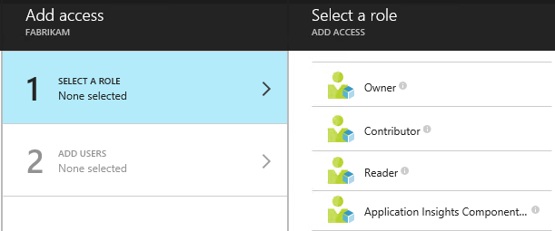
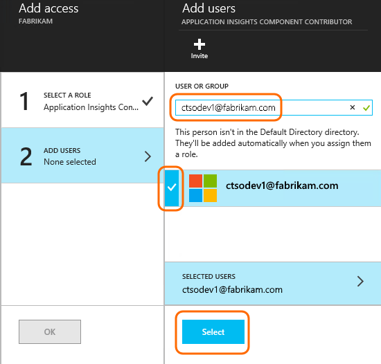

<properties 
	pageTitle="Application Insights のリソース、役割、アクセス制御" 
	description="組織の insights の所有者、共同作成者、閲覧者。" 
	services="application-insights" 
    documentationCenter=""
	authors="alancameronwills" 
	manager="ronmart"/>

<tags 
	ms.service="application-insights" 
	ms.workload="tbd" 
	ms.tgt_pltfrm="ibiza" 
	ms.devlang="na" 
	ms.topic="article" 
	ms.date="04/21/2015" 
	ms.author="awills"/>
 
# Application Insights のリソース、ロール、アクセス制御

Visual Studio [Application Insights][start] では、[Microsoft Azure の役割基準アクセス制御](role-based-access-control-configure.md)を利用し、データを読み取りできる人とデータを更新できる人を制御できます。

> [AZURE.IMPORTANT]リソース自体ではなく、アプリケーション リソースが属する**リソース グループまたはサブスクリプション**でユーザーにアクセスを割り当てます。**Application Insights コンポーネントの共同作業者**ロールを割り当てます。これにより、Web テストとアラート、アプリケーション リソースのアクセス制御が統一されます。[詳細情報](#access)。

## リソース、グループ、サブスクリプション

最初に、いくつかの定義を紹介します。

* **リソース** - Microsoft Azure サービスのインスタンス。Application Insights リソースはアプリケーションから送られてくる利用統計情報データを収集し、分析し、表示します。その他の種類の Azure リソースには Web アプリ、データベース、VM があります。 

    すべてのリソースを表示するには、[Azure ポータル][portal]に進み、サインインし、[参照] をクリックします。

    ![[参照] を選択し、[すべて] と [Application Insights でフィルター処理] のいずれかを選択します。](./media/app-insights-resources-roles-access-control/10-browse.png)

* [**リソース グループ**][group] - すべてのリソースが 1 つのグループに属します。関連リソースを管理するとき、特にアクセス制御の場合、グループは便利な方法です。たとえば、1 つのリソース グループに Web アプリ、そのアプリを監視する Application Insights リソース、エクスポートされたデータを保持する Storage リソースを配置できます。

    
    ![[参照]、[リソース グループ] を選択し、グループを選択します。](./media/app-insights-resources-roles-access-control/11-group.png)

* [**サブスクリプション**](https://manage.windowsazure.com) - Application Insights またはその他の Azure リソースを使用するには、Azure サブスクリプションにサインインします。すべてのリソース グループが 1 つの Azure サブスクリプションに属します。そのサブスクリプションで価格パッケージを選択します。会社のサブスクリプションの場合、メンバーとそのアクセス許可を選択します。
* [**Microsoft アカウント**][account] - Microsoft Azure サブスクリプション、XBox Live、Outlook.com、その他の Microsoft サービスにサインインするためのユーザー名とパスワード。

##  リソース グループのコントロール制御

アプリケーションに作成したリソースに加え、アラートと Web テストには非表示の個別リソースもあることを理解することが重要です。これらはアプリケーションと同じ[リソース グループ](#resource-group)に関連付けられています。Web サイトやストレージなど、他の Azure サービスをそこに配置することもあります。

これらのリソースのアクセスを制御するには、次の処置が推奨されます。

* **リソース グループまたはサブスクリプション** レベルでアクセスを制御します。
* **Application Insights コンポーネントの共同作業者**ロールをユーザーに割り当てます。この処置により、グループのその他のサービスのアクセス権を与えなくても、ユーザーは Web テスト、アラート、Application Insights リソースを編集できます。 

## 別のユーザーにアクセスを与えるには

サブスクリプションまたはリソース グループの所有者権限が必要です。

ユーザーは [Microsoft Azure アカウント][account]を持つ必要があります。個人と Azure Active Directory に定義されているユーザー グループにアクセスを供与できます。

#### リソース グループに移動する

そこでユーザーを追加します。

![アプリケーションのリソース ブレードで、Essentials を開き、リソース グループを開き、設定/ユーザーを選択します。[追加] をクリックします。](./media/app-insights-resources-roles-access-control/01-add-user.png)

あるいは、もう 1 つ上のレベルに進み、ユーザーをサブスクリプションに追加できます。

#### ロールを選択する

役割 | リソース グループにて
---|---
所有者 | ユーザーのアクセスなど、すべての項目を変更できます。
共同作成者 | すべてのリソースを含む、すべての項目を編集できます。
Application Insights コンポーネントの共同作業者 | Application Insights リソース、Web テスト、アラートを編集できます。
閲覧者 | すべての項目を表示できますが、変更はできません。

「編集」には作成、削除、更新が含まれます。

* リソース
* Web テスト
* アラート
* 連続エクスポート

#### ユーザーを選択する

対象のユーザーがディレクトリにない場合、Microsoft アカウントを持つユーザーを招待できます。(Outlook.com、OneDrive、Windows Phone、XBox Live などのサービスを利用している場合、Microsoft アカウントを持っています。)

## ユーザーと役割

* [Azure の役割基準のアクセス制御](role-based-access-control-configure.md)

<!--Link references-->

[account]: https://account.microsoft.com
[group]: azure-preview-portal-using-resource-groups.md
[portal]: http://portal.azure.com/
[start]: app-insights-get-started.md

<!---HONumber=58-->