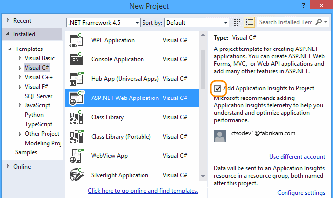

<properties title="Application Insights" pageTitle="Application Insights - start monitoring your app's health and usage" description="Analyze usage, availability and performance of your on-premises or Microsoft Azure web application with Application Insights." metaKeywords="analytics monitoring application insights" authors="awills"  manager="kamrani" />

<tags ms.service="application-insights" ms.workload="tbd" ms.tgt_pltfrm="ibiza" ms.devlang="na" ms.topic="article" ms.date="2014-09-24" ms.author="awills"></tags>

# Application Insights - アプリケーションの状態と利用状況の監視を開始する

*Application Insights はプレビュー段階です。*

Application Insights を使用すると、ライブ アプリケーションの以下の事柄について監視できます。

-   **可用性** - 世界中から数分ごとにご使用の URL についてテストします。
-   **パフォーマンス** - パフォーマンスに関する問題と例外を検出して診断します。
-   **利用状況** - ご使用のアプリケーションを使っているユーザーの実行内容を把握し、それらのユーザーにとってより良いアプリケーションとなるようにします。

構成は非常に簡単で、数分で結果を確認できます。現在、(サーバーまたは Azure 上の) ASP.NET Web アプリケーションをサポートしています。

[Microsoft Azure](http://azure.com) (無料のお試し期間があります) のアカウントが必要になります。

Application Insights を開始するには、次に示す 2 とおりの方法があります。

-   (推奨) [Visual Studio のプロジェクトに Application Insights を追加](#add)して、アプリケーションのパフォーマンスと利用状況を監視します。
-   [再デプロイしないでサーバーにエージェントをインストールする][redfield] - ライブ Web サイトを監視します。その際、再デプロイすることも、ソース コードに変更を加えることもありません。そうすることで、パフォーマンスと例外を監視できます。利用状況の監視機能は後で追加できます。

> [WACOM.NOTE] Visual Studio Online には[旧バージョンの Application Insights](http://msdn.microsoft.com/ja-jp/library/dn481095.aspx) があり、アプリケーションのより広い範囲の種類をサポートしています。それを Microsoft Azure の一部として徹底的に再構成しました。ここでは新しいバージョンについて取り上げます。

## プロジェクトに Application Insights を追加する

[Visual Studio 2013 更新プログラム 3](http://go.microsoft.com/fwlink/?linkid=397827&clcid=0x409) 以降が必要です。

### 新しいプロジェクトの場合

Visual Studio 2013 に新しいプロジェクトを作成するとき、Application Insights が選択されていることを確認してください。

初めての場合には、Microsoft Azure プレビュー版にログインまたはサインインするように求められます (Visual Studio Online アカウントとは異なります)。

Azure リソースの名前をプロジェクトの名前とは別にする場合、または同じグループの別のプロジェクトとしてリソースを表示する場合には、**[設定の構成]** を使用します。

*Application Insights オプションはありせんか。Visual Studio 2013 更新プログラム 3 を使用しているか、[拡張機能と更新プログラム｣ で Application Insights Tools が有効になっているか、および作成しているのが Web、Windows ストア、Windows Phone のどのプロジェクトであるかを確認します。*

### ... 既存のプロジェクトの場合

ソリューション エクスプローラーでプロジェクトを右クリックし、[Application Insights の追加] を選択します。

![[Application Insights の追加] を選択する](./media/appinsights/appinsights-03-addExisting.png)

*Web 利用状況分析を設定するものの最初にデータの一部を参照する場合には、複数の手順が関係します。*

### 2. プロジェクトを実行する

F5 を使用してアプリケーションを実行して、試します。別のページが開きます。

Visual Studio で、受け取ったイベント数を確認できます。

### 3. モニター データを表示する

プロジェクトから Application Insights を開きます。

**[アプリケーションの使用状況]** タイル内でデータを探します。最初、1 つまたは 2 つのポイントだけが表示されます。次に例を示します。

いずれかのタイルをクリックして、詳細を表示します。レポート内の表示内容を変更できます。[アプリケーションの使用状況レポートの構成方法の詳細について参照してください。][perf]

### 4. Web 利用状況分析を設定する

Application Insights を*既存* の Web プロジェクトに追加した場合、[利用状況分析] タイルには何も表示されません。複数の手順が必要になります。

Application Insights で、[クイック スタート] の [Website のインストルメンﾄ化｣ を選択します。

![Application Insights のプロジェクトで、[ｸイック スタート] の [Website のインストルメンﾄ化] を選択し、コードをコピーします。](./media/appinsights/appinsights-06webcode.png)

JavaScript コードを、監視する Web ページにある \</head\> 終了タグの直前にコピーします。ASP.NET プロジェクトにおいてすべてのページを監視するための良い方法は、`_SiteLayout` または `Views\Shared\_Layout` と通常呼ばれているマスター ページにコードを配置する方法です。このコードには、アプリケーションの Application Insights キーが含まれているに注意してください。

アプリケーションを再実行すると、データが **[利用状況分析]** に表示されます。

[グラフをクリックして、詳細を表示します。][perf]

### 5. アプリケーションをデプロイする

アプリケーションをデプロイし、データ累積を確認します。

ライブ アプリケーションになった後、[Web テストを設定][availability]し、引き続きライブ状態であることを確認します。

### ポータルでアプリケーションの名前を変更しますか

プロジェクトの利用統計情報の送信先となるリソースを変更できます。

(「リソース」とは、結果が表示される指定の Application Insights ブレードのことです。複数のリソースを 1 つのグループにまとめることができます。たとえば、複数のプロジェクトが 1 つのビジネス アプリケーションの構成要素となっている場合などです)。

ソリューション エクスプローラーで ApplicationInsights.config を右クリックし、**[Application Insights の更新]** を選択します。これによりウィザードが開き、別の既存のリソースを選択するか、または新しいリソースを作成できます。

その後、ポータルに戻り、古いリソースを削除します。

## ビデオ

### はじめに

> [AZURE.VIDEO application-insights-introduction]

### はじめに

> [AZURE.VIDEO getting-started-with-application-insights]

## 次のステップ

[Web アプリケーションの利用状況を追跡する][usage]

[Web アプリケーションのパフォーマンスを監視する][perf]

[診断ログを取得して検索する][diagnostic]

[トラブルシューティング][qna]

## 詳細情報

-   [Application Insights - 開始する][start]
-   [ライブ Web サーバーを監視する][redfield]
-   [Web アプリケーションのパフォーマンスを監視する][perf]
-   [診断ログを検索する][diagnostic]
-   [Web テストで可用性を追跡する][availability]
-   [利用状況を追跡する][usage]
-   [Q & A およびトラブルシューティング][qna]

<!--Link references-->

[start]: ../app-insights-start-monitoring-app-health-usage/
[redfield]: ../app-insights-monitor-performance-live-website-now/
[perf]: ../app-insights-web-monitor-performance/
[diagnostic]: ../app-insights-search-diagnostic-logs/ 
[availability]: ../app-insights-monitor-web-app-availability/
[usage]: ../app-insights-web-track-usage/
[qna]: ../app-insights-troubleshoot-faq/

