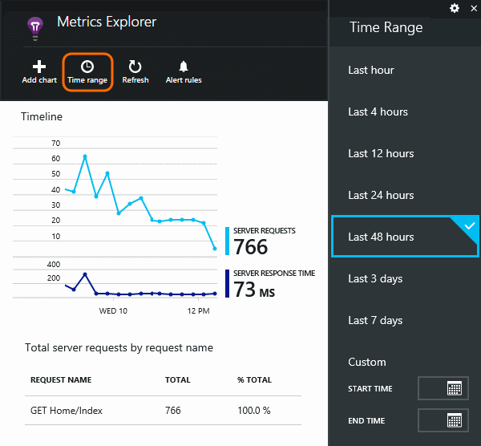
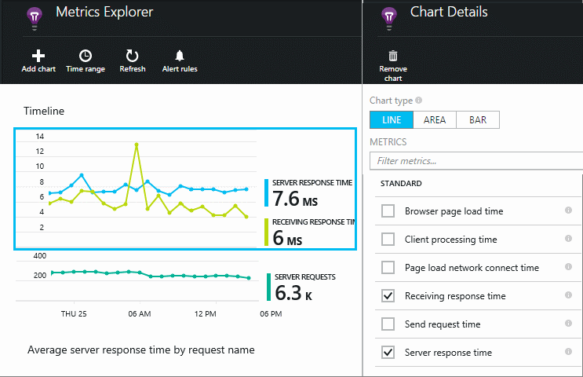

<properties 
	pageTitle="Application Insights を使用したアプリケーションの状態と利用状況の監視" 
	description="Application Insights の使用を開始します。内部設置型または Microsoft Azure アプリケーションの使用状況、可用性、パフォーマンスを分析します。" 
	services="application-insights" 
	authors="alancameronwills" 
	manager="kamrani"/>

<tags 
	ms.service="application-insights" 
	ms.workload="tbd" 
	ms.tgt_pltfrm="ibiza" 
	ms.devlang="na" 
	ms.topic="article" 
	ms.date="2014-12-11" 
	ms.author="awills"/>
 
# Web アプリケーションのパフォーマンスを監視する

*Application Insights はプレビュー段階です。*

アプリケーションが正常に実行されていること、および障害がすぐに検出されることを確認します。[Application Insights][start] はパフォーマンス上の問題や例外を通知し、問題の原因を把握して診断するのに役立ちます。

Application Insights が監視できるのは、オンプレミスのマシンまたは仮想マシンでホストされている ASP.NET Web アプリケーション、および Microsoft Azure Websites です。 

* [パフォーマンス モニターを設定する](#setup)
* [データを表示する](#view)
* [どのような意味がありますか?](#metrics)
* [問題を診断する](#diagnosis)
* [次のステップ](#next)

## パフォーマンス モニターを設定する

プロジェクトに Application Insights を追加していない場合 (つまり、ApplicationInsights.config がない場合)、以下のいずれかの方法で開始します。

* [Visual Studio のアプリケーション プロジェクトに Application Insights を追加する][greenbrown] - 推奨。パッシブなパフォーマンス モニターに加え、診断ログを挿入したり、利用状況を追跡したりできます。
* [ライブ Web サイトのパフォーマンスを監視する][redfield] - この場合、アプリケーション プロジェクトを更新したり、Web サイトを再デプロイしたりする必要はありません。
* [Microsoft Azure Web サイトの場合は](../insights-how-to-customize-monitoring/)  メトリックは Web サイトの監視レンズで既に確認できます。 

## レポートを表示する

F5 を使用してアプリケーションを実行して、試します。別のページが開きます。

Visual Studio で、受け取ったイベント数を確認できます。

プロジェクトから Application Insights を開きます。

**[アプリケーションの使用状況]** タイル内でデータを探します。最初、1 つまたは 2 つのポイントだけが表示されます。次に例を示します。

デバッグ モードで実行している場合、利用統計情報はパイプラインにより時間が短縮されるので、数秒でデータが表示されます。アプリケーションをデプロイすると、データ累積速度は遅くなります。

すぐにデータが表示されない場合、1 分ほど待ってから [更新] をクリックします。

### メトリックを確認する

いずれかのタイルをクリックして、詳細を表示したり、より長い期間の結果を表示したりします。たとえば、[要求] タイルをクリックして、次の時間範囲を選択します。

グラフをクリックして表示するメトリックを選択するか、新しいグラフを追加してそのメトリックを選択します。

> [AZURE.NOTE] 利用可能なすべての選択項目を表示するには、**メトリックすべてのチェック ボックスをオフ**にしてください。メトリックはグループに分けられ、グループ内のあるメンバーが選択されると、そのグループのメンバーのみが表示されます。

## どのような意味がありますか?パフォーマンス タイルとレポート

多様なパフォーマンス メトリックを取得できます。まず、アプリケーション ブレードに既定で表示されるメトリックから始めます。

### 要求

指定の期間に受け取った HTTP 要求の数です。これを他のレポートにおける結果と比較して、負荷が変化するとアプリケーションの動作がどのように変わるかを確認します。

HTTP 要求には、ページ、データ、画像に関するすべての GET 要求または POST 要求が含まれます。

タイルをクリックして、特定の URL のカウントを取得します。

### 平均応答時間

アプリケーションに入力した Web 要求と返された応答の間の時間を測定します。

各ポイントは移動平均を示しています。多くの要求がある場合、グラフ内の明確なピークや下落以外に、平均から逸脱している要求が存在することがあります。

異常なピークを探します。通常、要求の数が多くなれば応答時間も長くなることが想定されます。上昇の形が不均衡な場合、アプリケーションがリソース制限 (CPU、および CPU が使用するサービス機能など) に達した可能性があります。

タイルをクリックして、特定の URL の時間を取得します。

### 最も遅い要求

パフォーマンス チューニングが必要となる可能性がある要求を示します。

### 失敗した要求

受信できない例外がスローされた要求の数。

タイルをクリックして、特定の障害の詳細を表示したり、個別の要求を選択してその詳細を表示したりします。 

障害の代表的な例だけが、それぞれの検査用に保持されます。

### その他のメトリック

表示できる他のメトリックを確認するには、グラフをクリックし、すべてのメトリックを選択解除してすべてのメトリック セットを表示します。(i) をクリックし、各メトリック定義を表示します。

いずれかのメトリックを選択すると、同じグラフ上に表示できない他のメトリックは無効になります。

## アラートの設定

すべてのメトリックの異常な値を電子メールで通知するには、アラートを追加します。アカウント管理者または特定の電子メール アドレスのいずれかに電子メールを送信することを選択できます。

その他のプロパティの前に、リソースを設定します。パフォーマンスまたは使用状況のメトリックにアラートを設定する場合、Web テスト リソースは選択しないでください。

しきい値を入力するように求められたら、単位に注意してください。

*[アラートの追加] ボタンが表示されません。*- 読み取り専用のアクセス権であることが考えられます。 

## 問題を診断する

パフォーマンス上の問題を検出して診断するためのいくつかのヒントを以下に記します。

* [Web テスト][availability]を設定し、Web サイトが停止したり、間違って応答したり、応答速度が低下したりする場合にアラートを送信するようにします。 
* 要求の数を他のメトリックと比較し、障害や応答速度の低下が負荷と関連しているかどうかを確認します。
* コード内に[トレース ステートメントを挿入して、そのステートメントを検索する][diagnostic]ことにより、問題を特定しやすくすることができます。

## 次のステップ

[Web テスト][availability] - 世界中から定期的に、ご使用のアプリケーションに Web 要求を送信します。

[診断トレースを収集して検索する][diagnostic] - トレース呼び出しを挿入し、結果を詳しく調べて問題を特定します。

[利用状況を追跡する][usage] - ご使用のアプリケーションをどれほどのユーザーが使用しているかを調べます。

[トラブルシューティング][qna] - および Q & A

[AZURE.INCLUDE [app-insights-learn-more](../includes/app-insights-learn-more.md)]

<!--HONumber=35.2-->

<!--HONumber=46--> 
