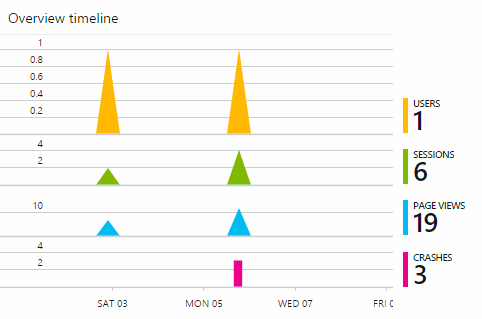
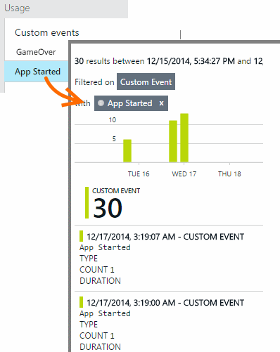
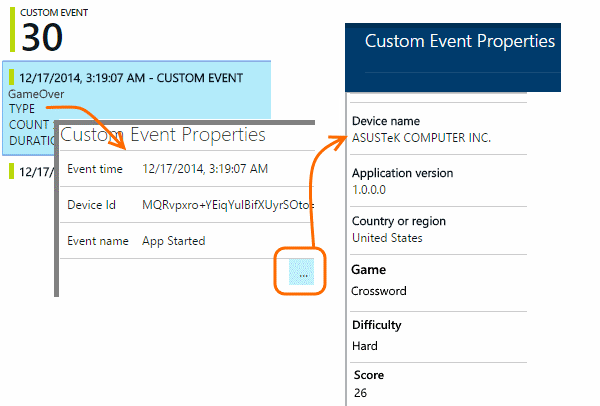

<properties 
	pageTitle="Application Insights による Windows ストア アプリおよび Windows Phone アプリの使用状況の監視" 
	description="Application Insights を使用して Windows デバイス アプリの使用状況を分析します。" 
	services="application-insights" 
    documentationCenter="windows"
	authors="alancameronwills" 
	manager="ronmart"/>

<tags 
	ms.service="application-insights" 
	ms.workload="tbd" 
	ms.tgt_pltfrm="ibiza" 
	ms.devlang="na" 
	ms.topic="article" 
	ms.date="02/28/2015" 
	ms.author="awills"/>

#  Application Insights による Windows ストア アプリと Windows Phone アプリの使用状況の監視

*Application Insights はプレビュー段階です。*

ユーザー数と、ユーザーがアプリ内で参照しているページを確認します。Application Insights では、このデータをすぐに使用できます。また、アプリに数行のコードを挿入することで、ユーザーがアプリにアクセスした経路と、そのアプリで実現している内容についても詳しく把握できます。

この操作をまだ行っていない場合は、[Application Insights をアプリ プロジェクトに追加][windows]して再発行ください。

## 使用状況の追跡

概要タイムラインで、ユーザーとセッションのグラフをクリックして、分析の詳細を表示します。

* **ユーザー**は匿名で追跡されるため、異なるデバイス上の同一ユーザーは 2 回カウントされることになります。
* **セッション**は、アプリが中断されたときに \(偶発的な中断がカウントされないように間隔は長めです\) カウントされます。

#### セグメント化

グラフを分割して、さまざまな条件で内訳を取得します。たとえば、アプリの各バージョンを使用しているユーザー数を表示するには、ユーザーのグラフを開き、アプリケーションのバージョンでセグメント化します。

#### ページ ビュー

ユーザーがアプリにアクセスするまでの経路を検出するには、[ページ ビューのテレメトリ][api]をコードに挿入します。

    var telemetry = new TelemetryClient();
    telemetry.TrackPageView("GameReviewPage");

ページ ビュー グラフでその結果を確認し、その詳細を開きます。

ページをクリックして特定のデータの詳細を表示します。

#### カスタム イベント

アプリからカスタム イベントを送信するコードを挿入することで、ユーザーの操作と、特定の機能やシナリオの使用状況を追跡できます。

次に例を示します。

    telemetry.TrackEvent("GameOver");

データは、カスタム イベント グリッドに表示されます。メトリックス エクスプローラーで集計ビューを表示するか、いずれかのイベントをクリックして特定のデータを表示できます。

イベントには文字列や数値のプロパティを追加できます。

    // Set up some properties:
    var properties = new Dictionary <string, string> 
       {{"Game", currentGame.Name}, {"Difficulty", currentGame.Difficulty}};
    var measurements = new Dictionary <string, double>
       {{"Score", currentGame.Score}, {"Opponents", currentGame.OpponentCount}};

    // Send the event:
    telemetry.TrackEvent("GameOver", properties, measurements);

任意のデータをクリックすると、自身で定義したプロパティを含め、その詳細なプロパティが表示されます。

カスタム イベントの詳細については、[API リファレンス][api]に関するページを参照してください。

## デバッグ モードとリリース モードの比較

#### デバッグ

デバッグ モードでビルドする場合、イベントは生成されるとすぐに送信されます。インターネット接続が切断され、接続が復旧する前にアプリを終了した場合、オフラインのテレメトリは破棄されます。

#### リリース

リリース構成でビルドする場合、イベントはデバイスに格納され、アプリケーション再開時に送信されます。データは、アプリケーションの初回使用時にも送信されます。起動時にインターネット接続されていない場合は、前のテレメトリだけでなく、現在のライフサイクルのテレメトリも格納され、次の再開時に送信されます。

## 次のステップ

[ユーザーを知る][knowUsers]

[メトリックス エクスプローラーの詳細情報][metrics]

[トラブルシューティング][qna]

<!--Link references-->

[api]: app-insights-api-custom-events-metrics.md
[knowUsers]: app-insights-overview-usage.md
[metrics]: app-insights-metrics-explorer.md
[qna]: app-insights-troubleshoot-faq.md
[windows]: app-insights-windows-get-started.md

<!--HONumber=54-->