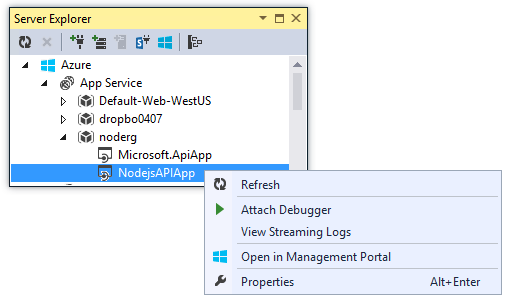

<properties 
	pageTitle="API アプリの管理" 
	description="Azure プレビュー ポータルと Visual Studio のサーバー エクスプローラーを使用して API アプリを管理する方法について説明します。" 
	services="app-service\api" 
	documentationCenter="" 
	authors="tdykstra" 
	manager="wpickett" 
	editor="jimbe"/>

<tags 
	ms.service="app-service-api" 
	ms.workload="web" 
	ms.tgt_pltfrm="na" 
	ms.devlang="na"
	ms.topic="article" 
	ms.date="04/20/2015" 
	ms.author="tdykstra"/>

# API アプリの管理

この記事では、Azure プレビュー ポータルを使用して認証の構成や自動スケーリングの設定などの API アプリ管理タスクを実行する方法について説明します。また、Visual Studio のサーバー エクスプローラー ウィンドウでいくつかの管理タスクを実行する方法についても説明します。

## API アプリのアーキテクチャについて

Azure App Service では、API アプリとは、Web サービスをホストするための追加の機能を持つ [Web アプリ](app-service-web-overview.md)のことです。Azure プレビュー ポータルには、API 固有の機能を管理するための **[API アプリ]** ブレードと、基になる Web アプリを管理するための **[API アプリ ホスト]** ブレードがあります。

少なくとも 1 つの API アプリを含むすべてのリソース グループでは、*ゲートウェイ*も使用されています。ゲートウェイはプロキシとして機能します。つまり、リソース グループ内のすべての API アプリの認証などの管理機能を処理します。API アプリと同様、ゲートウェイは、追加の機能を持つ Web アプリです。ゲートウェイを管理するための 2 つのポータル ブレードとして、ゲートウェイ固有の機能のための **[ゲートウェイ]** ブレードと、基になる Web アプリを管理するための **[ゲートウェイ ホスト]** ブレードがあります。

### [API アプリ] ブレードのタスク 

**[API アプリ]** ブレードは次のタスクに使用します。

- アクセス レベルの構成 - **[設定]、[アプリケーションの設定]** の順にクリックします。既定値は内部です。つまり、同じリソース グループに属する API アプリのみが API アプリを呼び出すことができます。詳細については、[API アプリの保護](app-service-api-dotnet-add-authentication.md)に関するページを参照してください。   
- 更新ポリシーの構成 - **[設定]、[アプリケーションの設定]** の順にクリックします。既定値は**オン**です。これは、API アプリの新しいバージョンがマーケットプレースに発行されたとき、重大な変更でない場合は API アプリが新しいバージョンに自動的に更新されることを意味します。  
- API アプリからの発信呼び出しの認証の構成 - **[設定]、[認証]** の順にクリックします。API アプリから認証を必要とする外部サービスを呼び出す場合、必要な構成値はここに入力します。たとえば、Dropbox コネクタでは、Dropbox サービスへのアクセスにクライアント ID とクライアント シークレットが必要になります。
- [RBAC](role-based-access-control-configure.md) の構成 - **[設定]、[ユーザー]** の順にクリックします。ここで構成するユーザー アクセスでは、API アプリ固有の機能にアクセスできるユーザーのみを決定します。Web アプリの機能用に RBAC を構成するには、**[API アプリ ホスト]** ブレードを使用します。通常は、API アプリと API アプリ ホストの RBAC 設定では、同期を保つようにします。あるユーザーに API アプリへのアクセスを許可し、API アプリ ホストへのアクセスは禁止する場合、API アプリ ホストに実際に関連する **[API アプリ]** ブレードの機能は使用できなくなります。**[API アプリ]** ブレードと **[API アプリ ホスト]** ブレードの関係は後で説明します。
- API 定義の表示 - **[概要]** セクションの **[API 定義]** をクリックして、**[API アプリ]** で公開されるメソッドのリストを表示します。

### API アプリ ブレードと API アプリ ホストのブレードの一般的な機能 

**[API アプリ]** ブレードでは、基になる Web アプリに関連する多くのタスクを実行できます。たとえば、API アプリをホストする Web アプリを停止、開始、再起動するボタンが用意されています。ただし、これらのタスクは、**[API アプリ ホスト]** ブレードからも実行できます。この 2 つのブレードが多くの同じ UI を共有している理由はこのためです。**[API アプリ]** ブレードの **[停止]**、**[開始]**、**[再起動]** の各ボタンには、**[API アプリ ホスト]** ブレードの **[停止]**、**[開始]**、**[再起動]** の各ボタンとまったく同じ効果があります。同様に、**[API アプリ]** ブレードの監視情報には、**[API アプリ ホスト]** ブレードと同じ情報が表示されます。

**[API アプリ ホスト]** ブレードにはない、**[API アプリ]** ブレードのみで提供されている機能は、前のセクションに記載しています。

### [API アプリ ホスト] ブレードのタスク

**[API アプリ ホスト]** ブレードは、すべての Web アプリを対象とするあらゆるタスクに使用します。詳細については、[ポータルでの Web アプリの管理](web-sites-manage.md)に関するページを参照してください。

### [ゲートウェイ] ブレードのタスク

**[ゲートウェイ]** ブレードは、次のタスクに使用します。

- API アプリの着信呼び出し用の認証プロバイダーの構成 - **[設定]、[ID]** の順にクリックします。ゲートウェイでリソース グループ内の API アプリの呼び出しを許可する前にユーザーを認証する必要がある場合、必要な構成値はここに入力します。詳細については、[Azure App Service での SaaS コネクタの構成とテスト](app-service-api-connnect-your-app-to-saas-connector.md)に関するトピックを参照してください。 
- [RBAC](role-based-access-control-configure.md) の構成 - **[設定]、[ユーザー]** の順にクリックします。API アプリと API アプリ ホストの各ブレードに入力した RBAC の構成の関係について先ほど説明しましたが、この内容はゲートウェイとゲートウェイ ホストの各ブレードにも当てはまります。

### [ゲートウェイ ホスト] ブレードのタスク

**[ゲートウェイ ホスト]** ブレードは、すべての Web アプリを対象とするあらゆるタスクに使用します。詳細については、[ポータルでの Web アプリの管理](web-sites-manage.md)に関するページを参照してください。

## [API アプリ] ブレードへの移動 

**[API アプリ]** ブレードに移動する方法の 1 つに、Azure プレビュー ポータルの参照機能があります。ポータルのホーム ページで、**[参照]、[API Apps]** の順にクリックして、管理できるすべての API アプリを参照します。

**[API Apps]** 一覧のブレード内の行をクリックすると、ポータルに **[API アプリ]** ブレードが表示されます。

## [API アプリ ホスト] ブレードへの移動

**[API アプリ ホスト]** ブレードに移動するには、**[API アプリ]** ブレードの **[API アプリ ホスト]** をクリックします。

## [ゲートウェイ] ブレードへの移動

**[ゲートウェイ]** ブレードに移動するには、**[API アプリ]** ブレードの **[ゲートウェイ]** リンクをクリックします。
   

## [ゲートウェイ ホスト] ブレードへの移動

**[ゲートウェイ ホスト]** ブレードに移動するには、**[ゲートウェイ]** ブレードの **[ゲートウェイ ホスト]** リンクをクリックします。
   

## Visual Studio のサーバー エクスプローラーでの API アプリへのアクセス

Visual Studio のサーバー エクスプローラーには、リモート デバッグ セッションの開始、ストリーミング ログの表示、メニュー エントリのクリックによるポータルの API アプリ ブレードの表示の機能が用意されています。

サーバー エクスプローラーで API アプリにアクセスするには、図に示すように、**[Azure]、[App Service]、[リソース グループ名]、[API アプリ名]**の順にクリックします。

## 概要

この記事では、Azure プレビュー ポータルを使用して API アプリの管理タスクを実行する方法について説明しました。詳細については、「[API Apps とは](app-service-api-apps-why-best-platform.md)」を参照してください。

<!--HONumber=52-->
