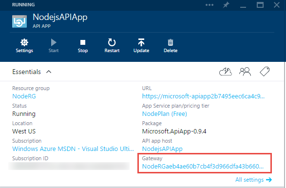

<properties 
	pageTitle="Azure App Service での Node.js API アプリの構築とデプロイ" 
    description="Node.js API アプリ パッケージを作成して Azure App Service にデプロイする方法について説明します。"
    services="app-service\api"
	documentationCenter="nodejs"
	authors="pkefal"
  manager="",
  editor=""/>

<tags
	ms.service="app-service-api"
	ms.workload="web"
	ms.tgt_pltfrm="na"
	ms.devlang="nodejs"
	ms.topic="article"
	ms.date="04/21/2015"
	ms.author="pakefali"/>

# Azure App Service での Node.js API アプリの構築とデプロイ

このチュートリアルでは、[Node.js](http://nodejs.org) アプリケーションを作成し、[Git](http://git-scm.com) を使用して Azure App Service API Apps にデプロイする方法について説明します。このチュートリアルの手順は、Node を実行できる任意のオペレーティング システムで使用できます。

完成したアプリケーションのスクリーンショットは次のようになります。

![][sample-api-app-page]

## Azure プレビュー ポータルでの API アプリの作成

> [AZURE.NOTE]このチュートリアルを完了するには、Microsoft Azure アカウントが必要です。アカウントを持っていない場合は、[MSDN サブスクライバーの特典を有効にする](/pricing/member-offers/msdn-benefits-details/)か、[無料評価版にサインアップ](/pricing/free-trial/)してください。無料評価版の [App Service アプリのサンプル](http://tryappservice.azure.com)を試すこともできます。

1. [Azure プレビュー ポータル](https://portal.azure.com)にログインします。

2. ポータルの左下にある **\[新規\]** をクリックします。

3. **\[Web + モバイル\]、\[API アプリ\]** の順にクリックします。

	![][portal-quick-create]

4. **\[名前\]** に NodejsAPIApp などの値を入力します。

5. App Service プランを選択するか、新しいプランを作成します。新しいプランを作成する場合は、料金レベル、および場所などのオプションを選択します。

	![][portal-create-api]

6. **\[作成\]** をクリックします。

	![][api-app-blade]

	**\[スタート画面に追加\]** チェック ボックスをオンのままにしておいた場合、API アプリの作成後にこの API アプリ用のブレードがポータルで自動的に表示されます。チェック ボックスをオフにした場合、ポータルのホーム ページで **\[通知\]** をクリックして API アプリの作成状態を確認し、通知をクリックして新しい API アプリのブレードに移動します。

7. **\[設定\]、\[アプリケーションの設定\]** の順にクリックします。

9. アクセス レベルを **\[パブリック \(匿名\)\]** に設定します。

11. **\[保存\]** をクリックします。

	![][set-api-app-access-level]

## 新しい API アプリの Git 発行の有効化

[Git](http://git-scm.com/%20target="_blank) は、Azure の Web サイトをデプロイするために使用できる分散型バージョン コントロール システムです。API アプリ用に記述したコードはローカルの Git リポジトリに格納されます。このコードをリモート リポジトリにプッシュして Azure にデプロイします。このデプロイ方法は、API アプリが Web アプリに基づいているために API アプリで使用できる App Service Web アプリの機能です。つまり、Azure App Service の API アプリは、Web サービスをホストするための追加の機能を持つ Web アプリであるということです。

ポータルでは、**\[API アプリ\]** ブレードで API アプリ固有の機能を管理し、**\[API アプリ ホスト\]** ブレードで Web アプリと共通する機能を管理します。このセクションでは、**\[API アプリ ホスト\]** ブレードに移動して、Git デプロイメントの機能を構成します。

1. \[API アプリ\] ブレードの **\[API アプリ ホスト\]** をクリックします。

	![][api-app-host]

2. **\[API アプリ\]** ブレードの **\[デプロイメント\]** セクションを見つけて、**\[継続的配置の設定\]** をクリックします。必要に応じて、ブレードのこの部分まで下へスクロールしてください。

	![][deployment-part]

3. **\[ソースの選択\]、\[ローカル Git リポジトリ\]** の順にクリックします。

5. **\[OK\]** をクリックします。

	![][setup-git-publishing]

6. API アプリまたはその他の App Service アプリを発行するためのデプロイ資格情報をまだ設定していない場合は、ここで設定します。

	* **\[デプロイ資格情報の設定\]** をクリックします。

	* ユーザー名とパスワードを作成します。

	* **\[保存\]** をクリックします。

	![][deployment-credentials]

1. **\[API アプリ ホスト\]** ブレードで、**\[設定\]、\[プロパティ\]** の順にクリックします。デプロイ先のリモート Git リポジトリの URL は、\[GIT URL\] の下に表示されます。

2. チュートリアルの後半で使用するためにこの URL をコピーします。

	![][git-url]

## Node.js API アプリのコードのダウンロードと確認

このセクションでは、NodeAPIApp サンプルの一部として提供されるコードをダウンロードして確認します。

1. [この GitHub リポジトリ](http://go.microsoft.com/fwlink/?LinkID=534023&clcid=0x409)内のコードをダウンロードします。リポジトリを複製するか、**Download Zip** をクリックして .zip ファイルとしてダウンロードすることができます。.zip ファイルをダウンロードした場合は、ローカル ディスクでファイルを解凍します。

2. サンプル ファイルを解凍したフォルダーに移動します。

	![][api-app-folder-browse]

3. テキスト エディターで **apiapp.json** ファイルを開き、その内容を確認します。

	![][apiapp-json]

	Azure App Service で Node.js アプリケーションを API アプリとして認識するには、次の 2 つの前提条件があります。

	+ *apiapp.json* という名前のファイルがアプリケーションのルート ディレクトリに存在する。
	+ Swagger 2.0 のメタデータのエンドポイントがアプリケーションによって公開される。このエンドポイントの URL は、*apiapp.json* ファイルで指定します。

	**apiDefinition** プロパティに注目してください。この URL のパスは API の URL の相対パスであり、Swagger 2.0 のエンドポイントを指しています。Azure App Service ではこのプロパティを使用して API の定義が検出され、多くの App Service API アプリ機能が有効になります。

	> [AZURE.NOTE]以前のバージョン \(例: 1.2\) はプラットフォームでサポートされていないため、エンドポイントは Swagger 2.0 の仕様に準拠する必要があります。サンプル アプリケーションでは Swagger 2.0 の仕様のエンドポイントの作成に swaggerize-express を使用しています。

4. **server.js** ファイルを開き、コードを確認します。

	![][server-js]

	このコードでは、swaggerize-express モジュールを使用して Swagger 2.0 のエンドポイントを作成します。

		app.use(swaggerize({
		    api: require('./api.json'),
		    docspath: '/swagger',
		    handlers: './handlers/'
		}));

	`api` プロパティは、API の Swagger 2.0 の仕様の定義が格納されている api.json ファイルを指しています。テキスト エディターで手動でファイルを作成するか、オンラインの [Swagger のエディター](http://editor.swagger.io)を使用して、そこから JSON ファイルをダウンロードできます \(*api.json* ファイルでは `host` プロパティを指定していますが、実行時にこのプロパティの値が決定され、動的に置き換えられます\)。

	`docspath` プロパティは Swagger 2.0 のエンドポイントを指しています。この URL は、API の基本パスへの相対パスです。基本パスは、api.json ファイルで宣言します。この例では、基本パスが */api/data* であるため、Swagger エンドポイントへの相対パスは */api/data/swagger* になります。

	> [AZURE.NOTE]基本パスが *api.json* ファイルで宣言されているため、API アプリの URL への相対パスとして */swagger* エンドポイントにアクセスしようとすると、404 が返されます。これは、Swagger のエンドポイントにアクセスしようとするときによく起こる間違いです。

	`handlers` プロパティは、Express.js モジュールのルートのハンドラーを格納しているローカル フォルダーを指しています。

## API アプリ コードのローカルでの実行

このセクションでは、アプリケーションをローカルで実行して、動作することをデプロイの前に確認します。

1. サンプルをダウンロードしたフォルダーに移動します。

2. コマンド ライン プロンプトを開き、次のコマンドを入力します。

		npm install

3. *install* コマンドが完了したら、次のコマンドを入力してください。

		node server.js

	コマンド ライン ウィンドウの出力に "Server started .." と表示されます。

5. ブラウザーで http://localhost:1337/ に移動します。

	次のページが表示されます。

	![][sample-api-app-page]

6. Swagger.json ファイルを表示するには、http://localhost:1337/api/data/swagger に移動します。

## Azure App Service への API アプリ コードの発行

このセクションでは、Azure App Service で実行されている API アプリにサンプル アプリケーションをデプロイするために、ローカル Git リポジトリを作成してそのリポジトリから Azure にプッシュします。

1. Git をインストールしていない場合は、[Git のダウンロード ページ](http://git-scm.com/download%20target="_blank")からインストールします。

1. コマンド ラインを使用して、サンプル アプリケーションのディレクトリに移動し、次のコマンドを入力してローカル Git リポジトリを初期化します。

		git init

2. 次のコマンドを入力して、リポジトリにファイルを追加します。

		git add .
		git commit -m "Initial commit of the API App"

3. コピーしておいた Git URL を使用して、作成した Web アプリ \(API アプリ ホスト\) に更新プログラムをプッシュするためのリモート参照を作成します。

		git remote add azure [URL for remote repository]

4. 次のコマンドを入力して、変更内容を Azure にプッシュします。

		git push azure master

	以前作成したパスワードを入力するように求められます。

	このコマンドからは、デプロイが成功したというメッセージが最後に出力されます。

		remote: Deployment successful.
		To https://user@testsite.scm.azurewebsites.net/testsite.git
	    * [new branch] master -\> master

## Azure プレビュー ポータルでの API 定義の表示

API を API アプリにデプロイしたので、Azure プレビュー ポータルで API 定義を確認できるようになりました。最初に*ゲートウェイ*を再起動します。これによって、API アプリの API 定義が変更されたことを Azure で認識できるようになります。ゲートウェイは、API の管理とリソース グループ内の API アプリの承認を処理する Web アプリです。

6. Azure プレビュー ポータルで、前に作成した API アプリの **\[API アプリ\]** ブレードに移動して、**\[ゲートウェイ\]** リンクをクリックします。

	

7. **\[ゲートウェイ\]** ブレードの **\[再起動\]** をクリックします。これでこのブレードを閉じることができます。

	

8. **\[API アプリ\]** ブレードの **\[API 定義\]** をクリックします。

	

	**\[API 定義\]** ブレードに 2 つの Get メソッドが表示されます。

	

## Azure でのサンプル アプリケーションの実行

Azure プレビュー ポータルで、目的の API アプリの **\[API アプリ ホスト\]** ブレードに移動し、**\[参照\]** をクリックします。

![][browse-api-app-page]

ブラウザーに、サンプル アプリをローカルで実行したときに表示されたホーム ページが表示されます。

## API アプリのメタデータ

[AZURE.INCLUDE [app-service-api-direct-deploy-metadata](../includes/app-service-api-direct-deploy-metadata.md)]

## 次のステップ

API アプリ バックエンドを使用する Node.js Web アプリケーションを Azure にデプロイしました。Azure での Node.js の使用に関する詳細については、「[Node.js デベロッパー センター](/develop/nodejs/)」を参照してください。

* このサンプル API アプリは [TryApp Service](http://tryappservice.azure.com) のページで試すことができます。

[portal-quick-create]: ./media/app-service-api-nodejs-api-app/portal-quick-create.png
[portal-create-api]: ./media/app-service-api-nodejs-api-app/portal-create-api.png
[api-app-blade]: ./media/app-service-api-nodejs-api-app/api-app-blade.png
[api-app-folder-browse]: ./media/app-service-api-nodejs-api-app/api-app-folder-browse.png
[api-app-host]: ./media/app-service-api-nodejs-api-app/api-app-host.png
[deployment-part]: ./media/app-service-api-nodejs-api-app/continuous-deployment.png
[set-api-app-access-level]: ./media/app-service-api-nodejs-api-app/set-api-app-access.png
[setup-git-publishing]: ./media/app-service-api-nodejs-api-app/local-git-repo.png
[deployment-credentials]: ./media/app-service-api-nodejs-api-app/deployment-credentials.png
[git-url]: ./media/app-service-api-nodejs-api-app/git-url.png
[apiapp-json]: ./media/app-service-api-nodejs-api-app/apiapp-json.png
[server-js]: ./media/app-service-api-nodejs-api-app/server-js.png
[sample-api-app-page]: ./media/app-service-api-nodejs-api-app/sample-api-app-page.png
[browse-api-app-page]: ./media/app-service-api-nodejs-api-app/browse-api-app-page.png

<!--HONumber=52-->
