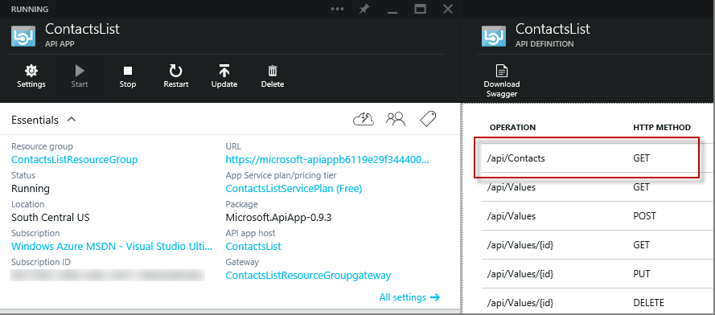
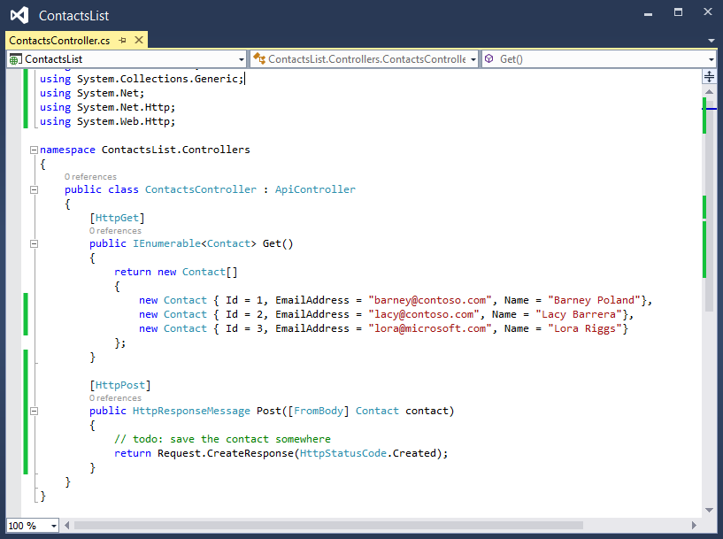
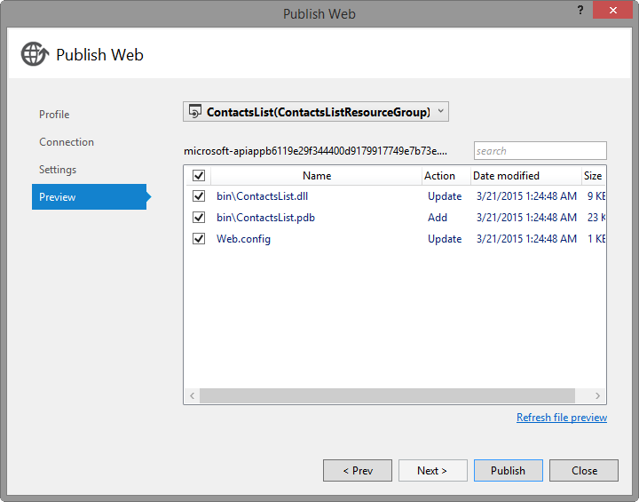

<properties 
	pageTitle="Azure App Service の API アプリのデプロイ" 
	description="Azure サブスクリプションに API アプリ プロジェクトをデプロイする方法について説明します。" 
	services="app-service\api" 
	documentationCenter=".net" 
	authors="bradygaster" 
	manager="wpickett" 
	editor="jimbe"/>

<tags 
	ms.service="app-service-api" 
	ms.workload="web" 
	ms.tgt_pltfrm="dotnet" 
	ms.devlang="na" 
	ms.topic="article" 
	ms.date="02/19/2015" 
	ms.author="bradyg;tarcher"/>

# Azure App Service の API アプリのデプロイ

## 概要

Visual Studio を使用して独自の API アプリを積極的に開発しており、クラウドで API をテストする必要がある場合は、新しい API アプリを Azure サブスクリプションに作成し、Visual Studio の便利な App Service デプロイ機能を使用してコードをデプロイできます。 

このチュートリアルは、3 部構成になっているチュートリアルの 2 番目です。

1. [API アプリの作成](app-service-dotnet-create-api-app.md)に関するチュートリアルでは、API アプリ プロジェクトを作成しました。 
* このチュートリアルでは、API アプリを Azure サブスクリプションにデプロイします。
* [API アプリのデバッグ](app-service-dotnet-remotely-debug-api-app.md)に関するチュートリアルでは、Azure で実行中のコードを Visual Studio を使用してリモートでデバッグします。

## API アプリのデプロイ 

**ソリューション エクスプローラー**で、プロジェクト (ソリューションではありません) を右クリックしてから、**[発行]** をクリックします。 

**[プロファイル]** タブ、**[Microsoft Azure API Apps (プレビュー)]** の順にクリックします。 

**[新規]** をクリックして、Azure サブスクリプションに新しい API アプリをプロビジョニングします。

**[API アプリの作成]** ダイアログで、次のように入力します。

- **[API アプリの名前]** にアプリケーションの名前を入力します。 
- 複数の Azure サブスクリプションがある場合は、使用するサブスクリプションを選択します。
- [App Service プラン] で、既存の App Service プランを選択するか、**[App Service プランの新規作成]** を選択して新しいプランの名前を入力します。 
- **[リソース グループ]** で、既存のリソース グループを選択するか、**[新しいリソース グループの作成]** を選択して名前を入力します。名前は一意にする必要があります。アプリ名をプレフィックスとして使用し、@ 記号を除いた Microsoft ID などの個人情報を追加することを検討してください。  
- **[アクセス レベル]** で、**[すべてのユーザーが利用できる]** を選択します。これは API を完全にパブリックにするオプションですが、このチュートリアルでは問題ありません。Azure ポータルを使用して後でアクセスを制限することができます。
- リージョンを選択します。  

**[OK]** をクリックします。サブスクリプションに API アプリが作成されます。このプロセスには数分かかることがあります。プロセスが開始されたことを通知するダイアログが Visual Studio に表示されます。 

プロビジョニング プロセスにより、Azure サブスクリプションにリソース グループと API アプリが作成されます。Visual Studio の **[Azure App Service アクティビティ]** ウィンドウに進捗状況が表示されます。 

API アプリがプロビジョニングされたら、ソリューション エクスプローラーでプロジェクトを右クリックして **[発行]** を選択します。発行ダイアログが再び開きます。前の手順で作成した発行プロファイルが選択されます。**[発行]** をクリックしてデプロイ プロセスを開始します。 

**[Azure App Service アクティビティ]** ウィンドウにデプロイの進捗状況が表示されます。 

## Azure ポータルでのアプリの表示

このセクションでは、ポータルに移動して、API Apps の使用可能な基本設定を表示し、API アプリに反復的な変更を加えます。デプロイするたびに、API アプリに加えた変更がポータルに反映されます。 

ブラウザーで、[Azure ポータル](https://portal.azure.com)に移動します。 

サイド バーで **[参照]** をクリックし、**[API Apps]** を選択します。

サブスクリプションの API アプリの一覧から作成した API を選択します。

**[API の定義]** をクリックします。アプリの **[API の定義]** ブレードに、アプリを作成したときに定義した API 操作の一覧が表示されます。 

ここで Visual Studio のプロジェクトに戻ります。**ContactsController.cs** ファイルに次のコードを追加します。  

	[HttpPost]
	public HttpResponseMessage Post([FromBody] Contact contact)
	{
		// todo: save the contact somewhere
		return Request.CreateResponse(HttpStatusCode.Created);
	}

このコードは、新しい `Contact` インスタンスを API にポストできる **Post** メソッドを追加します。 

**ソリューション エクスプローラー**で、プロジェクトを右クリックし、**[発行]** を選択します。 

**[構成]** ボックスの一覧の **[デバッグ]** 構成を選択し、**[発行]** をクリックして、API アプリを再びデプロイします。 

**Web の発行**ウィザードの **[プレビュー]** タブで、**[発行]** をクリックします。  

発行プロセスが完了したら、ポータルに戻り、**[API の定義]** ブレードを閉じてから再び開きます。先ほど作成し、Azure サブスクリプションに直接デプロイした新しい API エンドポイントが表示されます。

## 次のステップ

ここまでは、Visual Studio の直接デプロイする機能を使用して、反復処理、迅速なデプロイ、および API が正常に機能しているかどうかのテストを簡単に実行する方法について説明しました。[次のチュートリアル](app-service-dotnet-remotely-debug-api-app.md)では、Azure で実行中の API アプリをデバッグする方法について説明します。

<!--HONumber=49-->