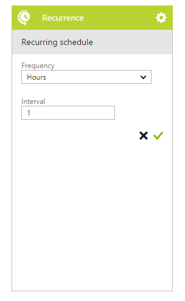

<properties 
	pageTitle="ロジック アプリの作成" 
	description="初めてのロジック アプリの作成" 
	authors="stepsic-microsoft-com" 
	manager="dwrede" 
	editor="" 
	services="app-service\logic" 
	documentationCenter=""/>

<tags
	ms.service="app-service-logic"
	ms.workload="integration"
	ms.tgt_pltfrm="na"
	ms.devlang="na"
	ms.topic="article"
	ms.date="03/20/2015"
	ms.author="stepsic"/>

#新しいロジック アプリを作成する
このトピックでは、初めての方に向けて App Service Logic Apps の使い方を簡単に説明します。今回は、興味を持ったツイートを Dropbox フォルダーに保存できるようにするまでの流れを見ていきます。

このシナリオでは、以下のものが必要になります。

- Azure サブスクリプション
- Twitter アカウント
- Dropbox アカウント

<!--- TODO: Add try it now information here -->

##コネクタを取得する

まずは、使用するコネクタを 2 つ作成する必要があります。**具体的には、Dropbox Connector** と **Twitter Connector** です。コネクタを作成する手順は、以下のとおりです。

1. ホーム画面の **[Marketplace]** をクリックし、**Twitter** を検索します。 

2. [Twitter Connector] を選択し、[作成] をクリックします。ブレードが表示されるので、設定をしていきます。名前は **Twitter Connector** のままでかまいません。

3. **[App Service プランの新規作成]** に、プランの名前を入力します。
	
	>[AZURE.NOTE]このセクションに示した手順では、新しい App Service のプランを作成することを前提に話を進めています。既存の App Service プランを使用する場合には、**[既存の選択]** をクリックして既存のプランを選択したうえで、このセクションでこれ以降に記載している内容は飛ばして、次のセクションの手順を実行してください。
 
4.  新しいプランの**価格レベル**を選択します。
 
	>[AZURE.NOTE]既定では、Logic Apps 向けにお勧めとされるプランのみが表示されます。利用可能なプランをすべて表示する場合には、**[すべて表示]** をクリックしてください。ロジック アプリを Free レベルで実行する場合には、実行間隔は 1 時間ごと、使用できるアクションは 1 か月につき 1,000 回までとなります。

5. フローの**リソース グループ**を作成します。 

	リソース グループは、アプリのコンテナーとしての役割を果たすものです。同じアプリのリソースはすべて、同じリソース グループに入ります。

6. Azure サブスクリプションが複数ある場合には、使用するものを 1 つ選択します。

7. ロジック アプリの**場所**を選択します。

	

8. **[作成]** をクリックします。1 ～ 2 分でプロビジョニングが始まります。 

9. Dropbox についても、同じ手順を繰り返します。

##ロジック アプリを作成する

次は、新しいロジック アプリを作成します。

1. 画面左下の **[+ 新規]** ボタンをクリックして **[Web + モバイル]** を展開したら、**[ロジック アプリ]** をクリックします。 

 	[ロジック アプリの作成] ブレードが表示されるので、最初の基本設定を入力していきます。

	
	
2. **[名前]** には、ロジック アプリの名前として意味のある文字列を入力します。

3. **App Service プラン**には、コネクタの作成時に使用したものを選択します。これにより、場所、サブスクリプション、リソース グループが自動的に選択されます。

基本となる設定は以上ですが、**[作成]** はまだクリックしないでください。この次は、ワークフローにトリガーとアクションを追加します。

## トリガーを追加する

トリガーとは、ロジック アプリの実行の引き金となるものです。ここでは、繰り返しトリガーを追加します。このトリガーは、事前に設定したスケジュールでワークフローを開始するためのものです。

1. まだ **[ロジック アプリの作成]** ブレードを開いているはずですので、そこで **[トリガーとアクション]** をクリックします。 

	フローを表示するデザイナーが全画面表示されます。右側に、トリガーを設定できるサービスが一覧表示されています。 

2. **[組み込み]** セクションで、**[繰り返し]** をクリックします。
	
	繰り返しの設定を指定するためのボックスが表示されます。

	

4.  (1 時間ごとなど) 繰り返しの **[頻度]** と **[間隔]** を選択し、緑色のチェック マークをクリックします。

次は、フローにアクションを追加していきます。

## Twitter アクションを追加する

アクションとは、ワークフローの動作を指します。アクションの数には上限はありません。また、アクションを調整して、あるアクションの情報がその次のアクションに送られるようにすることもできます。

1. 右側のウィンドウで **Twitter Connector** を探し、クリックします。 

2. 読み込みが終わったら **[承認]** ボタンをクリックし、Twitter アカウントにサインインして、**[アプリを認証]** をクリックします。 

	これにより、コネクタが Twitter アカウントにアクセスできるようになります。Twitter Connector に用意されている処理のリストが表示されます。 

	

3. **[ツイートの検索]** をクリックし、**[クエリの指定]** に「`#MicrosoftAzure`」などの文字を入力して、緑色のチェック マークをクリックします。

	

これで、Twitter Connector がワークフローの一部となりました。

## Dropbox アクションを追加してアプリを作成する

最後に、ツイートを Dropbox のファイルにアップロードするアクションを追加します。 

1. 右側のウィンドウで、**[Dropbox Connector]** をクリックします。 
  
2. プロビジョニングが完了したら **[承認]** ボタンをクリックし、Dropbox アカウントにサインインして **[許可]** をクリックします。

	
	
	これで、コネクタが Dropbox アカウントにアクセスできるようになります。Dropbox Connector に用意されている処理のリストが表示されます。 
 
4. **[ファイルのアップロード]** をクリックします。  

	Dropbox Connector の設定が表示されるので、ここで Twitter の検索結果のデータを Dropbox に送るように設定していきます。

	

3. **[ファイルパス]** フィールドには、「 `/tweet.txt`」と入力します。
  
4. **[コンテンツ]** フィールドは、`[...]` ボタン、**[ツイートのテキスト]** オプションの順にクリックします。 
 
	すると、テキストボックスに "`@first(body('twitterconnector')).TweetText`" という値が入力されます。この値の各部の意味は、以下のとおりです。

	部分                               | 説明
	------------------------------------------ | ------------
	 `@`                                       | 実際の値ではなく、関数を入力しようとしていることを示します。
	`actions('twitterconnector').outputs.body` | Twitter Connector のクエリの結果として返されたツイートを取得します。
	`first()`                                  | ツイートの検索アクションによって返されるのはリストであるものの、アップロードするのは 1 つのファイルのみとなります。
	`.TweetText`                               | ツイート メッセージのプロパティを選択します。
	
5. 緑色のチェック マークをクリックして、コネクタの設定を保存します。

5. これで、設計が完了しました。デザイナーの左上の **[コード ビュー]** をクリックしてみましょう。デザイナーで作成したワークフローを定義する JSON コードが確認できます。このコードについては、「[次のトピック][ロジック アプリの機能を使用する]」で詳しく説明します。

6. 画面下の **[OK]** ボタンをクリックし、**[作成]** ボタンをクリックします。 

	新しいロジック アプリが作成されます。

## 作成後のロジック アプリの管理

ここまでの手順で、ロジック アプリが実行できるようになりました。スケジュールが設定されているワークフローが実行されるたびに、  特定のハッシュタグが含まれるツイートがないかどうかが確認されます。条件に合致するツイートが見つかった場合には、Dropbox に保存されます。ここでは、最後にアプリを無効にしたり、動作内容を確認したりする方法を見ていきます。 

1. 画面左側の **[参照]** をクリックし、**[Logic Apps]** を選択します。 
 
2. 新たに作成したロジック アプリをクリックすると、現在の状態や全般的な情報を確認できます。 

3. ロジック アプリを編集するときは、**[トリガーとアクション]** をクリックします。 
 
5. アプリを無効にするには、コマンド バーで **[無効化]** をクリックします。

クラウド上で実行できる簡単なロジック アプリを 5 分もしないうちに作成できました。ロジック アプリの機能の使用について詳しくは、「[ロジック アプリの機能を使用する]」をご覧ください。

<!-- Shared links -->
[Azure ポータル]: https://portal.azure.com
[ロジック アプリの機能を使用する]: app-service-logic-use-logic-app-features.md

<!--HONumber=49-->