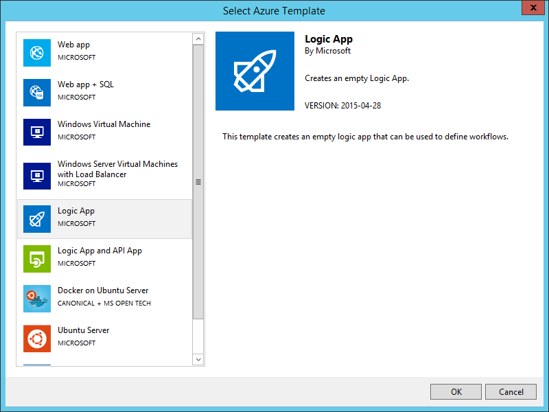

<properties 
	pageTitle="Visual Studio からのデプロイ" 
	description="Visual Studio でプロジェクトを作成してロジック アプリを管理します。" 
	authors="stepsic-microsoft-com" 
	manager="dwrede" 
	editor="" 
	services="app-service\logic" 
	documentationCenter=""/>

<tags
	ms.service="app-service-logic"
	ms.workload="integration"
	ms.tgt_pltfrm="na"
	ms.devlang="na"
	ms.topic="article"
	ms.date="04/26/2015"
	ms.author="stepsic"/>
	
# Visual Studio からのデプロイ

[Azure ポータル](https://portal.azure.com)にはロジック アプリを設計および管理するための優れた方法が用意されていますが、代わりに Visual Studio からロジック アプリをデプロイすることもできます。これには主に 2 つの機能があります。

- アプリケーションのすべての側面を含めることができるように、ソリューションに他のアセットと共にロジック アプリを保存する
- TFS や Git を使用して変更履歴を追跡できるように、ロジック アプリ定義をソース管理にチェックインしたままにする 

次の手順を実行するには、Azure SDK 2.6 をインストールしておく必要があります。最新の SDK for VS は、[こちら](http://azure.microsoft.com/downloads/)で探してください。

## プロジェクトの作成

1. **\[ファイル\]** メニューの **\[新規作成\]**、**\[プロジェクト\]** の順にクリックします \(または、**\[追加\]** の **\[新しいプロジェクト\]** をクリックして既存のソリューションに追加します\)。![\[ファイル\] メニュー](./media/app-service-logic-deploy-from-vs/filemenu.png)

2. ダイアログ ボックスで、**\[クラウド\]** を見つけて、**\[Azure リソース グループ\]** を選択します。**\[名前\]** に名前を入力し、**\[OK\]** をクリックします。

3. 必要に応じて、**\[ロジック アプリ\]** または **\[ロジック アプリと API アプリ\]** を選択する必要があります。**\[ロジック アプリ\]** を選択する場合は、既存の API を指定する必要があります。**\[ロジック アプリと API アプリ\]** を選択する場合は、同時に新しい空の API アプリを作成することもできます。

4. **テンプレート**を選択したら、**\[OK\]** をクリックします。

これで、ロジック アプリ プロジェクトがソリューションに追加されます。ソリューション エクスプローラーにデプロイメントが表示されます。

## ロジック アプリの構成

プロジェクトを作成したら、VS 内でロジック アプリの定義を編集することができます。ソリューション エクスプローラーで JSON ファイルをクリックします。アプリケーションのロジックを使用して入力できるプレース ホルダーの定義が表示されます。

定義全体で**パラメーター**を使用することをお勧めします。これは、開発環境と運用環境の両方にデプロイする場合に役立ちます。その場合、`.param` ファイルに環境固有のすべての構成と、実際の文字列ではなくパラメーターを配置する必要があります。

現在、Visual Studio には組み込みのデザイナーがありません。そのため、\(JSON を記述するのではなく\) グラフィカル インターフェイスを使用する場合は、Azure ポータルを使用する必要があります。

以前に Azure ポータル内でロジック アプリを作成していて、それをソース管理にチェックインする場合は、次の手順を実行します。- ポータルで **\[コード ビュー\]** に移動し、定義をコピーします。- Logic Apps [REST API](https://msdn.microsoft.com/library/azure/dn948510.aspx) を使用して定義を取得します。- [Azure リソース マネージャーの PowerShell](powershell-azure-resource-manager.md)、具体的には [`Get-AzureResource`コマンド](https://msdn.microsoft.com/library/dn654579.aspx) を使用して定義をダウンロードします。

## ロジック アプリのデプロイ

最後に、アプリを構成したら、いくつかの手順で Visual Studio から直接デプロイすることができます。

1. ソリューション エクスプローラーでデプロイを右クリックし、**\[デプロイ\]**、**\[新しいデプロイ\]** の順に移動します。

2. Azure サブスクリプションへのサインインを求められます。

3. ここでは、ロジック アプリをデプロイするリソース グループの詳細を選択する必要があります。

    リソース グループに適したテンプレートとパラメーター ファイルを必ず選択してください \(たとえば、運用環境にデプロイする場合、運用中のパラメーター ファイルを選択します\)。
    
4. デプロイの状態が **\[出力\]** ウィンドウに表示されます \(**\[Azure プロビジョニング\]** を選択することが必要になる場合があります\)。

今後は、ソース管理でロジック アプリを修正し、Visual Studio を使用して新しいバージョンをデプロイできます。Azure ポータルで定義を直接変更した場合、次回 Visual Studio からデプロイすると、変更内容がオーバーライドされることに注意してください。

Visual Studio を使用せず、ソース管理からロジック アプリをデプロイするツールを使用する場合は、いつでも [API](https://msdn.microsoft.com/library/azure/dn948510.aspx) または [PowerShell](powershell-azure-resource-manager.md) を直接使用してデプロイを自動化できます。
<!--HONumber=54-->