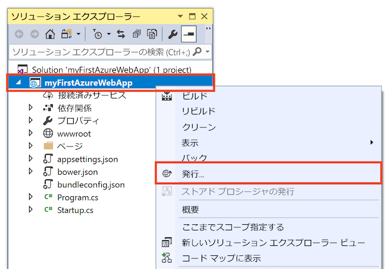
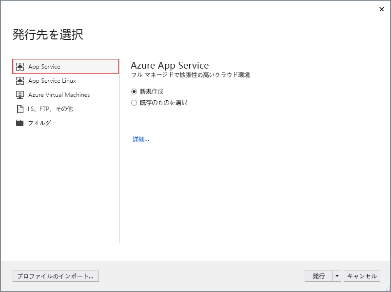
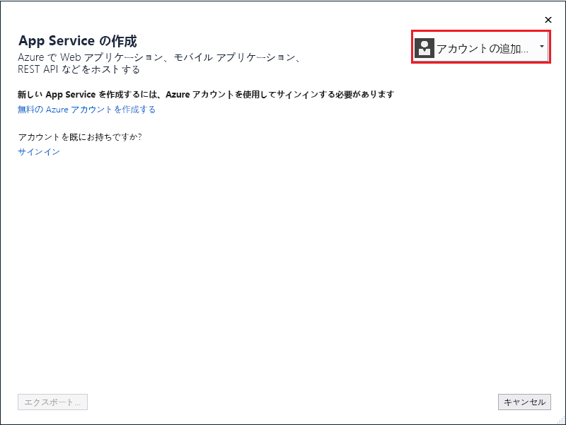
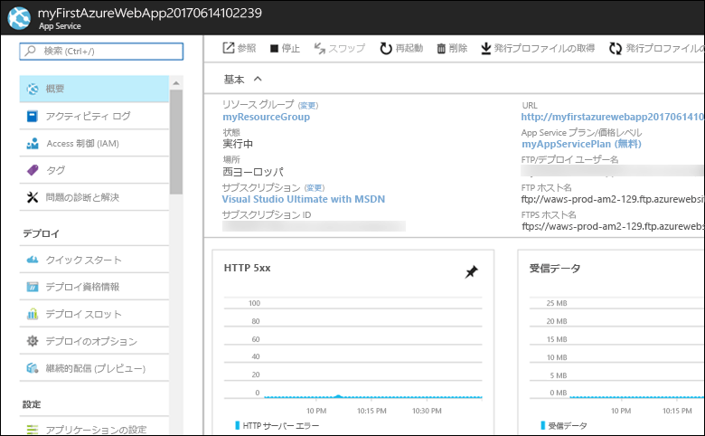

# <a name="create-an-aspnet-core-web-app-in-azure"></a>Azure に ASP.NET Core Web アプリを作成する

> [!NOTE]
> この記事では、Windows 上の App Service にアプリをデプロイします。 _Linux_ 上の App Service にデプロイするには、「[App Service on Linux での .NET Core Web アプリの作成](./containers/quickstart-dotnetcore.md)」をご覧ください。
>

[Azure Web Apps](app-service-web-overview.md) では、高度にスケーラブルな自己適用型の Web ホスティング サービスを提供しています。  このクイック スタートでは、Azure Web Apps に初めての ASP.NET Core Web アプリをデプロイする方法を示します。 作業が完了すると、デプロイされた Web アプリケーションを使って、App Service プランと Azure Web アプリで構成されるリソース グループを入手できます。

> [!NOTE]
> ASP.NET Framework Web アプリをビルドしてデプロイする方法については、[この記事](app-service-web-get-started-dotnet-framework.md)を参照してください。 
>

[!INCLUDE [quickstarts-free-trial-note](../../includes/quickstarts-free-trial-note.md)]

## <a name="prerequisites"></a>前提条件

このチュートリアルを完了するには、以下が必要です。

* 次のワークロードを使って、<a href="https://www.visualstudio.com/downloads/" target="_blank">Visual Studio 2017</a> をインストールします。
    - **ASP.NET と Web 開発**
    - **Azure 開発**

    ![ASP.NET および Web 開発と Azure 開発 ([Web & Cloud\(Webとクラウド\)] 下)](media/app-service-web-tutorial-dotnet-sqldatabase/workloads.png)

## <a name="create-an-aspnet-core-web-app"></a>ASP.NET Core Web アプリケーションの作成

Visual Studio で、 **[ファイル]、[新規作成]、[プロジェクト]** の順にクリックして、プロジェクトを作成します。 

**[新しいプロジェクト]** ダイアログ ボックスで、**[Visual C#]、[Web]、[ASP.NET Core Web アプリケーション]** の順にクリックします。

アプリケーションに _myFirstAzureWebApp_ という名前を付けて、**[OK]** をクリックします。
   


任意の種類の ASP.NET Core Web アプリを Azure にデプロイできます。 このクイックスタートでは、**[Web アプリケーション]** テンプレートを選択し、認証が **[認証なし]** に設定されていることを確認してください。
      
**[OK]**を選択します。

![[新しい ASP.NET プロジェクト] ダイアログ ボックス](./media/app-service-web-get-started-dotnet/razor-pages-aspnet-dialog.png)

ASP.NET Core プロジェクトが作成されると、ASP.NET Core ウェルカム ページが開き、作業を開始する際に役立つリソースへのリンクが多数表示されます。 


メニューから、**[デバッグ]、[デバッグなしで開始]** の順にクリックし、ローカルで Web アプリを実行します。


## <a name="publish-to-azure"></a>Azure に発行する

**ソリューション エクスプローラー**で **myFirstAzureWebApp** プロジェクトを右クリックし、**[発行]** を選択します。



**[Microsoft Azure App Service]** が選択されていることを確認し、**[発行]** をクリックします。



**[App Service の作成]** ダイアログ ボックスが表示されます。このダイアログ ボックスでは、Azure で ASP.NET Core Web アプリを実行するために必要なすべての Azure リソースを作成できます。

## <a name="sign-in-to-azure"></a>Azure へのサインイン

**[App Service の作成]** ダイアログ ボックスで、**[アカウントの追加]** をクリックし、Azure サブスクリプションにサインインします。 既にサインインしている場合は、目的のサブスクリプションを含んだアカウントをドロップダウンから選択します。

> [!NOTE]
> 既にサインインしている場合は、まだ **[作成]** を選択しないでください。
>
>
   


## <a name="create-a-resource-group"></a>リソース グループの作成

[!INCLUDE [resource group intro text](../../includes/resource-group.md)]

**[リソース グループ]** の横にある **[新規]** をクリックします。

リソース グループに **myResourceGroup** という名前を付けて、**[OK]** をクリックします。

## <a name="create-an-app-service-plan"></a>App Service プランを作成する

[!INCLUDE [app-service-plan](../../includes/app-service-plan.md)]

**[App Service プラン]** の横にある **[新規]** をクリックします。 

**[App Service プランの構成]** ダイアログ ボックスで、スクリーン ショットの次の表に示した設定を使用します。


| Setting | 推奨値 | [説明] |
|-|-|-|
|App Service プラン| myAppServicePlan | App Service プランの名前です。 |
| 場所 | 西ヨーロッパ | Web アプリがホストされているデータ センターです。 |
| サイズ | 無料 | [価格レベル](https://azure.microsoft.com/pricing/details/app-service/?ref=microsoft.com&utm_source=microsoft.com&utm_medium=docs&utm_campaign=visualstudio)によって、ホスティング機能が決まります。 |

**[OK]**を選択します。

## <a name="create-and-publish-the-web-app"></a>Web アプリを作成して発行する

**[Web アプリ名]** に一意のアプリ名 (有効な文字は `a-z`、`0-9`、および `-`) を入力するか、自動的に生成された一意の名前をそのまま使用します。 Web アプリの URL は`http://<app_name>.azurewebsites.net`です。`<app_name>` には Web アプリの名前を指定します。

**[作成]** をクリックして、Azure リソースの作成を開始します。


ウィザードの完了後に、Azure に ASP.NET Core Web アプリを発行してから、既定のブラウザーでアプリを起動します。


Web アプリを[作成して発行する手順](#create-and-publish-the-web-app)で指定した名前が、`http://<app_name>.azurewebsites.net` 形式の URL プレフィックスとして使用されます。

ASP.NET Core Web アプリを Azure App Service でライブ実行することができました。

## <a name="update-the-app-and-redeploy"></a>アプリを更新して再デプロイする

**ソリューション エクスプローラー**で、_Pages\Index.cshtml_ を開きます。

上部の `<div id="myCarousel" class="carousel slide" data-ride="carousel" data-interval="6000">` HTML タグを検索し、要素全体を次のコードに置き換えます。

```HTML
<div class="jumbotron">
    <h1>ASP.NET in Azure!</h1>
    <p class="lead">This is a simple app that we’ve built that demonstrates how to deploy a .NET app to Azure App Service.</p>
</div>
```

Azure に再デプロイするには、**ソリューション エクスプローラー**で **myFirstAzureWebApp** プロジェクトを右クリックし、**[発行]** を選択します。

発行ページで **[発行]** をクリックします。

発行が完了すると、Visual Studio で Web アプリの URL のブラウザーが起動されます。


## <a name="manage-the-azure-web-app"></a>Azure Web アプリを管理する

<a href="https://portal.azure.com" target="_blank">Azure Portal</a> に移動して、Web アプリを管理します。

左側のメニューで、**[App Services]** を選択し、Azure Web アプリの名前をクリックします。


Web アプリの [概要] ページを確認します。 ここでは、参照、停止、開始、再開、削除のような基本的な管理タスクを行うことができます。 



左側のメニューは、アプリを構成するためのさまざまなページを示しています。 

[!INCLUDE [Clean-up section](../../includes/clean-up-section-portal.md)]

## <a name="next-steps"></a>次の手順

> [!div class="nextstepaction"]
> [ASP.NET Core と SQL Database](app-service-web-tutorial-dotnetcore-sqldb.md)
