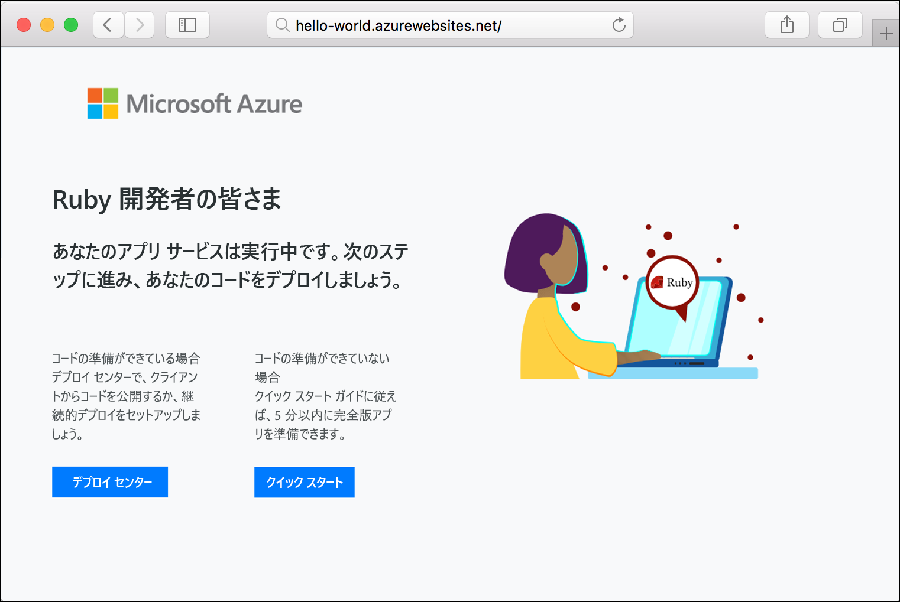

# <a name="create-a-ruby-app-in-app-service-on-linux"></a>App Service on Linux での Ruby アプリの作成

[Azure App Service on Linux](app-service-linux-intro.md) は、高度にスケーラブルな自己適用型の Web ホスティング サービスを提供します。 このクイックスタートでは、Web App on Linux として Azure にデプロイできる基本的な [Ruby on Rails](https://rubyonrails.org/) アプリケーションの作成方法を示します。


[!INCLUDE [quickstarts-free-trial-note](../../../includes/quickstarts-free-trial-note.md)]

## <a name="prerequisites"></a>前提条件

* <a href="https://www.ruby-lang.org/en/documentation/installation/#rubyinstaller" target="_blank">Ruby 2.3 以降のインストール</a>
* <a href="https://git-scm.com/" target="_blank">Git をインストールする</a>

## <a name="download-the-sample"></a>サンプルのダウンロード

ターミナル ウィンドウで、次のコマンドを実行して、サンプル アプリのリポジトリをローカル コンピューターに複製します。

```bash
git clone https://github.com/Azure-Samples/ruby-docs-hello-world
```

## <a name="run-the-application-locally"></a>ローカルでアプリケーションを実行する

アプリケーションを動作させるために、Rails サーバーを実行する必要があります。 `hello-world` ディレクトリに変更し、`rails server` コマンドを使用してサーバーを起動します。

```bash
cd hello-world\bin
rails server
```

Web ブラウザーで `http://localhost:3000` に移動して、ローカルでアプリケーションをテストします。


[!INCLUDE [Try Cloud Shell](../../../includes/cloud-shell-try-it.md)]

[!INCLUDE [Configure deployment user](../../../includes/configure-deployment-user.md)]

[!INCLUDE [Create resource group](../../../includes/app-service-web-create-resource-group-linux.md)]

[!INCLUDE [Create app service plan](../../../includes/app-service-web-create-app-service-plan-linux.md)]

## <a name="create-a-web-app"></a>Web アプリを作成する

[!INCLUDE [Create web app](../../../includes/app-service-web-create-web-app-ruby-linux-no-h.md)] 

サイトを参照して、新たに作成された、組み込みイメージを使用する Web アプリを確認します。 _&lt;app_name>_ は、Web アプリの名前に置き換えます。

```bash
http://<app_name>.azurewebsites.net
```

新しい Web アプリは次のようになります。



## <a name="deploy-your-application"></a>アプリケーションをデプロイする

次のコマンドを実行して、ローカル アプリケーションを Azure Web サイトにデプロイします。

```bash
git remote add azure <Git deployment URL from above>
git add -A
git commit -m "Initial deployment commit"
git push azure master
```

リモート デプロイ操作が正しく報告されていることを確認します。 これらのコマンドは、次のテキストに似た出力を生成します。

```bash
remote: Using sass-rails 5.0.6
remote: Updating files in vendor/cache
remote: Bundle gems are installed into ./vendor/bundle
remote: Updating files in vendor/cache
remote: ~site/repository
remote: Finished successfully.
remote: Running post deployment command(s)...
remote: Deployment successful.
To https://<your web app name>.scm.azurewebsites.net/<your web app name>.git
  579ccb....2ca5f31  master -> master
myuser@ubuntu1234:~workspace/<app name>$
```

デプロイが完了したら、次に示すように [`az webapp restart`](/cli/azure/webapp?view=azure-cli-latest#az_webapp_restart) コマンドを使用して Web アプリを再起動してデプロイが有効になるようにします。

```azurecli-interactive
az webapp restart --name <app name> --resource-group myResourceGroup
```

サイトに移動して結果を確認します。

```bash
http://<app name>.azurewebsites.net
```


> [!NOTE]
> アプリの再起動中にサイトを参照しようとすると、結果は HTTP 状態コード `Error 503 Server unavailable` になります。 完全に再起動するまで、数分かかる場合があります。
>

[!INCLUDE [Clean-up section](../../../includes/cli-script-clean-up.md)]

## <a name="next-steps"></a>次の手順

> [!div class="nextstepaction"]
> [Ruby on Rails と MySQL](tutorial-ruby-mysql-app.md)
