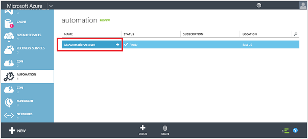

<properties linkid="automation-create-runbook-from-samples" urlDisplayName="Azure オートメーションの使用" pageTitle="Azure オートメーションの使用" metaKeywords="" description="Azure でオートメーション ジョブをインポートして実行する方法について説明します。" metaCanonical="" services="automation" documentationCenter="" title="Azure オートメーションの使用" authors="" solutions="" manager="" editor="" />

# Azure オートメーションの使用

このチュートリアルでは、Microsoft Azure にオートメーション Runbook をインポートして実行する手順について説明します。

開発者は Microsoft Azure オートメーションを使用すると、クラウド環境で一般的に実行される、手動で実行時間が長く、エラーが起こりやすく、頻繁に繰り返されるタスクを自動化する手段を入手できます。Runbook を使用して、Azure 環境内でリソースを作成、監視、管理、およびデプロイすることができます。Runbook は、内部で Windows PowerShell のワークフローを使用しています。オートメーションの詳細については、[オートメーション概要ガイドに関するページ](http://go.microsoft.com/fwlink/p/?LinkId=392861)を参照してください。

このチュートリアルでは、Azure オートメーションにサンプルの Runbook をインポートし、その Runbook を実行して、出力を表示する手順について説明します。

## サンプル Runbook とユーティリティ Runbook

Azure オートメーション チームはさまざまな Runbook サンプルを作成し、オートメーションに関連する作業を開始できるようにしました。これらのサンプルはオートメーションの基本的な概念を取り扱っており、独自の Runbook を作成する方法を学習するのに役立ちます。

また、オートメーション チームは、より大きいオートメーション タスクの構成要素として使用できるユーティリティ Runbook も作成しました。

>[WACOM.NOTE] 小規模で、モジュール構造を採用した、再利用可能な Runbook を作成することをお勧めします。また、オートメーションに慣れた後は、一般的に使用されるシナリオで役立つ独自のユーティリティ Runbook を作成することも強くお勧めします。

[スクリプト センター](http://go.microsoft.com/fwlink/p/?LinkId=393029)で、オートメーション チームが作成したサンプル Runbook とユーティリティ Runbook を表示し、ダウンロードすることができます。

## オートメーション関連のコミュニティとフィードバック

コミュニティや Microsoft の他のチームから提供された Runbook も、[スクリプト センター](http://go.microsoft.com/fwlink/?LinkID=391681)で公開されています。

<strong>フィードバックの送信</strong>Runbook ソリューションや PowerShell 統合モジュールを探索している場合は、スクリプト センターにスクリプトの要求を投稿することができます。オートメーションに関連する新機能が思い浮かんだ場合は、[User Voice](http://feedback.windowsazure.com/forums/34192--general-feedback) に投稿してください。

[WACOM.INCLUDE [create-account-note](../includes/create-account-note.md)]

## スクリプト センターからのサンプル Runbook のダウンロード

1.	[スクリプト センター](http://go.microsoft.com/fwlink/p/?LinkId=393029)にアクセスし、**[Hello World Azure Automation]** をクリックします。

2.	**[Download]** の横にある **[Write-HelloWorld.ps1]** というファイル名をクリックし、そのファイルをコンピューターに保存します。

## Azure への サンプル Runbook のインポート

1.	[Azure 管理ポータル](http://manage.windowsazure.com)にログインします。

2.	管理ポータルで、**[オートメーション アカウントの作成]** をクリックします。

	>[WACOM.NOTE] オートメーション アカウントを既に作成した場合は、手順 4 に進むことができます。

	

3.	**[新しいオートメーション アカウントの追加]** ページで、アカウントの名前を入力し、チェック マークをクリックします。

	
 
4.	**[オートメーション]** ページで、作成した新しいアカウントをクリックします。
 
	

5.	**[Runbook]** をクリックします。

	![[Runbook] タブ](./media/automation/automation_04_RunbooksTab.png)
  
6.	**[インポート]** をクリックします。

	

7.	ダウンロードした **Write-HelloWorld.ps1** スクリプトを参照し、チェック マークをクリックします。

		
 
8.	**[Write-HelloWorld]** をクリックします。

	

9.	**[作成者]** をクリックし、**[ドラフト]** をクリックします。この Runbook に対して、どのような変更も加える必要はありません。

	ここで、**Write-HelloWorld.ps1** の内容を参照できます。ドラフト モードでは、Runbook の内容を変更できます。

	
 
10.	**[発行]** をクリックして Runbook を昇格し、運用環境で使用する準備をします。

	
   
11.	Runbook を保存して発行するかどうかを問い合わされた場合は、**[はい]** をクリックします。
 
	

12.	**[発行済]** をクリックし、**[開始]** をクリックします。

	
 
13.	**[Runbook パラメーターの値を指定します]**ページで、Write-HelloWorld.ps1 スクリプトの入力パラメーターとして使用される **[名前]** を入力し、チェック マークをクリックします。

	
  
14.	**[ジョブ]** をクリックして、開始した Runbook ジョブの状態を確認し、**[ジョブ開始]** 列にあるタイムスタンプをクリックしてジョブの概要を表示します。

	

15.	 **[概要]** ページで、ジョブの概要、入力パラメーター、出力を表示できます。
 
	

## 関連項目

- [オートメーションの概要](http://go.microsoft.com/fwlink/p/?LinkId=392860)
- [Runbook 作成ガイド (英語)](http://go.microsoft.com/fwlink/p/?LinkID=301740)
- [オートメーション フォーラム](http://go.microsoft.com/fwlink/p/?LinkId=390561)

