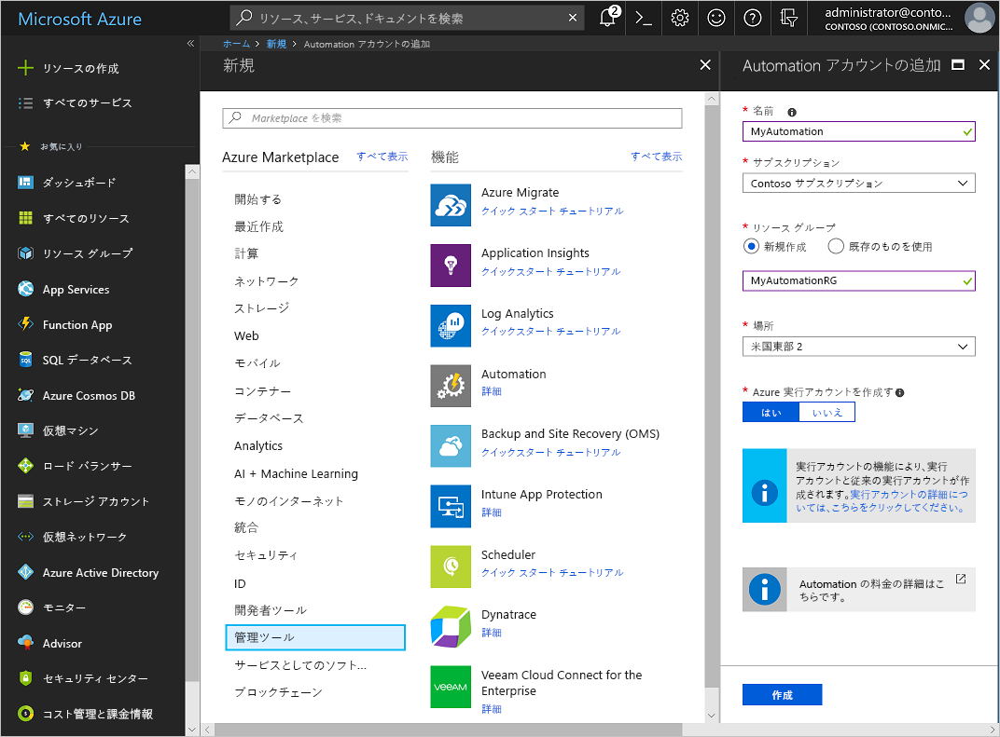
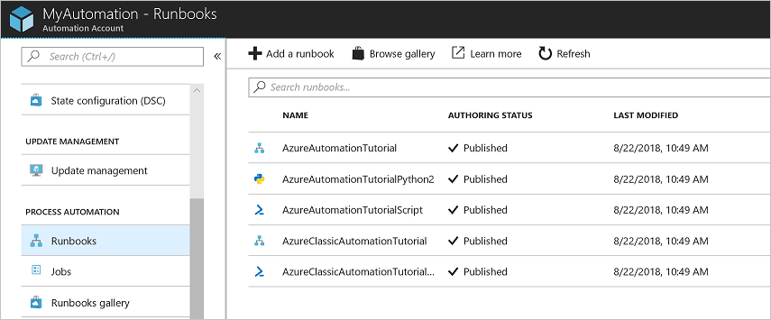
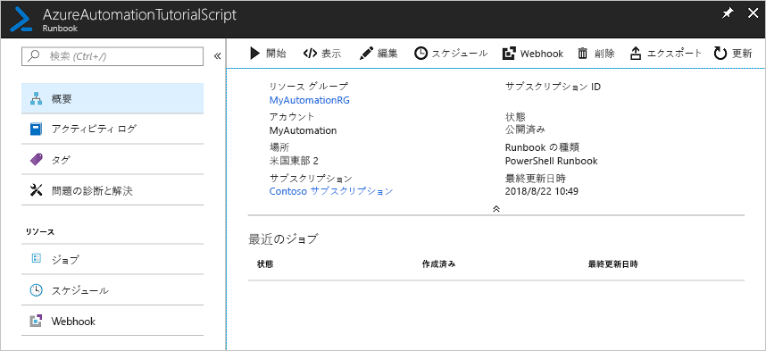
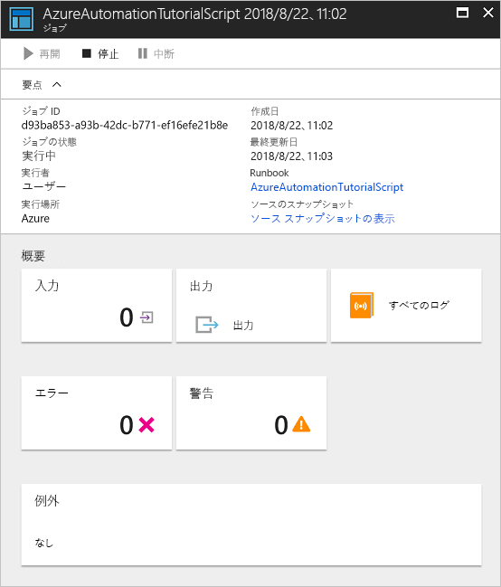

# Azure Automation アカウントを作成する

Azure を使用して Azure Automation アカウントを作成することができます。 この方法では、ブラウザーベースのユーザー インターフェイスで Automation アカウントとそれに関連するリソースを作成して構成できます。 このクイックスタートでは、Automation アカウントを作成し、そのアカウントで Runbook を実行する手順について説明します。

Azure サブスクリプションをお持ちでない場合は、開始する前に[無料の Azure アカウント](https://azure.microsoft.com/free/?WT.mc_id=A261C142F)を作成してください。

## Azure へのサインイン

https://portal.azure.com で Azure にサインインします

## Automation アカウントを作成する

1. Azure の左上にある **[リソースの作成]** ボタンをクリックします。

1. **[管理ツール]**、**[Automation]** の順に選択します。

1. アカウント情報を入力します。 **[Azure 実行アカウントの作成]** で **[はい]** を選択し、Azure に対する認証が簡単になるアーティファクトが自動的に有効になるようにします。 Automation アカウントの作成時には、選択後に名前を変更できないことに注意してください。 "*Automation アカウント名は、リージョンおよびリソース グループごとに一意です。削除された Automation アカウントの名前はすぐには使用できない場合があります。*" 1 つの Automation アカウントで、特定のテナントのすべてのリージョンおよびサブスクリプションにわたってリソースを管理できます。 完了したら、**[作成]** をクリックして、Automation アカウントの展開を開始します。

      

    > [!NOTE]
    > Automation アカウントをデプロイできる場所の最新の一覧については、「[リージョン別の利用可能な製品](https://azure.microsoft.com/en-us/global-infrastructure/services/?products=automation&regions=all)」を参照してください。

1. デプロイが完了したら、**[すべてのサービス]** をクリックし、**[Automation アカウント]** を選択し、作成した Automation アカウントを選択します。

    

## Runbook を実行する

チュートリアルの Runbook のいずれかを実行します。

1. **[プロセス オートメーション]** の **[Runbook]** をクリックします。 Runbook の一覧が表示されます。 既定では、アカウントのいくつかのチュートリアル Runbook が有効です。

    

1. **AzureAutomationTutorialScript** Runbook を選択します。 この操作で、Runbook の概要ページが開きます。

    

1. **[開始]** をクリックし、**[Runbook の開始]** ページで **[OK]** をクリックして Runbook を開始します。

    

1. **[ジョブの状態]** が "**実行中**" に変わったら、**[出力]** または **[すべてのログ]** をクリックして Runbook ジョブの出力を確認します。 このチュートリアル Runbook では、Azure リソースの一覧が出力されます。

## リソースのクリーンアップ

リソース グループ、Automation アカウント、および関連するすべてのリソースは、不要になったら削除します。 削除するには、Automation アカウントのリソース グループを選択し、**[削除]** をクリックします。

## 次の手順

このクイックスタートでは、Automation アカウントを展開し、Runbook ジョブを開始し、ジョブ結果を表示しました。 Azure Automation の詳細については、最初の Runbook を作成するクイックスタートに進みます。

> [!div class="nextstepaction"]
> [Automation クイックスタート - Runbook を作成する](./automation-quickstart-create-runbook.md)

