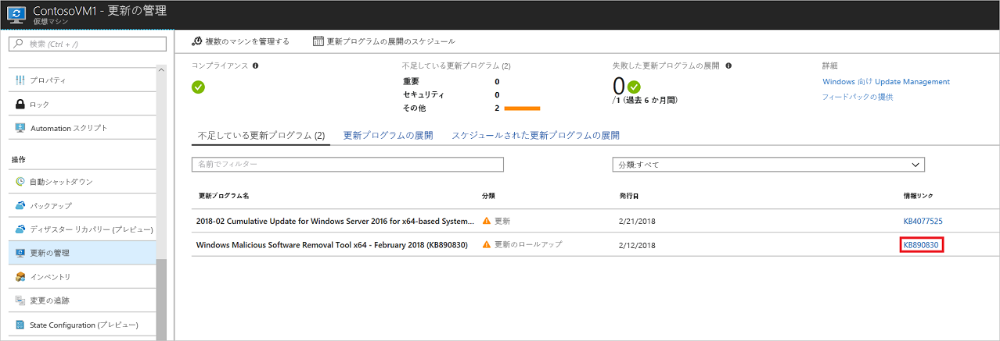
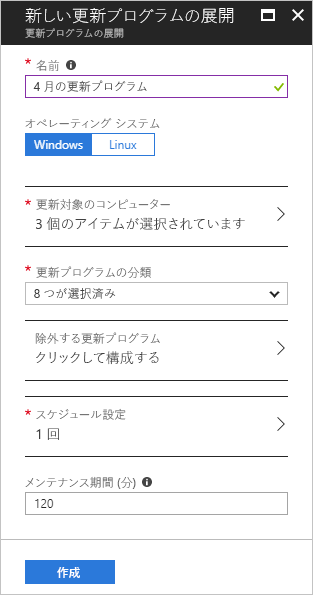
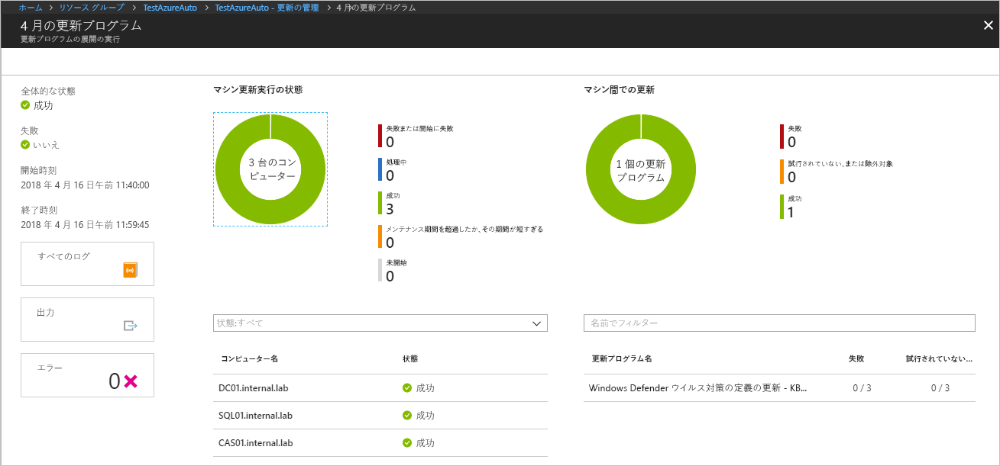

# Azure Automation で Windows 更新プログラムを管理する

更新の管理を使用すると、仮想マシンの更新プログラムとパッチを管理できます。
このチュートリアルでは、利用可能な更新プログラムの状態を迅速に把握し、必要な更新プログラムのインストールをスケジュールし、展開の結果を確認して更新プログラムが正常に適用されたことを検証する方法について説明します。

価格情報については、[Update Management の Automation の価格](https://azure.microsoft.com/pricing/details/automation/)に関するページをご覧ください。

このチュートリアルで学習する内容は次のとおりです。

> [!div class="checklist"]
> * 更新管理のために VM をオンボードする
> * 更新の評価を表示する
> * 更新プログラムのデプロイをスケジュールする
> * デプロイの結果を表示する

## 前提条件

このチュートリアルを完了するには、次のものが必要です。

* Azure サブスクリプション。 まだお持ちでない場合は、[MSDN サブスクライバーの特典を有効にする](https://azure.microsoft.com/pricing/member-offers/msdn-benefits-details/)か、[無料アカウント](https://azure.microsoft.com/free/?WT.mc_id=A261C142F)にサインアップしてください。
* 監視およびアクションの Runbook と監視タスクを保持する、[Automation アカウント](automation-offering-get-started.md)。
* オンボードする[仮想マシン](../virtual-machines/windows/quick-create-portal.md)。

## Azure にログインする

Azure Portal (http://portal.azure.com) にログインします。

## Update Management の有効化

まず、このチュートリアル用に VM の更新の管理を有効にする必要があります。 VM の別の Automation ソリューションで有効にした場合、この手順は不要です。

1. 左側のメニューで **[仮想マシン]** を選択し､一覧から VM を選択します。
2. 左側のメニューの **[操作]** セクションで、**[更新の管理]** をクリックします。 **[更新管理の有効化]** ページが開きます。

この VM で Update Management が有効になっているかを確認する検証が行われます。
この検証では、Log Analytics ワークスペースの確認、リンクされた Automation アカウントの確認、ソリューションがワークスペースにあるかどうかの確認が行われます。

[Log Analytics](../log-analytics/log-analytics-overview.md?toc=%2fazure%2fautomation%2ftoc.json) ワークスペースは、Update Management のような機能およびサービスによって生成されるデータを収集するために使用されます。
ワークスペースには、複数のソースからのデータを確認および分析する場所が 1 つ用意されています。
更新を必要とする VM で追加のアクションを実行する場合、Azure Automation を使用すると、VM に対して Runbook を実行して、更新プログラムをダウンロードして適用するなどの操作を行うことができます。

また、検証プロセスでは、VM が Microsoft Monitoring Agent (MMA) と Automation ハイブリッド Runbook worker でプロビジョニングされているかどうかが確認されます。
このエージェントは VM との通信に使用され、更新ステータスに関する情報を取得します。

Log Analytics ワークスペースおよび Automation アカウントを選択し、**[有効化]** をクリックして、ソリューションを有効にします。 ソリューションを有効にするには最大 15 分かかります。

オンボード中に次の前提条件のいずれかを満たしていないことがわかった場合は、自動的に追加されます。

* [Log Analytics](../log-analytics/log-analytics-overview.md?toc=%2fazure%2fautomation%2ftoc.json) ワークスペース
* [Automation](./automation-offering-get-started.md)
* [Hybrid Runbook Worker](./automation-hybrid-runbook-worker.md) が VM で有効になっている

**[更新の管理]** 画面が開きます。 使用する場所、Log Analytics ワークスペース、Automation アカウントを構成し、**[有効にする]** をクリックします。 フィールドが淡色表示されている場合は、その VM で別の Automation ソリューションが有効になっているため、同じワークスペースと Automation アカウントを使用する必要があることを示します。

![[更新管理の有効化] ソリューション ウィンドウ](./media/automation-tutorial-update-management/manageupdates-update-enable.png)

ソリューションを有効にするには最大 15 分かかります。 この処理中はブラウザーのウィンドウは閉じないでください。
ソリューションが有効になると、VM 上の不足している更新プログラムの情報が Log Analytics に送られます。
データの分析に使用できるようになるまでに、30 分から 6 時間かかる場合があります。

## 更新の評価を確認する

**更新管理**が有効になると、**[更新管理]** 画面が表示されます。
不足している更新プログラムがある場合は、**[不足している更新プログラム]** タブに、デプロイされていない更新プログラムの一覧が表示されます。

更新プログラムの **[情報リンク]** を選択すると、新しいウィンドウに更新プログラムのサポート記事が表示されます。 この記事で、更新プログラムに関する重要情報を確認できます。

更新プログラムの別の場所をクリックすると、選択した更新プログラムの **[ログ検索]** ウィンドウが表示されます。 その更新プログラムについて、ログ検索のクエリが事前に定義されています。 このクエリを変更するか、独自のクエリを作成して、環境に展開されている更新プログラムまたは不足している更新プログラムに関する詳細情報を確認します。

## 更新プログラムのデプロイをスケジュールする

VM に不足している更新プログラムがあることがわかりました。 更新プログラムをインストールするには、リリース スケジュールとサービス期間に従ってデプロイをスケジュールします。
デプロイに含める更新の種類を選択できます。
たとえば、緊急更新プログラムやセキュリティ更新プログラムを追加し、更新プログラムのロールアップを除外できます。

> [!WARNING]
> 更新に再起動が必要な場合、VM は自動的に再起動されます。

**[更新の管理]** 画面に戻り、画面の上部にある **[更新プログラムの展開のスケジュール]** を選択して、VM の新しい更新プログラムの展開スケジュールを設定します。

**[新しい更新プログラムの展開]** 画面で、次の情報を指定します。

* **[名前]** - 更新プログラムの展開に一意の名前を入力します。
* **更新プログラムの分類** - 更新プログラムのデプロイによってデプロイに追加されたソフトウェアの種類を選択します。 このチュートリアルでは、すべての種類を選択したままにします。

  分類の種類は次のとおりです。

  * 緊急更新プログラム
  * セキュリティ更新プログラム
  * 更新プログラムのロールアップ
  * Feature Pack
  * Service Pack
  * 定義の更新
  * ツール
  * 更新プログラム

* **[スケジュール設定]** - 5 分後の時刻に構成します。 現在の時刻から 30 分後という既定値のままにすることもできます。
デプロイを 1 回行うか、定期的なスケジュールを設定するかを指定することもできます。
**[繰り返し]** の **[定期的]** を選択します。 既定値の 1 日のままで **[OK]** をクリックします。 これで定期的なスケジュールが設定されます。

* **[メンテナンス期間 (分)]** - この値は既定値のままにします。 更新プログラムを展開する期間を指定できます。 この設定により、定義したサービス期間内は変更が確実に実行されます。

スケジュールの構成が完了したら、**[作成]** ボタンをクリックします。 状態ダッシュボードに戻ります。 **[スケジュールされた更新プログラムの展開]** を選択して、作成した展開スケジュールを表示します。

## 更新プログラムのデプロイの結果を表示する

スケジュールされた展開の開始後、**[更新管理]** 画面の **[更新プログラムの展開]** タブに、展開の状態が表示されます。
実行中の場合、状態は **[処理中]** と表示されます。
正常に完了すると、状態は **[成功]** に変わります。
展開時に 1 つ以上の更新プログラムでエラーが発生した場合、状態は **[部分的に失敗]** になります。
完了した更新プログラムのデプロイをクリックすると、その更新プログラムのデプロイ用のダッシュボードが表示されます。

**[更新プログラムを実行した結果]** タイルの概要には、VM 上の更新プログラムの合計数と展開結果が表示されます。
右側の表には、各更新プログラムとインストールの結果の詳細が示されます。
使用できる値の一覧を次に示します。

* **試行されていません**: メンテナンス期間として定義した時間が十分ではなかったため、更新プログラムがインストールされませんでした。
* **成功**: 更新できました。
* **失敗**: 更新できませんでした。

**[すべてのログ]** をクリックし、デプロイで作成されたすべてのログ エントリを確認します。

**[出力]** タイルをクリックし、ターゲット VM での更新プログラムのデプロイを管理する runbook のジョブ ストリームを確認します。

デプロイで発生したエラーの詳細情報を確認するには、**[エラー]** をクリックします。

## 次の手順

このチュートリアルで学習した内容は次のとおりです。

> [!div class="checklist"]
> * 更新管理のために VM をオンボードする
> * 更新の評価を表示する
> * 更新プログラムのデプロイをスケジュールする
> * デプロイの結果を表示する

更新の管理ソリューションの概要に進みます。

> [!div class="nextstepaction"]
> [更新の管理ソリューション](../operations-management-suite/oms-solution-update-management.md?toc=%2fazure%2fautomation%2ftoc.json)
