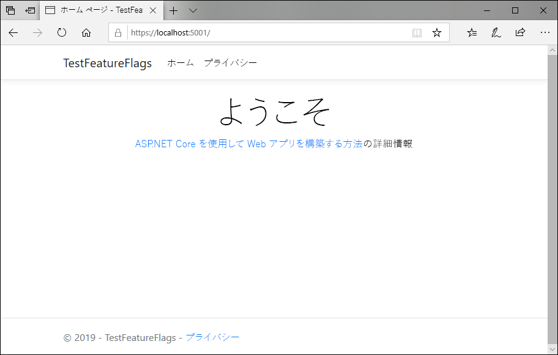

# <a name="quickstart-add-feature-flags-to-an-aspnet-core-app"></a>クイック スタート:ASP.NET Core アプリに機能フラグを追加する

アプリケーションを Azure App Configuration に接続することで、ASP.NET Core の機能管理を有効にできます。 この管理されたサービスを使用して、すべての機能フラグを格納し、その状態を一元的に制御できます。 このクイック スタートでは、このサービスを ASP.NET Core Web アプリに組み込み、機能管理のエンド ツー エンド実装を作成します。

.NET Core 機能管理ライブラリは、包括的な機能フラグのサポートにより、フレームワークを拡張します。 これらのライブラリは、.NET Core 構成システム上に構築されます。 また、.NET Core 構成プロバイダーを介して、App Configuration とシームレスに統合されます。

このクイック スタートの手順は、任意のコード エディターを使用して実行できます。 推奨のエディターは [Visual Studio Code](https://code.visualstudio.com/) です (Windows、macOS、および Linux プラットフォームで使用できます)。

## <a name="prerequisites"></a>前提条件

このクイック スタートを実行するには、[.NET Core SDK](https://dotnet.microsoft.com/download) をインストールします。

[!INCLUDE [quickstarts-free-trial-note](../../includes/quickstarts-free-trial-note.md)]

## <a name="create-an-app-configuration-store"></a>アプリ構成ストアを作成する

[!INCLUDE [azure-app-configuration-create](../../includes/azure-app-configuration-create.md)]

6. **[Feature Manager]\(機能マネージャー\)** > **[+ Create]\(+ 作成\)** を選択し、次の機能フラグを追加します。

    | キー | 状態 |
    |---|---|
    | Beta | オフ |

## <a name="create-an-aspnet-core-web-app"></a>ASP.NET Core Web アプリケーションの作成

[.NET Core コマンド ライン インターフェイス (CLI)](https://docs.microsoft.com/dotnet/core/tools/) を使用して、新しい ASP.NET Core MVC Web アプリ プロジェクトを作成します。 Visual Studio ではなく .NET Core CLI を使用する利点は、Windows、macOS、および Linux プラットフォームで使用できることです。

1. プロジェクト用の新規フォルダーを作成します。 このクイック スタートでは、*TestFeatureFlags* という名前を付けます。

2. 新しいフォルダーで次のコマンドを実行して、新しい ASP.NET Core MVC Web アプリ プロジェクトを作成します。

        dotnet new mvc

## <a name="add-secret-manager"></a>シークレット マネージャーを追加する

プロジェクトに[シークレット マネージャー ツール](https://docs.microsoft.com/aspnet/core/security/app-secrets)を追加します。 シークレット マネージャー ツールは、開発作業の機密データをプロジェクト ツリーの外部に格納します。 これにより、ソース コード内のアプリ シークレットが偶発的に共有されるのを防止できます。

- *.csproj* ファイルを開きます。 次に示すように、`UserSecretsId` 要素を追加し、その値を自分の値 (通常は GUID) に置き換えます。 ファイルを保存します。

    ```xml
    <Project Sdk="Microsoft.NET.Sdk.Web">

    <PropertyGroup>
        <TargetFramework>netcoreapp2.1</TargetFramework>
        <UserSecretsId>79a3edd0-2092-40a2-a04d-dcb46d5ca9ed</UserSecretsId>
    </PropertyGroup>

    <ItemGroup>
        <PackageReference Include="Microsoft.AspNetCore.App" />
        <PackageReference Include="Microsoft.AspNetCore.Razor.Design" Version="2.1.2" PrivateAssets="All" />
    </ItemGroup>

    </Project>
    ```

## <a name="connect-to-an-app-configuration-store"></a>アプリ構成ストアに接続する

1. 次のコマンドを実行して、`Microsoft.Extensions.Configuration.AzureAppConfiguration` パッケージと `Microsoft.FeatureManagement` NuGet パッケージへの参照を追加します。

        dotnet add package Microsoft.Extensions.Configuration.AzureAppConfiguration --version 1.0.0-preview-008520001

        dotnet add package Microsoft.FeatureManagement.AspNetCore --version 1.0.0-preview-008560001-910

2. 次のコマンドを実行して、プロジェクトのパッケージを復元します。

        dotnet restore

3. シークレット マネージャーに、*ConnectionStrings:AppConfig* という名前のシークレットを追加します。

    このシークレットには、アプリ構成ストアにアクセスするための接続文字列が格納されます。 次のコマンドの値を、自分のアプリ構成ストアの接続文字列に置き換えます。

    このコマンドは、*.csproj* ファイルと同じディレクトリで実行する必要があります。

        dotnet user-secrets set ConnectionStrings:AppConfig <your_connection_string>

    シークレット マネージャーは、Web アプリをローカルにテストするためだけに使用されます。 たとえば [Azure App Service](https://azure.microsoft.com/services/app-service/web) にアプリをデプロイするときは、シークレット マネージャーで接続文字列を格納する代わりに、App Service でアプリケーションの設定の**接続文字列**を使用します。

    このシークレットには、構成 API を使用してアクセスします。 サポートされているすべてのプラットフォームで、構成 API を使用する際の構成名にコロン (:) を使用できます。 [環境別の構成](https://docs.microsoft.com/aspnet/core/fundamentals/configuration/index?tabs=basicconfiguration&view=aspnetcore-2.0)に関するページを参照してください。

4. *Program.cs* を開き、.NET Core App Configuration プロバイダーへの参照を追加します。

    ```csharp
    using Microsoft.Extensions.Configuration.AzureAppConfiguration;
    ```

5. `config.AddAzureAppConfiguration()` メソッドを呼び出して App Configuration を使用するように、`CreateWebHostBuilder` メソッドを更新します。

    ```csharp
    public static IWebHostBuilder CreateWebHostBuilder(string[] args) =>
        WebHost.CreateDefaultBuilder(args)
            .ConfigureAppConfiguration((hostingContext, config) =>
            {
                var settings = config.Build();
                config.AddAzureAppConfiguration(options => {
                    options.Connect(settings["ConnectionStrings:AppConfig"])
                           .UseFeatureFlags();
                });
            })
            .UseStartup<Startup>();
    ```

6. *Startup.cs*を開き、.NET Core 機能マネージャーへの参照を追加します。

    ```csharp
    using Microsoft.FeatureManagement.AspNetCore;
    ```

7. `services.AddFeatureManagement()` メソッドを呼び出し、必要に応じて `services.AddFeatureFilter<FilterType>()` を呼び出して機能フラグで使用するフィルターを含めることで、`ConfigureServices` メソッドを更新して機能フラグのサポートを追加します。

    ```csharp
    public void ConfigureServices(IServiceCollection services)
    {
        services.AddFeatureManagement();
    }
    ```

8. *MyFeatureFlags.cs* ファイルを追加します。

    ```csharp
    namespace TestFeatureFlags
    {
        public enum MyFeatureFlags
        {
            Beta
        }
    }
    ```

9. Controllers ディレクトリに *BetaController.cs* を追加します。

    ```csharp
    using Microsoft.AspNetCore.Mvc;
    using Microsoft.FeatureManagement.AspNetCore;

    namespace TestFeatureFlags.Controllers
    {
        public class BetaController: Controller
        {
            private readonly IFeatureManager _featureManager;

            public BetaController(IFeatureManagerSnapshot featureManager)
            {
                _featureManager = featureManager;
            }

            [Feature(MyFeatureFlags.Beta)]
            public IActionResult Index()
            {
                return View();
            }
        }
    }
    ```

10. Views ディレクトリで *_ViewImports.cshtml* を開き、機能マネージャーのタグ ヘルパーを追加します。

    ```html
    @addTagHelper *, Microsoft.FeatureManagement.AspNetCore
    ```

11. Views の Shared ディレクトリにある *_Layout.cshtml* を開いて、`<body>` > `<header>` の下の `<nav>` バーの内容を次のコードに置き換えます。

    ```html
    <nav class="navbar navbar-expand-sm navbar-toggleable-sm navbar-light bg-white border-bottom box-shadow mb-3">
        <div class="container">
            <a class="navbar-brand" asp-area="" asp-controller="Home" asp-action="Index">TestFeatureFlags</a>
            <button class="navbar-toggler" type="button" data-toggle="collapse" data-target=".navbar-collapse" aria-controls="navbarSupportedContent"
            aria-expanded="false" aria-label="Toggle navigation">
            <span class="navbar-toggler-icon"></span>
            </button>
            <div class="navbar-collapse collapse d-sm-inline-flex flex-sm-row-reverse">
                <ul class="navbar-nav flex-grow-1">
                    <li class="nav-item">
                        <a class="nav-link text-dark" asp-area="" asp-controller="Home" asp-action="Index">Home</a>
                    </li>
                    <feature name="Beta">
                    <li class="nav-item">
                        <a class="nav-link text-dark" asp-area="" asp-controller="Beta" asp-action="Index">Beta</a>
                    </li>
                    </feature>
                    <li class="nav-item">
                        <a class="nav-link text-dark" asp-area="" asp-controller="Home" asp-action="Privacy">Privacy</a>
                    </li>
                </ul>
            </div>
        </div>
    </nav>
    ```

12. Views の下に Beta ディレクトリを作成し、そこに *Index.cshtml* を追加します。

    ```html
    @{
        ViewData["Title"] = "Beta Home Page";
    }

    <h1>
        This is the beta website.
    </h1>
    ```

## <a name="build-and-run-the-app-locally"></a>アプリをビルドしてローカルで実行する

1. .NET Core CLI を使用してアプリケーションをビルドするには、コマンド シェルで次のコマンドを実行します。

        dotnet build

2. ビルドが正常に完了したら、次のコマンドを実行して、Web アプリをローカルで実行します。

        dotnet run

3. ブラウザー ウィンドウを開いて、`https://localhost:5001` (ローカルでホストされた Web アプリの既定の URL) に移動します。

    

4. [Azure Portal](https://aka.ms/azconfig/portal) にサインインします。 **[すべてのリソース]** を選択し、クイック スタートで作成したアプリ構成ストア インスタンスを選択します。

5. **[Feature Manager]\(機能マネージャー\)** を選択し、*[Beta]\(ベータ\)* の値を *[On]\(オン\)* に変更します。

    | キー | 状態 |
    |---|---|
    | Beta | On |

6. ブラウザー ページを最新の情報に更新して新しい構成設定を確認します。

    

## <a name="clean-up-resources"></a>リソースのクリーンアップ

[!INCLUDE [azure-app-configuration-cleanup](../../includes/azure-app-configuration-cleanup.md)]

## <a name="next-steps"></a>次の手順

このクイック スタートでは、新しいアプリ構成ストアを作成し、[機能管理ライブラリ](https://go.microsoft.com/fwlink/?linkid=2074664)を介して ASP.NET Core Web アプリで機能を管理するために、この構成ストアを使用しました。

* [機能管理](./concept-feature-management.md) の詳細を確認する
* [機能フラグを管理する](./manage-feature-flags.md)
* [.NET Core アプリ内で機能フラグを使用する](./use-feature-flags-dotnet-core.md)
