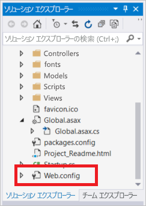
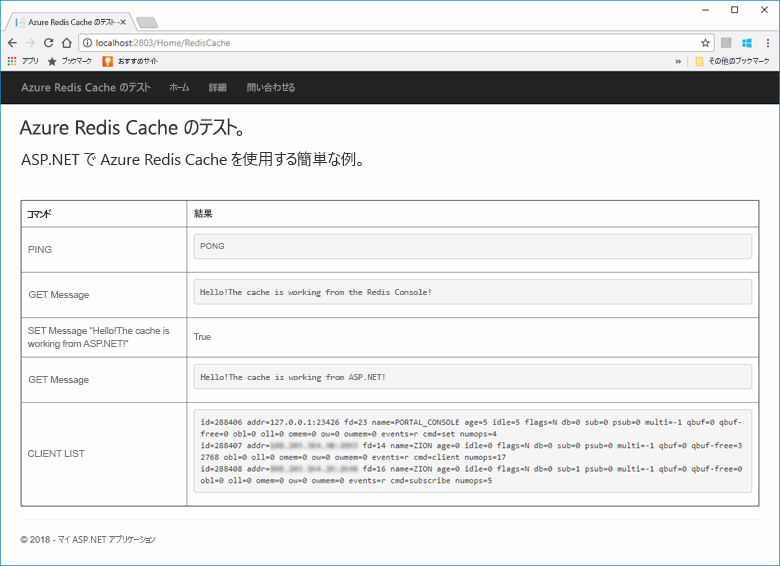
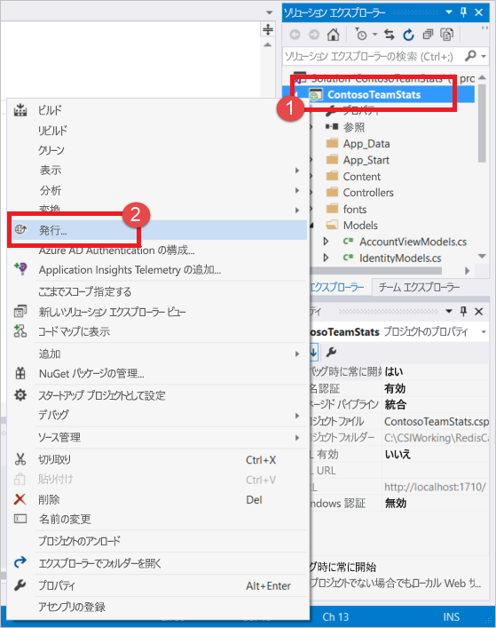
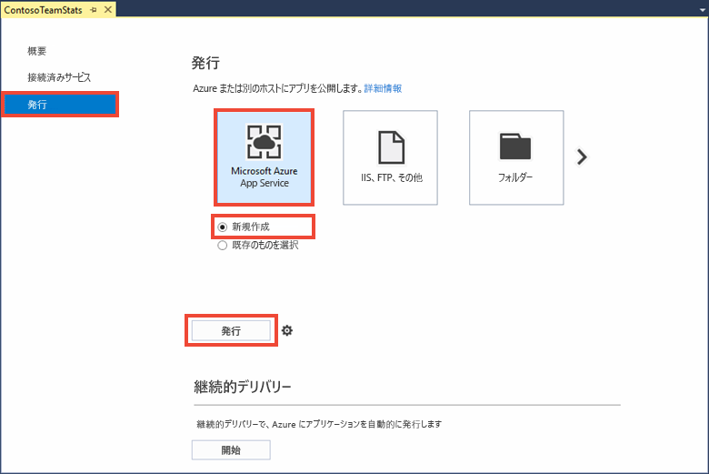
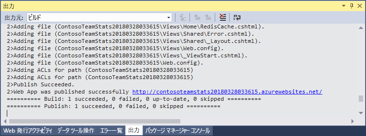
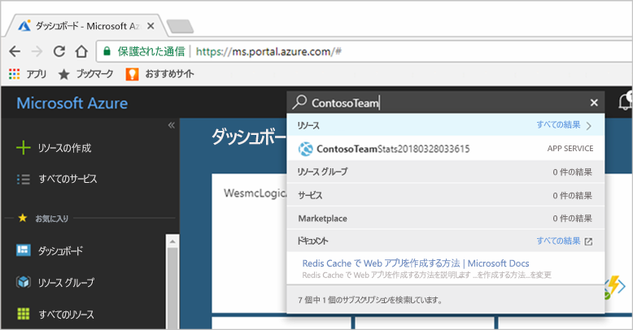
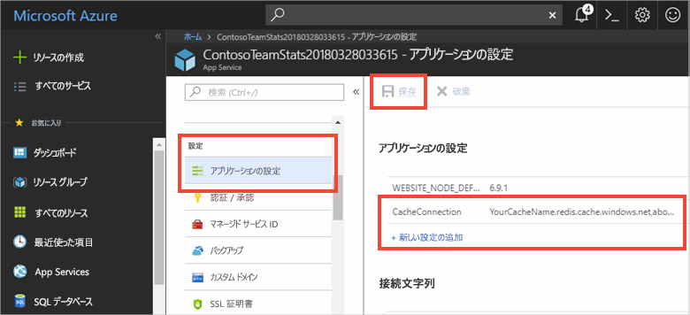

# <a name="quickstart-create-an-aspnet-web-app"></a>クイック スタート: ASP.NET Web アプリを作成する 

## <a name="introduction"></a>はじめに

このクイック スタートでは、Visual Studio 2017 を使用して ASP.NET Web アプリケーションを作成し Azure App Service にデプロイする方法を説明します。 このサンプル アプリケーションは、Azure Cache for Redis に接続して、キャッシュにデータを格納し、キャッシュからデータを取得します。 このクイック スタートを完了すると、Azure Redis Cache との間で読み書きを行う、Azure でホストされる Web アプリが完成します。


[!INCLUDE [quickstarts-free-trial-note](../../includes/quickstarts-free-trial-note.md)]

## <a name="prerequisites"></a>前提条件

このクイック スタートを完了するには、次の環境で [Visual Studio 2017](https://www.visualstudio.com/downloads/) をインストールする必要があります。
* ASP.NET および Web の開発
* Azure の開発

## <a name="create-the-visual-studio-project"></a>Visual Studio プロジェクトの作成

1. Visual Studio を開き、**[ファイル]** >**[新規]** > **[プロジェクト]** の順に選択します。

2. **[新しいプロジェクト]** ダイアログで、次の操作を行います。

    

    a. **[テンプレート]** の一覧で、**[Visual C#]** ノードを展開します。

    b. **[クラウド]** を選択します

    c. **[ASP.NET Web アプリケーション]** を選択します。

    d.[Tableau Server return URL]: Tableau Server ユーザーがアクセスする URL。 **.NET Framework 4.5.2** 以降が選択されていることを確認します。

    e. **[名前]** ボックスで、プロジェクトに名前を付けます。 この例では、**ContosoTeamStats** という名前を使用しました。

    f. **[OK]** を選択します。
   
3. プロジェクトの種類として、 **[MVC]** を選択します。

4. **[認証]** の設定で **[認証なし]** が指定されていることを確認します。 Visual Studio のバージョンによっては、既定の **[認証]** が別の設定になっている場合があります。 これを変更するには、**[認証の変更]**、**[認証なし]** の順に選択します。

5. **[OK]** を選択してプロジェクトを作成します。

## <a name="create-a-cache"></a>キャッシュの作成

次に、アプリ用のキャッシュを作成します。

[!INCLUDE [redis-cache-create](../../includes/redis-cache-create.md)]

[!INCLUDE [redis-cache-access-keys](../../includes/redis-cache-access-keys.md)]

#### <a name="to-edit-the-cachesecretsconfig-file"></a>*CacheSecrets.config* ファイルを編集するには

3. コンピューター上に *CacheSecrets.config* というファイルを作成します。そのファイルをサンプル アプリケーションのソース コードでチェックインされない場所に配置します。 このクイック スタートでは、*CacheSecrets.config* ファイルを *C:\AppSecrets\CacheSecrets.config* に配置します。

4. *CacheSecrets.config* ファイルを編集します。 次の内容を追加します。

    ```xml
    <appSettings>
        <add key="CacheConnection" value="<cache-name>.redis.cache.windows.net,abortConnect=false,ssl=true,password=<access-key>"/>
    </appSettings>
    ```

5. `<cache-name>` は実際のキャッシュ ホスト名に置き換えます。

6. `<access-key>` は、実際のキャッシュのプライマリ キーに置き換えます。

    > [!TIP]
    > セカンダリ アクセス キーは、プライマリ アクセス キーを再生成する間の代替キーとして、キー ローテーションのときに使用できます。
>
7. ファイルを保存します。

## <a name="update-the-mvc-application"></a>MVC アプリケーションを更新する

このセクションでは、Azure Cache for Redis に対する簡単なテストを表示する新しいビューをサポートするようにアプリケーションを更新します。

* [キャッシュ用のアプリ設定で web.config ファイルを更新する](#Update-the-webconfig-file-with-an-app-setting-for-the-cache)
* StackExchange.Redis クライアントを使うようにアプリケーションを構成する
* HomeController と Layout を更新する
* 新しい RedisCache ビューを追加する

### <a name="update-the-webconfig-file-with-an-app-setting-for-the-cache"></a>キャッシュ用のアプリ設定で web.config ファイルを更新する

アプリケーションをローカルで実行すると、*CacheSecrets.config* 内の情報が、Azure Cache for Redis インスタンスへの接続に使われます。 後でこのアプリケーションを Azure にデプロイします。 そのときに、アプリケーションがこのファイルの代わりにキャッシュ接続情報の取得に使用するアプリ設定を Azure 内で構成します。 

*CacheSecrets.config* はアプリケーションと一緒に Azure にデプロイされず、アプリケーションのローカルなテストの間にだけ使われます。 キャッシュ データへの不正アクセスを防ぐため、この情報は可能な限り安全に保持してください。

#### <a name="to-update-the-webconfig-file"></a>*web.config* ファイルを更新するには
1. **ソリューション エクスプローラー**で、*web.config* ファイルをダブルクリックして開きます。

    

2. *web.config* ファイルで `<appSetting>` 要素を見つけます。 次の `file` 属性を追加します。 異なるファイル名または場所を使用した場合は、この例の値を実際の値で置き換えてください。

* 変更前: `<appSettings>`
* 変更後: ` <appSettings file="C:\AppSecrets\CacheSecrets.config">`

`<appSettings>` 要素内のマークアップは、ASP.NET ランタイムによって外部ファイルの内容と結合されます。 指定したファイルが見つからない場合、このファイル属性は無視されます。 このアプリケーションのソース コードにシークレット (キャッシュへの接続文字列) は含まれていません。 Web アプリを Azure にデプロイするときに、*CacheSecrets.config* ファイルはデプロイされません。

### <a name="to-configure-the-application-to-use-stackexchangeredis"></a>StackExchange.Redis を使用するようにアプリケーションを構成するには

1. Visual Studio 用の [StackExchange.Redis](https://github.com/StackExchange/StackExchange.Redis) NuGet パッケージを使うようにアプリを構成するには、**[ツール] > [NuGet パッケージ マネージャー] > [パッケージ マネージャー コンソール]** の順に選択します。

2. [`Package Manager Console`] ウィンドウで、次のコマンドを実行します。

    ```powershell
    Install-Package StackExchange.Redis
    ```

3. クライアント アプリケーションから StackExchange.Azure Cache for Redis クライアントを使用して Azure Cache for Redis にアクセスするために必要なアセンブリ参照が NuGet パッケージによってダウンロードされ追加されます。 `StackExchange.Redis` クライアント ライブラリの厳密な名前を持つバージョンを使用する場合は、`StackExchange.Redis.StrongName` パッケージをインストールします。

### <a name="to-update-the-homecontroller-and-layout"></a>HomeController とレイアウトを更新するには

1. **ソリューション エクスプローラー**で **Controllers** フォルダーを展開し、*HomeController.cs* ファイルを開きます。

2. キャッシュ クライアントとアプリの設定をサポートするために、次の 2 つの `using` ステートメントをファイルの先頭に追加します。

    ```csharp
    using System.Configuration;
    using StackExchange.Redis;
    ```

3. 新しいキャッシュに対していくつかのコマンドを実行する新しい `RedisCache` アクションをサポートするために、次のメソッドを `HomeController` クラスに追加します。

    ```csharp
        public ActionResult RedisCache()
        {
            ViewBag.Message = "A simple example with Azure Cache for Redis on ASP.NET.";

            var lazyConnection = new Lazy<ConnectionMultiplexer>(() =>
            {
                string cacheConnection = ConfigurationManager.AppSettings["CacheConnection"].ToString();
                return ConnectionMultiplexer.Connect(cacheConnection);
            });

            // Connection refers to a property that returns a ConnectionMultiplexer
            // as shown in the previous example.
            IDatabase cache = lazyConnection.Value.GetDatabase();

            // Perform cache operations using the cache object...

            // Simple PING command
            ViewBag.command1 = "PING";
            ViewBag.command1Result = cache.Execute(ViewBag.command1).ToString();

            // Simple get and put of integral data types into the cache
            ViewBag.command2 = "GET Message";
            ViewBag.command2Result = cache.StringGet("Message").ToString();

            ViewBag.command3 = "SET Message \"Hello! The cache is working from ASP.NET!\"";
            ViewBag.command3Result = cache.StringSet("Message", "Hello! The cache is working from ASP.NET!").ToString();

            // Demonstrate "SET Message" executed as expected...
            ViewBag.command4 = "GET Message";
            ViewBag.command4Result = cache.StringGet("Message").ToString();

            // Get the client list, useful to see if connection list is growing...
            ViewBag.command5 = "CLIENT LIST";
            ViewBag.command5Result = cache.Execute("CLIENT", "LIST").ToString().Replace(" id=", "\rid=");

            lazyConnection.Value.Dispose();

            return View();
        }
    ```

4. **ソリューション エクスプローラー**で、**[ビュー]** > **[共有]** フォルダーを順に展開します。 次に *_Layout.cshtml ファイル*を開きます。

    置換前のコード:
    
    ```csharp
    @Html.ActionLink("Application name", "Index", "Home", new { area = "" }, new { @class = "navbar-brand" })
    ```

    を以下に置き換えます。

    ```csharp
    @Html.ActionLink("Azure Cache for Redis Test", "RedisCache", "Home", new { area = "" }, new { @class = "navbar-brand" })
    ```

### <a name="to-add-a-new-rediscache-view"></a>新しい RedisCache ビューを追加するには

1. **ソリューション エクスプローラー**で、**[Views]** フォルダーを展開し、**[Home]** フォルダーを右クリックします。 **[追加]** > **[ビュー...]** を選択します。

2. **[ビューの追加]** ダイアログで、ビューの名前に「**RedisCache**」と入力します。 その後、**[追加]** を選択します。

3. *RedisCache.cshtml* ファイルのコードを次のコードに置き換えます。

    ```csharp
    @{
        ViewBag.Title = "Azure Cache for Redis Test";
    }

    <h2>@ViewBag.Title.</h2>
    <h3>@ViewBag.Message</h3>
    <br /><br />
    <table border="1" cellpadding="10">
        <tr>
            <th>Command</th>
            <th>Result</th>
        </tr>
        <tr>
            <td>@ViewBag.command1</td>
            <td><pre>@ViewBag.command1Result</pre></td>
        </tr>
        <tr>
            <td>@ViewBag.command2</td>
            <td><pre>@ViewBag.command2Result</pre></td>
        </tr>
        <tr>
            <td>@ViewBag.command3</td>
            <td><pre>@ViewBag.command3Result</pre></td>
        </tr>
        <tr>
            <td>@ViewBag.command4</td>
            <td><pre>@ViewBag.command4Result</pre></td>
        </tr>
        <tr>
            <td>@ViewBag.command5</td>
            <td><pre>@ViewBag.command5Result</pre></td>
        </tr>
    </table>
    ```

## <a name="run-the-app-locally"></a>アプリをローカルで実行する

既定では、プロジェクトはテストとデバッグのためにアプリを [IIS Express](https://docs.microsoft.com/iis/extensions/introduction-to-iis-express/iis-express-overview) にローカルにホストするように構成されます。

### <a name="to-run-the-app-locally"></a>アプリをローカルで実行するには
1. Visual Studio で **[デバッグ]** > **[デバッグの開始]** の順に選択してアプリをビルドし、テストとデバッグのためにアプリをローカルで起動します。

2. ブラウザーで、ナビゲーション バーの **[Azure Cache for Redis Test]** を選択します。

3. 次の例では、以前に `Message` キーにキャッシュされた値がありました。この値は、ポータルの Azure Cache for Redis コンソールを使用して設定されています。 アプリは、そのキャッシュ値を更新しました。 また、アプリは `PING` および `CLIENT LIST` コマンドも実行しました。

    

## <a name="publish-and-run-in-azure"></a>Azure に発行して実行する

アプリのローカル テストが正常に終了したら、アプリを Azure にデプロイして、クラウドで実行します。

### <a name="to-publish-the-app-to-azure"></a>アプリを Azure に発行するには

1. Visual Studio で、ソリューション エクスプローラーのプロジェクト ノードを右クリックします。 **[発行]** を選択します。

    

2. **[Microsoft Azure App Service]**、**[新規作成]**、**[発行]** の順に選択します。

    

3. **[App Service の作成]** ダイアログ ボックスで、次のように変更します。

    | Setting | 推奨値 | 説明 |
    | ------- | :---------------: | ----------- |
    | **アプリ名** | 既定値を使用します。 | アプリ名は、Azure へのデプロイ時にアプリのホスト名になります。 必要に応じて、名前を一意にするためにタイムスタンプのサフィックスが追加される場合があります。 |
    | **サブスクリプション** | Azure サブスクリプションを選択します。 | 関連するホスティング料金は、このサブスクリプションに請求されます。 複数の Azure サブスクリプションがある場合は、適切なサブスクリプションを選択したことを確認します。|
    | **リソース グループ** | キャッシュを作成したものと同じリソース グループを使います (*TestResourceGroup* など)。 | リソース グループは、すべてのリソースをグループとして管理するときに便利です。 後でアプリを削除する必要があるときは、グループを削除するだけで済みます。 |
    | **[App Service プラン]** | **[新規]** を選択し、*TestingPlan* という名前で新しい App Service プランを作成します。 <br />キャッシュを作成するときに使ったものと同じ **[場所]** を使います。 <br />サイズでは **[Free]** を選びます。 | App Service プランでは、Web アプリを実行するための一連のコンピューティング リソースを定義します。 |

    ![[App Service] ダイアログ ボックス](./media/cache-web-app-howto/cache-create-app-service-dialog.png)

4. App Service のホスティング設定を構成したら、**[作成]** を選択します。

5. Visual Studio の **[出力]** ウィンドウを監視して、発行の状態を確認します。 アプリが発行されると、アプリの URL がログに記録されます。

    

### <a name="add-the-app-setting-for-the-cache"></a>キャッシュ用のアプリの設定を追加する

新しいアプリが発行されたら、新しいアプリの設定を追加します。 この設定は、キャッシュの接続情報を格納するために使われます。 

#### <a name="to-add-the-app-setting"></a>アプリの設定を追加するには 

1. Azure portal の上部にある検索バーにアプリ名を入力し、作成した新しいアプリを検索します。

    

2. キャッシュへの接続に使用する **CacheConnection** という名前の新しいアプリ設定をアプリに追加します。 *CacheSecrets.config* ファイルで `CacheConnection` 用に構成したものと同じ値を使います。 値には、キャッシュのホスト名とアクセス キーが含まれます。

    

### <a name="run-the-app-in-azure"></a>Azure でのアプリの実行

ブラウザーで、アプリの URL にアクセスします。 URL は、Visual Studio 出力ウィンドウの発行操作の結果に表示されます。 Azure portal の作成したアプリの [概要] ページにも表示されます。

ナビゲーション バーの **[Azure Cache for Redis Test]** を選択して、キャッシュへのアクセスをテストします。


## <a name="clean-up-resources"></a>リソースのクリーンアップ

次のチュートリアルに進む場合は、このクイック スタートで作成したリソースを維持して、再利用することができます。

クイック スタートのサンプル アプリケーションの使用を終える場合は、課金を避けるために、このクイック スタートで作成した Azure リソースを削除することができます。 

> [!IMPORTANT]
> リソース グループを削除すると、元に戻すことができません。 リソース グループを削除すると、そのリソース グループ内のすべてのリソースは完全に削除されます。 間違ったリソース グループやリソースをうっかり削除しないようにしてください。 このサンプルのホストとなるリソースを、保持するリソースが含まれている既存のリソース グループ内に作成した場合は、リソース グループを削除するのではなく、個々のブレードから各リソースを個別に削除することができます。

### <a name="to-delete-a-resource-group"></a>リソース グループを削除するには

1. [Azure portal](https://portal.azure.com) にサインインし、 **[リソース グループ]** を選択します。

2. **[名前でフィルター]** ボックスにリソース グループの名前を入力します。 この記事の手順では、*TestResources* という名前のリソース グループを使用しました。 リソース グループの結果一覧で、**[...]** を選択し、**[リソース グループの削除]** を選択します。

    

リソース グループの削除の確認を求めるメッセージが表示されます。 確認のためにリソース グループの名前を入力し、**[削除]** を選択します。

しばらくすると、リソース グループとそのリソースのすべてが削除されます。

## <a name="next-steps"></a>次の手順

次のチュートリアルでは、より現実的なシナリオで Azure Cache for Redis を使って、アプリのパフォーマンスを向上させます。 このアプリケーションを更新し、ASP.NET とデータベースでキャッシュ アサイド パターンを使ってスコアボードの結果をキャッシュします。

> [!div class="nextstepaction"]
> [ASP.NET でキャッシュ アサイド スコアボードを作成する](cache-web-app-cache-aside-leaderboard.md)
