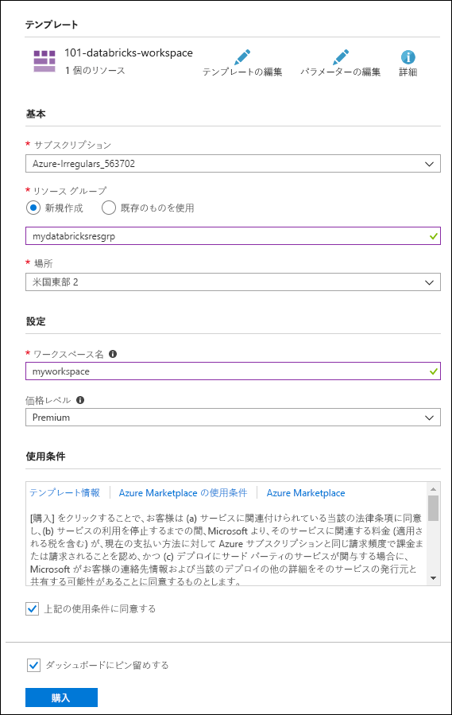
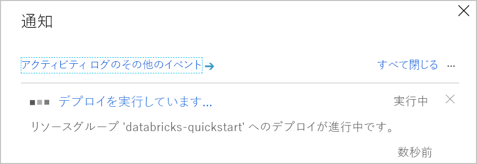
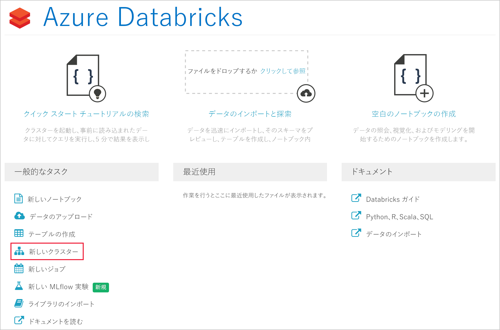
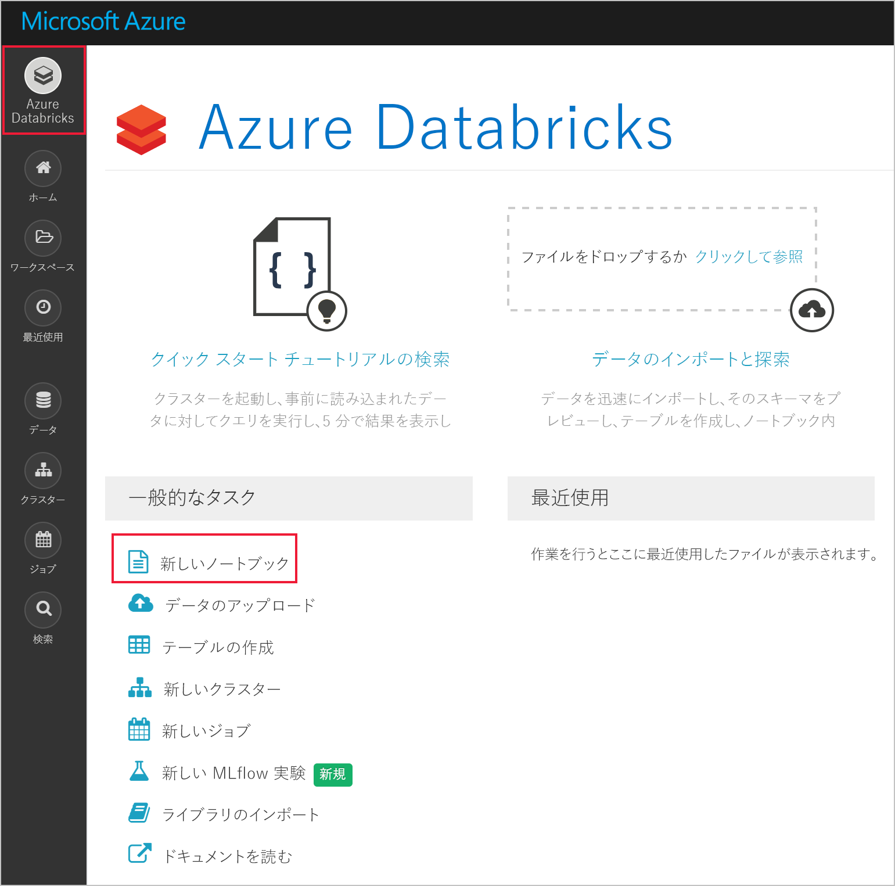
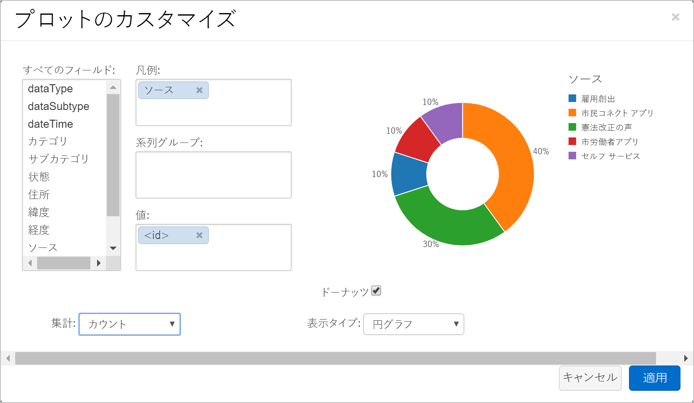
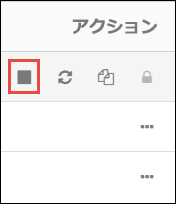

# <a name="quickstart-run-a-spark-job-on-azure-databricks-using-the-azure-resource-manager-template"></a>クイック スタート: Azure Resource Manager テンプレートを使用して Azure Databricks で Spark ジョブを実行する

このクイック スタートでは、Azure Resource Manager テンプレートを使用して Azure Databricks ワークスペースを作成する方法について説明します。 そのワークスペースを使用して Apache Spark クラスターを作成し、Databricks クラスター上で Spark ジョブを実行します。 Azure Databricks の詳細については、「[Azure Databricks とは](what-is-azure-databricks.md)」を参照してください。

このクイック スタートでは、Spark ジョブの一環として、ラジオ チャンネルのサブスクリプション データを分析し、人口統計学的属性に基づく無料/有料使用についての分析情報を取得します。

Azure サブスクリプションをお持ちでない場合は、開始する前に[無料アカウントを作成](https://azure.microsoft.com/free/)してください。

## <a name="create-an-azure-databricks-workspace"></a>Azure Databricks ワークスペースを作成する

このセクションでは、Azure Resource Manager テンプレートを使って Azure Databricks ワークスペースを作成します。 

1. 次の画像をクリックして Azure ポータルでテンプレートを開きます。         

    <a href="https://portal.azure.com/#create/Microsoft.Template/uri/https%3A%2F%2Fraw.githubusercontent.com%2FAzure%2Fazure-quickstart-templates%2Fmaster%2F101-databricks-workspace%2Fazuredeploy.json" target="_blank"></a>

2. Azure Databricks ワークスペースを作成するために必要な値を入力します。 

    

    次の値を指定します。 
     
    |プロパティ  |[説明]  |
    |---------|---------|
    |**サブスクリプション**     | ドロップダウンから Azure サブスクリプションを選択します。        |
    |**[リソース グループ]**     | 新しいリソース グループを作成するか、既存のリソース グループを使用するかを指定します。 リソース グループは、Azure ソリューションの関連するリソースを保持するコンテナーです。 詳しくは、[Azure リソース グループの概要](../azure-resource-manager/resource-group-overview.md)に関するページをご覧ください。 |
    |**場所**     | **[米国東部 2]** を選択します。 使用可能な他のリージョンについては、「[リージョン別の利用可能な製品](https://azure.microsoft.com/regions/services/)」をご覧ください。        |
    |**[ワークスペース名]**     | Databricks ワークスペースの名前を指定します        |
    |**価格レベル**     |  **Standard** と **Premium** のいずれかを選択します。 これらのレベルの詳細については、[Databricks の価格に関するページ](https://azure.microsoft.com/pricing/details/databricks/)を参照してください。       |

3. **[上記の使用条件に同意する]**、**[ダッシュボードにピン留めする]** の順に選択し、**[購入]** をクリックします。

4. ワークスペースの作成には数分かかります。 ワークスペース作成時に、ポータルの右側に **[Submitting deployment for Azure Databricks]\(Azure Databricks のデプロイを送信しています\)** タイルが表示されます。 このタイルを表示するために、ダッシュボードを右へスクロールしなければならない場合があります。 スクリーンの上部に進行状況バーも表示されます。 いずれかの領域で進行状況を確認できます。

    

## <a name="create-a-spark-cluster-in-databricks"></a>Databricks に Spark クラスターを作成する

1. Azure Portal で、作成した Databricks ワークスペースに移動して、**[Launch Workspace]\(ワークスペースの起動\)** をクリックします。

2. Azure Databricks ポータルにリダイレクトされます。 ポータルで **[クラスター]** をクリックします。

    

3. **[New cluster]\(新しいクラスター\)** ページで、クラスターを作成するための値を指定します。

    

    以下を除くすべての値は、既定値のままにします。

    * クラスターの名前を入力します。
    * この記事では、**4.0** ランタイムを使用してクラスターを作成します。 
    * **[Terminate after ____ minutes of inactivity]\(アクティビティが ____ 分ない場合は終了する\)** チェック ボックスをオンにします。 クラスターが使われていない場合にクラスターを終了するまでの時間 (分単位) を指定します。
    
    **[クラスターの作成]** を選択します。 クラスターが実行されたら、ノートブックをクラスターにアタッチして、Spark ジョブを実行できます。 

クラスターの作成について詳しくは、[Azure Databricks での Spark クラスターの作成に関するページ](https://docs.azuredatabricks.net/user-guide/clusters/create.html)をご覧ください。

## <a name="run-a-spark-sql-job"></a>Spark SQL ジョブを実行する

このセクションで始める前に、次の前提条件を満たす必要があります。

* [Azure Blob Storage アカウントを作成](../storage/common/storage-create-storage-account.md#create-a-storage-account)します。 
* [GitHub から](https://github.com/Azure/usql/blob/master/Examples/Samples/Data/json/radiowebsite/small_radio_json.json)サンプルの JSON ファイルをダウンロードします。 
* サンプルの JSON ファイルを、作成した Azure Blob Storage アカウントにアップロードします。 [Microsoft Azure Storage Explorer](../vs-azure-tools-storage-manage-with-storage-explorer.md) を使って、ファイルをアップロードできます。

次のタスクで、Databricks にノートブックを作成し、Azure BLOB ストレージ アカウントからデータを読み取るようにノートブックを構成して、データに対して Spark SQL ジョブを実行します。

1. 左側のウィンドウで、**[ワークスペース]** をクリックします。 **[ワークスペース]** ドロップダウンの **[作成]** をクリックして、**[ノートブック]** をクリックします。

    

2. **[Create Notebook]\(ノートブックの作成\)** ダイアログ ボックスで、名前を入力し、言語として **[Scala]** を選んで、前に作成した Spark クラスターを選びます。

    

    **Create** をクリックしてください。

3. この手順では、Azure Storage アカウントを Databricks Spark クラスターに関連付けます。 この関連付けを実行する方法は 2 つあります。 Azure Storage アカウントを Databricks Filesystem (DBFS) にマウントする方法と、作成したアプリケーションから Azure Storage アカウントに直接アクセスする方法です。  

    > [!IMPORTANT]
    >この記事では、**DBFS のストレージにマウントする方法**を使用します。 この方法では、マウントされたストレージがクラスター ファイル システム自体に確実に関連付けられます。 そのため、クラスターにアクセスするすべてのアプリケーションが、関連付けられているストレージも使用できます。 直接アクセスする方法は、アクセスの構成を行うアプリケーションに限定されます。
    >
    > マウントする方法を使用するには、Databricks ランタイム バージョン **4.0** で Spark クラスターを作成する必要があります。これは、この記事で選択したバージョンです。

    次のスニペットで、`{YOUR CONTAINER NAME}`、`{YOUR STORAGE ACCOUNT NAME}`、および `{YOUR STORAGE ACCOUNT ACCESS KEY}` を Azure Storage アカウントの適切な値に置き換えてください。 スニペットをノートブックの空のセルに貼り付け、Shift + Enter キーを押してコードのセルを実行します。

    * **DBFS を使用してストレージ アカウントにマウントする (推奨)**。 このスニペットでは、Azure Storage アカウントのパスが `/mnt/mypath` にマウントされています。 そのため、今後 Azure Storage アカウントにアクセスする場合は、完全なパスを指定する必要はありません。 単に `/mnt/mypath` を使用することができます。

          dbutils.fs.mount(
            source = "wasbs://{YOUR CONTAINER NAME}@{YOUR STORAGE ACCOUNT NAME}.blob.core.windows.net/",
            mountPoint = "/mnt/mypath",
            extraConfigs = Map("fs.azure.account.key.{YOUR STORAGE ACCOUNT NAME}.blob.core.windows.net" -> "{YOUR STORAGE ACCOUNT ACCESS KEY}"))

    * **ストレージ アカウントに直接アクセスする**

          spark.conf.set("fs.azure.account.key.{YOUR STORAGE ACCOUNT NAME}.blob.core.windows.net", "{YOUR STORAGE ACCOUNT ACCESS KEY}")

    ストレージ アカウント キーを取得する方法については、「[ストレージ アクセス キーの管理](../storage/common/storage-create-storage-account.md#manage-your-storage-account)」を参照してください。

    > [!NOTE]
    > Azure Databricks 上の Spark クラスターで Azure Data Lake Store を使うこともできます。 方法については、[Azure Databricks での Data Lake Store の使用に関するページ](https://go.microsoft.com/fwlink/?linkid=864084)をご覧ください。

4. SQL ステートメントを実行し、サンプルの JSON データ ファイル **small_radio_json.json** のデータを使って、一時テーブルを作成します。 次のスニペットでは、プレースホルダーの値をコンテナー名およびストレージ アカウント名に置き換えます。 スニペットをノートブックのコード セルに貼り付けて、Shift + Enter キーを押します。 スニペットの `path` は、Azure ストレージ アカウントにアップロードしたサンプルの JSON ファイルの場所を示します。

    ```sql
    %sql 
    DROP TABLE IF EXISTS radio_sample_data;
    CREATE TABLE radio_sample_data
    USING json
    OPTIONS (
     path "/mnt/mypath/small_radio_json.json"
    )
    ```

    コマンドが正常に完了すると、JSON ファイルのすべてのデータが Databricks クラスター内のテーブルとして取り込まれます。

    `%sql` 言語のマジック コマンドを使うと、ノートブックから SQL コードを実行できます (ノートブックが別の種類であっても)。 詳しくは、「[Mixing languages in a notebook](https://docs.azuredatabricks.net/user-guide/notebooks/index.html#mixing-languages-in-a-notebook)」(ノートブックに言語を混在させる) をご覧ください。

5. 実行するクエリについて詳しく理解するため、サンプルの JSON データのスナップショットを見てみます。 次のスニペットをコード セルに貼り付けて、**Shift + Enter** キーを押します。

    ```sql
    %sql 
    SELECT * from radio_sample_data
    ```

6. 次のスクリーンショットのような表形式の出力が表示されます (一部の列のみ示してあります)。

    

    サンプルには、ラジオ チャンネルの視聴者の性別 (列名: **gender**) および登録が無料か有料か (列名: **level**) に関するデータが含まれます。

7. このデータのビジュアル表現を作成し、各性別について、無料アカウント ユーザーの数と有料登録者の数がわかるようにします。 表形式の出力の下部で、**[Bar chart]\(棒グラフ\)** アイコンをクリックした後、**[Plot Options]\(プロット オプション\)** をクリックします。

    

8. **[Customize Plot]\(プロットのカスタマイズ\)** で、スクリーンショットに示すように値をドラッグ アンド ドロップします。

    

    * **[Keys]\(キー\)** を **gender** に設定します。
    * **[Series groupings]\(系列グループ\)** を **level** に設定します。
    * **[Values]\(値\)** を **level** に設定します。
    * **[Aggregation]\(集計\)** を **[COUNT]\(個数\)** に設定します。

    **[Apply]**をクリックします。

9. 出力は、次のスクリーンショットのようなビジュアル表現になります。

     

## <a name="clean-up-resources"></a>リソースのクリーンアップ

記事を完了したら、クラスターを終了できます。 そのためには、Azure Databricks ワークスペースの左側のウィンドウで、**[クラスター]** を選択します。 終了するクラスターで、**[アクション]** 列の下にある省略記号をポイントし、**[終了]** アイコンを選択します。



クラスター作成時に **[Terminate after __ minutes of inactivity]\(アクティビティが __ 分ない場合は終了する\)** チェック ボックスをオンにしていた場合、手動で終了しなくともクラスターは自動で停止します。 このような場合、クラスターは、一定の時間だけ非アクティブな状態が続くと自動的に停止します。

## <a name="next-steps"></a>次の手順

この記事では、Azure Databricks に Spark クラスターを作成し、Azure Storage のデータを使って Spark ジョブを実行しました。 [Spark のデータ ソース](https://docs.azuredatabricks.net/spark/latest/data-sources/index.html)を見て、他のデータ ソースから Azure Databricks にデータをインポートする方法を学習することもできます。 Resource Manager テンプレートを見て、[カスタム VNET アドレスで Azure Databricks ワークスペースを作成](https://github.com/Azure/azure-quickstart-templates/tree/master/101-databricks-workspace-with-custom-vnet-address)することもできます。

次の記事に進んで、Azure Databricks を使った ETL (データの抽出、変換、読み込み) 操作の実行方法について学びましょう。

> [!div class="nextstepaction"]
>[Azure Databricks を使ったデータの抽出、変換、読み込み](databricks-extract-load-sql-data-warehouse.md)
