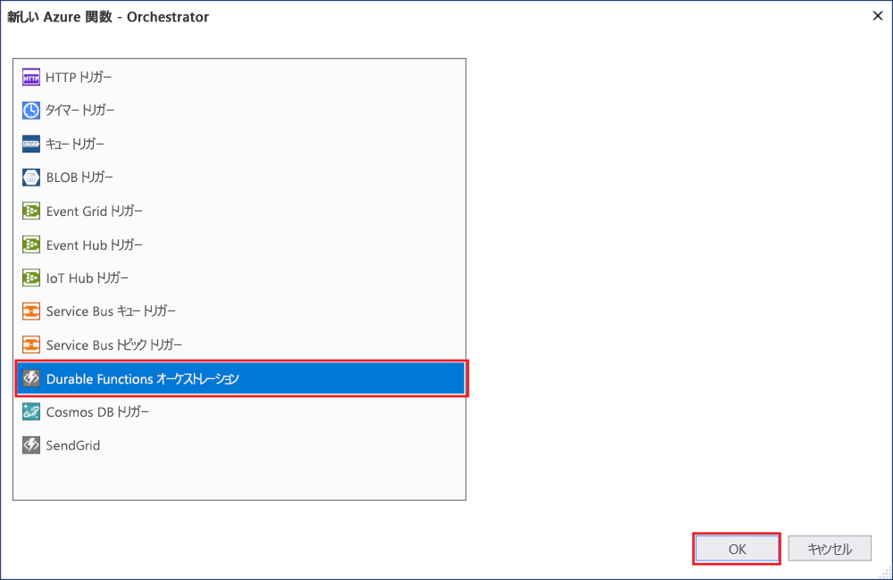

# <a name="create-your-first-durable-function-in-c"></a>C\# で最初の Durable Functions を作成する

*Durable Functions* は、サーバーレス環境でステートフル関数を記述できる [Azure Functions](../functions-overview.md) の拡張機能です。 この拡張機能は状態、チェックポイント、再起動を管理します。

この記事では、Visual Studio 2019 を使用して、"hello world" 持続的関数をローカルで作成してテストする方法を学習します。  この関数は、他の関数の呼び出しを調整し、連結します。 その後、関数コードを Azure に発行します。 これらのツールは、Visual Studio 2019 の Azure の開発ワークロードの一部として使用できます。


## <a name="prerequisites"></a>前提条件

このチュートリアルを完了するには、以下が必要です。

* [Visual Studio 2019](https://visualstudio.microsoft.com/vs/) をインストールします。 **Azure 開発**ワークロードもインストールされていることを確認します。 Visual Studio 2017 でも Durable Functions 開発はサポートされていますが、UI と手順は異なります。

* [Azure Storage Emulator](../../storage/common/storage-use-emulator.md) がインストールされ、実行されていることを確認します。

[!INCLUDE [quickstarts-free-trial-note](../../../includes/quickstarts-free-trial-note.md)]

## <a name="create-a-function-app-project"></a>関数アプリ プロジェクトを作成する

Azure Functions テンプレートでは、Azure の関数アプリに発行できるプロジェクトを作成します。 関数アプリを使用すると、リソースを管理、デプロイ、および共有するための論理ユニットとして関数をグループ化できます。

1. Visual Studio で、 **[ファイル]** メニューから **[新規]**  >  **[プロジェクト]** の順に選択します。

1. **[新しいプロジェクトの追加]** ダイアログ ボックスで `functions` を検索して **[Azure Functions]** テンプレートを選択し、 **[次へ]** を選択します。 

    ![Visual Studio で関数を作成するための [新しいプロジェクト] ダイアログ](./media/durable-functions-create-first-csharp/functions-vs-new-project.png)

1. プロジェクトの**プロジェクト名**を入力し、 **[OK]** を選択します。 プロジェクト名は、C# 名前空間として有効である必要があります。そのため、アンダースコア、ハイフン、その他の英数字以外の文字は使用しないでください。

1. **[新しい Azure Functions アプリケーションの作成]** で、図の下の表に示されている設定を使用してください。

    ![Visual Studio の [新しい Azure Functions アプリケーションの作成] ダイアログ](./media/durable-functions-create-first-csharp/functions-vs-new-function.png)

    | Setting      | 推奨値  | 説明                      |
    | ------------ |  ------- |----------------------------------------- |
    | **バージョン** | Azure Functions 2.x <br />(.NET Core) | .NET Core をサポートする Azure Functions のバージョン 2.x ランタイムを使用する関数プロジェクトを作成します。 Azure Functions 1.x では、.NET Framework がサポートされます。 詳細については、「[Azure Functions ランタイム バージョンをターゲットにする方法](../functions-versions.md)」をご覧ください。   |
    | **テンプレート** | Empty | 空の関数アプリを作成します。 |
    | **ストレージ アカウント**  | ストレージ エミュレーター | Durable Functions の状態管理にはストレージ アカウントが必要です。 |

4. **[作成]** を選択して、空の関数プロジェクトを作成します。 このプロジェクトには、関数を実行するために必要な基本的な構成ファイルがあります。

## <a name="add-functions-to-the-app"></a>アプリに関数を追加する

次の手順では、テンプレートを使用してプロジェクト内に永続関数のコードを作成します。

1. Visual Studio でプロジェクトを右クリックし、 **[追加]**  >  **[新しい Azure 関数]** を選択します。

    

1. 追加メニューから **[Azure Function]** が選択されていることを確認し、C# ファイルの名前を入力してから **[追加]** を選択します。

1. **[Durable Functions のオーケストレーション]** テンプレートを選択し、 **[OK]** を選択します。

      

新しい永続関数がアプリに追加されます。  新しい .cs ファイルを開いて内容を表示します。 この永続関数は、次のメソッドを使用した単純な関数チェーンの例です。  

| Method | FunctionName | 説明 |
| -----  | ------------ | ----------- |
| **`RunOrchestrator`** | `<file-name>` | 持続的オーケストレーションを管理します。 このケースでは、オーケストレーションが起動し、一覧が作成され、3 つの関数呼び出しの結果が一覧に追加されます。  3 つの関数呼び出しが完了すると、一覧が返されます。 |
| **`SayHello`** | `<file-name>_Hello` | 関数から hello が返されます。 これは、調整されるビジネス ロジックを含む関数です。 |
| **`HttpStart`** | `<file-name>_HttpStart` | オーケストレーションのインスタンスを開始し、チェック状態の応答を返す、[HTTP によってトリガーされる関数](../functions-bindings-http-webhook.md)。 |

関数プロジェクトと Durable Functions を作成できたので、この関数をローカル コンピューターでテストすることができます。

## <a name="test-the-function-locally"></a>関数をローカルでテストする

Azure Functions Core Tools を使用すると、ローカルの開発用コンピューター上で Azure Functions プロジェクトを実行できます。 Visual Studio から初めて関数を開始すると、これらのツールをインストールするよう求めるメッセージが表示されます。

1. 関数をテストするには、F5 キーを押します。 メッセージが表示されたら、Visual Studio からの要求に同意し、Azure Functions Core (CLI) ツールをダウンロードしてインストールします。 また、ツールで HTTP 要求を処理できるようにファイアウォールの例外を有効にすることが必要になる場合もあります。

2. Azure Functions のランタイムの出力から、関数の URL をコピーします。

    

3. HTTP 要求の URL をブラウザーのアドレス バーに貼り付け、要求を実行します。 関数によって返されたローカルの GET 要求に対するブラウザーでの応答を次に示します。

    

    応答は、永続的なオーケストレーションが正常に開始されたことを示す HTTP 関数の最初の結果です。  これはまだオーケストレーションの最終的な結果ではありません。  応答には、いくつかの便利な URL が含まれています。  ここでは、オーケストレーションの状態を照会してみましょう。

4. `statusQueryGetUri` の URL 値をコピーし、ブラウザーのアドレス バーに貼り付け、要求を実行します。

    この要求によって、オーケストレーション インスタンスの状態が照会されます。 最終的な応答は次のようになります。  これはインスタンスが完了したことを示し、Durable Functions の出力または結果を含みます。

    ```json
    {
        "instanceId": "d495cb0ac10d4e13b22729c37e335190",
        "runtimeStatus": "Completed",
        "input": null,
        "customStatus": null,
        "output": [
            "Hello Tokyo!",
            "Hello Seattle!",
            "Hello London!"
        ],
        "createdTime": "2018-11-08T07:07:40Z",
        "lastUpdatedTime": "2018-11-08T07:07:52Z"
    }
    ```

5. デバッグを停止するには、**Shift キーを押しながら F5 キー**を押します。

関数がローカル コンピューター上で正常に動作することを確認した後、プロジェクトを Azure に発行します。

## <a name="publish-the-project-to-azure"></a>Azure にプロジェクトを発行する

プロジェクトを発行するには、Azure サブスクリプションに関数アプリがあることが必要です。 関数アプリは、Visual Studio から直接作成できます。

[!INCLUDE [Publish the project to Azure](../../../includes/functions-vstools-publish.md)]

## <a name="test-your-function-in-azure"></a>Azure で関数をテストする

1. [発行プロファイル] ページから関数アプリのベース URL をコピーします。 関数をローカルでテストしたときに使用した URL の `localhost:port` 部分を新しいベース URL に置き換えます。

    Durable Functions の HTTP トリガーを呼び出す URL は、次の形式である必要があります。

        http://<APP_NAME>.azurewebsites.net/api/<FUNCTION_NAME>_HttpStart

2. HTTP 要求のこの新しい URL をブラウザーのアドレス バーに貼り付けます。 以前の発行済みアプリの使用時と同じ状態応答を受け取るはずです。

## <a name="next-steps"></a>次の手順

Visual Studio を使用して、C# の Durable Functions アプリを作成して発行しました。

> [!div class="nextstepaction"]
> [Durable Functions の一般的なパターンについて学習する。](durable-functions-concepts.md)
