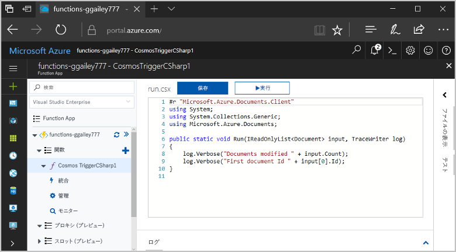
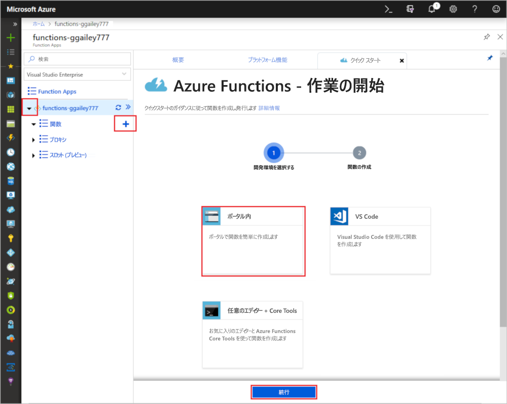
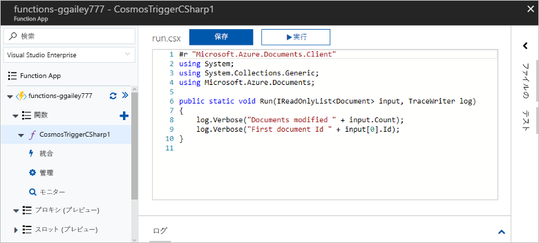
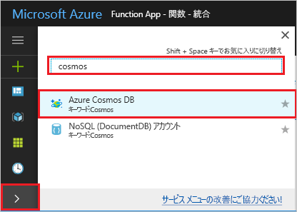
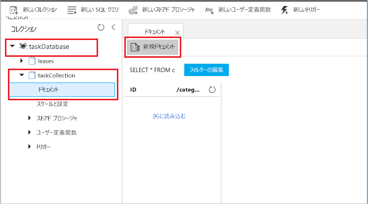

# Azure Cosmos DB によってトリガーされる関数を作成する

Azure Cosmos DB にデータが追加される、または変更されるときにトリガーされる関数の作成方法を説明します。 Azure Cosmos DB の詳細については、[Azure Cosmos DB: Azure Functions を使用したサーバーレス データベース コンピューティング](../cosmos-db/serverless-computing-database.md)に関するページを参照してください。

## 前提条件

このチュートリアルを完了するには、以下が必要です。

+ Azure サブスクリプションをお持ちでない場合は、開始する前に [無料アカウント](https://azure.microsoft.com/free/?WT.mc_id=A261C142F) を作成してください。

> [!NOTE]
> [!INCLUDE [SQL API support only](../../includes/functions-cosmosdb-sqlapi-note.md)]

## Azure Cosmos DB アカウントを作成する

トリガーを作成する前に、SQL API を使用する Azure Cosmos DB アカウントが必要です。

[!INCLUDE [cosmos-db-create-dbaccount](../../includes/cosmos-db-create-dbaccount.md)]

## Azure Function App の作成

[!INCLUDE [Create function app Azure portal](../../includes/functions-create-function-app-portal.md)]

次に、新しい Function App で関数を作成します。

## Azure Cosmos DB のトリガーの作成

1. Function App を展開し、**[関数]** の横にある **[+]** ボタンをクリックします。 これが関数アプリの初めての関数の場合は、**[ポータル内]**、**[続行]** の順に選択します。 それ以外の場合は、手順 3 に進みます。

   

1. **[その他のテンプレート]**、**[Finish and view templates]\(終了してテンプレートを表示\)** の順に選択します。

    ![Functions のクイック スタート: [その他のテンプレート] を選択する](./media/functions-create-cosmos-db-triggered-function/add-first-function.png)

1. 検索フィールドに「`cosmos`」と入力し、**Azure Cosmos DB トリガー** テンプレートを選択します。

1. プロンプトが表示されたら、**[インストール]** を選択して Azure Storage 拡張機能とすべての依存関係を関数アプリにインストールします。 インストールが正常に完了したら、**[続行]** を選択します。

    

1. 新しいトリガーは、次の画像の下の表に示したように設定します。

    

    | Setting      | 推奨値  | Description                                |
    | ------------ | ---------------- | ------------------------------------------ |
    | **Name** | 既定値 | テンプレートに示されている既定の関数名を使用します。|
    | **Azure Cosmos DB アカウント接続** | 新しい設定 | **[新規]** を選択し、使用する**サブスクリプション**、前の手順で作成した**データベース アカウント**、**[選択]** の順に選択します。 これにより、アカウント接続のアプリケーション設定が作成されます。 この設定は、データベースへの接続へのバインディングによって使用されます。 |
    | **[コレクション名]** | 項目 | 監視するコレクションの名前。 |
    | **[Create lease collection if it doesn't exist]\(リース コレクションが存在しない場合は作成する\)** | オン | コレクションはまだ存在していないため、作成します。 |
    | **データベース名** | タスク | 監視するコレクションのデータベース名。 |

1. **[作成]** をクリックして、Azure Cosmos DB でトリガーされる関数を作成します。 関数が作成されると、テンプレート ベースの関数コードが表示されます。  

    

    この関数テンプレートは、ドキュメント数と最初のドキュメント ID をログに書き込みます。

次に、Azure Cosmos DB アカウントに接続し、`Tasks` データベースに `Items` コレクションを作成します。

## Items コレクションの作成

1. ブラウザーの新しいタブで、[Azure Portal](https://portal.azure.com) の 2 つ目のインスタンスを開きます。

1. ポータルの左側のアイコン バーを展開し、検索フィールドに「`cosmos`」と入力して、**[Azure Cosmos DB]** を選択します。

    

1. Azure Cosmos DB アカウントを選択してから、**[データ エクスプローラー]** を選択します。 

1. **[コレクション]** で、**[taskDatabase]**、**[新しいコレクション]** の順に選択します。

    

1. **[コレクションの追加]** で、次の画像の下の表に示したように設定します。 

    

    | Setting|推奨値|説明 |
    | ---|---|--- |
    | **[データベース ID]** | タスク |新しいデータベースの名前。 これは、関数バインドで定義された名前と一致する必要があります。 |
    | **[コレクション ID]** | 項目 | 新しいコレクションの名前。 これは、関数バインドで定義された名前と一致する必要があります。  |
    | **[ストレージ容量]** | 固定 (10 GB)|既定値を使用します。 この値は、データベースの記憶域容量です。 |
    | **スループット** |400 RU| 既定値を使用します。 待ち時間を短縮する場合、後でスループットをスケールアップできます。 |
    | **[[パーティション キー]](../cosmos-db/partition-data.md)** | /category|各パーティションに均等にデータを分散するパーティション キー。 効率の良いコレクションを作成するためには、正しいパーティション キーを選択することが大切です。 | 

1. **[OK]** をクリックして、Items コレクションを作成します。 コレクションが作成されるまで多少時間がかかる場合があります。

関数バインドで指定されたコレクションが作成されたら、この新しいコレクションにドキュメントを追加することで関数をテストできます。

## 関数をテストする

1. データ エクスプローラーで新しい **[taskCollection]** を展開し、**[ドキュメント]**、**[新しいドキュメント]** の順に選択します。

    

1. 新しいドキュメントの内容を次の内容に置き換えて、**[保存]** を選択します。

        {
            "id": "task1",
            "category": "general",
            "description": "some task"
        }

1. ポータルでご利用の関数が表示されている、ブラウザーの 1 つ目のタブに切り替えます。 関数ログを展開し、新しいドキュメントがその関数をトリガーしたことを確認します。 `task1` のドキュメント ID の値がログに書き込まれていることを確認してください。 

    

1. (省略可能) ドキュメントに戻り、変更を加え、**[更新]** をクリックします。 次に、関数ログに戻り、この更新によっても関数がトリガーされたことを確認します。

## リソースのクリーンアップ

[!INCLUDE [Next steps note](../../includes/functions-quickstart-cleanup.md)]

## 次の手順

Azure Cosmos DB でドキュメントが追加または変更されたときに実行される関数を作成しました。 Azure Cosmos DBのトリガーの詳細については、「[Azure Functions の Azure Cosmos DB バインド](functions-bindings-cosmosdb.md)」をご覧ください。

[!INCLUDE [Next steps note](../../includes/functions-quickstart-next-steps.md)]
