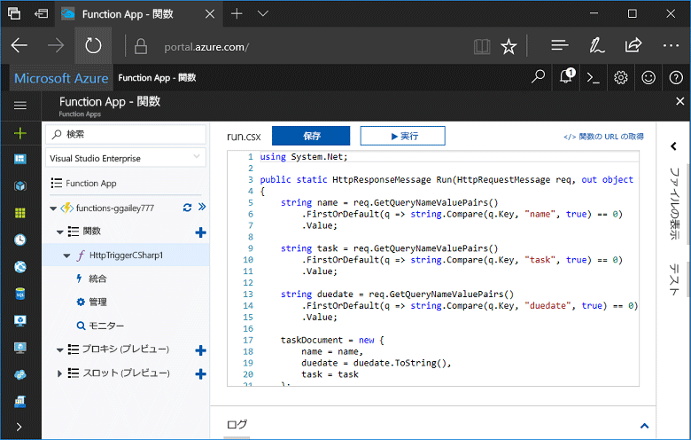
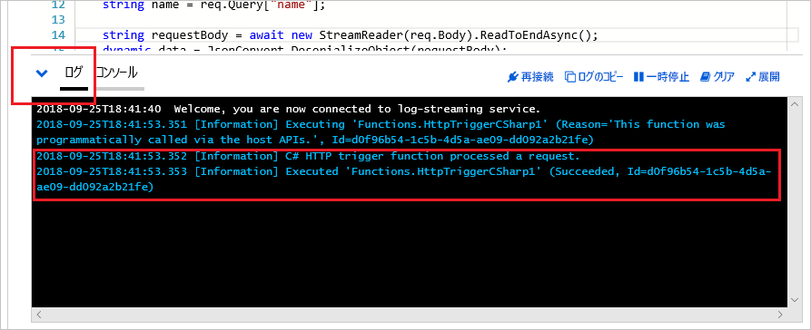

# Azure Portal で初めての関数を作成する

Azure Functions を使用すると、最初に VM を作成したり Web アプリケーションを発行したりしなくても、サーバーレス環境でコードを実行できます。 このトピックでは、Functions を使用して Azure Portal で "hello world" 関数を作成する方法について説明します。

[!INCLUDE [quickstarts-free-trial-note](../../includes/quickstarts-free-trial-note.md)]

## Azure へのログイン

[Azure Portal](https://portal.azure.com/) にログインします。

## Function App を作成する

関数の実行をホストするための Function App が存在する必要があります。 Function App を使用すると、リソースの管理、デプロイ、および共有を容易にするためのロジック ユニットとして関数をグループ化できます。 

[!INCLUDE [Create function app Azure portal](../../includes/functions-create-function-app-portal.md)]

[!INCLUDE [functions-portal-favorite-function-apps](../../includes/functions-portal-favorite-function-apps.md)]

次に、新しい Function App で関数を作成します。

## HTTP によってトリガーされる関数の作成

1. 新しい Function App を展開し、**[関数]** の横にある **+** ボタンをクリックします。

2.  **[関数への早道]** ページで、**[webhook + API]** を選択し、関数の**言語を選択**して、**[この関数を作成する]** をクリックします。 
   
    

HTTP によってトリガーされる関数のテンプレートを使用して、選択した言語で関数が作成されます。 HTTP 要求を送信することによって、新しい関数を実行できます。

## 関数をテストする

1. 新しい関数で、**[</> 関数の URL の取得]** をクリックし、**[default (Function key)\(既定 (関数キー)\)]** を選択して、**[コピー]** をクリックします。 

    

2. 関数 URL をブラウザーのアドレス バーに貼り付けます。 この URL にクエリ文字列 `&name=<yourname>` を追加し、`Enter` キーを押して、要求を実行します。 次に、Edge ブラウザーで関数によって返された応答の例を示します。

    

    要求 URL には、既定では HTTP 経由で関数にアクセスするために必要なキーが含まれています。   

3. 関数が実行されると、ログにトレース情報が書き込まれます。 前の実行からのトレース出力を表示するには、ポータルで関数に戻り、画面の下部にある上矢印をクリックして **[ログ]** を展開します。 

   

## リソースのクリーンアップ

[!INCLUDE [Clean up resources](../../includes/functions-quickstart-cleanup.md)]

## 次のステップ

HTTP によってトリガーされる単純な関数を含む Function App を作成しました。  

[!INCLUDE [Next steps note](../../includes/functions-quickstart-next-steps.md)]

詳細については、「[Azure Functions における HTTP と Webhook のバインド](functions-bindings-http-webhook.md)」を参照してください。

