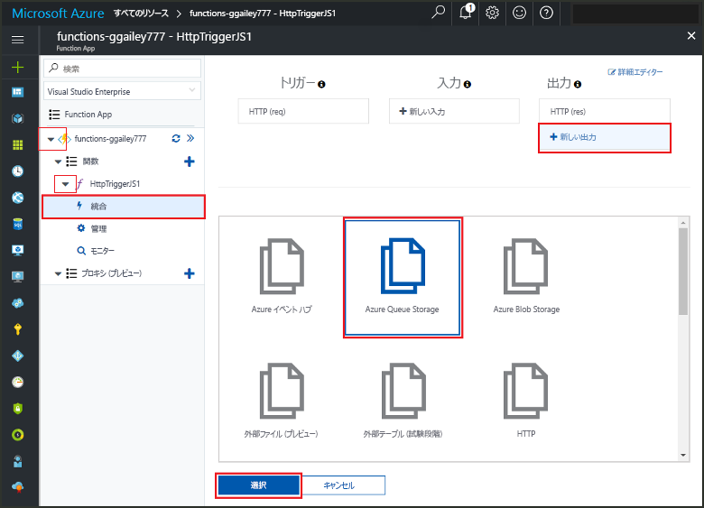
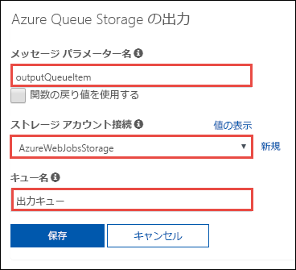
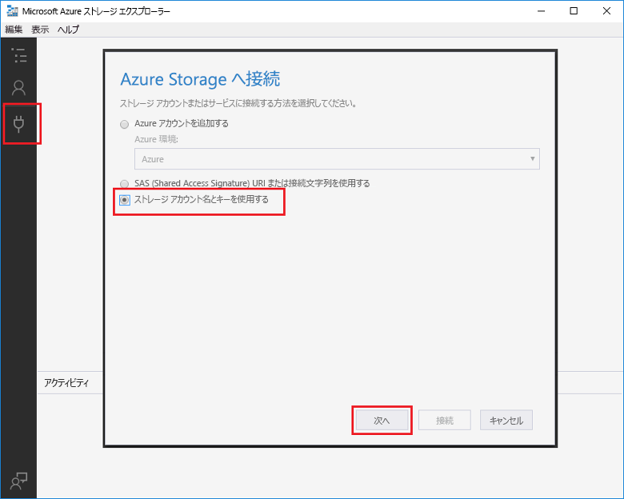
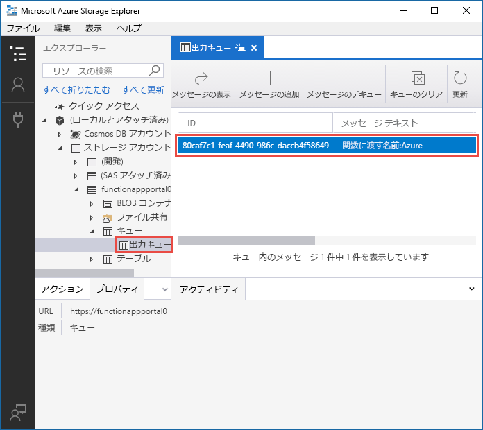

<a id="add-messages-to-an-azure-storage-queue-using-functions" class="xliff"></a>

# Functions を使用して Azure Storage キューにメッセージを追加する

Azure Functions では、入力および出力バインディングによって、関数から外部サービス データに接続する宣言方法が提供されます。 このトピックでは、Azure Queue Storage にメッセージを送信する出力バインディングを追加することで既存の関数を更新する方法について説明します。  


<a id="prerequisites" class="xliff"></a>

## 前提条件 

[!INCLUDE [Previous topics](../../includes/functions-quickstart-previous-topics.md)]

* [Microsoft Azure ストレージ エクスプローラー](http://storageexplorer.com/)をインストールします。

[!INCLUDE [functions-portal-favorite-function-apps](../../includes/functions-portal-favorite-function-apps.md)] 

## <a name="add-binding"></a>出力バインディングを追加する
 
1. Function App と関数の両方を展開します。

2. **[統合]** と **[+ 新しい出力]** を選択し、**[Azure Queue storage]** を選択して、**[選択]** を選択します。
    
    

3. テーブルに指定されている設定を使用し、**[保存]** を選択します。 

    

    | 設定      |  推奨値   | Description                              |
    | ------------ |  ------- | -------------------------------------------------- |
    | **キュー名**   | myqueue-items    | ストレージ アカウント内の接続先のキューの名前。 |
    | **ストレージ アカウント接続** | AzureWebJobStorage | Function App によって既に使用されているストレージ アカウント接続を使用するか、新しく作成できます。  |
    | **メッセージ パラメーター名** | outQueueItem | 出力バインディング パラメーターの名前。 | 

出力バインディングが定義されたので、コードを更新し、バインディングを使用して、メッセージをキューに追加する必要があります。  

<a id="update-the-function-code" class="xliff"></a>

## 関数コードを更新する

1. 関数を選択し、エディターに関数コードを表示します。 

2. C# 関数の場合は、次のように関数定義を更新して、**outQueueItem** ストレージ バインディング パラメーターを追加します。 JavaScript 関数の場合は、この手順をスキップします。

    ```cs   
    public static async Task<HttpResponseMessage> Run(HttpRequestMessage req, 
        ICollector<string> outQueueItem, TraceWriter log)
    {
        ....
    }
    ```

3. メソッドが戻る直前に、関数に次のコードを追加します。 関数の言語に合ったスニペットを使用します。

    ```javascript
    context.bindings.outQueueItem = "Name passed to the function: " + 
                (req.query.name || req.body.name);
    ```

    ```cs
    outQueueItem.Add("Name passed to the function: " + name);     
    ```

4. **[保存]** を選択して変更を保存します。

HTTP トリガーに渡される値は、キューに追加されるメッセージに含まれています。
 
<a id="test-the-function" class="xliff"></a>

## 関数をテストする 

1. コードの変更が保存されたら、**[実行]** を選択します。 

    

2. ログを確認して、関数が成功したことを確認します。 出力バインディングを最初に使用するときに、**outqueue** という名前の新しいキューが、Functions ランタイムによってストレージ アカウントに作成されます。

次に、ストレージ アカウントに接続して、追加した新しいキューとメッセージを確認することができます。 

<a id="connect-to-the-queue" class="xliff"></a>

## キューに接続する

既に Storage エクスプローラーをインストールしてストレージ アカウントに接続している場合は、最初の 3 つの手順をスキップします。    

1. 関数で、**[統合]** と新しい **[Azure Queue storage]** 出力バインディングを選択し、**[ドキュメント]** を展開します。 **[アカウント名]** と **[アカウント キー]** の両方をコピーします。 これらの資格情報を使用して、ストレージ アカウントに接続します。
 
    

2. [Microsoft Azure ストレージ エクスプローラー](http://storageexplorer.com/) ツールを実行し、左側の接続アイコンをクリックして、**[Use a storage account name and key]\(ストレージ アカウント名とキーを使用\)** を選択し、**[次へ]** を選択します。

    
    
3. 手順 1. の **[アカウント名]** と **[アカウント キー]** を対応するフィールドに貼り付けて **[次へ]** を選択し、**[接続]** を選択します。 
  
    

4. 接続されたストレージ アカウントを展開し、**[Queues] \(キュー)** を右クリックして、**myqueue-items** という名前のキューが存在することを確認します。 既にメッセージもキューに表示されているはずです。  
 
    
 

<a id="clean-up-resources" class="xliff"></a>

## リソースのクリーンアップ

[!INCLUDE [Next steps note](../../includes/functions-quickstart-cleanup.md)]

<a id="next-steps" class="xliff"></a>

## 次のステップ

既存の関数に出力バインディングを追加しました。 

[!INCLUDE [Next steps note](../../includes/functions-quickstart-next-steps.md)]

Queue Storage へのバインディングの詳細については、「[Azure Functions における Storage キュー バインド](functions-bindings-storage-queue.md)」を参照してください。 


