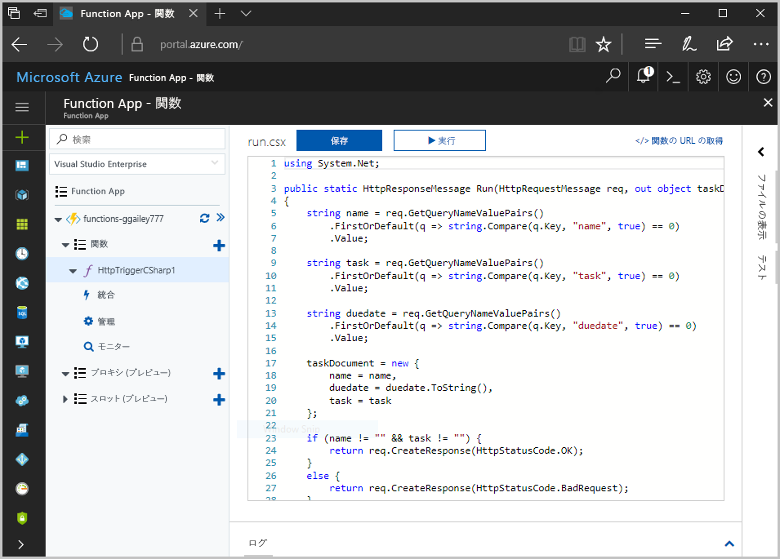
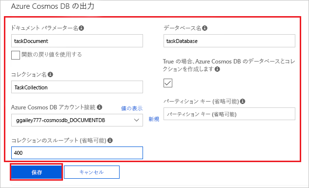
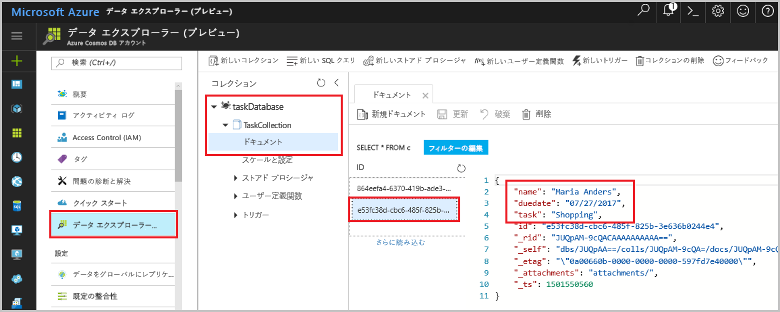

# <a name="store-unstructured-data-using-azure-functions-and-azure-cosmos-db"></a>Azure Functions と Azure Cosmos DB を使用して非構造化データを格納する

[Azure Cosmos DB](https://azure.microsoft.com/services/cosmos-db/) は、非構造化 JSON データを格納するうえで最適な手段です。 Cosmos DB は、Azure Functions と連携させると、リレーショナル データベースにデータを格納する場合よりもはるかに少ないコードですばやく簡単にデータを格納することができます。

Azure Functions では、入力および出力バインディングによって、関数から外部サービス データに接続する宣言方法が提供されます。 このトピックでは、Cosmos DB ドキュメント内に非構造化データを格納する出力バインディングを追加するように既存の C# 関数を更新する方法について説明します。 



## <a name="prerequisites"></a>前提条件

このチュートリアルを完了するには、以下が必要です。

[!INCLUDE [Previous quickstart note](../../includes/functions-quickstart-previous-topics.md)]

## <a name="add-an-output-binding"></a>出力バインディングを追加する

1. Function App と関数の両方を展開します。

1. **[統合]** を選択し、ページの右上にある **[新規出力]** を選択します。 **[Azure Cosmos DB]** を選択し、**[選択]** をクリックします。

    

3. **[Azure Cosmos DB output]\(Azure Cosmos DB 出力\)** の設定を使用して、次の表で指定されているように設定します。 

    

    | 設定      | 推奨値  | Description                                |
    | ------------ | ---------------- | ------------------------------------------ |
    | **[ドキュメント パラメーター名]** | taskDocument | コード内で Cosmos DB オブジェクトを指す名前。 |
    | **[データベース名]** | taskDatabase | ドキュメントを保存するデータベースの名前。 |
    | **[コレクション名]** | TaskCollection | データベース コレクションの名前 |
    | **[If true, creates the Cosmos DB database and collection]\(オンの場合、Cosmos DB データベースとコレクションを作成する\)** | オン | コレクションはまだ存在していないため、作成します。 |

4. **[Azure Cosmos DB document connection]\(Cosmos DB ドキュメント接続\)** ラベルの横にある **[新規]** を選択し、**[+ 新規作成]** を選択します。 

5. **[新しいアカウント]** の設定を使用して、次の表で指定されているように設定します。 

    

    | 設定      | 推奨値  | Description                                |
    | ------------ | ---------------- | ------------------------------------------ |
    | **ID** | データベースの名前 | Azure Cosmos DB データベースの一意の ID  |
    | **API** | SQL (DocumentDB) | ドキュメント データベース API を選択します。  |
    | **サブスクリプション** | Azure サブスクリプション | Azure サブスクリプション  |
    | **リソース グループ** | myResourceGroup |  関数アプリが含まれる既存のリソース グループを使用します。 |
    | **場所**  | 西ヨーロッパ | 関数アプリ、または格納されたドキュメントを使用するその他のアプリに近い場所を選択します。  |

6. **[OK]** をクリックしてデータベースを作成します。 データベースの作成には数分かかる場合があります。 データベースが作成されると、データベース接続文字列が関数アプリ設定として格納されます。 このアプリ設定の名前が、**[Azure Cosmos DB account connection]\(Azure Cosmos DB アカウント接続\)** に挿入されます。 
 
8. 接続文字列が設定されてから、**[保存]** を選択し、バインディングを作成します。

## <a name="update-the-function-code"></a>関数コードを更新する

既存の C# 関数コードを次のコードに置き換えます。

```csharp
using System.Net;

public static HttpResponseMessage Run(HttpRequestMessage req, out object taskDocument, TraceWriter log)
{
    string name = req.GetQueryNameValuePairs()
        .FirstOrDefault(q => string.Compare(q.Key, "name", true) == 0)
        .Value;

    string task = req.GetQueryNameValuePairs()
        .FirstOrDefault(q => string.Compare(q.Key, "task", true) == 0)
        .Value;

    string duedate = req.GetQueryNameValuePairs()
        .FirstOrDefault(q => string.Compare(q.Key, "duedate", true) == 0)
        .Value;

    taskDocument = new {
        name = name,
        duedate = duedate.ToString(),
        task = task
    };

    if (name != "" && task != "") {
        return req.CreateResponse(HttpStatusCode.OK);
    }
    else {
        return req.CreateResponse(HttpStatusCode.BadRequest);
    }
}

```
このサンプル コードは、HTTP 要求のクエリ文字列を読み取り、それらを `taskDocument` オブジェクトのフィールドに代入します。 `taskDocument` バインディングは、このバインディング パラメーターのオブジェクト データを、バインドされたドキュメント データベースに格納されるように送信します。 データベースは、関数が初めて実行されるときに作成されます。

## <a name="test-the-function-and-database"></a>関数とデータベースをテストする

1. 右側のウィンドウを展開し、**[テスト]** を選択します。 **[クエリ]** の下の **[+ パラメーターの追加]** をクリックし、クエリ文字列に以下のパラメーターを追加します。

    + `name`
    + `task`
    + `duedate`

2. **[実行]** をクリックして、200 状態が返されることを確認します。

    

1. Azure Portal の左側のアイコン バーを展開し、検索フィールドに「`cosmos`」と入力して、**[Azure Cosmos DB]** を選択します。

    

2. Azure Cosmos DB アカウントを選択してから、**[データ エクスプローラー]** を選択します。 

3. **[コレクション]** ノードを展開して新しいドキュメントを選択し、ドキュメントにクエリ文字列値といくつかの追加のメタデータが含まれていることを確認します。 

    

Azure Cosmos DB に非構造化データを格納するバインディングを HTTP トリガーに正常に追加できました。

[!INCLUDE [Clean-up section](../../includes/clean-up-section-portal.md)]

## <a name="next-steps"></a>次のステップ

[!INCLUDE [functions-quickstart-next-steps](../../includes/functions-quickstart-next-steps.md)]

Cosmos DB データベースへのバインドの詳細については、「[Azure Functions における Cosmos DB のバインド](functions-bindings-documentdb.md)」を参照してください。

