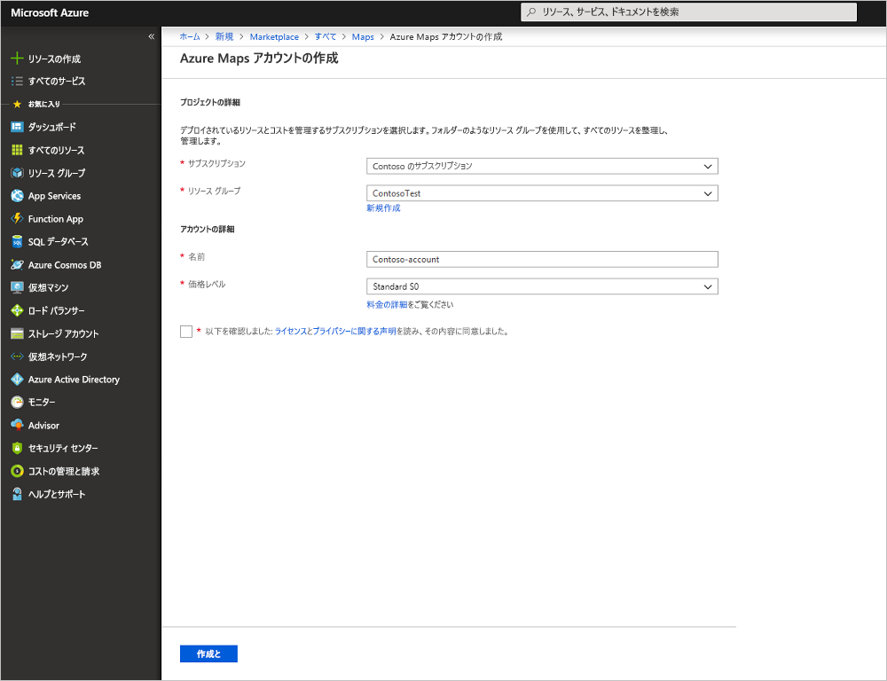

# Azure Maps を使用して対話形式の検索マップを起動する

この記事では、対話形式で検索を行える、Azure Maps のマップ作成機能について説明します。 デモ版の Web アプリケーションで使用する Azure Maps アカウント を作成し、アカウント キーを取得する基本的な手順についても説明します。

Azure サブスクリプションをお持ちでない場合は、開始する前に [無料アカウント](https://azure.microsoft.com/free/?WT.mc_id=A261C142F) を作成してください。

## Azure Portal にログインする

[Azure Portal](https://portal.azure.com/) にログインします。

## アカウントを作成し、キーを取得する

1. [Azure Portal](https://portal.azure.com) の左上隅にある **[リソースの作成]** をクリックします。
2. *[Marketplace を検索]* ボックスに「**Maps**」と入力します。
3. *[結果]* から **[Maps]** を選択します。 マップの下に表示される **[作成]** ボタンをクリックします。
4. **[Azure Maps アカウントの作成]** ページで、次の値を入力します。
    - 新しいアカウントの "*名前*"。
    - このアカウントで使う "*サブスクリプション*"。
    - このアカウントの "*リソース グループ*" です。 *[新規作成]* を選んで新しく作成することも、*[既存のものを使用]* を選んで既存のリソース グループを使うこともできます。
    - "*リソース グループの場所*" を選びます。
    - *[ライセンス]* と *[プライバシーに関する声明]* の内容を読み、チェック ボックスをオンにして条件に同意します。
    - 最後に、**[作成]** ボタンをクリックします。

    

5. アカウントが正常に作成されたら、アカウントを開いて、アカウント メニューの [設定] セクションに移動します。 **[キー]** をクリックして Azure Maps アカウントのプライマリおよびセカンダリ キーを表示します。 次のセクションで使用する **[主キー]** の値をローカルのクリップボードにコピーします。

## アプリケーションのダウンロード

1. [interactiveSearch.html](https://github.com/Azure-Samples/azure-maps-samples/blob/master/src/interactiveSearch.html) ファイルの内容をコピーまたはダウンロードします。
2. このファイルの内容を **AzureMapDemo.html** としてローカルに保存し、テキスト エディターで開きます。
3. 文字列 `<insert-key>` を検索し、前のセクションで取得した、**主キー**の値で置換します。

## アプリケーションの起動

1. **AzureMapDemo.html** ファイルを任意のブラウザーで開きます。
2. 表示されるロサンゼルス市の地図を見てください。 拡大/縮小すると、ズームのレベルに応じて、マップに表示される情報が自動的に増減します。 
3. マップの既定の中心を変更します。 **AzureMapDemo.html** ファイルで **center** という名前の変数を検索します。 この変数の緯度と経度のペア値を、新しい値 **[-74.0060, 40.7128]** に置き換えます。 ファイルを保存し、ブラウザーを更新します。
4. これで、対話形式の検索を実行できます。 デモ版の Web アプリケーションの左上隅にある検索ボックスに「**レストラン**」と入力します。
5. 検索ボックスの下に表示された住所/場所のリストにマウスをのせると、対応するピンがマップに現れ、その場所に関する情報がポップアップに表示されます。 民間事業のプライバシー保護のために、架空の名前と住所が表示されています。

    

## リソースのクリーンアップ

チュートリアルでは、アカウントを使用してマップを構成する方法の詳細について説明します。 チュートリアルに進む場合は、このクイック スタートで作成したリソースを削除しないでください。 使用する予定がない場合は、次の手順を使用して、このクイックスタートで作成したすべてのリソースを削除してください。

1. **AzureMapDemo.html** Web アプリケーションを実行しているブラウザーを閉じます。
2. Azure Portal の左側のメニューにある **[すべてのリソース]** をクリックし、Azure Maps アカウントを選択します。 **[すべてのリソース]** ブレードの上部にある **[削除]** をクリックします。

## 次の手順

このクイック スタートでは、Azure Maps アカウントを作成し、デモ アプリを起動しました。 Azure Maps API を使用して独自のアプリケーションを作成する方法を学習するには、次のチュートリアルにお進みください。

> [!div class="nextstepaction"]
> [Azure Maps を使って目的地を検索する](./tutorial-search-location.md)

他のコード例や対話型のコーディング エクスペリエンスについては、使用方法に関する以下のガイドをご覧ください。

> [!div class="nextstepaction"]
> [Azure Maps REST API を使用してアドレスを検索する方法](./how-to-search-for-address.md)

> [!div class="nextstepaction"]
> [Azure Maps のマップ コントロールを使用する方法](./how-to-use-map-control.md)
