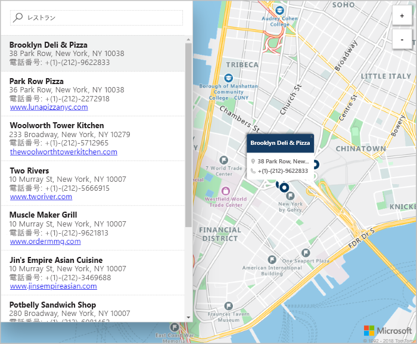

# Azure Maps を使用して対話形式の検索マップを作成する

この記事では、対話形式で検索を行える、Azure Maps のマップ作成機能について説明します。 次の基本的な手順について説明します。
* 自分用の Azure Maps アカウントを作成する。
* デモ版の Web アプリケーションで使用するアカウント キーを取得する。

Azure サブスクリプションをお持ちでない場合は、開始する前に [無料アカウント](https://azure.microsoft.com/free/?WT.mc_id=A261C142F) を作成してください。

## Azure portal にサインインします

[Azure Portal](https://portal.azure.com/) にサインインします。

## アカウントを作成し、キーを取得する

1. [Azure portal](https://portal.azure.com) の左上隅にある **[リソースの作成]** を選択します。
2. **[Marketplace を検索]** ボックスに「**Maps**」と入力します。
3. **[結果]** から **[Maps]** を選択します。 マップの下に表示される **[作成]** ボタンを選択します。
4. **[Azure Maps アカウントの作成]** ページで、次の値を入力します。
   - 新しいアカウントの "**名前**"。
   - このアカウントで使う "**サブスクリプション**"。
   - このアカウントの "**リソース グループ**" です。 **[新規作成]** を選んで新しく作成することも、**[既存のものを使用]** を選んで既存のリソース グループを使うこともできます。
   - 任意の **[価格レベル]** を選択します。
   - **ライセンス**と**プライバシーに関する声明**を読みます。 チェックボックスをオンにして利用規約に同意します。
   - 最後に **[作成]** ボタンを選択します。

     

5. アカウントが正常に作成されたら、アカウントを開いて、アカウント メニューの [設定] セクションに移動します。 **[キー]** を選択して Azure Maps アカウントのプライマリおよびセカンダリ キーを表示します。 次のセクションで使用する **[主キー]** の値をローカルのクリップボードにコピーします。

## アプリケーションのダウンロード

1. [interactiveSearch.html](https://github.com/Azure-Samples/AzureMapsCodeSamples/blob/master/AzureMapsCodeSamples/Tutorials/interactiveSearch.html) ファイルの内容をコピーまたはダウンロードします。
2. このファイルの内容を **AzureMapDemo.html** としてローカルに保存します。 それをテキスト エディターで開きます。
3. `<Your Azure Maps Key>` という文字列を検索します。 これを前のセクションで取得した**主キー**の値に置き換えます。

## アプリケーションを開く

1. **AzureMapDemo.html** ファイルを任意のブラウザーで開きます。
2. 表示されたロサンゼルス市の地図を見てください。 拡大/縮小すると、ズームのレベルに応じて、マップに表示される情報が自動的に増減します。 
3. マップの既定の中心を変更します。 **AzureMapDemo.html** ファイルで **center** という名前の変数を検索します。 この変数の緯度と経度のペア値を、新しい値 **[-74.0060, 40.7128]** に置き換えます。 ファイルを保存し、ブラウザーを更新します。
4. これで、対話形式の検索を実行できます。 デモ版の Web アプリケーションの左上隅にある検索ボックスに「**レストラン**」と入力します。
5. 検索ボックスの下に表示された住所/場所のリストにマウスを合わせます。 対応するピンがマップに現れ、その場所に関する情報がポップアップに表示されることがわかります。 民間事業のプライバシー保護のために、架空の名前と住所が表示されています。

    

## リソースのクリーンアップ

チュートリアルでは、お使いのアカウントで Azure Maps を使用および構成する方法について詳しく説明します。 チュートリアルに進む場合は、このクイック スタートで作成したリソースをクリーンアップしないでください。 進まない場合は、次の手順に従ってリソースをクリーンアップしてください。

1. **AzureMapDemo.html** Web アプリケーションを実行しているブラウザーを閉じます。
2. Azure portal の左側のメニューから、**[すべてのリソース]** を選択します。 次に、Azure Maps アカウントを選択します。 **[すべてのリソース]** ブレードの上部にある **[削除]** を選択します。

## 次の手順

このクイック スタートでは、Azure Maps アカウントを作成し、デモ アプリを作成しました。 Azure Maps の詳細については、以下のチュートリアルを参照してください。

> [!div class="nextstepaction"]
> [Azure Maps を使用して近くの目的地を検索する](tutorial-search-location.md)

他のコード例や対話型のコーディング エクスペリエンスについては、以下のガイドを参照してください。

> [!div class="nextstepaction"]
> [Azure Maps Search サービスを使用して住所を検索する](how-to-search-for-address.md)

> [!div class="nextstepaction"]
> [Azure Maps のマップ コントロールを使用する](how-to-use-map-control.md)
