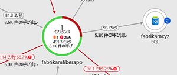
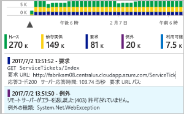
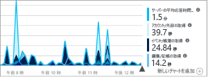
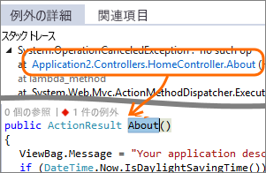

# Application Insights とは何か?
Application Insights は、複数のプラットフォームで使用できる Web 開発者向けの拡張可能なアプリケーション パフォーマンス管理 (APM) サービスです。 このサービスを使用して、実行中の Web アプリケーションを監視することができます。 パフォーマンスに異常があると、自動的に検出されます。 組み込まれている強力な分析ツールを使えば、問題を診断し、ユーザーがアプリを使用して実行している操作を把握できます。  Application Insights は、パフォーマンスやユーザビリティを継続的に向上させるうえで役立つように設計されています。 オンプレミス、ハイブリッド、または任意のパブリック クラウドでホストされている .NET、Node.js、Java EE などのさまざまなプラットフォーム上のアプリで機能します。 DevOps プロセスと統合され、さまざまなツールへの接続ポイントを備えています。 Visual Studio App Center と統合することで、モバイル アプリからテレメトリを監視および分析できます。

## Application Insights のしくみ
小さなインストルメンテーション パッケージをアプリケーションにインストールし、Application Insights リソースを Microsoft Azure ポータルに設定します。 このインストルメンテーションがアプリを監視し、テレメトリ データを Azure Monitor に送信します (アプリケーションの実行場所は問いません。Azure でホストされている必要はありません)。

Web サービス アプリケーションだけでなく、バックグラウンド コンポーネントや Web ページ内の JavaScript 自体もインストルメント化することができます。 

さらに、パフォーマンス カウンター、Azure Diagnostics、Docker のログなどのホスト環境からテレメトリをプルすることができます。 定期的に Web サービスに人工的な要求を送信する Web テストを設定することもできます。

これらのテレメトリ ストリームはすべて Azure Monitor に統合されています。 Azure portal では、強力な分析ツールと検索ツールを生データに適用できます。

### オーバーヘッドとは
アプリのパフォーマンスへの影響はごくわずかです。 追跡呼び出しはブロッキングを行わず、バッチ処理された後、別のスレッドで送信されます。

## Application Insights の監視対象

Application Insights は、開発チーム用のツールであり、アプリのパフォーマンスや使用状況を把握できるように支援します。 以下を監視します。

* **要求レート、応答時間、およびエラー率**: 最も人気のあるページがどの時間帯にどの場所のユーザーからアクセスされているかを調べます。 最もパフォーマンスの高いページを確認します。 要求が多いときに、応答時間と失敗率が高くなる場合は、おそらくリソースに問題があります。 
* **依存率、応答時間、およびエラー率**: 外部サービスによって応答が遅くなっているかどうかを調べます。
* **例外**: 集計された統計を分析します。または特定のインスタンスを選択し、スタック トレースと関連する要求を調べます。 サーバーとブラウザーの両方の例外が報告されます。
* **ページ ビューと読み込みのパフォーマンス**: ユーザーのブラウザーから報告されます。
* Web ページからの **AJAX 呼び出し**: レート、応答時間、およびエラー率。
* **ユーザー数とセッション数**。
* Windows または Linux サーバー コンピューターの CPU、メモリ、ネットワーク使用率などの**パフォーマンス カウンター**。 
* Docker または Azure の**ホスト診断**。 
* アプリの**診断トレース ログ**: これにより、トレース イベントを要求に関連付けることができます。
* 販売された品目や勝利したゲームなどのビジネス イベントを追跡するためにクライアントまたはサーバーのコード内に書き込んだ**カスタム イベントとメトリック**。

## テレメトリの確認場所

データを探索する方法は多数あります。 次の記事を参照してください。

|  |  |
| --- | --- |
| [**スマート検出と手動のアラート**](../../azure-monitor/app/proactive-diagnostics.md) アプリのテレメトリの通常パターンに対して自動アラートを適応し、通常とは異なるパターンがある場合にアラートをトリガーします。 カスタムまたは標準のメトリックスの特定レベルで[アラートを設定](../../azure-monitor/app/alerts.md)することもできます。 | |
| [**アプリケーション マップ**](../../azure-monitor/app/app-map.md) アプリのコンポーネントを、主要なメトリックとアラートと共に表示します。 |  |
| [**プロファイラー**](../../azure-monitor/app/profiler.md) サンプリングされた要求の実行プロファイルを検査します。 | |
| [**利用状況分析**](../../azure-monitor/app/usage-overview.md) ユーザーのセグメント化とリテンションを分析します。| |
| [**インスタンスのデータの診断検索**](../../azure-monitor/app/diagnostic-search.md) 要求、例外、依存関係の呼び出し、ログ トレースおよびページ ビューなどのイベントを検索およびフィルター処理します。  | |
| [**集計データのメトリックス エクスプ ローラー**](../../azure-monitor/app/metrics-explorer.md) 要求、失敗、および例外の比率、応答時間、ページの読み込み時間などの集計データを調査、フィルター処理、およびセグメント分割します。 | |
| [**ダッシュボード**](../../azure-monitor/app/overview-dashboard.md) 複数のリソースからのデータをマッシュアップし、他のユーザーと共有します。 複数コンポーネントのアプリケーションと、チーム ルームでの継続的な表示に最適です。 | |
| [**ライブ メトリック ストリーム**](../../azure-monitor/app/live-stream.md) 新しいビルドをデプロイする場合、このほぼリアルタイムのパフォーマンス インジケーターを監視し、すべてが期待どおりに動作することを確認します。 | |
| [**分析**](../../azure-monitor/app/analytics.md) この強力なクエリ言語を使用して、アプリのパフォーマンスと使用状況に関する難しい質問に回答します。 | |
| [**Visual Studio**](../../azure-monitor/app/visual-studio.md) パフォーマンス データをコードで確認します。 スタック トレースからコードに移動します。| |
| [**スナップショット デバッガー**](../../azure-monitor/app/snapshot-debugger.md) ライブの操作からサンプリングされたスナップショットをパラメーター値でデバッグします。| |
| [**Power BI**](../../azure-monitor/app/export-power-bi.md ) 使用状況のメトリックをその他のビジネス インテリジェンスと統合します。| |
| [**REST API**](https://dev.applicationinsights.io/) メトリックと生データのクエリを実行するコードを記述します。|  |
| [**連続エクスポート**](../../azure-monitor/app/export-telemetry.md) 生データが届いたらすぐにストレージに一括エクスポートします。 | |

## Application Insights の使用方法

### 監視
Application Insights を Web アプリにインストールし、[可用性 Web テスト](../../azure-monitor/app/monitor-web-app-availability.md)を設定します。さらに、次のことを行います。

* チーム ルーム用の既定の[アプリケーション ダッシュボード](../../azure-monitor/app/overview-dashboard.md)をチェックし、負荷、応答性のほか、依存関係、ページの読み込み、および AJAX 呼び出しのパフォーマンスを監視します。
* 最も時間がかかり、最も失敗した要求を検出します。
* 低下しているものについてすぐにわかるように、新しいリリースをデプロイしたときに [Live Stream](../../azure-monitor/app/live-stream.md) を監視します。

### 検出、診断
アラートを受け取ったときや問題を検出したときに、次のことを行います。

* 影響を受けるユーザーの数を評価します。
* 失敗を、例外、依存関係呼び出し、トレースと相互に関連付けます。
* プロファイラー、スナップショット、スタック ダンプ、およびトレース ログを調べます。

### ビルド、評価、学習
デプロイした各新機能の[有効性を評価](../../azure-monitor/app/usage-overview.md)します。

* 顧客が新しい UX やビジネス機能をどのように使用しているかを評価することを計画します。
* カスタム テレメトリをコードに書き込みます。
* テレメトリによる確かな証拠に基づいて次の開発サイクルを決定します。

## 作業開始
Application Insights は、Microsoft Azure でホストされる多数のサービスの 1 つであり、テレメトリは分析と表示のために Microsoft Azure に送信されます。 このため、他の操作を行う前に、 [Microsoft Azure](https://azure.com)のサブスクリプションが必要になります。 サインアップは無料で、Application Insights の基本的な[価格プラン](https://azure.microsoft.com/pricing/details/application-insights/)を選択できます。大幅に増えた使用量に対応するようアプリケーションを拡大しない限り、料金は発生しません。 組織に既にサブスクリプションがある場合は、それにユーザーの Microsoft アカウントを追加することができます。

作業の開始方法はいくつかあります。 目的に適した方法から始めてください。 後で、他のものを追加することもできます。

* **実行時: サーバー上の Web アプリをインストルメント化します。** 既にデプロイ済みのアプリケーションに最適です。 コードを更新しなくて済みます。
  * [**Azure Web Apps でホストされる ASP.NET または ASP.NET Core アプリケーション**](../../azure-monitor/app/azure-web-apps.md)
  * [**Azure VM または Azure 仮想マシン スケール セット上の IIS でホストされる ASP.NET アプリケーション**](../../azure-monitor/app/azure-vm-vmss-apps.md)
  * [**IIS のオンプレミス VM でホストされる ASP.NET アプリケーション**](../../azure-monitor/app/monitor-performance-live-website-now.md)
* **開発時: コードに Application Insights を追加します。** テレメトリの収集をカスタマイズし、追加のテレメトリを送信できます。
  * [ASP.NET アプリケーション](../../azure-monitor/app/asp-net.md)
  * [ASP.NET Core アプリケーション](../../azure-monitor/app/asp-net-core.md)
  * [.NET コンソール アプリケーション](../../azure-monitor/app/console.md)
  * [Java](../../azure-monitor/app/java-get-started.md)
  * [Node.JS](../../azure-monitor/app/nodejs.md)
  * [その他のプラットフォーム](../../azure-monitor/app/platforms.md)
* ページ ビュー、AJAX、その他のクライアント側テレメトリ用に **[Web ページをインストルメント化](../../azure-monitor/app/javascript.md)** します。
* Visual Studio App Center と統合することで、 **[モバイル アプリの使用状況を分析](../../azure-monitor/learn/mobile-center-quickstart.md)** します。
* **[可用性テスト](../../azure-monitor/app/monitor-web-app-availability.md)** - Microsoft のサーバーから定期的に Web サイトに ping を実行します。

## 次の手順
実行時に開始する:

* [Azure VM と Azure 仮想マシン スケール セットの IIS でホストされたアプリ](../../azure-monitor/app/azure-vm-vmss-apps.md)
* [IIS サーバー](../../azure-monitor/app/monitor-performance-live-website-now.md)
* [Azure Web Apps](../../azure-monitor/app/azure-web-apps.md)

開発時に開始する:

* [ASP.NET](../../azure-monitor/app/asp-net.md)
* [ASP.NET Core](../../azure-monitor/app/asp-net-core.md)
* [Java](../../azure-monitor/app/java-get-started.md)
* [Node.JS](../../azure-monitor/app/nodejs.md)

## サポートとフィードバック
* 質問および問題点:
  * [トラブルシューティング][qna]
  * [MSDN フォーラム](https://social.msdn.microsoft.com/Forums/vstudio/home?forum=ApplicationInsights)
  * [StackOverflow](https://stackoverflow.com/questions/tagged/ms-application-insights)
* ご提案:
  * [UserVoice](https://feedback.azure.com/forums/357324-application-insights/filters/top)
* ブログ:
  * [Application Insights のブログ](https://azure.microsoft.com/blog/tag/application-insights)

## ビデオ

- 外部のビデオ: [ASP.NET アプリケーションでの Application Insights の構成](https://www.youtube.com/watch?v=blnGAVgMAfA)。
- 外部のビデオ: [ASP.NET Core および Visual Studio での Application Insights の構成](https://www.youtube.com/watch?v=NoS9UhcR4gA&t)。
- 外部のビデオ: [ASP.NET Core および Visual Studio Code での Application Insights の構成](https://youtu.be/ygGt84GDync)。

<!--Link references-->

[android]: ../../azure-monitor/learn/mobile-center-quickstart.md
[azure]: ../../insights-perf-analytics.md
[client]: ../../azure-monitor/app/javascript.md
[desktop]: ../../azure-monitor/app/windows-desktop.md
[greenbrown]: ../../azure-monitor/app/asp-net.md
[ios]: ../../azure-monitor/learn/mobile-center-quickstart.md
[java]: ../../azure-monitor/app/java-get-started.md
[knowUsers]: app-insights-web-track-usage.md
[platforms]: ../../azure-monitor/app/platforms.md
[portal]: https://portal.azure.com/
[qna]: ../../azure-monitor/app/troubleshoot-faq.md
[redfield]: ../../azure-monitor/app/monitor-performance-live-website-now.md
