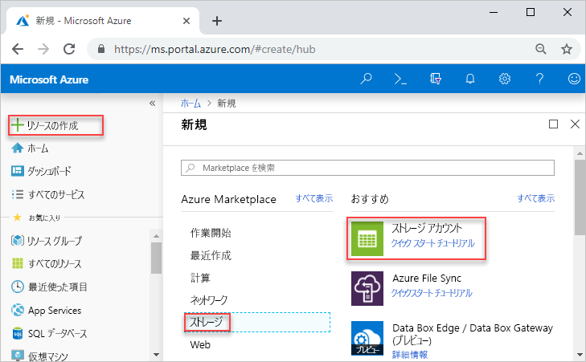
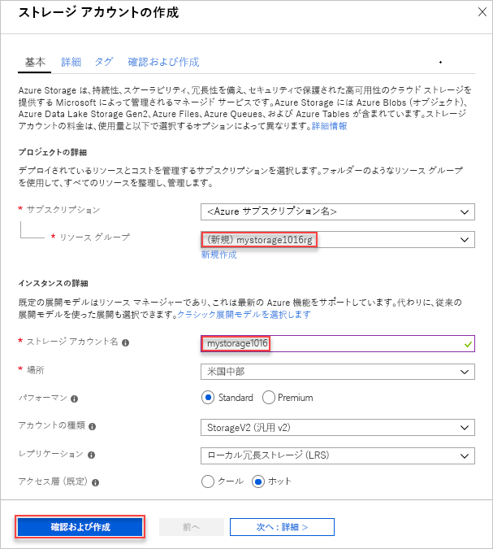
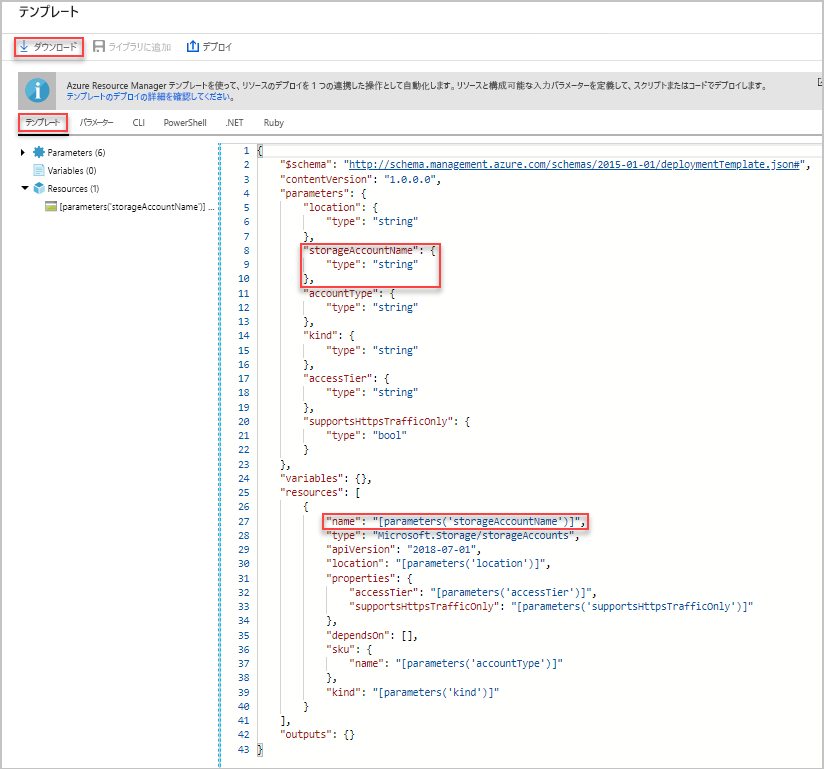
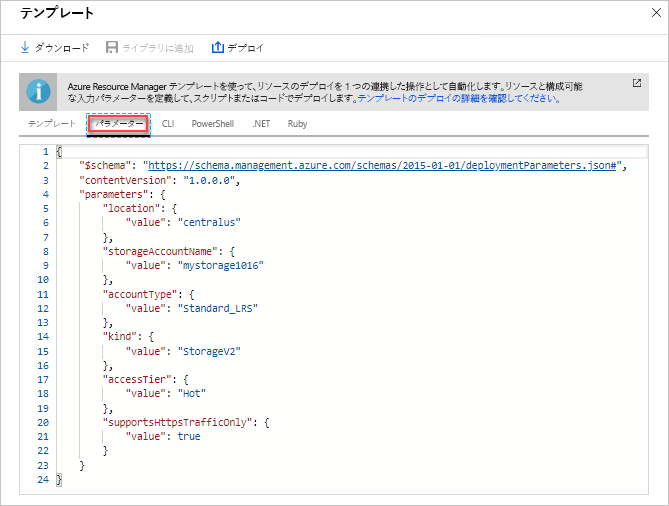
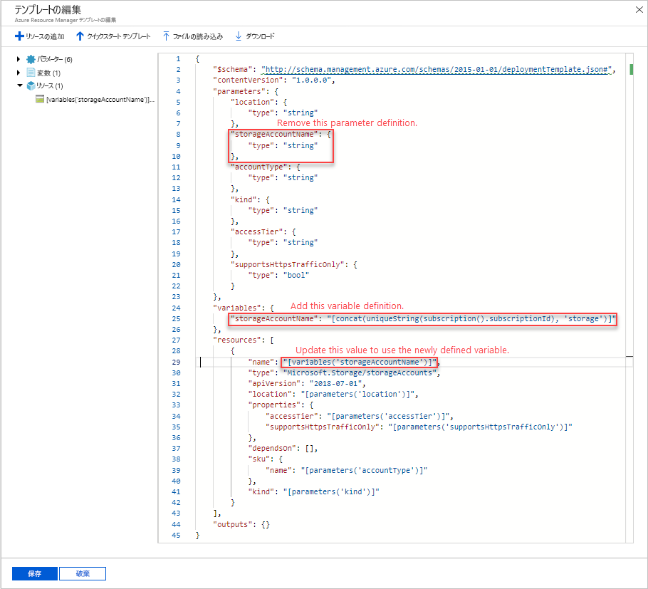
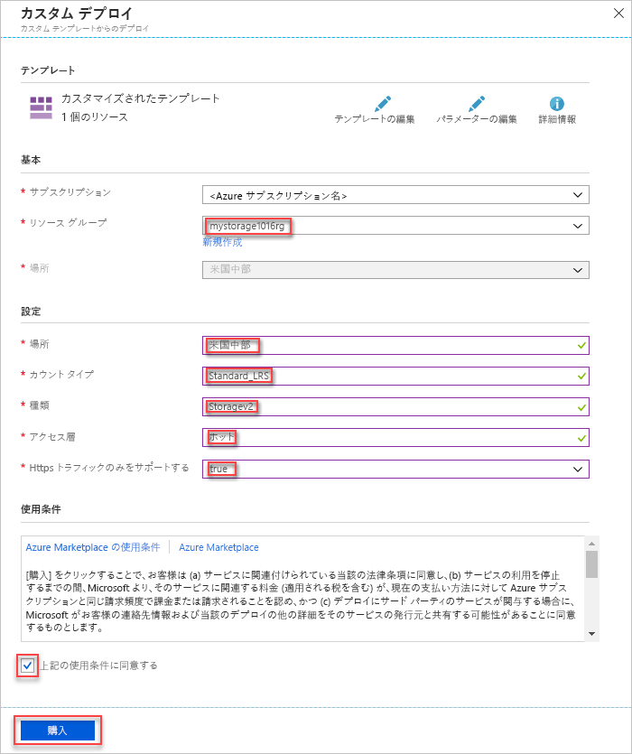
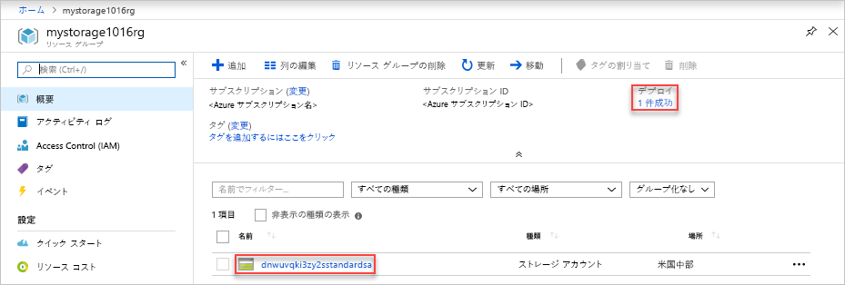

# <a name="quickstart-create-and-deploy-azure-resource-manager-templates-by-using-the-azure-portal"></a>クイック スタート:Azure portal を使用した Azure Resource Manager テンプレートの作成とデプロイ

Azure portal を使用して Resource Manager テンプレートを生成する方法と、ポータルでテンプレートを編集およびデプロイするプロセスについて学習します。 Resource Manager テンプレートとは、ソリューションに対してデプロイが必要なリソースを定義した JSON ファイルのことをいいます。 Azure ソリューションのデプロイと管理に関する概念について理解を深めるには、「[Azure Resource Manager の概要](resource-group-overview.md)」を参照してください。

チュートリアルを完了した後、Azure Storage アカウントをデプロイします。 同じプロセスを使用して他の Azure リソースをデプロイすることができます。

Azure サブスクリプションをお持ちでない場合は、開始する前に[無料アカウントを作成](https://azure.microsoft.com/free/)してください。

## <a name="generate-a-template-using-the-portal"></a>ポータルを使用したテンプレートの生成

最初から Resource Manager テンプレートを作成するのは簡単な作業ではありません。Azure のデプロイと JSON 形式に慣れていない場合は特にそうです。 Azure portal を使用すると、Azure Storage アカウントなどのリソースを構成できます。 リソースをデプロイする前に、構成を Resource Manager テンプレートにエクスポートできます。 テンプレートを保存し、今後再利用できます。

経験豊富なテンプレート開発者の多くは、慣れていない Azure リソースをデプロイするときにこの方法を使用して実用的なテンプレートを生成しています。

1. [Azure Portal](https://portal.azure.com) にサインインします。
2. **[リソースの作成]** > **[Storage]** > **[ストレージ アカウント - Blob、File、Table、Queue]** を選択します。

    
3. 次の情報を入力します。

    - **[リソース グループ]**:**[新規作成]** を選択し、任意のリソース グループ名を指定します。 スクリーンショットでは、リソース グループ名は *mystorage1016rg* です。 リソース グループとは、Azure リソース用のコンテナーです。 リソース グループを使用すると、Azure リソースをより簡単に管理できます。
    - **[名前]**:ストレージ アカウントに一意の名前を付けます。 スクリーンショットでは、名前は *mystorage1016* です。

    残りのプロパティは既定値のままでかまいません。

    

    > [!NOTE]
    > エクスポートされたテンプレートの中には、デプロイする前に編集を必要とするものがあります。

4. 画面下部の **[確認および作成]** を選択します。
5. 画面下部の **[Automation のテンプレートをダウンロードする]** を選択します。 ポータルに、生成されたテンプレートが次のように表示されます。

    

    メイン ウィンドウにテンプレートが表示されます。 これは、6 つの最上位要素 (`schema`、`contentVersion`、`parameters`、`variables`、`resources`、および `output`) が含まれた JSON ファイルです。 詳細については、「[Azure Resource Manager テンプレートの構造と構文の詳細](./resource-group-authoring-templates.md)」をご覧ください。

    6 個のパラメーターが定義されています。 そのうちの 1 つは、**storageAccountName** という名前です。 前のスクリーンショットの 2 番目の強調表示された部分は、テンプレートでこのパラメーターを参照する方法を示しています。 次のセクションでは、生成された名前をストレージ アカウントに使用するようにテンプレートを編集します。

    テンプレートには、1 つの Azure リソースが定義されています。 その種類は、[Microsoft.Storage/storageAccounts] です。 リソースがどのように定義されているかと、定義の構造を確認してください。
6. **[Download]** を選択します。 ダウンロードしたパッケージの **template.json** をコンピューターに保存します。 次のセクションでは、テンプレート デプロイ ツールを使用してテンプレートを編集します。
7. **[パラメーター]** タブを選択して、パラメーターに指定した値を確認します。 これらの値を書き留めておきます。次のセクションでテンプレートをデプロイするときに必要になります。

    

    テンプレートとパラメーター ファイルの両方を使用して、リソース (このチュートリアルでは Azure Storage アカウント) を作成できます。

## <a name="edit-and-deploy-the-template"></a>テンプレートの編集とデプロイ

Azure portal では、いくつかの基本的なテンプレート編集を行うことができます。 このクイック スタートでは、"*Template Deployment*" と呼ばれるポータル ツールを使用します。 このチュートリアルでは *Template Deployment* を使用しているため、1 つのインターフェイス (Azure portal) を使用してチュートリアル全体を完了できます。 より複雑なテンプレートを編集する場合は、豊富な編集機能を備えた [Visual Studio Code](./resource-manager-quickstart-create-templates-use-visual-studio-code.md) を使用することを検討してください。

Azure では、各 Azure サービスで一意の名前が使用される必要があります。 既に存在するストレージ アカウント名を入力すると、デプロイが失敗する可能性があります。 この問題を回避するために、テンプレート関数呼び出し `uniquestring()` を使用して一意のストレージ アカウント名を生成するようにテンプレートを変更します。

1. Azure Portal で、**[リソースの作成]** を選択します。
2. **[Marketplace を検索]** で「**template deployment**」と入力し、**Enter** キーを押します。
3. **[テンプレートのデプロイ]** を選択します。

    
4. **作成**を選択します。
5. **[Build your own template in the editor] \(エディターで独自のテンプレートをビルド\)** を選択します。
6. **[ファイルの読み込み]** を選択し、手順に従って、前のセクションでダウンロードした template.json を読み込みます。
7. 次のスクリーンショットに示されているように、1 つの変数を追加します。

    ```json
    "storageAccountName": "[concat(uniquestring(resourceGroup().id), 'standardsa')]"
    ```
    

    ここでは、`concat()` と `uniqueString()` という 2 つのテンプレート関数が使用されています。

8. 前のスクリーンショットで強調表示されている **storageAccountName** パラメーターを削除します。
9. このパラメーターの代わりに、新しく定義した変数を使用するように、**Microsoft.Storage/storageAccounts** リソースの name 要素を更新します。

    ```json
    "name": "[variables('storageAccountName')]",
    ```

    最終的なテンプレートは次のようになります。

    ```json
    {
        "$schema": "https://schema.management.azure.com/schemas/2015-01-01/deploymentTemplate.json#",
        "contentVersion": "1.0.0.0",
        "parameters": {
            "location": {
                "type": "string"
            },
            "accountType": {
                "type": "string"
            },
            "kind": {
                "type": "string"
            },
            "accessTier": {
                "type": "string"
            },
            "supportsHttpsTrafficOnly": {
                "type": "bool"
            }
        },
        "variables": {
            "storageAccountName": "[concat(uniquestring(resourceGroup().id), 'standardsa')]"
        },
        "resources": [
            {
                "name": "[variables('storageAccountName')]",
                "type": "Microsoft.Storage/storageAccounts",
                "apiVersion": "2018-07-01",
                "location": "[parameters('location')]",
                "properties": {
                    "accessTier": "[parameters('accessTier')]",
                    "supportsHttpsTrafficOnly": "[parameters('supportsHttpsTrafficOnly')]"
                },
                "dependsOn": [],
                "sku": {
                    "name": "[parameters('accountType')]"
                },
                "kind": "[parameters('kind')]"
            }
        ],
        "outputs": {}
    }
    ```
7. **[保存]** を選択します。
8. 次の値を入力します。

    - **リソース グループ**: **[新規作成]** を選択し、リソース グループに一意の名前を付けます。
    - **場所**: リソース グループの場所を選択します。 たとえば **[米国中部]** です。 
    - **[場所]**: ストレージ アカウントの場所を選択します。 たとえば **[米国中部]** です。
    - **アカウントの種類**:このクイック スタートでは、「**Standard_LRS**」と入力します。
    - **種類**:このクイック スタートでは、「**StorageV2**」と入力します。
    - **アクセス層**:このクイック スタートでは、「**ホット**」と入力します。
    - **[Https Traffic Only Enabled]\(HTTPS トラフィックのみ有効\)**:   このクイック スタートでは、**[true]** を選択します。
    - **[上記の使用条件に同意する]**: (オン)

    サンプルのデプロイのスクリーンショットを次に示します。

    

10. **[購入]** を選択します。
11. 画面の上部にあるベルのアイコン (通知) を選択して、デプロイの状態を確認します。 "**デプロイを実行しています**" と表示されます。 デプロイが完了するまでお待ちください。

    

12. 通知ウィンドウで **[リソース グループに移動]** を選択します。 次のような画面が表示されます。

    

    デプロイの状態が成功であったことのほか、リソース グループ内のストレージ アカウントが 1 つのみであることを確認できます。 ストレージ アカウント名は、テンプレートによって生成された一意の文字列です。 Azure ストレージ アカウントの使用の詳細については、「[クイック スタート:Azure portal を使用して BLOB をアップロード、ダウンロード、および一覧表示する](../storage/blobs/storage-quickstart-blobs-portal.md)」を参照してください。

## <a name="clean-up-resources"></a>リソースのクリーンアップ

Azure リソースが不要になったら、リソース グループを削除して、デプロイしたリソースをクリーンアップします。

1. Azure portal で、左側のメニューの **[リソース グループ]** を選択します。
2. **[Filter by name]\(名前でフィルター処理\)** フィールドに、リソース グループ名を入力します。
3. リソース グループ名を選択します。  リソース グループにストレージ アカウントが表示されます。
4. 上部のメニューの **[リソース グループの削除]** を選択します。

## <a name="next-steps"></a>次の手順

このチュートリアルでは、Azure portal を使用してテンプレートを生成する方法と、ポータルを使用してテンプレートをデプロイする方法を説明しました。 このクイック スタートで使用したテンプレートは、Azure リソースが 1 つだけ含まれた単純なテンプレートです。 テンプレートが複雑な場合は、Visual Studio Code または Visual Studio を使用してテンプレートを開発する方が簡単です。 次のクイック スタートでは、Azure PowerShell および Azure コマンド ライン インターフェイス (CLI) を使用してテンプレートをデプロイする方法についても説明しています。

> [!div class="nextstepaction"]
> [Visual Studio Code を使用してテンプレートを作成する](./resource-manager-quickstart-create-templates-use-visual-studio-code.md)
