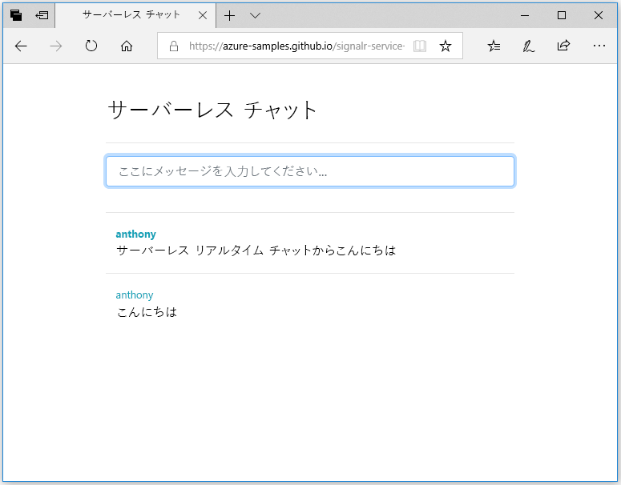

## Web アプリケーションの実行

1. 利便性のために、サンプルのシングルページ Web アプリケーションが GitHub で公開されています。 ブラウザーで [https://azure-samples.github.io/signalr-service-quickstart-serverless-chat/demo/chat/](https://azure-samples.github.io/signalr-service-quickstart-serverless-chat/demo/chat/) を開きます。

    > [!NOTE]
    > HTML ファイルのソースは [/docs/demo/chat/index.html](https://github.com/Azure-Samples/signalr-service-quickstart-serverless-chat/blob/master/docs/demo/chat/index.html) にあります。

1. 関数アプリのベース URL の入力を求められたら、*http://localhost:7071* と入力します。

1. 入力を求められたら、ユーザー名を入力します。

1. Web アプリケーションは関数アプリで *GetSignalRInfo* 関数を呼び出して、Azure SignalR Service に接続するための接続情報を取得します。 接続が完了すると、チャット メッセージ入力ボックスが表示されます。

1. メッセージを入力して Enter キーを押します。 アプリケーションは Azure Function アプリで *SendMessage* 関数にメッセージを送信します。次に、この関数が SignalR 出力バインディングを使用して、接続されているすべてのクライアントにメッセージをブロードキャストします。 すべてが正しく動作している場合、アプリケーションでメッセージが表示されます。

    

1. Web アプリケーションの別のインスタンスを、別のブラウザー ウィンドウで開きます。 送信したメッセージがアプリケーションのすべてのインスタンスで表示されることを確認します。