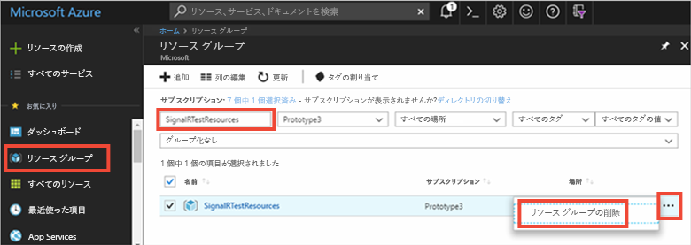

# <a name="quickstart-create-a-chat-room-with-aspnet-and-signalr-service"></a>クイック スタート:ASP.NET と SignalR Service を使ってチャット ルームを作成する

Azure SignalR Service は [SignalR for ASP.NET Core 2.0](https://docs.microsoft.com/aspnet/core/signalr/introduction) に基づいており、ASP.NET SignalR との互換性は 100% では**ありません**。 Azure SignalR Service は、最新の ASP.NET Core テクノロジに基づいて ASP.NET SignalR データ プロトコルを再実装しています。 ASP.NET SignalR に対して Azure SignalR Service を使用する場合、ASP.NET SignalR の一部の機能はサポートされません。たとえば、Azure SignalR はクライアントが再接続したときにメッセージを再生しません。 また、Forever Frame の転送や JSONP はサポートされません。 ASP.NET SignalR アプリケーションを SignalR Service と共に使用するには、いくらかのコード変更や適切なバージョンの依存ライブラリが必要になります。 

ASP.NET SignalR と ASP.NET Core SignalR の機能の比較の完全なリストについては、[バージョンの違いに関するドキュメント](https://docs.microsoft.com/aspnet/core/signalr/version-differences?view=aspnetcore-2.2)を参照してください。

このクイック スタートでは、ASP.NET と Azure SignalR Service を使用して同じような[チャット ルーム アプリケーション](./signalr-quickstart-dotnet-core.md)を作成する方法を学びます。


[!INCLUDE [quickstarts-free-trial-note](../../includes/quickstarts-free-trial-note.md)]
## <a name="prerequisites"></a>前提条件

* [Visual Studio 2019](https://visualstudio.microsoft.com/downloads/)
* [.NET 4.6.1](https://www.microsoft.com/net/download/windows)
* [ASP.NET SignalR 2.4.1](https://www.nuget.org/packages/Microsoft.AspNet.SignalR/)

## <a name="sign-in-to-azure"></a>Azure へのサインイン

Azure アカウントで [Azure Portal](https://portal.azure.com/) にサインインします。

[!INCLUDE [Create instance](includes/signalr-quickstart-create-instance.md)]

*Serverless* モードは、ASP.NET SignalR アプリケーションではサポートされていません。 Azure SignalR Service インスタンスの場合、必ず *Default* または *Classic* を使用してください。

[「SignalR Service の作成」にあるスクリプト](scripts/signalr-cli-create-service.md)を使用して、このクイック スタートで使用されている Azure リソースを作成することもできます。

## <a name="clone-the-sample-application"></a>サンプル アプリケーションの複製

サービスのデプロイ中、コードでの作業に切り替えましょう。 [GitHub からサンプル アプリ](https://github.com/aspnet/AzureSignalR-samples/tree/master/aspnet-samples/ChatRoom)を複製し、SignalR Service 接続文字列を設定し、アプリケーションをローカルで実行します。

1. git ターミナル ウィンドウを開きます。 サンプル プロジェクトを複製するフォルダーに移動します。

1. 次のコマンドを実行して、サンプル レポジトリを複製します。 このコマンドは、コンピューター上にサンプル アプリのコピーを作成します。

    ```bash
    git clone https://github.com/aspnet/AzureSignalR-samples.git
    ```

## <a name="configure-and-run-chat-room-web-app"></a>チャット ルーム Web アプリの構成と実行

1. Visual Studio を起動し、複製したリポジトリの *aspnet-samples/ChatRoom/* フォルダーにあるソリューションを開きます。

1. Azure portal を開いたブラウザーで、作成したインスタンスを探して選択します。

1. **[Key]\(キー\)** を選択し、SignalR Service インスタンスの接続文字列を表示します。

1. プライマリ接続文字列を選択してコピーします。

1. web.config ファイルで接続文字列を設定します。

    ```xml
    <configuration>
    <connectionStrings>
        <add name="Azure:SignalR:ConnectionString" connectionString="<Replace By Your Connection String>"/>
    </connectionStrings>
    ...
    </configuration>
    ```

1. *Startup.cs* で、`MapSignalR()` を呼び出す代わりに `MapAzureSignalR({your_applicationName})` を呼び出して接続文字列に渡し、アプリケーション自身が SignalR をホストするのではなく、サービスに接続するようにします。 `{YourApplicationName}` を自分のアプリケーションの名前と置き換えます。 この名前は、このアプリケーションを他のアプリケーションから区別するための一意の名前です。 値として `this.GetType().FullName` を使用することができます。

    ```cs
    public void Configuration(IAppBuilder app)
    {
        // Any connection or hub wire up and configuration should go here
        app.MapAzureSignalR(this.GetType().FullName);
    }
    ```

    これらの API を使用する前にサービス SDK を参照する必要もあります。 **[ツール]、[NuGet パッケージ マネージャー]、[パッケージ マネージャー コンソール]** を開き、コマンドを実行します。

    ```powershell
    Install-Package Microsoft.Azure.SignalR.AspNet
    ```

    これらの変更以外はすべてのそのままで、使い慣れたハブ インターフェイスを引き続き使用してビジネス ロジックを作成することができます。

    > [!NOTE]
    > この実装では、エンドポイント `/signalr/negotiate` が Azure SignalR Service SDK によるネゴシエーションに対して公開されます。 クライアントが接続を試行すると特別なネゴシエーション応答が返され、クライアントは接続文字列で定義されたサービス エンドポイントにリダイレクトされます。

1. **F5** を押し、プロジェクトをデバッグ モードで実行します。 アプリケーションがローカルで実行されます。 アプリケーションそのものが SignalR ランタイムをホストする代わりに、Azure SignalR Service に接続するようになります。

[!INCLUDE [Cleanup](includes/signalr-quickstart-cleanup.md)]


> [!IMPORTANT]
> いったん削除したリソース グループを元に戻すことはできません。リソース グループとそこに存在するすべてのリソースは完全に削除されます。 間違ったリソース グループやリソースをうっかり削除しないようにしてください。 このサンプルのホストとなるリソースを、保持するリソースが含まれている既存のリソース グループ内に作成した場合は、リソース グループを削除するのではなく、個々のブレードから各リソースを個別に削除することができます。
> 
> 

[Azure ポータル](https://portal.azure.com) にサインインし、 **[リソース グループ]** をクリックします。

**[名前でフィルター]** ボックスにリソース グループの名前を入力します。 このクイックスタートの手順では、*SignalRTestResources* という名前のリソース グループを使用しました。 結果一覧でリソース グループの **[...]** をクリックし、**[リソース グループの削除]** をクリックします。

   


しばらくすると、リソース グループとそこに含まれているすべてのリソースが削除されます。

## <a name="next-steps"></a>次の手順

このクイック スタートでは、新しい Azure SignalR Service リソースを作成して、ASP.NET Web アプリと共に使用しました。 次に、Azure SignalR Service を ASP.NET Core と共に使用して、リアルタイム アプリケーションを開発する方法について学びます。

> [!div class="nextstepaction"]
> [Azure SignalR Service を ASP.NET Core と共に使用する](./signalr-quickstart-dotnet-core.md)
