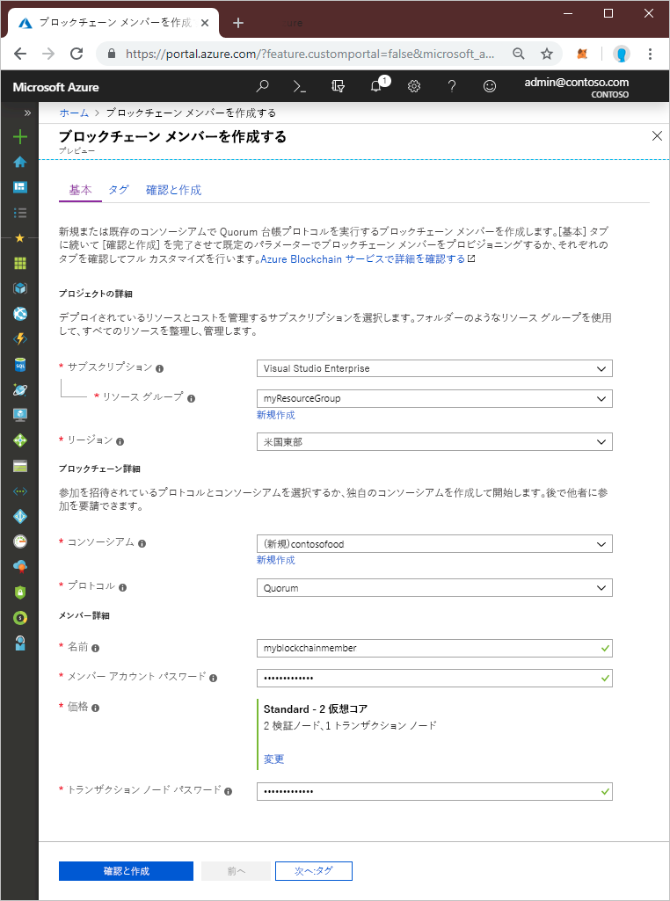
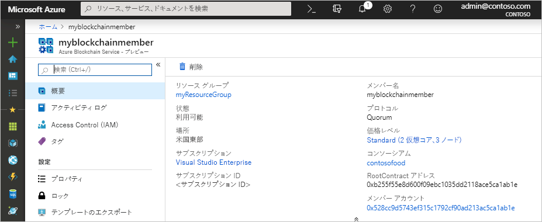

# クイック スタート:Azure portal を使用して Azure Blockchain Service を作成する

Azure Blockchain Service は、スマート コントラクト内でビジネス ロジックを実行できるブロックチェーン プラットフォームです。 このクイックスタートでは、Azure portal を使用して管理対象台帳を作成することから始める方法について説明します。

[!INCLUDE [quickstarts-free-trial-note](../../../includes/quickstarts-free-trial-note.md)]

## 管理対象台帳を作成する

Azure Blockchain Service は、定義された一連のコンピューティング リソースとストレージ リソースを使用して作成されます。

1. [Azure Portal](https://portal.azure.com) にサインインします。
1. Azure Portal の左上隅にある **[リソースの作成]** を選択します。
1. **[ブロックチェーン]**  >  **[Azure Blockchain Service]\(Azure Blockchain Service \)** を選択します。
1. テンプレートを編集して完成させます。

    

    Setting | 説明
    --------|------------
    ブロックチェーン メンバー | Azure Blockchain Service のメンバーを識別する一意の名前を選択します。 ブロックチェーン メンバー名に使用できるのは、小文字と数字のみです。 先頭の文字は英字にする必要があります。 値の長さは 2 から 20 文字にする必要があります。
    サブスクリプション | サービスに使用する Azure サブスクリプションを選択します。 複数のサブスクリプションをお持ちの場合は、リソースの課金対象となるサブスクリプションを選択してください。
    リソース グループ | 新しいリソース グループ名、またはサブスクリプションの既存のリソース グループ名。
    リージョン | コンソーシアムの全メンバーの場所は同じにする必要があります。
    メンバー アカウントのパスワード | メンバー アカウントのパスワードは、メンバー用に作成される Ethereum アカウントの秘密キーの暗号化に使用されます。 メンバー アカウントとメンバー アカウントのパスワードをコンソーシアムの管理に使用します。
    コンソーシアム名 | 新しいコンソーシアムの一意の名前を入力します。 招待状を介してコンソーシアムに参加する場合、この値は参加しているコンソーシアムです。
    説明 | コンソーシアムの説明。
    Protocol |  プレビューは Quorum プロトコルをサポートしています。
    価格 | 新しいサービスのノード構成。 **[Standard]** を選択します。 2 つの検証ノードと 1 つのトランザクション ノードが既定の設定です。
    トランザクション ノードのパスワード | メンバーの既定のトランザクション ノードのパスワード。 このパスワードは、ブロックチェーン メンバーの既定のトランザクション ノード パブリック エンドポイントに接続する際の基本認証に使用します。

1. **[作成]** を選択して、サービスをプロビジョニングします。 プロビジョニングには約 10 分かかります。
1. デプロイ プロセスを監視するには、ツール バーの **[通知]** を選択します。
1. デプロイ後、ブロックチェーン メンバーに移動します。

**[概要]** を選択すると、RootContract アドレスやメンバー アカウントなど、サービスに関する基本情報を確認できます。

## リソースのクリーンアップ

作成したメンバーは、次のクイックスタートまたはチュートリアルに使用できます。 必要なくなったら、Azure Blockchain Service で作成した `myResourceGroup` リソース グループを削除することによって、リソースを削除できます。

リソース グループを削除するには:

1. Azure Portal で、左側のナビゲーション ウィンドウの **[リソース グループ]** に移動し、削除するリソース グループを選択します。
2. **[リソース グループの削除]** を選択します。 リソース グループ名を入力して削除を確認し、 **[削除]** を選択します。

## 次の手順

> [!div class="nextstepaction"]
> [MetaMask を使用してスマート コントラクトを接続およびデプロイする](connect-metamask.md)