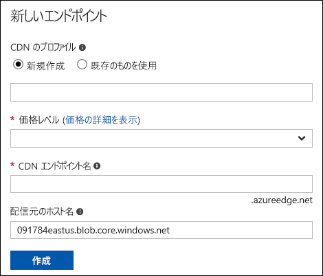
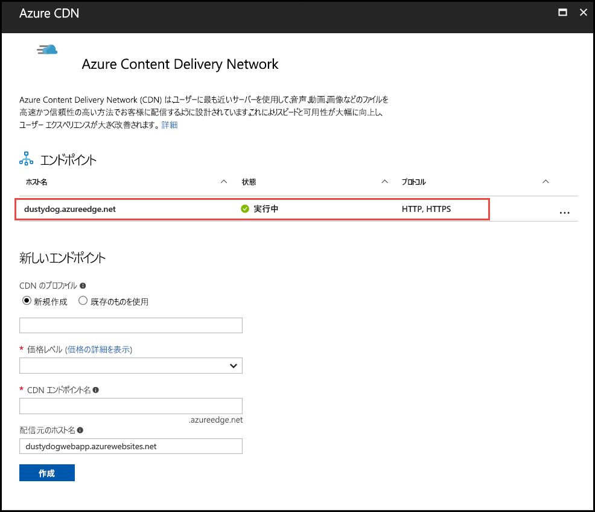

# Azure ストレージ アカウントと Azure CDN との統合
Azure Content Delivery Network (CDN) を有効にして、Azure Storage からのコンテンツをキャッシュすることができます。 Azure CDN では、高帯域幅コンテンツ配信用のグローバル ソリューションが開発者に提供されています。 Azure CDN は、コンピューティング インスタンスの BLOB と静的コンテンツを、米国、ヨーロッパ、アジア、オーストラリア、南アメリカの物理ノードにキャッシュできます。

## ステップ 1: ストレージ アカウントを作成する
Azure サブスクリプションの新しいストレージ アカウントを作成するには、次の手順に従います。 ストレージ アカウントを使うと、Azure Storage サービスにアクセスできます。 ストレージ アカウントは、Azure Storage サービスの各コンポーネント (Blob Storage、Queue Storage、Table Storage) にアクセスするための最高レベルの名前空間を表します。 詳細については、「[Microsoft Azure Storage の概要](../storage/common/storage-introduction.md)」をご覧ください。

ストレージ アカウントを作成するには、サービス管理者または関連付けられているサブスクリプションの共同管理者である必要があります。

> [!NOTE]
> Azure Portal や PowerShell など、ストレージ アカウントは複数の方法で作成できます。 このチュートリアルでは、Azure Portal を使う方法を示します。   
> 

**Azure サブスクリプションのストレージ アカウントを作成するには**

1. [Azure Portal](https://portal.azure.com) にサインインします。
2. 左上隅にある **[リソースの作成]** を選びます。 **[新規]** ウィンドウで **[ストレージ]** を選び、**[ストレージ アカウント - Blob、File、Table、Queue]** を選びます。
    
    **[ストレージ アカウントの作成]** ウィンドウが表示されます。   

    ![[ストレージ アカウントの作成] ウィンドウ](./media/cdn-create-a-storage-account-with-cdn/cdn-create-new-storage-account.png)

3. **[名前]** ボックスに、サブドメインの名前を入力します。 文字数は 3 ～ 24 文字とし、アルファベット小文字と数字を使用できます。
   
    この値は、サブスクリプションの Blob リソース、Queue リソース、または Table リソースのアドレス指定に使われる URI 内のホスト名になります。 Blob Storage 内のコンテナー リソースをアドレス指定するには、次の形式の URI を使います。
   
    http://*&lt;StorageAcountLabel&gt;*.blob.core.windows.net/*&lt;mycontainer&gt;*

    *&lt;StorageAccountLabel&gt;* は、**[名前]** ボックスに入力した値を示します。
   
    > [!IMPORTANT]    
    > URL ラベルは、ストレージ アカウントの URI のサブドメインになるので、Azure のすべてのホストされるサービスにおいて一意である必要があります。
   
    この値は、ポータルでストレージ アカウントの名前としても、またはプログラムでこのアカウントにアクセスするときにも、使われます。
    
4. **[デプロイ モデル]**、**[アカウントの種類]**、**[パフォーマンス]**、**[レプリケーション]** は既定値を使います。 
    
5. **[サブスクリプション]** では、ストレージ アカウントで使うサブスクリプションを選びます。
    
6. **[リソース グループ]** では、リソース グループを選択または作成します。 リソース グループについて詳しくは、「[Azure Resource Manager の概要](../azure-resource-manager/resource-group-overview.md#resource-groups)」をご覧ください。
    
7. **[場所]** では、ストレージ アカウントの場所を選びます。
    
8. **[作成]**を選択します。 ストレージ アカウントを作成するプロセスは、完了までに数分かかる場合があります。

## 手順 2: ストレージ アカウントの CDN を有効にする

ストレージ アカウントから直接、ストレージ アカウントの CDN を有効にできます。 

1. ダッシュボードでストレージ アカウントを選び、左側のウィンドウで **[Azure CDN]** を選びます。 **[Azure CDN]** ボタンがすぐに表示されない場合は、左側のウィンドウの **[検索]** ボックスに「CDN」と入力します。
    
    **[Azure Content Delivery Network]** ウィンドウが表示されます。

    
    
2. 必要な情報を入力して新しいエンドポイントを作成します。
    - **CDN のプロファイル**: 新しい CDN プロファイルを作成するか、既存の CDN プロファイルを使います。
    - **価格レベル**: CDN プロファイルを作成する場合にのみ、価格レベルを選びます。
    - **CDN エンドポイント名**: CDN エンドポイントの名前を入力します。

    > [!TIP]
    > 既定では、新しい CDN エンドポイントは、ストレージ アカウントのホスト名を配信元サーバーとして使います。

3. **[作成]**を選択します。 作成されたエンドポイントが、エンドポイントの一覧に表示されます。

    

> [!NOTE]
> 最適化の種類など、CDN エンドポイントに対して高度な構成設定を指定する場合は、代わりに [Azure CDN 拡張機能](cdn-create-new-endpoint.md#create-a-new-cdn-endpoint)を使って、CDN エンドポイントまたは CDN プロファイルを作成できます。

## 手順 3: その他の CDN 機能を有効にする

ストレージ アカウントの **[Azure CDN]** ウィンドウで、一覧から CDN エンドポイントを選んで、CDN 構成ウィンドウを開きます。 圧縮、クエリ文字列、geo フィルタリングなど、配信のその他の CDN 機能を有効にすることができます。 また、カスタム ドメイン マッピングを CDN エンドポイントに追加して、カスタム ドメインの HTTPS を有効にすることもできます。
    

## ステップ 4: CDN コンテンツにアクセスする
CDN にキャッシュされたコンテンツにアクセスするには、ポータルで提供される CDN URL を使用します。 キャッシュされた BLOB のアドレスの形式は次のようになります。

http://<*EndpointName*\>.azureedge.net/<*myPublicContainer*\>/<*BlobName*\>

> [!NOTE]
> ストレージ アカウントへの CDN アクセスを有効にすると、パブリックにアクセスできるオブジェクトが CDN エッジ キャッシュの対象になります。 CDN で現在キャッシュされているオブジェクトを変更する場合、キャッシュされたコンテンツの有効期限が終了した後で CDN がそのコンテンツを更新するまで、CDN を通して新しいコンテンツを使うことはできません。

## ステップ 5: CDN からコンテンツを削除する
Azure CDN にオブジェクトをキャッシュする必要がなくなった場合は、次のいずれかの手順を実行できます。

* コンテナーをパブリックではなくプライベートにします。 詳細については、「 [コンテナーと BLOB への匿名読み取りアクセスを管理する](../storage/blobs/storage-manage-access-to-resources.md)」を参照してください。
* Azure Portal を使って、CDN エンドポイントを無効にするか削除します。
* オブジェクトの要求に応答しなくなるように、ホストされるサービスを変更します。

Azure CDN に既にキャッシュされているオブジェクトは、オブジェクトの有効期限が切れるまで、またはエンドポイントが消去されるまで、キャッシュに残ったままとなります。 有効期限が切れると、Azure CDN は、CDN エンドポイントがまだ有効で、オブジェクトがまだ匿名アクセス可能かどうかを確認します。 そうではない場合、オブジェクトはキャッシュされなくなります。

## その他のリソース
* [カスタム ドメインを CDN エンドポイントに追加する](cdn-map-content-to-custom-domain.md)
* [Azure Content Delivery Network のカスタム ドメインで HTTPS を構成する](cdn-custom-ssl.md)

