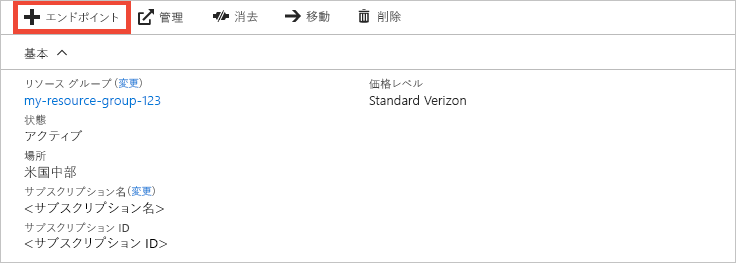
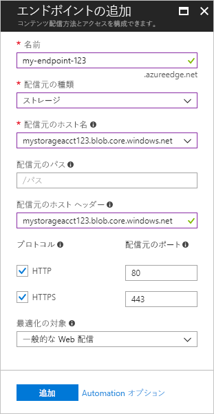
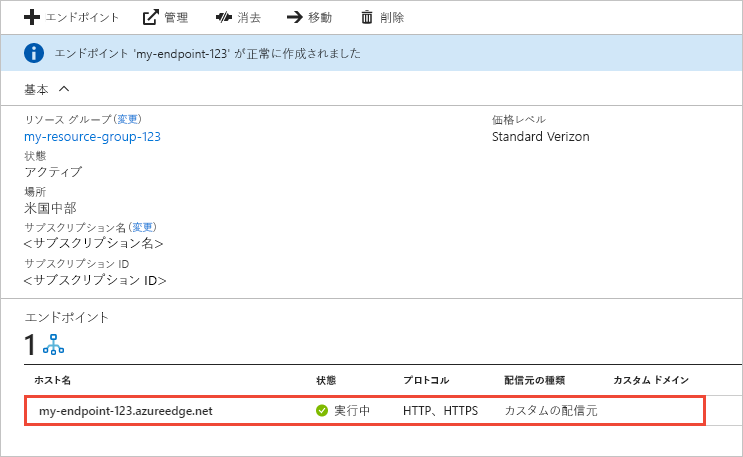

# クイック スタート: Azure CDN プロファイルとエンドポイントの作成
このクイック スタートでは、CDN プロファイルと CDN エンドポイントを新しく作成することによって Azure Content Delivery Network (CDN) を有効にします。 プロファイルとエンドポイントを作成すると、顧客へのコンテンツの配信を開始することができます。

[!INCLUDE [quickstarts-free-trial-note](../../includes/quickstarts-free-trial-note.md)]

## 前提条件
このクイック スタートを行うには、配信元ホスト名として使用する、*mystorageacct123* という名前のストレージ アカウントを作成しておく必要があります。 詳細については、「[Azure ストレージ アカウントと Azure CDN との統合](cdn-create-a-storage-account-with-cdn.md)」を参照してください

## Azure Portal にログインする
Azure アカウントを使用して [Azure Portal](https://portal.azure.com) にログインします。

[!INCLUDE [cdn-create-profile](../../includes/cdn-create-profile.md)]

## [新しい CDN エンドポイントの作成]

CDN プロファイルを作成したら、これを使用してエンドポイントを作成できます。

1. Azure Portal のダッシュボードで、作成した CDN プロファイルを選択します。 目的の CDN プロファイルが見つからない場合は、**[すべてのサービス]**、**[CDN のプロファイル]** の順に選択します。 **[CDN のプロファイル]** ページで、使用するプロファイルを選択します。 
   
    [CDN のプロファイル] ページが表示されます。

2. **[エンドポイント]** を選択します。
   
    
   
    **[エンドポイントの追加]** ページが表示されます。

    画像の下の表に指定した設定を使用してください。
   
    

    | Setting | 値 |
    | ------- | ----- |
    | **名前** | エンドポイントのホスト名として「*my-endpoint-123*」と入力します。 この名前はグローバルに一意でなければなりません。この名前が既に使用されている場合は、別の名前を入力してください。 この名前は、ドメイン _&lt;エンドポイント名&gt;_.azureedge.net でキャッシュされたリソースにアクセスする際に使用します。|
    | **配信元の種類** | **[ストレージ]**を選択します。 | 
    | **配信元のホスト名** | ホスト名として「*mystorageacct123.blob.core.windows.net*」と入力します。 この名前はグローバルに一意でなければなりません。この名前が既に使用されている場合は、別の名前を入力してください |
    | **配信元のパス** | 空白のままにします。 |
    | **配信元のホスト ヘッダー** | 生成された既定値をそのまま使用します。 |  
    | **プロトコル** | **[HTTP]** と **[HTTPS]** のオプションを既定値の選択状態のままにします。 |
    | **配信元のポート** | 既定のポート値のままにします。 | 
    | **最適化の対象** | 既定で選択される **[一般的な Web 配信]** のままにします。 |
    
3. **[追加]** を選択して、新しいエンドポイントを作成します。
   
   エンドポイントが作成されると、プロファイルのエンドポイントの一覧に表示されます。
    
   
    
   登録内容が反映されるまでに時間がかかるため、エンドポイントはすぐには使用できません。 

## リソースのクリーンアップ
前の手順では、リソース グループ内に CDN プロファイルとエンドポイントを作成しました。 [次の手順](#next-steps)に進んでエンドポイントにカスタム ドメインを追加する方法について学習するには、これらのリソースを保存してください。 ただし、将来これらのリソースを使用する予定がない場合は、次の手順に従ってリソース グループを削除してリソースを削除することで、追加の料金が発生するのを避けることができます。

1. Azure Portal の左側のメニューで、**[リソース グループ]**、**[my-resource-group-123]** の順に選択します。

2. **[リソース グループ]** ページで、**[リソース グループの削除]** を選択し、テキスト ボックスに「*my-resource-group-123*」と入力し、**[削除]** を選択します。

    このアクションにより、このクイック スタートで作成したリソース グループ、プロファイル、およびエンドポイントが削除されます。

## 次の手順
カスタム ドメインを CDN エンドポイントに追加する方法については、次のチュートリアルを参照してください。

> [!div class="nextstepaction"]
> [カスタム ドメインの追加](cdn-map-content-to-custom-domain.md)

