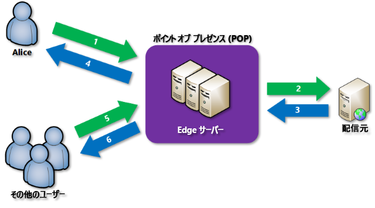

<properties
	pageTitle="Azure CDN の概要"
	description="Azure Content Delivery Network (CDN) の概要と、CDN を使用して BLOB と静的コンテンツをキャッシュして高帯域幅コンテンツを配信する方法について説明します。"
	services="cdn"
	documentationCenter=".NET"
	authors="camsoper"
	manager="erikre"
	editor=""/>

<tags
	ms.service="cdn"
	ms.workload="tbd"
	ms.tgt_pltfrm="na"
	ms.devlang="na"
	ms.topic="hero-article"
	ms.date="04/15/2016" 
	ms.author="casoper"/>

# Azure Content Delivery Network (CDN) の概要

Azure Content Delivery Network (CDN) では、Web サイトで使用される Azure の BLOB と静的コンテンツを戦略的に配置された場所にキャッシュし、ユーザーへのコンテンツ配信に最大スループットを使用できます。CDN では、世界各地の物理ノードにコンテンツをキャッシュすることによって、高帯域幅コンテンツを配信するためのグローバル ソリューションを開発者に提供します。現在の CDN ノードの場所の一覧については、[Azure POP ノードの場所](cdn-pop-locations.md)に関するページを参照してください。

CDN を使用して Azure データをキャッシュすると、次のような利点があります。

- エンド ユーザーのパフォーマンスとユーザー エクスペリエンスの向上。コンテンツの読み込みに複数のラウンドトリップか必要なアプリケーションを使用する場合は特にそうです。
- 製品発表イベントの開始時のような、瞬間的高負荷を処理しやすくする大型のスケーリング。
- ユーザー要求を分散させ、コンテンツをエッジ サーバーから配信することによる、配信元へのトラフィックの削減。

## 動作のしくみ

1. ユーザー (Alice) は、特殊なドメイン名 (`<endpointname>.azureedge.net` など) の URL を使用して、ファイル (資産とも呼ばれます) を要求します。DNS は、パフォーマンスが最高の Point-of-Presence (POP) の場所に要求をルーティングします。通常は、ユーザーに地理的に最も近い位置にある POP です。

2. POP のエッジ サーバーのキャッシュにファイルがない場合、エッジ サーバーは配信元にあるファイルを要求します。配信元は、Azure Web App、Azure Cloud Service、Azure ストレージ アカウント、またはパブリックにアクセスできる Web サーバーです。

3. 配信元からエッジ サーバーに対して、ファイルの有効期間 (TTL) を記述したオプションの HTTP ヘッダーなどのファイルが戻されます。

4. エッジ サーバーはファイルをキャッシュし、ファイルを要求元 (Alice) に返します。TTL が期限切れになるまで、ファイルはエッジ サーバーにキャッシュされた状態になります。配信元で TTL を指定していなかった場合、既定の TTL は 7 日間です。

5. その他のユーザー (Bob など) が同じ URL を使用して同じファイルを要求し、同じ POP に転送することもできます。

6. ファイルの TTL が期限切れになっていない場合、エッジ サーバーはキャッシュのファイルを返します。その結果、応答時間が短縮されます。

## Standard の機能

Standard CDN レベルには、以下の機能が含まれます。

- [Storage](cdn-create-a-storage-account-with-cdn.md)、[Cloud Services](cdn-cloud-service-with-cdn.md)、[Web Apps](../app-service-web/cdn-websites-with-cdn.md)、[Media Services](../media-services/media-services-manage-origins.md#enable_cdn) などの Azure サービスと簡単に統合
- HTTPS のサポート
- 負荷分散
- DDOS 保護
- [クエリ文字列のキャッシュ](cdn-query-string.md)
- [カスタム ドメイン名のサポート](cdn-map-content-to-custom-domain.md)
- [国のフィルタリング](cdn-restrict-access-by-country.md)
- [コア分析](cdn-analyze-usage-patterns.md)
- [高速消去](cdn-purge-endpoint.md)
- [資産の事前読み込み](cdn-preload-endpoint.md)
- [REST API を介した管理](https://msdn.microsoft.com/library/mt634456.aspx)

## Premium の機能

Premium CDN レベルには Standard レベルのすべての機能に加え、以下の機能があります。

- [カスタマイズ可能なルール ベースのコンテンツ配信エンジン](cdn-rules-engine.md)
- [詳細な HTTP レポート](cdn-advanced-http-reports.md)
- [リアルタイム統計](cdn-real-time-stats.md)

## 次のステップ

CDN の概要については、「[Azure の Content Delivery Network (CDN) を有効にする方法](./cdn-create-new-endpoint.md)」を参照してください。

既存の CDN 顧客は、[Microsoft Azure ポータル](https://portal.azure.com)から CDN エンドポイントを管理できるようになりました。

実際の CDN の効果については、[Build 2016 セッションのビデオ](https://azure.microsoft.com/documentation/videos/build-2016-leveraging-the-new-azure-cdn-apis-to-build-wicked-fast-applications/)をご覧ください。

<!---HONumber=AcomDC_0504_2016-->