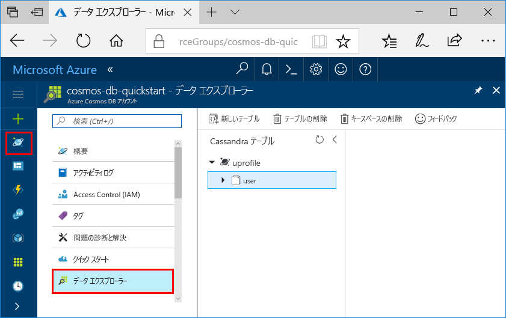

# <a name="quickstart-build-a-cassandra-app-with-net-and-azure-cosmos-db"></a>クイックスタート: .NET と Azure Cosmos DB で Cassandra アプリをビルドする

このクイックスタートでは、GitHub から例を複製することで、.NET と Azure Cosmos DB の [Cassandra API](cassandra-introduction.md) を使用してプロファイル アプリを作成する方法を示します。 このクイックスタートでは、Web ベースの Azure Portal を使って Azure Cosmos DB アカウントを作成する手順についても説明します。   

Azure Cosmos DB は、Microsoft のグローバルに分散されたマルチモデル データベース サービスです。 Azure Cosmos DB の中核をなすグローバルな分散と水平方向のスケール機能を利用して、ドキュメント、テーブル、キーと値、およびグラフ データベースをすばやく作成およびクエリできます。 

## <a name="prerequisites"></a>前提条件

Azure Cosmos DB Cassandra API プレビュー プログラムにアクセスする必要があります。 まだアクセスを申し込んでいない場合は、[今すぐサインアップ](https://aka.ms/cosmosdb-cassandra-signup)してください。

まだ Visual Studio 2017 をインストールしていない場合は、**無料**の [Visual Studio 2017 Community エディション](https://www.visualstudio.com/downloads/)をダウンロードして使用できます。 Visual Studio のセットアップ中に、必ず **[Azure の開発]** を有効にしてください。

[!INCLUDE [quickstarts-free-trial-note](../../includes/quickstarts-free-trial-note.md)]または、Azure サブスクリプションを使わず、課金も契約もなしで [Azure Cosmos DB を無料で試す](https://azure.microsoft.com/try/cosmosdb/)ことができます。

[Git](https://www.git-scm.com/) をインストールして例を複製します。

<a id="create-account"></a>
## <a name="create-a-database-account"></a>How to create a DocumentDB account (DocumentDB アカウントの作成方法)

[!INCLUDE [cosmos-db-create-dbaccount-cassandra](../../includes/cosmos-db-create-dbaccount-cassandra.md)]


## <a name="clone-the-sample-application"></a>サンプル アプリケーションの複製

次は、コードを使った作業に移りましょう。 GitHub から Cassandra API アプリを複製し、接続文字列を設定して実行します。 プログラムでデータを処理することが非常に簡単であることがわかります。 

1. git bash などの git ターミナル ウィンドウを開き、`cd` コマンドを使用して、サンプル アプリをインストールするフォルダーに変更します。 

    ```bash
    cd "C:\git-samples"
    ```

2. 次のコマンドを実行して、サンプル レポジトリを複製します。 このコマンドは、コンピューター上にサンプル アプリのコピーを作成します。

    ```bash
    git clone https://github.com/Azure-Samples/azure-cosmos-db-cassandra-dotnet-getting-started.git
    ```

3. Visual Studio で CassandraQuickStartSample ソリューション ファイルを開きます。 

## <a name="review-the-code"></a>コードの確認

この手順は省略可能です。 コード内のデータベース リソースの作成方法に関心がある場合は、次のスニペットを確認できます。 これらのスニペットはすべて C:\git-samples\azure-cosmos-db-cassandra-dotnet-getting-started\CassandraQuickStartSample フォルダーにインストールされている `Program.cs` ファイルのものです。 関心がない場合は、「[接続文字列の更新](#update-your-connection-string)」に進んでください。

* Cassandra クラスター エンドポイントに接続することによって、セッションを初期化します。 Azure Cosmos DB の Cassandra API は、TLSv1.2 のみをサポートしています。 

  ```csharp
   var options = new Cassandra.SSLOptions(SslProtocols.Tls12, true, ValidateServerCertificate);
   options.SetHostNameResolver((ipAddress) => CassandraContactPoint);
   Cluster cluster = Cluster.Builder().WithCredentials(UserName, Password).WithPort(CassandraPort).AddContactPoint(CassandraContactPoint).WithSSL(options).Build();
   ISession session = cluster.Connect();
   ```

* 新しいキースペースを作成します。

    ```csharp
    session.Execute("CREATE KEYSPACE uprofile WITH REPLICATION = { 'class' : 'NetworkTopologyStrategy', 'datacenter1' : 1 };"); 
    ```

* 新しいテーブルを作成します。

   ```csharp
  session.Execute("CREATE TABLE IF NOT EXISTS uprofile.user (user_id int PRIMARY KEY, user_name text, user_bcity text)");
   ```

* uprofile キースペースに接続する新しいセッションで IMapper オブジェクトを使用し、ユーザーのエンティティを挿入します。

    ```csharp
    mapper.Insert<User>(new User(1, "LyubovK", "Dubai"));
    ```
    
* すべてのユーザーの情報を取得するクエリを実行します。

    ```csharp
   foreach (User user in mapper.Fetch<User>("Select * from user"))
   {
      Console.WriteLine(user);
   }
    ```
    
 * 1 ユーザーの情報を取得するクエリを実行します。

    ```csharp
    mapper.FirstOrDefault<User>("Select * from user where user_id = ?", 3);
    ```

## <a name="update-your-connection-string"></a>接続文字列の更新

ここで Azure Portal に戻り、接続文字列情報を取得し、アプリにコピーします。 アプリはこの接続文字列情報によって、ホストされているデータベースと通信できます。

1. [Azure Portal](http://portal.azure.com/) で **[接続文字列]** をクリックします。 

    画面右側の  を使用してユーザー名の値をコピーします。

    ![Azure Portal の [接続文字列] ページでアクセス　キー名を表示してコピー](./media/create-cassandra-dotnet/keys.png)

2. Visual Studio 2017 で Program.cs ファイルを開きます。 

3. 13 行目の `<FILLME>` にポータルのユーザー名の値を貼り付けます。

    Program.cs の 13 行目は次のようになります。 

    `private const string UserName = "cosmos-db-quickstart";`

3. ポータルに戻り、パスワードの値をコピーします。 14 行目の `<FILLME>` にポータルのパスワードの値を貼り付けます。

    Program.cs の 14 行目は次のようになります。 

    `private const string Password = "2Ggkr662ifxz2Mg...==";`

4. ポータルに戻り、コンタクト ポイントの値をコピーします。 15 行目の `<FILLME>` にポータルのコンタクト ポイントの値を貼り付けます。

    Program.cs の 15 行目は次のようになります。 

    `private const string CassandraContactPoint = "cosmos-db-quickstarts.documents.azure.com"; //  DnsName`

5. Program.cs ファイルを保存します。
    
## <a name="run-the-app"></a>アプリの実行

1. Visual Studio で、**[ツール]** > **[NuGet パッケージ マネージャー]** > **[パッケージ マネージャー コンソール]** の順にクリックします。

2. コマンド プロンプトで、次のコマンドを使って .NET ドライバーの NuGet パッケージをインストールします。 

    ```cmd
    Install-Package CassandraCSharpDriver
    ```
3. Ctrl + F5 キーを押してアプリケーションを実行します。 コンソール ウィンドウにアプリが表示されます。 

    

    Ctrl + C キーを押してプログラムの実行を停止し、コンソール ウィンドウを閉じます。 
    
    これで、Azure Portal でデータ エクスプローラーを開いて、この新しいデータの表示、クエリ、変更、操作を行うことができます。 

    

## <a name="review-slas-in-the-azure-portal"></a>Azure Portal での SLA の確認

[!INCLUDE [cosmosdb-tutorial-review-slas](../../includes/cosmos-db-tutorial-review-slas.md)]

## <a name="clean-up-resources"></a>リソースのクリーンアップ

[!INCLUDE [cosmosdb-delete-resource-group](../../includes/cosmos-db-delete-resource-group.md)]

## <a name="next-steps"></a>次のステップ

このクイックスタートでは、Azure Cosmos DB アカウントを作成し、データ エクスプローラーを使用してコレクションを作成し、Web アプリを実行する方法を説明しました。 これで、Cosmos DB アカウントに追加のデータをインポートできます。 

> [!div class="nextstepaction"]
> [Azure Cosmos DB への Cassandra データのインポート](cassandra-import-data.md)
