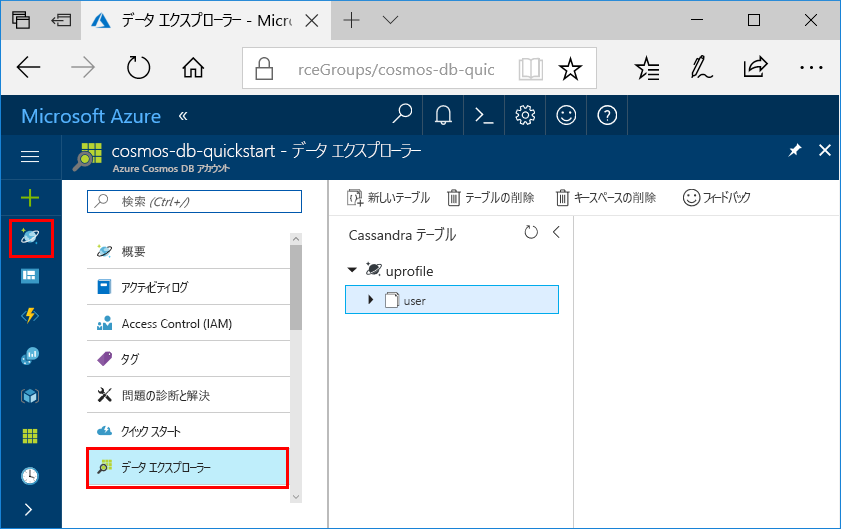

# <a name="quickstart-build-a-cassandra-app-with-nodejs-and-azure-cosmos-db"></a>クイックスタート: Node.js と Azure Cosmos DB で Cassandra アプリを構築する

このクイックスタートでは、GitHub から例を複製することで、Node.js と Azure Cosmos DB の [Cassandra API](cassandra-introduction.md) を使ってプロファイル アプリを作成する方法を示します。 このクイックスタートでは、Web ベースの Azure Portal を使って Azure Cosmos DB アカウントを作成する手順についても説明します。

Azure Cosmos DB は、Microsoft のグローバルに分散されたマルチモデル データベース サービスです。 Azure Cosmos DB の中核をなすグローバルな分散と水平方向のスケール機能を利用して、ドキュメント、テーブル、キーと値、およびグラフ データベースをすばやく作成およびクエリできます。 

## <a name="prerequisites"></a>前提条件

[!INCLUDE [quickstarts-free-trial-note](../../includes/quickstarts-free-trial-note.md)]または、Azure サブスクリプションを使わず、課金も契約もなしで [Azure Cosmos DB を無料で試す](https://azure.microsoft.com/try/cosmosdb/)ことができます。

Azure Cosmos DB Cassandra API プレビュー プログラムにアクセスする必要があります。 まだアクセスを申し込んでいない場合は、[今すぐサインアップ](cassandra-introduction.md#sign-up-now)してください。

加えて次の作業を行います。
* [Node.js](https://nodejs.org/en/) バージョン v0.10.29 以降
* [Git](http://git-scm.com/)

## <a name="create-a-database-account"></a>データベース アカウントの作成

ドキュメント データベースを作成するには、Azure Cosmos DB を含んだ Cassandra アカウントを事前に作成しておく必要があります。

[!INCLUDE [cosmos-db-create-dbaccount-cassandra](../../includes/cosmos-db-create-dbaccount-cassandra.md)]

## <a name="clone-the-sample-application"></a>サンプル アプリケーションの複製

GitHub から Cassandra API アプリを複製し、接続文字列を設定して実行します。 プログラムでデータを処理することが非常に簡単であることがわかります。 

1. コマンド プロンプトを開いて git-samples という名前の新しいフォルダーを作成し、コマンド プロンプトを閉じます。

    ```bash
    md "C:\git-samples"
    ```

2. git bash などの git ターミナル ウィンドウを開いて、`cd` コマンドを使用して、サンプル アプリをインストールする新しいフォルダーに変更します。

    ```bash
    cd "C:\git-samples"
    ```

3. 次のコマンドを実行して、サンプル レポジトリを複製します。 このコマンドは、コンピューター上にサンプル アプリのコピーを作成します。

    ```bash
    git clone https://github.com/Azure-Samples/azure-cosmos-db-cassandra-nodejs-getting-started.git
    ```

## <a name="review-the-code"></a>コードの確認

この手順は省略可能です。 コード内のデータベース リソースの作成方法に関心がある場合は、次のスニペットを確認できます。 これらのスニペットはすべて、C:\git-samples\azure-cosmos-db-cassandra-nodejs-getting-started フォルダーの uprofile.js ファイルからのものです。 関心がない場合は、「[接続文字列の更新](#update-your-connection-string)」に進んでください。 

* ユーザー名とパスワードは、Azure Portal の接続文字列ページを使って設定します。 "path\to\cert" では、X509 証明書へのパスを指定します。 

   ```nodejs
   var ssl_option = {
        cert : fs.readFileSync("path\to\cert"),
        rejectUnauthorized : true,
        secureProtocol: 'TLSv1_2_method'
        };
   const authProviderLocalCassandra = new cassandra.auth.PlainTextAuthProvider(config.username, config.password);
   ```

* `client` は、contactPoint の情報で初期化されます。 ContactPoint は、Azure Portal から取得されます。

    ```nodejs
    const client = new cassandra.Client({contactPoints: [config.contactPoint], authProvider: authProviderLocalCassandra, sslOptions:ssl_option});
    ```

* `client` は、Azure Cosmos DB の Cassandra API に接続します。

    ```nodejs
    client.connect(next);
    ```

* 新しいキースペースが作成されます。

    ```nodejs
    function createKeyspace(next) {
        var query = "CREATE KEYSPACE IF NOT EXISTS uprofile WITH replication = {\'class\': \'NetworkTopologyStrategy\', \'datacenter1\' : \'1\' }";
        client.execute(query, next);
        console.log("created keyspace");    
  }
    ```

* 新しいテーブルが作成されます。

   ```nodejs
   function createTable(next) {
    var query = "CREATE TABLE IF NOT EXISTS uprofile.user (user_id int PRIMARY KEY, user_name text, user_bcity text)";
        client.execute(query, next);
        console.log("created table");
   },
   ```

* キー/値エンティティが挿入されます。

    ```nodejs
    ...
       {
          query: 'INSERT INTO  uprofile.user  (user_id, user_name , user_bcity) VALUES (?,?,?)',
          params: [5, 'IvanaV', 'Belgaum', '2017-10-3136']
        }
    ];
    client.batch(queries, { prepare: true}, next);
    ```

* クエリを実行して、すべてのキー値を取得します。

    ```nodejs
   var query = 'SELECT * FROM uprofile.user';
    client.execute(query, { prepare: true}, function (err, result) {
      if (err) return next(err);
      result.rows.forEach(function(row) {
        console.log('Obtained row: %d | %s | %s ',row.user_id, row.user_name, row.user_bcity);
      }, this);
      next();
    });
    ```  
    
* クエリを実行して、キーの値を取得します。

    ```nodejs
    function selectById(next) {
        console.log("\Getting by id");
        var query = 'SELECT * FROM uprofile.user where user_id=1';
        client.execute(query, { prepare: true}, function (err, result) {
        if (err) return next(err);
            result.rows.forEach(function(row) {
            console.log('Obtained row: %d | %s | %s ',row.user_id, row.user_name, row.user_bcity);
        }, this);
        next();
        });
    }
    ```  

## <a name="update-your-connection-string"></a>接続文字列を更新する

ここで Azure Portal に戻り、接続文字列情報を取得し、アプリにコピーします。 これでアプリが、ホストされているデータベースと通信できます。

1. [Azure Portal](http://portal.azure.com/) で **[接続文字列]** をクリックします。 

    画面右側の  ボタンを使って、一番上にある [CONTACT POINT]\(コンタクト ポイント\) の値をコピーします。

    ![Azure Portal の [接続文字列] ページに表示されているコンタクト ポイント、ユーザー名、パスワードをコピーする](./media/create-cassandra-nodejs/keys.png)

2. `config.js` ファイルを開きます。 

3. 4 行目の `<FillMEIN>` にポータルのコンタクト ポイントの値を貼り付けます。

    4 行目は次のようになります。 

    `config.contactPoint = "cosmos-db-quickstarts.cassandra.cosmosdb.azure.com:10350"`

4. ポータルの [USERNAME]\(ユーザー名\) の値をコピーし、2 行目の `<FillMEIN>` に貼り付けます。

    2 行目は次のようになります。 

    `config.username = 'cosmos-db-quickstart';`
    
5. ポータルの [PASSWORD]\(パスワード\) の値をコピーし、3 行目の `<FillMEIN>` に貼り付けます。

    3 行目は次のようになります。

    `config.password = '2Ggkr662ifxz2Mg==';`

6. config.js ファイルを保存します。
    
## <a name="use-the-x509-certificate"></a>X509 証明書を使う 

1. Baltimore CyberTrust Root を追加する必要がある場合、そのシリアル番号は ‎02:00:00:b9、SHA1 フィンガープリントは d4🇩🇪20:d0:5e:66:fc:53:fe:1a:50:88:2c:78:db:28:52:ca:e4:74 です。 これは https://cacert.omniroot.com/bc2025.crt からダウンロードし、拡張子が .cer のローカル ファイルに保存できます。 

2. uprofile.js を開き、"path\to\cert" を新しい証明書を示すように変更します。 

3. uprofile.js を保存します。 

## <a name="run-the-app"></a>アプリの実行

1. git ターミナル ウィンドウで `npm install` を実行して、必要な npm モジュールをインストールします。

2. `node uprofile.js` を実行して、node アプリケーションを起動します。

3. コマンド ラインから予想される結果を確認します。

    

    Ctrl + C キーを押してプログラムの実行を停止し、コンソール ウィンドウを閉じます。 

    これで、Azure Portal でデータ エクスプローラーを開いて、この新しいデータの表示、クエリ、変更、操作を行うことができます。 

     

## <a name="review-slas-in-the-azure-portal"></a>Azure Portal での SLA の確認

[!INCLUDE [cosmosdb-tutorial-review-slas](../../includes/cosmos-db-tutorial-review-slas.md)]

## <a name="clean-up-resources"></a>リソースのクリーンアップ

[!INCLUDE [cosmosdb-delete-resource-group](../../includes/cosmos-db-delete-resource-group.md)]

## <a name="next-steps"></a>次の手順

このクイック スタートでは、Azure Cosmos DB アカウントを作成し、データ エクスプローラーを使用してコレクションを作成し、アプリを実行する方法を説明しました。 これで、Cosmos DB アカウントに追加のデータをインポートできます。 

> [!div class="nextstepaction"]
> [Azure Cosmos DB への Cassandra データのインポート](cassandra-import-data.md)


