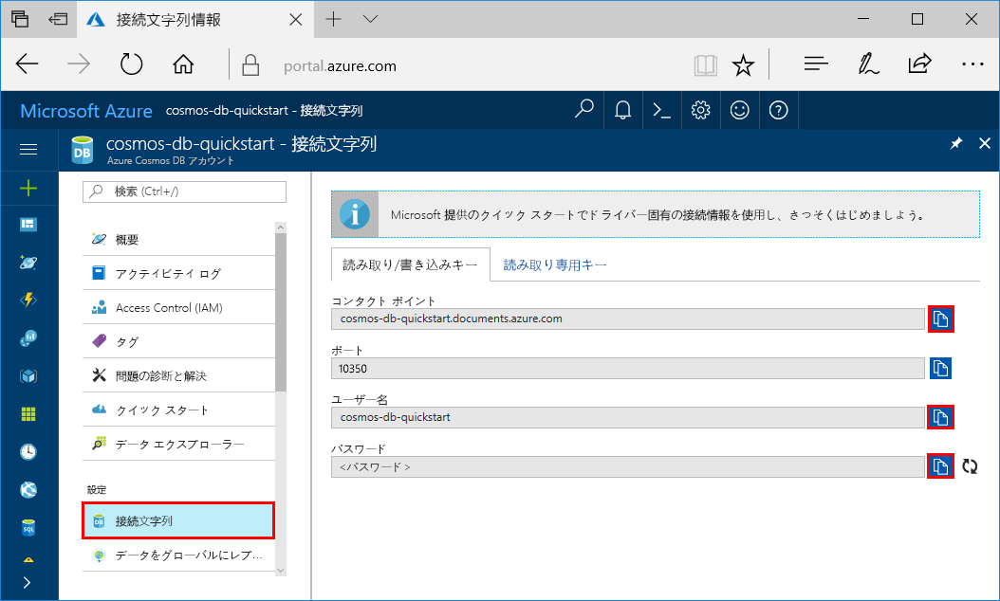
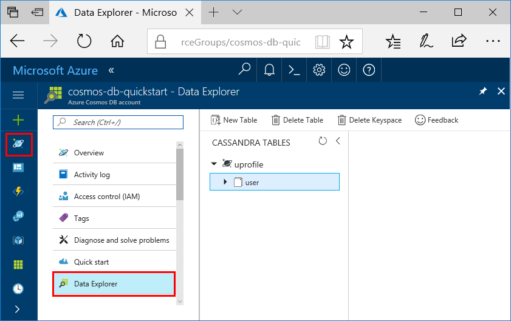

# <a name="quickstart-build-a-cassandra-app-with-python-and-azure-cosmos-db"></a>クイックスタート: Python と Azure Cosmos DB で Cassandra アプリを構築する

このクイックスタートでは、GitHub から例を複製することで、Python と Azure Cosmos DB の [Cassandra API](cassandra-introduction.md) を使ってプロファイル アプリを作成する方法を示します。 このクイックスタートでは、Web ベースの Azure Portal を使って Azure Cosmos DB アカウントを作成する手順についても説明します。

Azure Cosmos DB は、Microsoft のグローバルに分散されたマルチモデル データベース サービスです。 Azure Cosmos DB の中核をなすグローバルな分散と水平方向のスケール機能を利用して、ドキュメント、テーブル、キーと値、およびグラフ データベースをすばやく作成およびクエリできます。   

## <a name="prerequisites"></a>前提条件

[!INCLUDE [quickstarts-free-trial-note](../../includes/quickstarts-free-trial-note.md)]または、Azure サブスクリプションを使わず、課金も契約もなしで [Azure Cosmos DB を無料で試す](https://azure.microsoft.com/try/cosmosdb/)ことができます。

Azure Cosmos DB Cassandra API プレビュー プログラムにアクセスする必要があります。 まだアクセスを申し込んでいない場合は、[今すぐサインアップ](cassandra-introduction.md#sign-up-now)してください。

加えて次の作業を行います。
* [Python](https://www.python.org/downloads/) バージョン v2.7.14
* [Git](http://git-scm.com/)
* [Apache Cassandra 用 Python ドライバー](https://github.com/datastax/python-driver)

## <a name="create-a-database-account"></a>データベース アカウントの作成

ドキュメント データベースを作成するには、Azure Cosmos DB を含んだ Cassandra アカウントを事前に作成しておく必要があります。

[!INCLUDE [cosmos-db-create-dbaccount-cassandra](../../includes/cosmos-db-create-dbaccount-cassandra.md)]

## <a name="clone-the-sample-application"></a>サンプル アプリケーションの複製

GitHub から Cassandra API アプリを複製し、接続文字列を設定して実行します。 プログラムでデータを処理することが非常に簡単であることがわかります。 

1. コマンド プロンプトを開いて git-samples という名前の新しいフォルダーを作成し、コマンド プロンプトを閉じます。

    ```bash
    md "C:\git-samples"
    ```

2. git bash などの git ターミナル ウィンドウを開いて、`cd` コマンドを使用して、サンプル アプリをインストールする新しいフォルダーに変更します。

    ```bash
    cd "C:\git-samples"
    ```

3. 次のコマンドを実行して、サンプル レポジトリを複製します。 このコマンドは、コンピューター上にサンプル アプリのコピーを作成します。

    ```bash
    git clone https://github.com/Azure-Samples/azure-cosmos-db-cassandra-python-getting-started.git
    ```

## <a name="review-the-code"></a>コードの確認

この手順は省略可能です。 コード内のデータベース リソースの作成方法に関心がある場合は、次のスニペットを確認できます。 スニペットはすべて pyquickstart.py ファイルから取得します。 関心がない場合は、「[接続文字列の更新](#update-your-connection-string)」に進んでください。 

* ユーザー名とパスワードは、Azure Portal の接続文字列ページを使って設定します。 path\to\cert を X509 証明書へのパスに置き換えます。

   ```python
    ssl_opts = {
            'ca_certs': 'path\to\cert',
            'ssl_version': ssl.PROTOCOL_TLSv1_2
            }
    auth_provider = PlainTextAuthProvider( username=cfg.config['username'], password=cfg.config['password'])
    cluster = Cluster([cfg.config['contactPoint']], port = cfg.config['port'], auth_provider=auth_provider, ssl_options=ssl_opts)
    session = cluster.connect()
   
   ```

* `cluster` は、contactPoint の情報で初期化されます。 ContactPoint は、Azure Portal から取得されます。

    ```python
   cluster = Cluster([cfg.config['contactPoint']], port = cfg.config['port'], auth_provider=auth_provider)
    ```

* `cluster` は、Azure Cosmos DB の Cassandra API に接続します。

    ```python
    session = cluster.connect()
    ```

* 新しいキースペースが作成されます。

    ```python
   session.execute('CREATE KEYSPACE IF NOT EXISTS uprofile WITH replication = {\'class\': \'NetworkTopologyStrategy\', \'datacenter1\' : \'1\' }')
    ```

* 新しいテーブルが作成されます。

   ```
   session.execute('CREATE TABLE IF NOT EXISTS uprofile.user (user_id int PRIMARY KEY, user_name text, user_bcity text)');
   ```

* キー/値エンティティが挿入されます。

    ```Python
    insert_data = session.prepare("INSERT INTO  uprofile.user  (user_id, user_name , user_bcity) VALUES (?,?,?)")
    batch = BatchStatement()
    batch.add(insert_data, (1, 'LyubovK', 'Dubai'))
    batch.add(insert_data, (2, 'JiriK', 'Toronto'))
    batch.add(insert_data, (3, 'IvanH', 'Mumbai'))
    batch.add(insert_data, (4, 'YuliaT', 'Seattle'))
    ....
    session.execute(batch)
    ```

* クエリを実行して、すべてのキー値を取得します。

    ```Python
    rows = session.execute('SELECT * FROM uprofile.user')
    ```  
    
* クエリを実行して、キーの値を取得します。

    ```Python
    
    rows = session.execute('SELECT * FROM uprofile.user where user_id=1')
    ```  

## <a name="update-your-connection-string"></a>接続文字列を更新する

ここで Azure Portal に戻り、接続文字列情報を取得し、アプリにコピーします。 これでアプリが、ホストされているデータベースと通信できます。

1. [Azure Portal](http://portal.azure.com/) で **[接続文字列]** をクリックします。 

    画面右側の  ボタンを使って、一番上にある [CONTACT POINT]\(コンタクト ポイント\) の値をコピーします。

    

2. `config.py` ファイルを開きます。 

3. 10 行目の `<FILLME>` にポータルのコンタクト ポイントの値を貼り付けます。

    10 行目は次のようになります。 

    `'contactPoint': 'cosmos-db-quickstarts.cassandra.cosmosdb.azure.com:10350'`

4. ポータルの [USERNAME]\(ユーザー名\) の値をコピーし、6 行目の `<FILLME>` に貼り付けます。

    6 行目は次のようになります。 

    `'username': 'cosmos-db-quickstart',`
    
5. ポータルの [PASSWORD]\(パスワード\) の値をコピーし、8 行目の `<FILLME>` に貼り付けます。

    8 行目は次のようになります。

    `'password' = '2Ggkr662ifxz2Mg==`';`

6. config.py ファイルを保存します。
    
## <a name="use-the-x509-certificate"></a>X509 証明書を使う

1. Baltimore CyberTrust Root を追加する必要がある場合、そのシリアル番号は ‎02:00:00:b9、SHA1 フィンガープリントは d4🇩🇪20:d0:5e:66:fc:53:fe:1a:50:88:2c:78:db:28:52:ca:e4:74 です。 これは https://cacert.omniroot.com/bc2025.crt からダウンロードし、拡張子が .cer のローカル ファイルに保存できます

2. pyquickstart.py を開き、"path\to\cert" を新しい証明書を示すように変更します。

3. pyquickstart.py を保存します。

## <a name="run-the-app"></a>アプリの実行

1. git ターミナルで cd コマンドを使って、azure-cosmos-db-cassandra-python-getting-started フォルダーに変更します。 

2. 次のコマンドを実行して、必要なモジュールをインストールします。

    ```python
    python -m pip install cassandra-driver
    python -m pip install prettytable
    python -m pip install requests
    python -m pip install pyopenssl
    ```

2. 次のコマンドを実行して、node アプリケーションを開始します。

    ```
    python pyquickstart.py
    ```

3. コマンド ラインから予想される結果を確認します。

    Ctrl + C キーを押してプログラムの実行を停止し、コンソール ウィンドウを閉じます。 

    
    
    これで、Azure Portal でデータ エクスプローラーを開いて、この新しいデータの表示、クエリ、変更、操作を行うことができます。 

    

## <a name="review-slas-in-the-azure-portal"></a>Azure Portal での SLA の確認

[!INCLUDE [cosmosdb-tutorial-review-slas](../../includes/cosmos-db-tutorial-review-slas.md)]

## <a name="clean-up-resources"></a>リソースのクリーンアップ

[!INCLUDE [cosmosdb-delete-resource-group](../../includes/cosmos-db-delete-resource-group.md)]

## <a name="next-steps"></a>次の手順

このクイック スタートでは、Azure Cosmos DB アカウントを作成し、データ エクスプローラーを使用してコレクションを作成し、アプリを実行する方法を説明しました。 これで、Cosmos DB アカウントに追加のデータをインポートできます。 

> [!div class="nextstepaction"]
> [Azure Cosmos DB への Cassandra データのインポート](cassandra-import-data.md)

