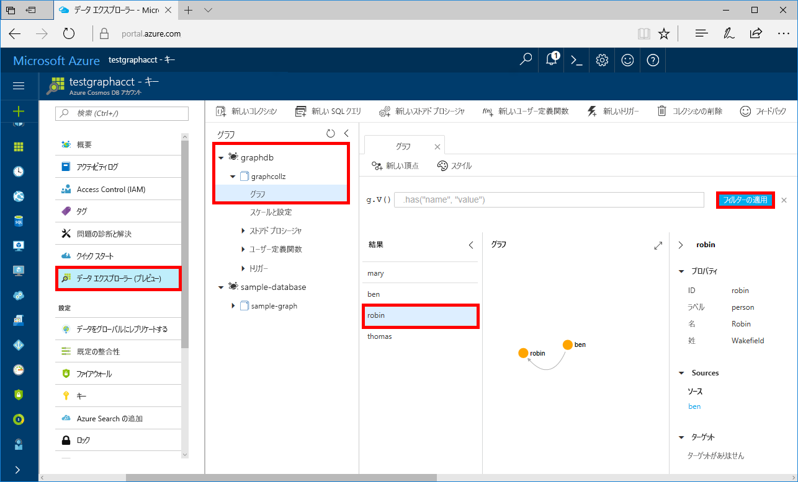

# <a name="azure-cosmos-db-build-a-net-framework-or-core-application-using-the-graph-api"></a>Azure Cosmos DB: Graph API を使用して .NET Framework アプリケーションまたは .NET Core アプリケーションを構築する

Azure Cosmos DB は、Microsoft のグローバルに配布されるマルチモデル データベース サービスです。 Azure Cosmos DB の中核をなすグローバル配布と水平方向のスケール機能を活用して、ドキュメント、キー/値、およびグラフ データベースをすばやく作成および照会できます。 

このクイック スタートでは、Azure Portal を使用した Azure Cosmos DB [Graph API](graph-introduction.md) アカウント、データベース、およびグラフ (コンテナー) の作成方法を説明します。 その後、オープンソース ドライバーの [Gremlin.Net](http://tinkerpop.apache.org/docs/3.2.7/reference/#gremlin-DotNet) を使用して、コンソール アプリを構築し実行します。  

## <a name="prerequisites"></a>前提条件

まだ Visual Studio 2017 をインストールしていない場合は、**無料**の [Visual Studio 2017 Community エディション](https://www.visualstudio.com/downloads/)をダウンロードして使用できます。 Visual Studio のセットアップ中に、必ず **[Azure の開発]** を有効にしてください。

Visual Studio 2017 がインストール済みである場合は、[Visual Studio 2017 Update 3](https://www.visualstudio.com/en-us/news/releasenotes/vs2017-relnotes) までインストールされていることを確認してください。

[!INCLUDE [quickstarts-free-trial-note](../../includes/quickstarts-free-trial-note.md)]

## <a name="create-a-database-account"></a>データベース アカウントの作成

[!INCLUDE [cosmos-db-create-dbaccount-graph](../../includes/cosmos-db-create-dbaccount-graph.md)]

## <a name="add-a-graph"></a>グラフの追加

[!INCLUDE [cosmos-db-create-graph](../../includes/cosmos-db-create-graph.md)]

## <a name="clone-the-sample-application"></a>サンプル アプリケーションの複製

GitHub から Graph API アプリの複製を作成し、接続文字列を設定して実行します。 プログラムでデータを処理することが非常に簡単であることがわかります。 

1. git ターミナル ウィンドウ (git bash など) を開き、`cd` を実行して作業ディレクトリに移動します。  

2. 次のコマンドを実行して、サンプル レポジトリを複製します。 

    ```bash
    git clone https://github.com/Azure-Samples/azure-cosmos-db-graph-gremlindotnet-getting-started.git
    ```

3. 次に、Visual Studio を開いてソリューション ファイルを開きます。

4. プロジェクト内の NuGet パッケージを復元します。 これには、Gremlin.Net ドライバーと Newtonsoft.Json パッケージを含める必要があります。

5. また、Nuget パッケージ マネージャーまたは [nuget コマンド ライン ユーティリティ](https://docs.microsoft.com/en-us/nuget/install-nuget-client-tools)を使用して、Gremlin.Net ドライバー (バージョン 3.2.7) を手動でインストールすることもできます。 

    ```bash
    nuget install Gremlin.Net -Version 3.2.7
    ```

## <a name="review-the-code"></a>コードの確認

アプリで何が行われているかを簡単に確認してみましょう。 Program.cs ファイルを開くと、以下のコード行によって、Azure Cosmos DB リソースが作成されていることがわかります。 

* 上で作成したアカウントに基づいて接続パラメーターを設定します (19 行目)。 

    ```csharp
    private static string hostname = "your-endpoint.gremlin.cosmosdb.azure.com";
    private static int port = 443;
    private static string authKey = "your-authentication-key";
    private static string database = "your-database";
    private static string collection = "your-collection-or-graph";
    ```

* 実行される Gremlin コマンドの一覧は、Dictionary に記述されています (26 行目)。

    ```csharp
    private static Dictionary<string, string> gremlinQueries = new Dictionary<string, string>
    {
        { "Cleanup",        "g.V().drop()" },
        { "AddVertex 1",    "g.addV('person').property('id', 'thomas').property('firstName', 'Thomas').property('age', 44)" },
        { "AddVertex 2",    "g.addV('person').property('id', 'mary').property('firstName', 'Mary').property('lastName', 'Andersen').property('age', 39)" },
        { "AddVertex 3",    "g.addV('person').property('id', 'ben').property('firstName', 'Ben').property('lastName', 'Miller')" },
        { "AddVertex 4",    "g.addV('person').property('id', 'robin').property('firstName', 'Robin').property('lastName', 'Wakefield')" },
        { "AddEdge 1",      "g.V('thomas').addE('knows').to(g.V('mary'))" },
        { "AddEdge 2",      "g.V('thomas').addE('knows').to(g.V('ben'))" },
        { "AddEdge 3",      "g.V('ben').addE('knows').to(g.V('robin'))" },
        { "UpdateVertex",   "g.V('thomas').property('age', 44)" },
        { "CountVertices",  "g.V().count()" },
        { "Filter Range",   "g.V().hasLabel('person').has('age', gt(40))" },
        { "Project",        "g.V().hasLabel('person').values('firstName')" },
        { "Sort",           "g.V().hasLabel('person').order().by('firstName', decr)" },
        { "Traverse",       "g.V('thomas').out('knows').hasLabel('person')" },
        { "Traverse 2x",    "g.V('thomas').out('knows').hasLabel('person').out('knows').hasLabel('person')" },
        { "Loop",           "g.V('thomas').repeat(out()).until(has('id', 'robin')).path()" },
        { "DropEdge",       "g.V('thomas').outE('knows').where(inV().has('id', 'mary')).drop()" },
        { "CountEdges",     "g.E().count()" },
        { "DropVertex",     "g.V('thomas').drop()" },
    };
    ```


* 上で指定したパラメーターを使用して、`GremlinServer` 接続オブジェクトを作成します (52 行目)。

    ```csharp
    var gremlinServer = new GremlinServer(hostname, port, enableSsl: true, 
                                                    username: "/dbs/" + database + "/colls/" + collection, 
                                                    password: authKey);
    ```

* 新しい `GremlinClient` オブジェクトを作成します (56 行目)。

    ```csharp
    var gremlinClient = new GremlinClient(gremlinServer);
    ```

* 非同期タスクを持つ `GremlinClient` オブジェクトを使用して、各 Gremlin クエリを実行します (63 行目)。 これで、上で定義したディクショナリから Gremlin クエリが読み取られます (26 行目)。

    ```csharp
    var task = gremlinClient.SubmitAsync<dynamic>(query.Value);
    task.Wait();
    ```

* 結果を取得し、値を読み取ります。これらの値は、Newtonsoft.Json の `JsonSerializer` クラスを使用して、ディクショナリとして書式設定されています。

    ```csharp
    foreach (var result in task.Result)
    {
        // The vertex results are formed as dictionaries with a nested dictionary for their properties
        string output = JsonConvert.SerializeObject(result);
        Console.WriteLine(String.Format("\tResult:\n\t{0}", output));
    }
    ```

## <a name="update-your-connection-string"></a>接続文字列を更新する

ここで Azure Portal に戻り、接続文字列情報を取得し、アプリにコピーします。

1. [Azure Portal](http://portal.azure.com/) で **[キー]** をクリックします。 

    URI の値の最初の部分をコピーします。

    ![Azure Portal の [キー] ページでアクセス キーを表示およびコピーする](./media/create-graph-dotnet/keys.png)

2. Program.cs で、19 行目の `hostname` 変数の `your-endpoint` に値を貼り付けます。 

    `"private static string hostname = "your-endpoint.gremlin.cosmosdb.azure.com";`

    endpoint の値は次のようになります。

    `"private static string hostname = "testgraphacct.gremlin.cosmosdb.azure.com";`

3. ポータルで **PRIMARY KEY** 値をコピーし、`authkey` 変数に貼り付けて、21 行目の `"your-authentication-key"` プレースホルダーを置き換えます。 

    `private static string authKey = "your-authentication-key";`

4. 上で作成したデータベースの情報を使用して、22 行目の `database` 変数内にデータベース名を貼り付けます。 

    `private static string database = "your-database";`

5. 同様に、上で作成したコレクションの情報を使用して、23 行目の `collection` 変数内にコレクション (グラフ名でもあります) を貼り付けます。 

    `private static string collection = "your-collection-or-graph";`

6. Program.cs ファイルを保存します。 

これで、Azure Cosmos DB と通信するために必要なすべての情報でアプリを更新しました。 

## <a name="run-the-console-app"></a>コンソール アプリの実行

Ctrl + F5 キーを押してアプリケーションを実行します。 アプリケーションによって、Gremlin クエリ コマンドと結果の両方がコンソールに出力されます。

   コンソール ウィンドウには、グラフに追加されている頂点と辺が表示されます。 スクリプトが完了したら、Enter キーを押してコンソール ウィンドウを閉じます。

## <a name="browse-using-the-data-explorer"></a>データ エクスプローラーを使用した参照

次に、Azure Portal のデータ エクスプローラーに戻り、新しいグラフ データを参照しクエリできます。

1. データ エクスプローラーで新しいデータベースが [グラフ] ウィンドウに表示されます。 データベースとコレクションのノードを展開し、**[グラフ]** をクリックします。

2. **[フィルターの適用]** をクリックし、既定のクエリを使用してグラフのすべての頂点を表示します。 サンプル アプリで生成されたデータは、[グラフ] ウィンドウに表示されます。

    グラフは拡大または縮小できます。また、グラフ表示領域の拡大、頂点の追加、表示画面上での頂点の移動が可能です。

    

## <a name="review-slas-in-the-azure-portal"></a>Azure Portal での SLA の確認

[!INCLUDE [cosmosdb-tutorial-review-slas](../../includes/cosmos-db-tutorial-review-slas.md)]

## <a name="clean-up-resources"></a>リソースのクリーンアップ

このアプリの使用を続けない場合は、以下の手順に従い、Azure Portal でこのクイック スタートで作成したすべてのリソースを削除してください。 

1. Azure Portal の左側のメニューで、**[リソース グループ]** をクリックし、作成したリソースの名前をクリックします。 
2. リソース グループのページで **[削除]** をクリックし、削除するリソースの名前をテキスト ボックスに入力してから **[削除]** をクリックします。

## <a name="next-steps"></a>次の手順

このクイック スタートでは、Azure Cosmos DB アカウントを作成し、データ エクスプローラーを使用してグラフを作成し、アプリを実行する方法を説明しました。 これで Gremlin を使用して、さらに複雑なクエリを作成し、強力なグラフ トラバーサル ロジックを実装できます。 

> [!div class="nextstepaction"]
> [Gremlin を使用したクエリ](tutorial-query-graph.md)

