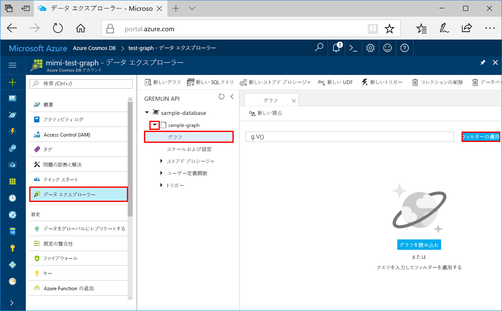
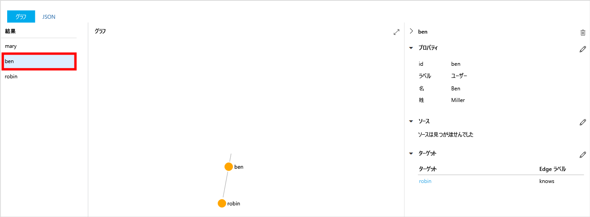
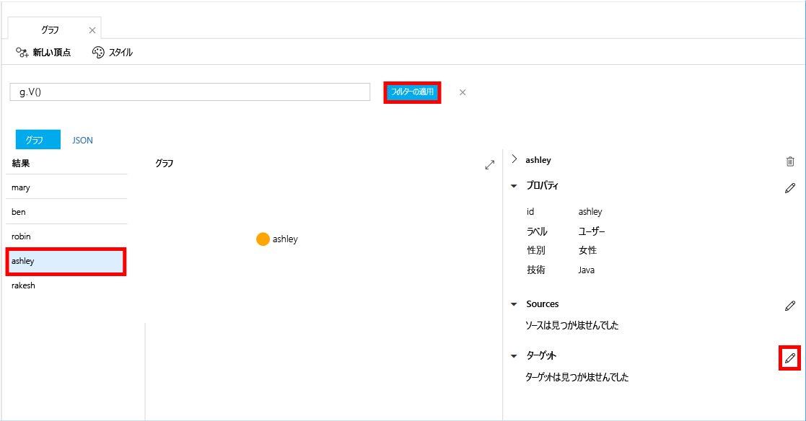
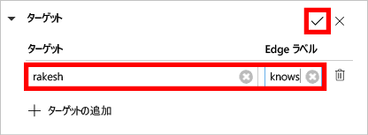

# <a name="azure-cosmos-db-create-a-graph-database-using-java-and-the-azure-portal"></a>Azure Cosmos DB: グラフ データベースを Java と Azure Portal で作成する

Azure Cosmos DB は、Microsoft のグローバルに分散されたマルチモデル データベース サービスです。 Azure Cosmos DB の中核をなすグローバルな分散と水平方向のスケール機能を利用して、ドキュメント、キー/値、およびグラフ データベースをすばやく作成およびクエリできます。 

このクイックスタートでは、Azure Cosmos DB 用の Azure Portal ツールを使ってグラフ データベースを作成します。 また、グラフ データベースを使った Java コンソール アプリを OSS [Gremlin Java](https://mvnrepository.com/artifact/org.apache.tinkerpop/gremlin-driver) ドライバーですばやく作成する方法も紹介します。 このクイックスタートの手順は、Java を実行できる任意のオペレーティング システムで使用できます。 このクイックスタートを完了すると、UI とプログラムのどちらか好きな方法で、グラフ リソースの作成と変更を行うことができるようになります。 

## <a name="prerequisites"></a>前提条件

* [Java Development Kit (JDK) 1.7 以降](http://www.oracle.com/technetwork/java/javase/downloads/jdk8-downloads-2133151.html)
    * Ubuntu で `apt-get install default-jdk` を実行して JDK をインストールします。
    * 必ず、JDK のインストール先フォルダーを指すように JAVA_HOME 環境変数を設定してください。
* [Maven](http://maven.apache.org/) バイナリ アーカイブの[ダウンロード](http://maven.apache.org/download.cgi)と[インストール](http://maven.apache.org/install.html)
    * Ubuntu で `apt-get install maven` を実行して Maven をインストールします。
* [Git](https://www.git-scm.com/)
    * Ubuntu で `sudo apt-get install git` を実行して Git をインストールします。

[!INCLUDE [quickstarts-free-trial-note](../../includes/quickstarts-free-trial-note.md)]

## <a name="create-a-database-account"></a>データベース アカウントの作成

グラフ データベースを作成するには、Azure Cosmos DB を含んだ Gremlin (グラフ) データベース アカウントを事前に作成しておく必要があります。

[!INCLUDE [cosmos-db-create-dbaccount-graph](../../includes/cosmos-db-create-dbaccount-graph.md)]

## <a name="add-a-graph"></a>グラフの追加

Azure Portal でデータ エクスプローラー ツールを使用してグラフ データベースを作成できるようになりました。 

1. Azure Portal の左側のナビゲーション メニューで、**[データ エクスプローラー (プレビュー)]** をクリックします。 
2. **[データ エクスプローラー (プレビュー)]** ブレードで **[New Graph]\(新しいグラフ\)** をクリックし、以下の情報を使用してページに必要事項を入力します。

    

    設定|推奨値|Description
    ---|---|---
    データベース ID|sample-database|新しいデータベースの ID。 データベース名は、1 - 255 文字である必要があります。また、`/ \ # ?` は使えず、末尾にスペースを入れることもできません。
    グラフ ID|sample-graph|新しいグラフの ID。 グラフ名の文字要件はデータベース ID と同じです。
    ストレージの容量| 10 GB|既定値をそのまま使用します。 これは、データベースの記憶域容量です。
    スループット|400 RU|既定値をそのまま使用します。 待ち時間を短縮する場合、後でスループットをスケールアップできます。
    RU/m|オフ|既定値をそのまま使用します。 後でワークロードの急増に対処する必要が生じた場合は、その時点で [RU/m](request-units-per-minute.md) 機能を有効にすることができます。
    パーティション キー|空白|このクイックスタートの目的上、パーティション キーは空白のままにしておきます。

3. フォームに入力したら、**[OK]** をクリックします。

## <a name="clone-the-sample-application"></a>サンプル アプリケーションの複製

github からグラフ アプリの複製を作成し、接続文字列を設定して実行します。 プログラムでデータを処理することが非常に簡単であることがわかります。 

1. git ターミナル ウィンドウ (git bash など) を開き、`cd` を実行して作業ディレクトリに移動します。  

2. 次のコマンドを実行して、サンプル レポジトリを複製します。 

    ```bash
    git clone https://github.com/Azure-Samples/azure-cosmos-db-graph-java-getting-started.git
    ```

## <a name="review-the-code"></a>コードの確認

アプリで何が行われているかを簡単に確認してみましょう。 \src\GetStarted フォルダーから `Program.java` ファイルを開き、以下のコード行を探します。 

* Gremlin `Client` は、`src/remote.yaml` 内の構成から初期化されます。

    ```java
    cluster = Cluster.build(new File("src/remote.yaml")).create();
    ...
    client = cluster.connect();
    ```

* Gremlin の一連の手順は、`client.submit` メソッドを使用して実行されます。

    ```java
    ResultSet results = client.submit(gremlin);

    CompletableFuture<List<Result>> completableFutureResults = results.all();
    List<Result> resultList = completableFutureResults.get();

    for (Result result : resultList) {
        System.out.println(result.toString());
    }
    ```

## <a name="update-your-connection-string"></a>接続文字列を更新する

1. src/remote.yaml ファイルを開きます。 

3. src/remote.yaml ファイルに *hosts*、*username*、*password* の各値を入力します。 その他の設定を変更する必要はありません。

    設定|推奨値|説明
    ---|---|---
    ホスト|[***.graphs.azure.com]|この表の後のスクリーンショットをご覧ください。 この値は、Azure Portal の [概要] ページに表示される [Gremlin URI] の値から末尾の ":443/" を削除して角かっこで囲んだものです。<br><br>この値は、[キー] タブから取得することもできます。その場合は、[URI] の値から "https://" を削除し、documents を graphs に変更して、末尾の ":443/" を削除してください。
    ユーザー名|/dbs/sample-database/colls/sample-graph|`/dbs/<db>/colls/<coll>` 形式のリソースです。`<db>` は既存のデータベースの名前、`<coll>` は既存のコレクションの名前になります。
    パスワード|*プライマリ マスター キー*|この表の後の 2 つ目のスクリーンショットをご覧ください。 この値は自分のプライマリ キーです。Azure Portal の [キー] ページの [プライマリ キー] ボックスから取得できます。 このボックスの右側のコピー ボタンを使って値をコピーしてください。

    Hosts の値には、**[概要]** ページから **[Gremlin URI]** の値をコピーします。 この値が空の場合は、前の表の Hosts 行で、[キー] ブレードから Gremlin URI を作成する手順を確認してください。
![Azure Portal の [概要] ページで Gremlin URI の値を表示してコピー](./media/create-graph-java/gremlin-uri.png)

    Password の値については、**[キー]** ブレードにある **[プライマリ キー]** から値をコピーしてください。![Azure Portal の [キー] ページでプライマリ キーを表示してコピー](./media/create-graph-java/keys.png)

## <a name="run-the-console-app"></a>コンソール アプリの実行

1. git ターミナル ウィンドウで、azure-cosmos-db-graph-java-getting-started フォルダーに `cd` で移動します。

2. git ターミナル ウィンドウで「`mvn package`」と入力して、必要な Java パッケージをインストールします。

3. git ターミナル ウィンドウで `mvn exec:java -D exec.mainClass=GetStarted.Program` を実行して、Java アプリケーションを起動します。

グラフに追加される頂点がターミナル ウィンドウに表示されます。 プログラムが完了したら、インターネット ブラウザーで Azure Portal に切り替えます。 

<a id="add-sample-data"></a>
## <a name="review-and-add-sample-data"></a>サンプル データの確認と追加

今度はデータ エクスプローラーに戻って、グラフに追加された頂点を確認し、さらにデータ ポイントを追加してみましょう。

1. データ エクスプローラーで、**sample-database**/**sample-graph** の順に展開し、**[グラフ]** をクリックして **[フィルターの適用]** をクリックします。 

   

2. **[結果]** リストを見ると、新しいユーザーがグラフに追加されていることがわかります。 **[ben]** を選択すると、彼は robin に接続されていることがわかります。 Graph エクスプローラーで頂点を移動したり、拡大/縮小したり、Graph エクスプローラーの画面サイズを大きくしたりすることができます。 

   

3. データ エクスプローラーを使って、グラフに新しいユーザーをいくつか追加してみましょう。 グラフにデータを追加するには、**[New Vertex]\(新しい頂点\)** ボタンをクリックします。

   

4. *person* というラベルを入力し、次のキーと値を入力して、グラフに 1 つ目の頂点を作成します。 グラフ内の person ごとに一意のプロパティを作成できることに注目してください。 必須のキーは id のみです。

    key|value|メモ
    ----|----|----
    id|ashley|頂点の一意の識別子。 id を指定しなかった場合は、自動的に生成されます。
    gender|female| 
    tech | java | 

    > [!NOTE]
    > このクイックスタートでは、パーティション分割されていないコレクションを作成します。 ただし、コレクションの作成段階でパーティション キーを指定することによって、パーティション分割されたコレクションを作成した場合は、新たに作成する各頂点のキーとして、パーティション キーを追加する必要があります。 

5. **[OK]**をクリックします。 画面サイズを大きくしないと、画面下部の **[OK]** が見えない場合があります。

6. もう一度 **[New Vertex]\(新しい頂点\)** をクリックして、新しいユーザーを追加します。 *person* というラベルを入力して、次のキーと値を入力します。

    key|value|メモ
    ----|----|----
    id|rakesh|頂点の一意の識別子。 id を指定しなかった場合は、自動的に生成されます。
    gender|male| 
    school|MIT| 

7. **[OK]**をクリックします。 

8. 既定の `g.V()` フィルターで **[フィルターの適用]** をクリックします。 すると、**[結果]** リストにすべてのユーザーが表示されます。 追加したデータが多くなってきたら、フィルターを使って結果を制限することができます。 既定では、データ エクスプローラーにより `g.V()` を使用してグラフ内のすべての頂点が取得されますが、[グラフ クエリ](tutorial-query-graph.md)を `g.V().count()` のように変更すると、グラフに含まれる全頂点のカウントを JSON 形式で取得できます。

9. これで rakesh と ashley を接続できる状態になりました。 **[結果]** リストで **[ashley]** が選択されていることを確認し、右下の **[Targets]\(ターゲット\)** の横にある編集ボタンをクリックします。 ウィンドウの幅を広げないと **[プロパティ]** 領域が見えない場合があります。

   

10. **[Target]\(ターゲット\)** ボックスに「*rakesh*」と入力し、**[Edge label]\(辺ラベル\)** ボックスに「*knows*」と入力して、チェック ボックスをクリックします。

   

11. 結果リストから **[rakesh]** を選択すると、ashley と rakesh が接続されていることがわかります。 

   

    さらに、データ エクスプローラーを使用して、ストアド プロシージャ、UDF、トリガーを作成し、サーバー側ビジネス ロジックを実行できるほか、スループットをスケールすることもできます。 データ エクスプローラーでは、API で使用可能な、組み込みのプログラムによるデータ アクセスがすべて公開されていますが、Azure Portal でデータに簡単にアクセスできます。


## <a name="review-slas-in-the-azure-portal"></a>Azure Portal での SLA の確認

[!INCLUDE [cosmosdb-tutorial-review-slas](../../includes/cosmos-db-tutorial-review-slas.md)]

## <a name="clean-up-resources"></a>リソースのクリーンアップ

このアプリの使用を続けない場合は、以下の手順に従い、Azure Portal でこのクイック スタートで作成したすべてのリソースを削除してください。 

1. Azure Portal の左側のメニューで、**[リソース グループ]** をクリックし、作成したリソースの名前をクリックします。 
2. リソース グループのページで **[削除]** をクリックし、削除するリソースの名前をテキスト ボックスに入力してから **[削除]** をクリックします。

## <a name="next-steps"></a>次のステップ

このクイック スタートでは、Azure Cosmos DB アカウントを作成し、データ エクスプローラーを使用してグラフを作成し、アプリを実行する方法を説明しました。 これで Gremlin を使用して、さらに複雑なクエリを作成し、強力なグラフ トラバーサル ロジックを実装できます。 

> [!div class="nextstepaction"]
> [Gremlin を使用したクエリ](tutorial-query-graph.md)


