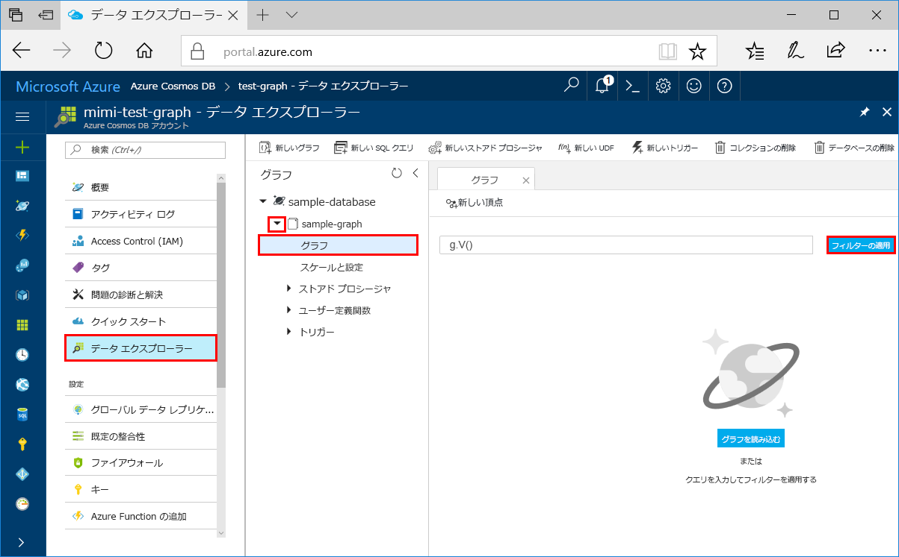
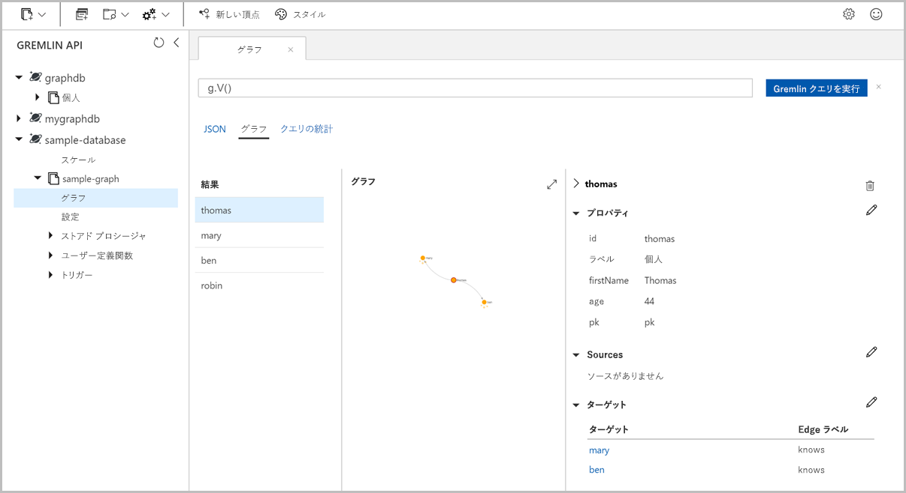
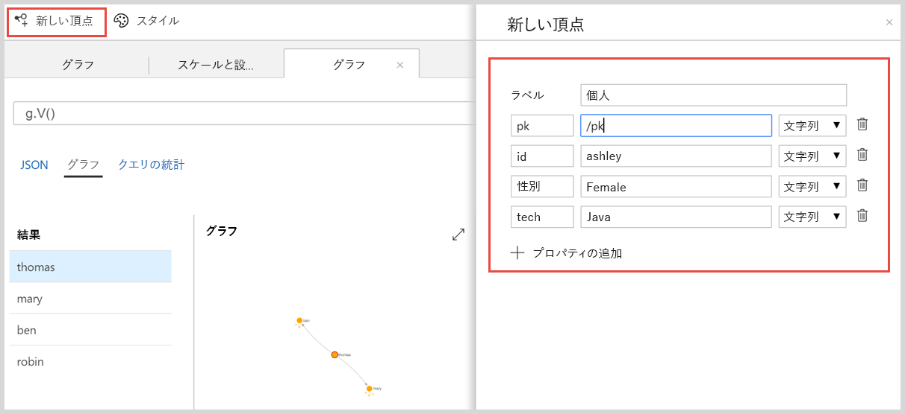
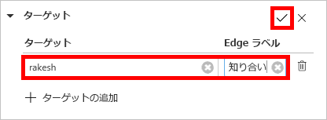
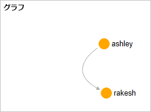

# <a name="azure-cosmos-db-create-a-graph-database-using-python-and-the-azure-portal"></a>Azure Cosmos DB: Python と Azure Portal を使用してグラフ データベースを作成する

このクイックスタートでは、Python と Azure Cosmos DB [Graph API](graph-introduction.md) を使って、GitHub から例を複製することによりコンソール アプリを作成する方法を説明します。 このクイックスタートでは、Web ベースの Azure Portal を使って Azure Cosmos DB アカウントを作成する手順についても説明します。   

Azure Cosmos DB は、Microsoft のグローバルに分散されたマルチモデル データベース サービスです。 Azure Cosmos DB の中核をなすグローバルな分散と水平方向のスケール機能を利用して、ドキュメント、テーブル、キーと値、およびグラフ データベースをすばやく作成およびクエリできます。  

> [!NOTE]
> このクイックスタートには、2017 年 11 月 27 日以降に作成したグラフ データベース アカウントが必要です。 既存のアカウントは、一般公開に移行された後で Python をサポートするようになります。

## <a name="prerequisites"></a>前提条件

[!INCLUDE [quickstarts-free-trial-note](../../includes/quickstarts-free-trial-note.md)]または、Azure サブスクリプションを使わず、課金も契約もなしで [Azure Cosmos DB を無料で試す](https://azure.microsoft.com/try/cosmosdb/)ことができます。

加えて次の作業を行います。
* [Python](https://www.python.org/downloads/) バージョン v3.5 以降
* [pip パッケージ マネージャー](https://pip.pypa.io/en/stable/installing/)
* [Git](http://git-scm.com/)
* [Gremlin 用 Python ドライバー](https://github.com/apache/tinkerpop/tree/master/gremlin-python)

## <a name="create-a-database-account"></a>データベース アカウントの作成

グラフ データベースを作成するには、Azure Cosmos DB を含んだ Gremlin (グラフ) データベース アカウントを事前に作成しておく必要があります。

[!INCLUDE [cosmos-db-create-dbaccount-graph](../../includes/cosmos-db-create-dbaccount-graph.md)]

## <a name="add-a-graph"></a>グラフの追加

Azure Portal でデータ エクスプローラー ツールを使用してグラフ データベースを作成できるようになりました。 

1. **[データ エクスプローラー]** > **[New Graph]\(新しいグラフ\)** をクリックします。

    **[グラフの追加]** 領域が右端に表示されます。表示するには、右にスクロールする必要がある場合があります。

    ![Azure Portal データ エクスプローラーの [グラフの追加] ページ](./media/create-graph-python/azure-cosmosdb-data-explorer-graph.png)

2. **[グラフの追加]** ページで、新しいグラフの設定を入力します。

    設定|推奨値|[説明]
    ---|---|---
    データベース ID|sample-database|新しいデータベースの名前として「*sample-database*」と入力します。 データベース名は、1 - 255 文字である必要があります。また、`/ \ # ?` は使えず、末尾にスペースを入れることもできません。
    グラフ ID|sample-graph|新しいコレクションの名前として「*sample-graph*」と入力します。 グラフ名の文字要件はデータベース ID と同じです。
    ストレージの容量|固定 (10 GB)|既定値の**固定 (10 GB)** のままにします。 この値は、データベースの記憶域容量です。
    Throughput|400 RU|スループットを 400 要求ユニット (RU/秒) に変更します。 待ち時間を短縮する場合、後でスループットをスケールアップできます。

3. フォームに入力したら、**[OK]** をクリックします。

## <a name="clone-the-sample-application"></a>サンプル アプリケーションの複製

次は、コードを使った作業に移りましょう。 GitHub から Graph API アプリの複製を作成し、接続文字列を設定して実行します。 プログラムでデータを処理することが非常に簡単であることがわかります。  

1. コマンド プロンプトを開いて git-samples という名前の新しいフォルダーを作成し、コマンド プロンプトを閉じます。

    ```bash
    md "C:\git-samples"
    ```

2. git bash などの git ターミナル ウィンドウを開き、`cd` コマンドを使用して、サンプル アプリをインストールするフォルダーに変更します。  

    ```bash
    cd "C:\git-samples"
    ```

3. 次のコマンドを実行して、サンプル レポジトリを複製します。 このコマンドは、コンピューター上にサンプル アプリのコピーを作成します。 

    ```bash
    git clone https://github.com/Azure-Samples/azure-cosmos-db-graph-python-getting-started.git
    ```

## <a name="review-the-code"></a>コードの確認

この手順は省略可能です。 コード内のデータベース リソースの作成方法に関心がある場合は、次のスニペットを確認できます。 スニペットはすべて、C:\git-samples\azure-cosmos-db-graph-python-getting-started\ フォルダーの `connect.py` ファイルから取得されます。 関心がない場合は、「[接続文字列の更新](#update-your-connection-information)」に進んでください。 

* Gremlin の `client` は、`connect.py` の 104 行目で初期化されます。

    ```python
    ...
    client = client.Client('wss://<YOUR_ENDPOINT>.graphs.azure.com:443/','g', 
        username="/dbs/<YOUR_DATABASE>/colls/<YOUR_COLLECTION_OR_GRAPH>", 
        password="<YOUR_PASSWORD>")
    ...
    ```

* `connect.py` ファイルの先頭で、Gremlin の一連のステップが宣言されています。 これらは、`client.submitAsync()` メソッドを使って実行されます。

    ```python
    client.submitAsync(_gremlin_cleanup_graph)
    ```

## <a name="update-your-connection-information"></a>接続情報の更新

ここで Azure Portal に戻り、接続情報を取得して、アプリにコピーします。 これらの設定により、アプリはホストされているデータベースと通信できるようになります。

1. [Azure Portal](http://portal.azure.com/) で **[キー]** をクリックします。 

    URI の値の最初の部分をコピーします。

    ![Azure Portal の [キー] ページでアクセス キーを表示およびコピーする](./media/create-graph-python/keys.png)

2. connect.py ファイルを開き、104 行目の `<YOUR_ENDPOINT>` に URI の値を貼り付けます。

    ```python
    client = client.Client('wss://<YOUR_ENDPOINT>.graphs.azure.com:443/','g', 
        username="/dbs/<YOUR_DATABASE>/colls/<YOUR_COLLECTION_OR_GRAPH>", 
        password="<YOUR_PASSWORD>")
    ```

    クライアント オブジェクトの URI 部分は、次のコードにようになります。

    ```python
    client = client.Client('wss://test.graphs.azure.com:443/','g', 
        username="/dbs/<YOUR_DATABASE>/colls/<YOUR_COLLECTION_OR_GRAPH>", 
        password="<YOUR_PASSWORD>")
    ```

3. `client` オブジェクトの 2 番目のパラメーターを、`<YOUR_DATABASE>` と `<YOUR_COLLECTION_OR_GRAPH>` の文字列に置き換えます。 提案された値を使った場合、パラメーターは次のコードのようになります。

    `username="/dbs/sample-database/colls/sample-graph"`

    `client` オブジェクト全体は、次のコードのようになります。

    ```python
    client = client.Client('wss://test.graphs.azure.com:443/','g', 
        username="/dbs/sample-database/colls/sample-graph", 
        password="<YOUR_PASSWORD>")
    ```

4. Azure Portal でコピー ボタンを使って PRIMARY KEY をコピーし、`password=<YOUR_PASSWORD>` パラメーターの `<YOUR_PASSWORD>` に貼り付けます。

    `client` オブジェクトの定義全体は、次のコードのようになります。
    ```python
    client = client.Client('wss://test.graphs.azure.com:443/','g', 
        username="/dbs/sample-database/colls/sample-graph", 
        password="asdb13Fadsf14FASc22Ggkr662ifxz2Mg==")
    ```

5. `connect.py` ファイルを保存します。

## <a name="run-the-console-app"></a>コンソール アプリの実行

1. git ターミナル ウィンドウで、azure-cosmos-db-graph-python-getting-started フォルダーに `cd` で移動します。

    ```git
    cd "C:\git-samples\azure-cosmos-db-graph-python-getting-started"
    ```

2. git ターミナル ウィンドウで、次のコマンドを実行して 必要な Python パッケージをインストールします。

   ```
   pip install -r requirements.txt
   ```

3. git ターミナル ウィンドウで、次のコマンドを実行して Python アプリケーションを起動します。
    
    ```
    python connect.py
    ```

    グラフに追加される頂点と辺がターミナル ウィンドウに表示されます。 
    
    タイムアウト エラーが発生した場合は、[[Update your connection information]\(接続情報の更新\)](#update-your-connection-information) で接続情報が適切に更新されていることを確認し、最後のコマンドを再試行してください。 
    
    プログラムが停止したら、Enter キーを押して、インターネット ブラウザーで Azure Portal に切り替えます。

<a id="add-sample-data"></a>
## <a name="review-and-add-sample-data"></a>サンプル データの確認と追加

今度はデータ エクスプローラーに戻って、グラフに追加された頂点を確認し、さらにデータ ポイントを追加してみましょう。

1. **[データ エクスプローラー]** をクリックし、**sample-graph** を展開して、**[グラフ]**、**[フィルターの適用]** の順にクリックします。 

   

2. **[結果]** リストを見ると、新しいユーザーがグラフに追加されていることがわかります。 **[ben]** を選択すると、彼は robin に接続されていることがわかります。 ドラッグ アンド ドロップで頂点を移動したり、マウスのホイールを回して拡大および縮小したり、双方向矢印でグラフのサイズを大きくしたりできます。 

   

3. 新しいユーザーを何人か追加してみます。 グラフにデータを追加するには、**[New Vertex]\(新しい頂点\)** ボタンをクリックします。

   

4. 「*person*」というラベルを入力します。

5. **[プロパティの追加]** をクリックして、次の各プロパティを追加します。 グラフ内の person ごとに一意のプロパティを作成できることに注目してください。 必須のキーは id のみです。

    key|value|メモ
    ----|----|----
    id|ashley|頂点の一意の識別子。 id を指定しなかった場合は、自動的に生成されます。
    gender|female| 
    tech | java | 

    > [!NOTE]
    > このクイックスタートでは、パーティション分割されていないコレクションを作成します。 ただし、コレクションの作成段階でパーティション キーを指定することによって、パーティション分割されたコレクションを作成した場合は、新たに作成する各頂点のキーとして、パーティション キーを追加する必要があります。 

6. Click **OK**. 画面サイズを大きくしないと、画面下部の **[OK]** が見えない場合があります。

7. もう一度 **[New Vertex]\(新しい頂点\)** をクリックして、新しいユーザーを追加します。 

8. 「*person*」というラベルを入力します。

9. **[プロパティの追加]** をクリックして、次の各プロパティを追加します。

    key|value|メモ
    ----|----|----
    id|rakesh|頂点の一意の識別子。 id を指定しなかった場合は、自動的に生成されます。
    gender|male| 
    school|MIT| 

10. Click **OK**. 

11. 既定の `g.V()` フィルターで **[フィルターの適用]** ボタンをクリックして、グラフ内のすべての値を表示します。 すると、**[結果]** リストにすべてのユーザーが表示されます。 

    追加したデータが多くなってきたら、フィルターを使って結果を制限することができます。 既定では、データ エクスプローラーは `g.V()` を使ってグラフのすべての頂点を取得します。 `g.V().count()` などの他の[グラフ クエリ](tutorial-query-graph.md)に変更して、グラフ内のすべての頂点の数を JSON 形式で取得できます。 フィルターを変更した場合、フィルターを `g.V()` に戻して **[フィルターの適用]** をクリックし、もう一度すべての結果を表示します。

12. これで rakesh と ashley を接続できる状態になりました。 **[結果]** リストで **[ashley]** が選択されていることを確認し、右下の **[Targets]\(ターゲット\)** の横にある編集ボタンをクリックします。 ウィンドウの幅を広げないと **[プロパティ]** 領域が見えない場合があります。

   

13. **[Target]\(ターゲット\)** ボックスに「*rakesh*」と入力し、**[Edge label]\(辺ラベル\)** ボックスに「*knows*」と入力して、チェック ボックスをオンにします。

   

14. 結果リストから **[rakesh]** を選択すると、ashley と rakesh が接続されていることがわかります。 

   

   以上で、このチュートリアルのリソース作成部分は完了です。 引き続き、グラフへの頂点の追加、既存の頂点の変更、またはクエリの変更を行うことができます。 次に、Azure Cosmos DB が提供するメトリックを確認し、リソースをクリーンアップします。 

## <a name="review-slas-in-the-azure-portal"></a>Azure Portal での SLA の確認

[!INCLUDE [cosmosdb-tutorial-review-slas](../../includes/cosmos-db-tutorial-review-slas.md)]

## <a name="clean-up-resources"></a>リソースのクリーンアップ

[!INCLUDE [cosmosdb-delete-resource-group](../../includes/cosmos-db-delete-resource-group.md)]

## <a name="next-steps"></a>次の手順

このクイック スタートでは、Azure Cosmos DB アカウントを作成し、データ エクスプローラーを使用してグラフを作成し、アプリを実行する方法を説明しました。 これで Gremlin を使用して、さらに複雑なクエリを作成し、強力なグラフ トラバーサル ロジックを実装できます。 

> [!div class="nextstepaction"]
> [Gremlin を使用したクエリ](tutorial-query-graph.md)

