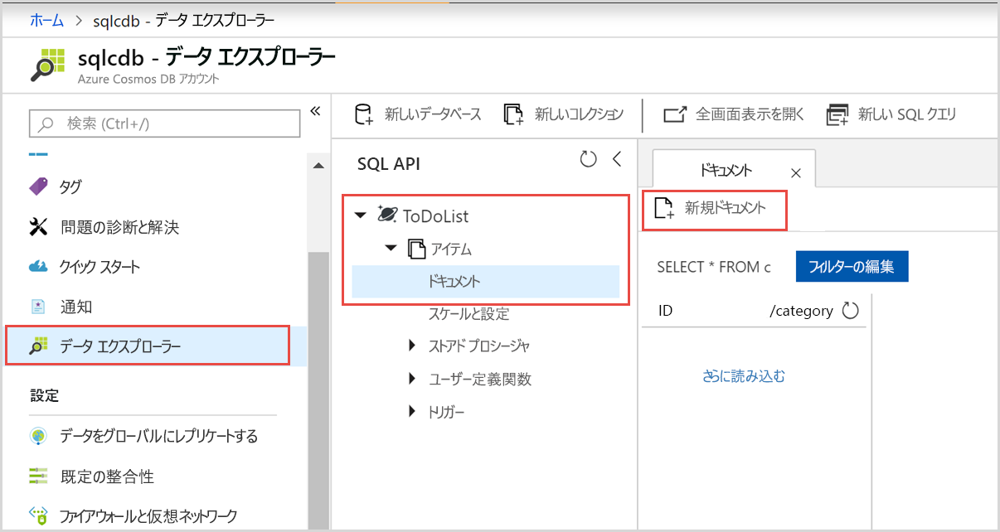

# <a name="quickstart-build-a-net-web-app-using-azure-cosmos-db-sql-api-account"></a>クイック スタート:Azure Cosmos DB SQL API アカウントを使用して .NET Web アプリをビルドする

> [!div class="op_single_selector"]
> * [.NET](create-sql-api-dotnet.md)
> * [.NET (プレビュー)](create-sql-api-dotnet-preview.md)
> * [Java](create-sql-api-java.md)
> * [Node.js](create-sql-api-nodejs.md)
> * [Python](create-sql-api-python.md)
> * [Xamarin](create-sql-api-xamarin-dotnet.md)
>  
> 

Azure Cosmos DB は、Microsoft のグローバルに配布されるマルチモデル データベース サービスです。 Azure Cosmos DB の中核をなすグローバル配布と水平方向のスケール機能を活用して、ドキュメント、キー/値、およびグラフ データベースをすばやく作成および照会できます。 

このクイック スタートでは、Azure portal を使用して、Azure Cosmos DB [SQL API](sql-api-introduction.md) アカウント、ドキュメント データベース、コレクションを作成し、サンプル データをコレクションに追加する方法を説明します。 さらに、[SQL .NET SDK](sql-api-sdk-dotnet.md) を使用して todo Web アプリをビルドしてデプロイし、コレクション内の管理データを追加します。 

## <a name="prerequisites"></a>前提条件

まだ Visual Studio 2017 をインストールしていない場合は、**無料**の [Visual Studio 2017 Community エディション](https://www.visualstudio.com/downloads/)をダウンロードして使用できます。 Visual Studio のセットアップ中に、必ず **[Azure の開発]** を有効にしてください。

[!INCLUDE [quickstarts-free-trial-note](../../includes/quickstarts-free-trial-note.md)] 
[!INCLUDE [cosmos-db-emulator-docdb-api](../../includes/cosmos-db-emulator-docdb-api.md)]  

<a id="create-account"></a>
## <a name="create-an-account"></a>アカウントの作成

[!INCLUDE [cosmos-db-create-dbaccount](../../includes/cosmos-db-create-dbaccount.md)]

<a id="create-collection-database"></a>
## <a name="add-a-database-and-a-collection"></a>データベースとコレクションの追加

Azure Portal でデータ エクスプローラー ツールを使用してデータベースとコレクションを作成できるようになりました。 

1. **[データ エクスプローラー]** > **[新しいコレクション]** をクリックします。 
    
    **[コレクションの追加]** 領域が右端に表示されます。表示するには、右にスクロールする必要がある場合があります。

    ![Azure portal の [データ エクスプローラー] の [コレクションの追加] ウィンドウ](./media/create-sql-api-dotnet/azure-cosmosdb-data-explorer-dotnet.png)

2. **[コレクションの追加]** ページで、新しいコレクションの設定を入力します。

    設定|推奨値|説明
    ---|---|---
    **データベース ID**|ToDoList|新しいデータベースの名前として *ToDoList* を入力します。 データベース名は 1 文字以上 255 文字以内にする必要があります。`/, \\, #, ?` は使えず、末尾にスペースを入れることもできません。
    **コレクション ID**|項目|新しいコレクションの名前として*項目*を入力します。 コレクション ID には、データベース名と同じ文字要件があります。
    **パーティション キー**| `<your_partition_key>`| パーティション キーを入力します。 この記事で説明するサンプルでは、*/category* をパーティション キーとして使用します。
    **スループット**|400 RU|スループットを 400 要求ユニット (RU/秒) に変更します。 待ち時間を短縮する場合、後でスループットをスケールアップできます。 
    
    上記の設定に加え、必要に応じて、このコレクション用に**一意なキー**を追加できます。 この例では、このフィールドを空のままにしましょう。 一意なキーを使用すると、開発者はデータベースにデータ整合性のレイヤーを追加できます。 コレクションの作成中に一意キー ポリシーを作成すると、パーティション キーごとに 1 つ以上の値の一意性が保証されます。 詳細については、記事「[Azure Cosmos DB における一意なキー](unique-keys.md)」を参照してください。
    
    Click **OK**.

    新しいデータベースとコレクションがデータ エクスプローラーに表示されます。

    

<a id="add-sample-data"></a>
## <a name="add-sample-data"></a>サンプル データの追加

これで、データ エクスプローラーを使用して、新しいコレクションにデータを追加できます。

1. データ エクスプローラーで新しいデータベースが [コレクション] ウィンドウに表示されます。 **[タスク]** データベースを展開し、**[項目]** コレクションを展開して、**[ドキュメント]** をクリックし、**[新しいドキュメント]** をクリックします。 

   
  
2. ここで、次の構造のドキュメントをコレクションに追加します。

     ```json
     {
         "id": "1",
         "category": "personal",
         "name": "groceries",
         "description": "Pick up apples and strawberries.",
         "isComplete": false
     }
     ```

3. json を **[ドキュメント]** タブに追加したら、**[保存]** をクリックします。

    ![json データをコピーし、Azure Portal のデータ エクスプローラーで [保存] をクリックします。](./media/create-sql-api-dotnet/azure-cosmosdb-save-document.png)

4. もう 1 つドキュメントを作成して保存します。`id` プロパティには一意の値を挿入し、その他のプロパティについては適宜変更してください。 Azure Cosmos DB では、データにスキーマを課さないため、新しいドキュメントは必要な任意の構造にすることができます。

## <a name="query-your-data"></a>データのクエリ

[!INCLUDE [cosmos-db-create-sql-api-query-data](../../includes/cosmos-db-create-sql-api-query-data.md)]

## <a name="clone-the-sample-application"></a>サンプル アプリケーションの複製

次は、コードを使った作業に移りましょう。 [GitHub から SQL API アプリ](https://github.com/Azure-Samples/documentdb-dotnet-todo-app)の複製を作成し、接続文字列を設定して実行します。 プログラムでデータを処理することが非常に簡単であることがわかります。 

1. コマンド プロンプトを開いて git-samples という名前の新しいフォルダーを作成し、コマンド プロンプトを閉じます。

    ```bash
    md "C:\git-samples"
    ```

2. git bash などの git ターミナル ウィンドウを開いて、`cd` コマンドを使用して、サンプル アプリをインストールする新しいフォルダーに変更します。

    ```bash
    cd "C:\git-samples"
    ```

3. 次のコマンドを実行して、サンプル レポジトリを複製します。 このコマンドは、コンピューター上にサンプル アプリのコピーを作成します。

    ```bash
    git clone https://github.com/Azure-Samples/documentdb-dotnet-todo-app.git
    ```

4. 次に、Visual Studio で todo ソリューション ファイルを開きます。 

## <a name="review-the-code"></a>コードの確認

この手順は省略可能です。 コード内のデータベース リソースの作成方法に関心がある場合は、次のスニペットを確認できます。 関心がない場合は、「[接続文字列の更新](#update-your-connection-string)」に進んでください。 このクイック スタートでは、Azure portal を使用してデータベースとコレクションを作成し、.NET サンプルを使用してサンプル データを追加します。 ただし、.NET サンプルを使用してデータベースとコレクションを作成することもできます。 

次のスニペットはすべて DocumentDBRepository.cs ファイルからのものです。

* 次のコードのように、DocumentClient が初期化されます。

    ```csharp
    client = new DocumentClient(new Uri(ConfigurationManager.AppSettings["endpoint"]), ConfigurationManager.AppSettings["authKey"]);
    ```

* 次のコードのように、`CreateDatabaseAsync` メソッドを使用して新しいデータベースが作成されます。

    ```csharp
    await client.CreateDatabaseAsync(new Database { Id = DatabaseId });
    ```

* 次のコードのように、`CreateDocumentCollectionAsync` メソッドを使用して新しいコレクションが作成されます。

    ```csharp
    private static async Task CreateCollectionIfNotExistsAsync()
    {
        try
        {
           await client.ReadDocumentCollectionAsync(UriFactory.CreateDocumentCollectionUri(DatabaseId, CollectionId));
        }
        catch (DocumentClientException e)
        {
           if (e.StatusCode == System.Net.HttpStatusCode.NotFound)
           {
              await client.CreateDocumentCollectionAsync(
              UriFactory.CreateDatabaseUri(DatabaseId),
              new DocumentCollection
              {
                  Id = CollectionId
              },
              new RequestOptions { OfferThroughput = 400 });
           }
           else
           {
             throw;
           }
        }
    }
    ```

## <a name="update-your-connection-string"></a>接続文字列を更新する

ここで Azure Portal に戻り、接続文字列情報を取得し、アプリにコピーします。

1. [Azure portal](https://portal.azure.com/) の Azure Cosmos DB アカウントで、左のナビゲーションの **[キー]** を選択してから **[読み取り/書き込みキー]** を選択します。 次の手順では、画面の右側のコピー ボタンを使用して、URI とプライマリ キーを web.config ファイルにコピーします。

    ![Azure Portal の [キー] ブレードでアクセス キーを表示およびコピーする](./media/create-sql-api-dotnet/keys.png)

2. Visual Studio 2017 で web.config ファイルを開きます。 

3. ポータルから (コピー ボタンを使用して) URI 値をコピーし、web.config の endpoint キーの値に設定します。 

    `<add key="endpoint" value="FILLME" />`

4. ポータルから PRIMARY KEY 値をコピーし、web.config の authKey の値に設定します。 

    `<add key="authKey" value="FILLME" />`
    
5. 次に、先ほど作成したデータベースとの名前に合わせて database と collection の値を更新します。 これで、Azure Cosmos DB と通信するために必要なすべての情報でアプリを更新しました。 

   ```csharp
   <add key="database" value="ToDoList"/>
   <add key="collection" value="Items"/>
   ```
 
## <a name="run-the-web-app"></a>Web アプリの実行
1. Visual Studio の**ソリューション エクスプローラー**でプロジェクトを右クリックし、**[NuGet パッケージの管理]** を選択します。 

2. NuGet の **[参照]** ボックスに「*DocumentDB*」と入力します。

3. 結果から、**Microsoft.Azure.DocumentDB** ライブラリをインストールします。 これにより、Microsoft.Azure.DocumentDB パッケージとすべての依存関係がインストールされます。

4. Ctrl + F5 キーを押してアプリケーションを実行します。 ブラウザーにアプリが表示されます。 

5. ブラウザーで **[新規作成]** を選択し、to-do アプリでいくつかの新しいタスクを作成します。

   

これで、データ エクスプローラーに戻って、この新しいデータの表示、クエリ、変更、操作を行うことができます。 

## <a name="review-slas-in-the-azure-portal"></a>Azure Portal での SLA の確認

[!INCLUDE [cosmosdb-tutorial-review-slas](../../includes/cosmos-db-tutorial-review-slas.md)]

## <a name="clean-up-resources"></a>リソースのクリーンアップ

[!INCLUDE [cosmosdb-delete-resource-group](../../includes/cosmos-db-delete-resource-group.md)]

## <a name="next-steps"></a>次の手順

このクイックスタートでは、Azure Cosmos DB アカウントを作成し、データ エクスプローラーを使用してコレクションを作成し、Web アプリを実行する方法を説明しました。 これで、Cosmos DB アカウントに追加のデータをインポートできます。 

> [!div class="nextstepaction"]
> [Azure Cosmos DB へのデータのインポート](import-data.md)


